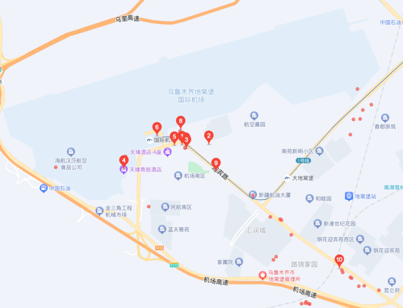
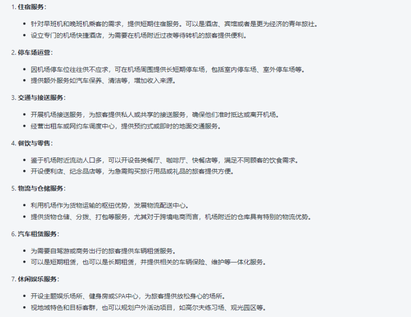

# 前景评估

## 中国八大区域性枢纽机场

​		中国八大区域性枢纽机场：[重庆江北国际机场](https://baike.baidu.com/item/重庆江北国际机场/4155905?fromModule=lemma_inlink)、[成都双流国际机场](https://baike.baidu.com/item/成都双流国际机场/1024519?fromModule=lemma_inlink)、[武汉天河国际机场](https://baike.baidu.com/item/武汉天河国际机场/3557245?fromModule=lemma_inlink)、[郑州新郑国际机场](https://baike.baidu.com/item/郑州新郑国际机场/3520532?fromModule=lemma_inlink)、[沈阳桃仙国际机场](https://baike.baidu.com/item/沈阳桃仙国际机场/3519776?fromModule=lemma_inlink)、[西安咸阳国际机场](https://baike.baidu.com/item/西安咸阳国际机场/3521559?fromModule=lemma_inlink)、[昆明长水国际机场](https://baike.baidu.com/item/昆明长水国际机场/340207?fromModule=lemma_inlink)、[乌鲁木齐地窝堡国际机场](https://baike.baidu.com/item/乌鲁木齐地窝堡国际机场/6293127?fromModule=lemma_inlink)这八个机场。后新增了[长沙黄花国际机场](https://baike.baidu.com/item/长沙黄花国际机场/3557712?fromModule=lemma_inlink)和[青岛胶东国际机场](https://baike.baidu.com/item/青岛胶东国际机场/4080653?fromModule=lemma_inlink)。

## 地理位置

## 交通

## 旅游城市

## 竞争对手

## 综合分析

### 优势

- 目标位置后续未来有规划高铁站。
- 远离喧嚣，睡觉安静舒适。

### 劣势

- 客人可能认为目标位置目前较为偏僻，担心人身安全问题。

## 机场调研

### 昆明长水机场

### 天府国际机场

### 成都双流机场

### 重庆江北国际机场

### 武汉天河国际机场

### 郑州新郑国际机场

### 沈阳桃仙国际机场

### 西安咸阳国际机场

### 乌鲁木齐地窝堡国际机场

### 长沙黄花国际机场

## 商业模式

### 机场周围5公里能做什么盈利？

