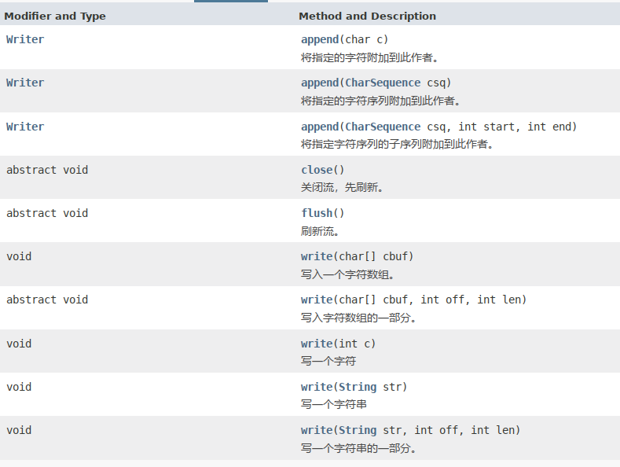
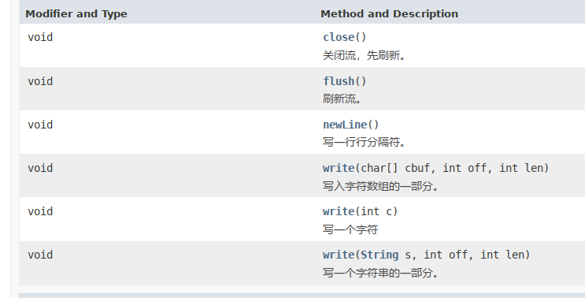
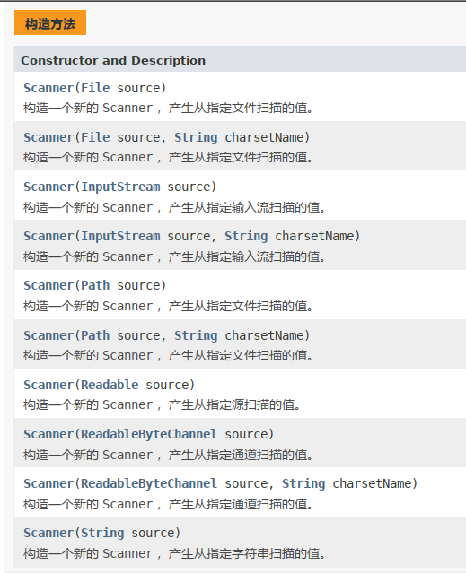

# BIO

​	所有涉及的类的API都翻越JDK API文档对照着看。


## 什么是流

概念：内存与存储设备之间传输数据的通道。


水借助管道传输：数据借助流传输。

## 流的分类

按方向：

- 输入流：将输入设备中的内存读入到内存中。
- 输出流：将内存中内存的内容写入到输出设备中。


按单位：

- 字节流:以字节为单位，可以读写所有数据。
- 字符流:以字符为单位，只能读写文本数据。

按功能：

- 节点流:具有实际传输数据的读写功能。
- 过滤流:在节点流的基础之上增强功能。

## 字节流

- java.io.InputStream 输入流

  

- java.io.OutputStream 输出流

  

## 文件字节流

​		文件字节流继承自字节流

- java.io.FileInputStream

  

- java.io.FileOutputStream

  

### 案例： 单个字节读取文件

```java
package com.tc.io;

import java.io.FileInputStream;
import java.io.IOException;

public class Demo1 {
    public static void main(String[] args) {
        FileInputStream fis = null;
        try {
            fis = new FileInputStream("d:\\aa.txt");
//        fis.read()
            int data = 0;
            while ((data = fis.read()) != -1) {
                System.out.println((char)data);
            }
            System.out.println("\r\n执行完毕");
        } catch (IOException e) {
            e.printStackTrace();
        } finally {
            if (null != fis) {
                try {
                    fis.close();
                } catch (IOException e) {
                    e.printStackTrace();
                }
            }
        }
    }
}
```

### 案例：从文件一次读多个字节

```java
package com.tc.io;

import java.io.File;
import java.io.FileInputStream;
import java.io.IOException;

public class Demo1 {
    public static void main(String[] args) {
        FileInputStream fis = null;
        try {
            System.out.println(new File(".").getAbsolutePath());
            fis = new FileInputStream(".//aa.txt");

//            byte[] buf = new byte[fis.available()];
            byte[] buf = new byte[1024];
            int count = 0;

            while ((count = fis.read(buf)) != -1) {
                System.out.print(new String(buf， 0， count));
            }
            System.out.println("\r\n执行完毕");
        } catch (IOException e) {
            e.printStackTrace();
        } finally {
            if (null != fis) {
                try {
                    fis.close();
                } catch (IOException e) {
                    e.printStackTrace();
                }
            }
        }
    }
}
```

### 案例：单个字节写入文件

```java
package com.tc.io;

import java.io.FileOutputStream;

public class Demo2 {
    public static void main(String[] args) throws Exception{
        // 创建输出流
        boolean isAppend = true; // 是否是追加方式
        FileOutputStream fos = new FileOutputStream("./bb.txt"， isAppend);
        // 写入流
        fos.write(97);
        fos.write('b');
        fos.write('c');

        fos.write(" Hello world!".getBytes());
        // 关闭流
        fos.close();
        System.out.println("执行完毕");
    }
}
```

### 案例：通过字节流实现复制一个文件

```java
package com.tc.io;

import java.io.FileInputStream;
import java.io.FileOutputStream;

public class Demo3 {
    public static void main(String[] args) throws Exception {
        FileInputStream fis = new FileInputStream("./001.png");
        FileOutputStream fos = new FileOutputStream("./002.png");

        byte[] buf = new byte[1024];
        int count;
        while ((count = fis.read(buf)) != -1) {
            fos.write(buf， 0， count);
        }

        fis.close();
        fos.close();
    }
}
```

## 字节缓冲流

- 缓冲流: BufferedInputStream/ BufferedOutputStream
  - 提高I0效率，减少访问磁盘的次数;
  - 数据存储在缓冲区中， flush是将缓存区的内容写入文件中，也可以直接 close

### 案例：字节读取文件

```java
package com.tc.io;

import java.io.BufferedInputStream;
import java.io.FileInputStream;

public class Demo4 {
    public static void main(String[] args) throws Exception{
        final FileInputStream fis = new FileInputStream("./aa.txt");
        // 增强fis流
        final BufferedInputStream bis = new BufferedInputStream(fis);
        // read
//        int data;
//        while ((data = fis.read()) != -1) {
//            System.out.print((char)data);
//        }

        byte[] buf = new byte[3];
        int count = 0;

        while ((count = bis.read(buf)) != -1) {
            System.out.print(new String(buf， 0， count));
        }

        // close
        bis.close();

        System.out.println("\r\n执行完毕");
    }
}
```

### 案例：通过缓冲字节流实现复制一个文件

```java
package com.tc.io;

import java.io.BufferedInputStream;
import java.io.BufferedOutputStream;
import java.io.FileInputStream;
import java.io.FileOutputStream;

public class Demo5 {
    public static void main(String[] args) throws Exception {
        FileInputStream fis = new FileInputStream("./001.png");
        FileOutputStream fos = new FileOutputStream("./002.png");

        final BufferedInputStream bis = new BufferedInputStream(fis);
        final BufferedOutputStream bos = new BufferedOutputStream(fos);

        byte[] buf = new byte[1024];
        int count;
        while ((count = bis.read(buf)) != -1) {
            bos.write(buf， 0， count);
        }

//        fis.close();
//        fos.close();
        bis.close();
        bos.close();
    }
}
```

## 对象流

- 对象流：ObjectOutputStream/ObjectInputStream
  - 增强了缓冲区功能
  - 增强了读写8种基本数据类型和字符串功能
  - 增强了读写对象的功能
    - readObject()从流中读取一个对象
    - writeObject(Object obj)向流中写入一个对象
- 使用流传输对象的过程称为序列化、反序列化。

### 案例：序列化反序列化对象

```java
package com.tc.io;

import java.io.*;

class Student implements Serializable {
    public String id;
    public String name;
    public String classId;
    public int age;

    public Student(String id， String name， String classId， int age) {
        this.id = id;
        this.name = name;
        this.classId = classId;
        this.age = age;
    }

    @Override
    public String toString() {
        return "Student{" +
                "id='" + id + '\'' +
                "， name='" + name + '\'' +
                "， classId='" + classId + '\'' +
                "， age=" + age +
                '}';
    }
}

public class Demo6 {
    public static void main(String[] args) throws Exception{
        final Student s1 = new Student("01001"， "zhangsan"， "一班"， 16);
        final Student s2 = new Student("01002"， "lisi"， "一班"， 17);

        // ====== 序列化
        final ObjectOutputStream oos = new ObjectOutputStream(new FileOutputStream("./slist.bin"));
        oos.writeInt(2);
        oos.writeObject(s1);
        oos.writeObject(s2);
        // close
        oos.close();

        // ======= 反序列化
        final ObjectInputStream ois = new ObjectInputStream(new FileInputStream("./slist.bin"));
        final int len = ois.readInt(); // 这里是故意写了个int，其实可以不用这个的，直接读对象
        System.out.println("student length:" + len);
        for (int i = 0; i < len; i++) {
            final Student student = (Student) ois.readObject();
            System.out.println(student);
        }
        // close
        ois.close();
    }
}
```

### 注意事项：

1. 序列化类必须要实现Serializable接口；
2. 序列化类中对象属性要求实现Serializable接口；
3. 序列化版本号serialVersionUID，保证序列化的类和反序列化的类是同一个类。如果变动类结构发生大的变化，版本号最好也变动一下；
4. 如果不想某个属性不序列化，就使用transient（瞬时的）关键字修饰；
5. 静态属性是不能序列化的。
6. 序列多个对象的时候，可以借助集合来实现。

## 字符编码

- ISO-8859-1	收录除ASCII外，还包括西欧、希腊语、泰语、阿拉伯语、希伯来语对应的文字符号。
- UTF-8 	 针对 Unicode码表的可变长度字符编码        国际上使用较多      
- GB2312	简体中文                
- GBK	简体中文、扩充    
- BIG5	台湾，繁体中文

> 注意：当编码方式和解码方式不一致时，会出现乱码。

## 字符流

- Reader：字符输入流


- Writer：字符输出流



## 文件字符流

FileReader

​	public int read(char[] c) 从流中读取多个字符，将读到内容存入c数组，返回实际读到的字节数；如果达到文件的尾部，则返回-1。

FileWriter

​	public void write(String str)  一次写多个字符，将b数组中所有字符，写入输出流。

### 案例：字符流读取含有汉字的utf-8文件

```java
package com.tc.io;

import java.io.File;
import java.io.FileReader;
import java.io.IOException;

public class Demo7 {
    public static void main(String[] args) {
        FileReader fileReader = null;
        try {
            System.out.println(new File(".").getAbsolutePath());
            fileReader = new FileReader(".//aa.txt");

            char[] buf = new char[3];
            int count = 0;

            while ((count = fileReader.read(buf)) != -1) {
                System.out.print(new String(buf， 0， count));
            }
            System.out.println("\r\n执行完毕");
        } catch (IOException e) {
            e.printStackTrace();
        } finally {
            if (null != fileReader) {
                try {
                    fileReader.close();
                } catch (IOException e) {
                    e.printStackTrace();
                }
            }
        }
    }
}
```

### 案例：汉字写入文件

```java
package com.tc.io;

import java.io.FileWriter;

public class Demo8 {
    public static void main(String[] args) throws Exception {
        // create
        FileWriter fileWriter = new FileWriter("./demo8.txt");
        // write
        for (int i = 0; i < 10; i++) {
            fileWriter.write("java是世界上最好的语言");
            fileWriter.flush();
        }
        // close
        fileWriter.close();
        System.out.println("执行完毕");
    }
}
```

> 字符流只能写字符文件，要复制其他文件还是使用字节流。

## 字符缓冲流

BufferedReader/BufferedWriter

- 高效读写
- 支持输入换行
- 可一次写一行、读一行。

Bufferedreader


BufferedWriter



### 案例：字符缓冲流读

```java
package com.tc.io;

import java.io.BufferedReader;
import java.io.FileReader;
import java.io.IOException;

public class Demo9 {
    public static void main(String[] args) {
        FileReader fileReader = null;
        BufferedReader br = null;
        try {
            fileReader = new FileReader(".//aa.txt");
             br = new BufferedReader(fileReader);

//            char[] buf = new char[3];
//            int count = 0;
//
//            while ((count = br.read(buf)) != -1) {
//                System.out.print(new String(buf， 0， count));
//            }

            String line = null;
            while ((line = br.readLine()) != null) {
                System.out.println(line);
            }

            System.out.println("\r\n执行完毕");
        } catch (IOException e) {
            e.printStackTrace();
        } finally {
            if (null != br) {
                try {
                    br.close();
                } catch (IOException e) {
                    e.printStackTrace();
                }
            }
        }
    }
}
```

### 案例：字符缓冲写

```java
package com.tc.io;

import java.io.BufferedWriter;
import java.io.FileWriter;

public class Demo10 {
    public static void main(String[] args) throws Exception {
        // create
        FileWriter fileWriter = new FileWriter("./demo10.txt");
        BufferedWriter buffWriter = new BufferedWriter(fileWriter);
        // write
        for (int i = 0; i < 10; i++) {
            buffWriter.write("java是世界上最好的语言");
            buffWriter.newLine();
            buffWriter.flush();
        }
        // close
//        fileWriter.close();
        buffWriter.close();
        System.out.println("执行完毕");
    }
}
```

## 打印流

PrintWriter(字符流)/PrintStream(字节流)

- 封装了print()/println()方法，支持写入后换行。
- 支持数据原样打印。

### 案例：通过打印流输出内容到文件

```java
package com.tc.io;

import java.io.PrintWriter;

public class Demo11 {
    public static void main(String[] args) throws Exception {
        PrintWriter pw = new PrintWriter("./demo11.txt");

        // 这些参数原样打印到文件中
        pw.println(97);
        pw.println(true);
        pw.println(3.14);
        pw.println('a');

        pw.close();
    }
}
```

## 转换流

桥接转换流：InputStreamReader/OutputStreamWriter

- 可将字节流转换为字符流
- 可设置字符的编码方式。

InputStreamReader是从字节流到字符流的桥：它读取字节，并使用指定的`charset`将其解码为[字符](mk:@MSITStore:Z:\media\tc\jx-file\2_STUDY\手册\jdk api 1.8_China\jdk api 1.8_google.CHM::/java/nio/charset/Charset.html) 。它使用的字符集可以由名称指定，也可以被明确指定，或者可以接受平台的默认字符集。

 每个调用InputStreamReader的read（）方法之一可能会导致从底层字节输入流读取一个或多个字节。 为了使字节有效地转换为字符，可以从底层流读取比满足当前读取操作所需的更多字节。 

 为了最大的效率，请考虑在BufferedReader中包装一个InputStreamReader。 例如： 

```java
  BufferedReader in = new BufferedReader(new InputStreamReader(System.in)); 
```

OutputStreamWriter是字符的桥梁流以字节流：向其写入的字符编码成使用指定的字节charset 。它使用的字符集可以由名称指定，也可以被明确指定，或者可以接受平台的默认字符集。

 每次调用write（）方法都会使编码转换器在给定字符上被调用。 所得到的字节在写入底层输出流之前累积在缓冲区中。 可以指定此缓冲区的大小，但是默认情况下它大部分用于大多数目的。 请注意，传递给write（）方法的字符不会缓冲。 

 为了最大的效率，请考虑在BufferedWriter中包装一个OutputStreamWriter，以避免频繁的转换器调用。 例如： 

```java
  Writer out = new BufferedWriter(new OutputStreamWriter(System.out)); 
```

###  案例：使用转换流读取gbk文件

```java
package com.tc.io;

import java.io.FileInputStream;
import java.io.InputStreamReader;

public class Demo12 {
    public static void main(String[] args) throws Exception {
        FileInputStream fis = new FileInputStream("./aa.txt");
        InputStreamReader isr = new InputStreamReader(fis， "gbk");
//        BufferedReader br = new BufferedReader(isr);

        int data = 0;
        while ((data = isr.read()) != -1) {
            System.out.print((char)data);
        }

//        fis.close();
        isr.close();
    }
}
```

###  案例：使用转换流写入gbk文件

```java
package com.tc.io;

import java.io.FileOutputStream;
import java.io.OutputStreamWriter;

public class Demo13 {
    public static void main(String[] args) throws Exception {
        FileOutputStream fos = new FileOutputStream("./aa.txt");
        OutputStreamWriter osw = new OutputStreamWriter(fos， "gbk");
//        BufferedWriter bw = new BufferedWriter(osw);

        for (int i = 0; i < 10; i++) {
            osw.write("我爱四川，我爱故乡\r\n");
            osw.flush();
        }

        osw.close();
    }
}
```

## 文本扫描器

java.util.Scanner

一个简单的文本扫描器，可以使用正则表达式解析原始类型和字符串。

A Scanner分隔符模式将输入打破到令牌，默认情况下匹配空格。 然后可以使用各种next方法将得到的令牌转换成不同类型的值。 



```java
package com.tc.io;


import java.io.File;
import java.io.FileReader;
import java.io.StringReader;
import java.util.Scanner;

public class Demo4 {
    public static void main(String[] args) throws Exception {
//        Scanner scanner = new Scanner(new File("aa.txt"));
//        Scanner scanner = new Scanner(new FileReader("aa.txt"));
//        Scanner scanner = new Scanner(System.in);
//        Scanner scanner = new Scanner(new StringReader("哈哈哈哈哈哈，哈哈哈，哈哈哈哈！"));
        Scanner scanner = new Scanner("锄禾日当午，\r\n旱地落下土，\r\n谁知盘中餐，\r\n粒粒皆辛苦\r\n");
        while (scanner.hasNextLine()) {
            String str = scanner.nextLine();
            System.out.print(str);
        }

    }
}
```

## File类

- 概念:代表物理盘符中的一个文件或者文件夹。

- 方法（详情查看API文档）：
  - createNewFile()//创建一个新文件
  - mkdir()//创建一个新目录
  - delete()//删除文件或空目录
  - exists()//判断File对象所对象所代表的对象是否存在
  - getAbsolutePath()/获取文件的绝对路径
  - getName()//取得名字
  - getParent()//获取文件/目录所在的目录
  - isDirectory()//是否是目录
  - isFile()//是否是文件
  - length()//获得文件的长度
  - listFiles()//列出目录中的所有内容
  - renameTo()/修改文件名为

### 案例：文件api练习

```java
package com.tc.io;

import java.io.File;
import java.io.IOException;
import java.sql.Time;
import java.util.Arrays;
import java.util.Date;
import java.util.concurrent.TimeUnit;

public class Demo1 {
    public static void main(String[] args) throws Exception {
        // 分隔符
        separator();

        // 文件操作
        fileOpe();

        // 文件夹操作
        dectoryOpe();

        // 递归遍历文件/文件夹
        listFiles(new File("testDir"));

        // 递归删除文件/文件夹
        delFiles(new File("testDir"));
    }

    public static void separator () {
        System.out.println("路径分隔符" + File.pathSeparator);
        System.out.println("名称分隔符" + File.separator);
    }

    public static void fileOpe() throws IOException， InterruptedException {
        // 创建文件
        File file = new File("./demo1.txt");
        System.out.println(file.toString());
        if (!file.exists()) {
            final boolean isCreate = file.createNewFile();
            System.out.println("创建结果：" + isCreate);
        }
        // 删除文件
//        final boolean isDel = file.delete();
//        System.out.println("删除结果：" + isDel);

        // 使用jvm退出来删除
//        TimeUnit.SECONDS.sleep(3);
//        file.deleteOnExit();

        // 获取文件信息
        System.out.println(file.getAbsolutePath());
        System.out.println(file.getPath());
        System.out.println(file.getName());
        System.out.println(file.getParent());
        System.out.println(file.length());
        System.out.println(new Date(file.lastModified()).toLocaleString());

        // 判断
        System.out.println(file.canExecute());
        System.out.println(file.canRead());
        System.out.println(file.canWrite());
        System.out.println(file.isFile());
        System.out.println(file.isDirectory());
        System.out.println(file.isHidden());
    }

    public static void dectoryOpe() {
        File dir = new File("testDir/aa/bb");
        System.out.println(dir);

        if (!dir.exists()) {
//            dir.mkdir()
            dir.mkdirs();
        }

        // 只能删除空目录
//        dir.delete();
//        TimeUnit.SECONDS.sleep(3);
//        dir.deleteOnExit();

        System.out.println(dir.getAbsolutePath());
        System.out.println(dir.getPath());
        System.out.println(dir.getName());
        System.out.println(dir.getParent());
        System.out.println(new Date(dir.lastModified()).toLocaleString());

        System.out.println(dir.isDirectory());
        System.out.println(dir.isHidden());

        System.out.println(new File("src").list().length);
        System.out.println("---------");
        Arrays.stream(new File("src").listFiles()).forEach(System.out::println);
    }

    private static void listFiles(File testDir) {
        if (null != testDir && testDir.exists()) {
            if (testDir.isDirectory()) {
                final File[] listFiles = testDir.listFiles();
                for (File cFile : listFiles) {
                    listFiles(cFile);
                }
            } else {
                System.out.println(testDir.getAbsolutePath());
            }
        }
    }

    private static void delFiles(File testDir) {
        if (null != testDir && testDir.exists()) {
            if (testDir.isDirectory()) {
                final File[] listFiles = testDir.listFiles();
                for (File cFile : listFiles) {
                    listFiles(cFile);
                }
            }
            testDir.delete();
        }
    }
}
```

## 文件过滤接口

public interface FileFilter

- boolean accept(File pathname)

public interface FilenameFilter

- boolean accept(File dir， String name);

当调用File类中的 listFiles()方法时，支持传入 Filefilter接口接口实现类，对获取文件进行过滤，只有满足条件的文件的才可出现在listFiles()的返回值中。

```java
package com.tc.io;

import java.io.File;
import java.io.FileFilter;

public class Demo2 {
    public static void main(String[] args) {
        File file = new File("res/img");

        if (!file.exists()) {
            return;
        }

//        file.listFiles(new FilenameFilter() {
//            @Override
//            public boolean accept(File dir， String name) {
//                return name.endsWith(".jpg");
//            }
//        });
        final File[] listFiles = file.listFiles(new FileFilter() {
            @Override
            public boolean accept(File tmpFile) {
                return tmpFile.getName().endsWith(".jpg");
            }
        });
//        final File[] listFiles2 = file.listFiles((dir， name) -> name.endsWith(".jpg"));

        for (File listFile : listFiles) {
            System.out.println(file.getName());
        }
    }
}
```


## Properties

Properties：属性集合

特点：

1. 存储属性名和属性值
2. 属性名和属性值都是字符串类型
3. 没有泛型
4. 和流有关


### 案例：properties文件操作

```java
package com.tc.io;

import java.io.FileInputStream;
import java.io.FileOutputStream;
import java.io.PrintWriter;
import java.util.Properties;
import java.util.Set;

public class Demo3 {
    public static void main(String[] args) throws Exception{
        Properties properties = new Properties();

        properties.setProperty("username"， "zhangsan");
        properties.setProperty("age"， "20");

        System.out.println(properties.toString());
        System.out.println(properties.getProperty("username"));

//        properties.entrySet();
//        properties.keySet();
//        properties.values();
        Set<String> propSet = properties.stringPropertyNames();
        for (String prop : propSet) {
            System.out.println(prop + "=" + properties.get(prop));
        }

        // 流有关的方法
//        properties.list(System.out);
        PrintWriter pw = new PrintWriter("./test.txt");
        properties.list(pw);
        pw.close();

//        properties.save(); // 过时
        FileOutputStream fos = new FileOutputStream("./test3.properties");
        properties.store(fos， "这里写注释");
        fos.close();

//       文件加载
        final FileInputStream fis = new FileInputStream("test3.properties");
        Properties properties2 = new Properties();
        properties2.load(fis);
        fis.close();
    }
}
```

## RandomAccessFile

​	该类的实例支持读取和写入随机访问文件。随机访问文件的行为类似于存储在文件系统中的大量字节。有一种游标，或索引到隐含的数组，称为*文件指针* ;输入操作读取从文件指针开始的字节，并使文件指针超过读取的字节。如果在读/写模式下创建随机访问文件，则输出操作也可用;输出操作从文件指针开始写入字节，并将文件指针提前到写入的字节。写入隐式数组的当前端的输出操作会导致扩展数组。文件指针可以通过读取`getFilePointer`方法和由设置`seek`方法。

 在这个类中的所有读取例程通常都是如果在读取所需的字节数之前到达文件结尾，则抛出一个`EOFException` （这是一种`IOException` ）。 如果任何字节由于除文件末尾之外的任何原因而无法读取，则抛出`IOException`以外的`EOFException` 。 特别地，如果流已经被关闭，则可以抛出`IOException` 。 

RandomAccessFile有两个构造器，其实这两个构造器基本相同，只是指定文件的形式不同而已，一个使用String参数来指定文件名，一个使用File参数来指定文件本身。除此之外，创建RandomAccessFile对象还需要指定一个mode参数。该参数指定RandomAccessFile的访问模式，有以下4个值：

- “r” 以只读方式来打开指定文件夹。如果试图对该RandomAccessFile执行写入方法，都将抛出IOException异常。
- “rw” 以读，写方式打开指定文件。如果该文件尚不存在，则试图创建该文件。
- “rws” 以读，写方式打开指定文件。相对于”rw” 模式，还要求对文件内容或元数据的每个更新都同步写入到底层设备。
- “rwd” 以读，写方式打开指定文件。相对于”rw” 模式，还要求对文件内容每个更新都同步写入到底层设备。

###  案例：使用RandomAccessFile实现从指定位置读取文件的功能

```java
public  static void main(String[] args)throws IOException {
        String filePath="E:\\learnproject\\Iotest\\lib\\src\\main\\java\\com\\Test.txt";
        RandomAccessFile raf=null;
        File file=null;
        try {
            file=new File(filePath);
            raf=new RandomAccessFile(file,"r");
            // 获取 RandomAccessFile对象文件指针的位置，初始位置为0
            System.out.print("输入内容："+raf.getFilePointer());
            //移动文件记录指针的位置
            raf.seek(1000);

            byte[] b=new byte[1024];
            int hasRead=0;
            //循环读取文件
            while((hasRead=raf.read(b))>0){
                //输出文件读取的内容
                System.out.print(new String(b,0,hasRead));
            }
        }catch (IOException e){
            e.printStackTrace();
        }finally {
            raf.close();
        }
    }
```

### 案例：使用RandomAccessFile实现向文件中追加内容的功能

```java
public class RandomAccessFileTest2 {
    public  static void main(String[] args)throws IOException {
        String filePath="E:\\learnproject\\Iotest\\lib\\src\\main\\java\\com\\Test.txt";
        RandomAccessFile raf=null;
        File file=null;
        try {
            file=new File(filePath);
            // 以读写的方式打开一个RandomAccessFile对象
            raf=new RandomAccessFile(file,"rw");
            //将记录指针移动到该文件的最后
            raf.seek(raf.length());
            //向文件末尾追加内容
            raf.writeChars("这是追加内容。。");
        }catch (IOException e){
            e.printStackTrace();
        }finally {
            raf.close();
        }
    }
```

### 案例：使用RandomAccessFile实现向文件指定位置插入内容的功能

```java
/**
 * 插入文件指定位置的指定内容
 * @param filePath 文件路径
 * @param pos  插入文件的指定位置
 * @param insertContent 插入文件中的内容
 * @throws IOException
 */
  public static void insert(String filePath,long pos,String insertContent)throws IOException{
      RandomAccessFile raf=null;
      File tmp=File.createTempFile("tmp",null);
      tmp.deleteOnExit();
      try {
          // 以读写的方式打开一个RandomAccessFile对象
          raf = new RandomAccessFile(new File(filePath), "rw");
          //创建一个临时文件来保存插入点后的数据
          FileOutputStream fileOutputStream = new FileOutputStream(tmp);
          FileInputStream fileInputStream = new FileInputStream(tmp);
          //把文件记录指针定位到pos位置
          raf.seek(pos);
          raf.seek(pos);
          //------下面代码将插入点后的内容读入临时文件中保存-----
          byte[] bbuf = new byte[64];
          //用于保存实际读取的字节数据
          int hasRead = 0;
          //使用循环读取插入点后的数据
          while ((hasRead = raf.read(bbuf)) != -1) {
              //将读取的内容写入临时文件
              fileOutputStream.write(bbuf, 0, hasRead);
          }
          //-----下面代码用于插入内容 -----
          //把文件记录指针重新定位到pos位置
          raf.seek(pos);
          //追加需要插入的内容
          raf.write(insertContent.getBytes());
          //追加临时文件中的内容
          while ((hasRead = fileInputStream.read(bbuf)) != -1) {
              //将读取的内容写入临时文件
              raf.write(bbuf, 0, hasRead);
          }
      }catch (Exception e){
          throw  e;
      }
  }
    public  static void main(String[] args)throws IOException {
        String filePath="E:\\learnproject\\Iotest\\lib\\src\\main\\java\\com\\Test.txt";
        insert(filePath,1000,"插入指定位置指定内容");
    }
```

