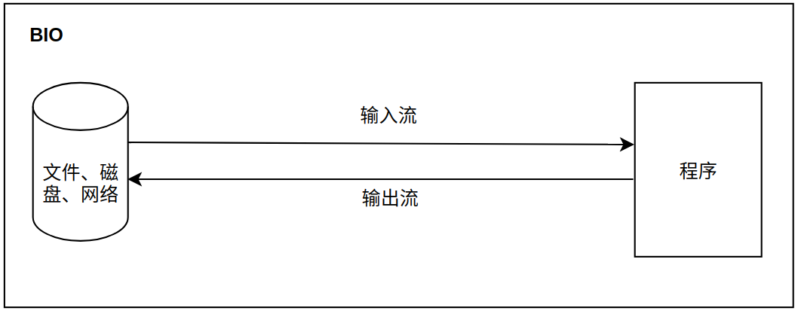
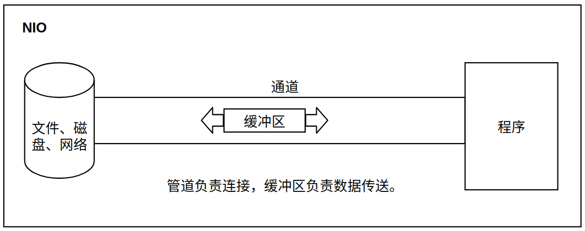
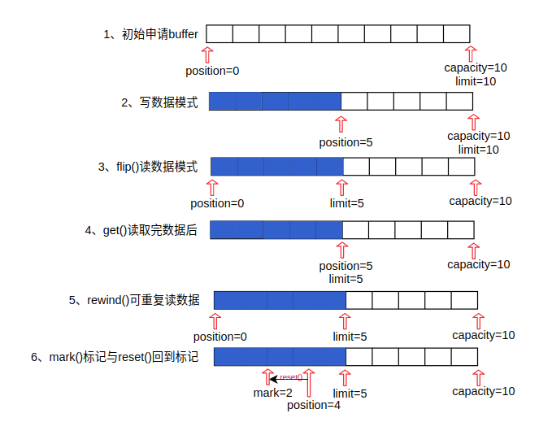
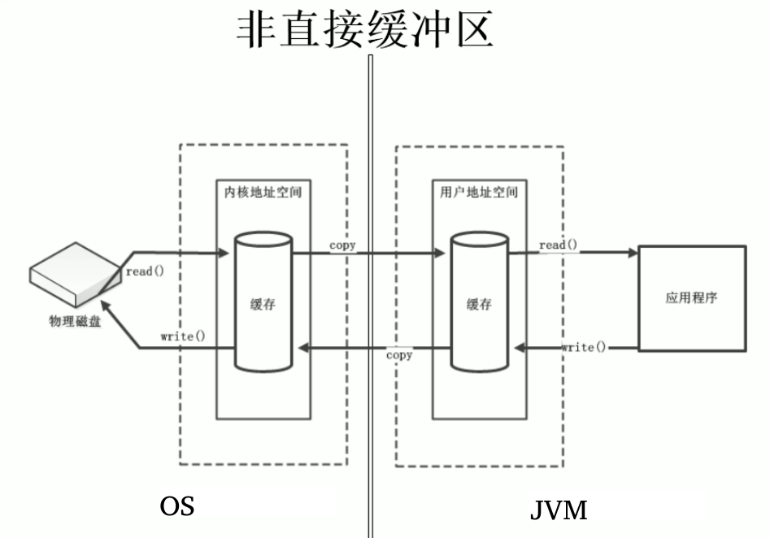
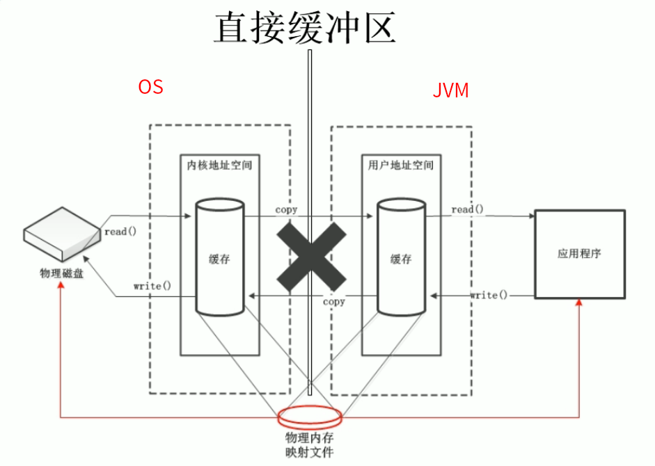
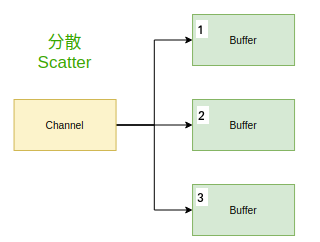
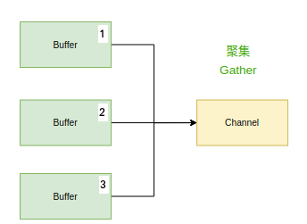

# NIO

资料:  [尚硅谷NIO视频(java nio线程精讲)](https://www.bilibili.com/video/BV14W411u7ro?t=396&p=6)

## 基础知识

### NIO与IO的主要区别

| IO                        | NIO                           |
| ------------------------- | ----------------------------- |
| 面向流（Stream Oriented） | 面向缓冲区（Buffer Oriented） |
| 阻塞IO（Blocking IO）     | 非阻塞IO（Non Blocking IO）   |
| （无）                    | 选择器（Selectors）           |





### 阻塞和非阻塞

​		阻塞和非阻塞是进程在访问数据的时候，数据内是否准备就绪的一种处理方式，当数据没有准备好的时候，阻塞往往需要等待缓冲区中的数据准备好过后才处理其他的事情，否则一直等待在那里。而非阻塞，当我们的进程访问我们的数据缓冲区的时候，也直接返回。

### IO同步和异步

​		同步就是在一个功能调用时，在没有得到结果之前，该调用就不返回。也就是一件一件事做，等前一件做完了才做下一件事。
​		异步和同步相对，当一个异步过程调用出发后，调用者不能立刻得到结果。实际处理这个调用的部件在完成后，通过状态，通知和回调来通知调用者。

### 通道和缓冲区

​	Java NIO系统的核心在于：通道（Channel）和缓冲区（Buffer）。通道表示打开到IO设备（例如：文件、套接字）的连接。若需要使用NIO系统，需要获取用于连接IO设备的通道以及用于容纳数据的缓冲区。然后操作缓冲区，对数据进行处理。

> 简而言之：Channel负责传输，Buffer负责存储。

## 缓冲区Buffer

### 不同数据类型缓冲区

​	在Java NIO中负责数据的存取。缓冲区就是数组。用于存储不同数据类型的数据。

根据数据类型不同（boolean除外），提供了相应类型的缓冲区：

**ByteBuffer、CharBuffer、ShortBuffer、IntBuffer、LongBuffer、FloatBuffer、DoubleBuffer。**

上述缓冲区的管理方式几乎一致，通过allocate()获取缓冲区。

### 缓冲区存取数据核心方法

put()：存入数据到缓冲区中

get()：获取缓冲区中的数据

### 缓冲区4个核心属性

capacity：容量，表示缓冲区中最大存储数据的容量。一旦声明不能改变。

limit：界限，表示缓冲区中可以操作数据的大小。（limit后数据不能进行读写0

position：位置，表示缓冲区正在操作数据的位置。

mark：标记，表示记录当前position的位置，可以通过resset()恢复到mark的位置。

规则：mark <= position <= limit <= capacity

### 代码演示方法和属性

代码buffer流程图示：



代码：

```java
package com.tc.nio;

import java.nio.ByteBuffer;

public class TestBuffer {
    public static void main(String[] args) {
        // 1.分配一个指定大小的缓冲区
        ByteBuffer buffer = ByteBuffer.allocate(10);
        // 可用看出初始化缓冲区后，指针最开始指向开始0位置，空间为10，最大可以写入10
        System.out.println("--------------allocate---------------");
        System.out.println("position:" + buffer.position());
        System.out.println("limit:" + buffer.limit());
        System.out.println("capacity:" + buffer.capacity());

        // 2.利用put()存入数据到缓冲区中
        String str = "abcde";
        buffer.put(str.getBytes());
        // 可以看到指针写入数据后到了5这个位置，总空间为10，最大可以写到10
        System.out.println("--------------put()---------------");
        System.out.println("position:" + buffer.position());
        System.out.println("limit:" + buffer.limit());
        System.out.println("capacity:" + buffer.capacity());

        // 3.切换为读取的模式
        buffer.flip();
        // 可以看出，切换到读模式后，指针指向开始位置，最多读取到limit位置。
        System.out.println("--------------flip()---------------");
        System.out.println("position:" + buffer.position());
        System.out.println("limit:" + buffer.limit());
        System.out.println("capacity:" + buffer.capacity());

        // 4.读取缓冲区中的数据
        byte[] dst = new byte[buffer.limit()];
        buffer.get(dst);
        System.out.println("content:" + new String(dst， 0， dst.length));
        // 可以看出，当前position读取位置到了5，最大可读为5，总空间容量为10。
        System.out.println("--------------get()---------------");
        System.out.println("position:" + buffer.position());
        System.out.println("limit:" + buffer.limit());
        System.out.println("capacity:" + buffer.capacity());

        // 5、rewind()：可重复读取数据  回到了第三步状态。
        buffer.rewind();
        System.out.println("--------------rewind()---------------");
        System.out.println("position:" + buffer.position());
        System.out.println("limit:" + buffer.limit());
        System.out.println("capacity:" + buffer.capacity());

        // 6.clear()：清空缓冲区，但是缓冲区中的数据依然存在，但是处于“被遗忘”状态
        buffer.clear();
        System.out.println("--------------clear()---------------");
        System.out.println("position:" + buffer.position());
        System.out.println("limit:" + buffer.limit());
        System.out.println("capacity:" + buffer.capacity());
        // 查看还在不在
        System.out.println((char)buffer.get());

        // 7.mark标记，reset回到mark标记
        System.out.println("--------------mark()&&reset()---------------");
        buffer.clear();
        buffer.get(new byte[2]);
        System.out.println("position:" + buffer.position()); // position:2
        buffer.mark(); // mark = 2
        buffer.get(new byte[2]);
        System.out.println("position:" + buffer.position()); // position:4
        buffer.reset(); // reset   :position reset to mark pos.
        System.out.println("position:" + buffer.position()); // position:2

        System.out.println("--------------remaining()---------------");
        // 判断缓冲区中是否还有剩余数据
        if (buffer.hasRemaining()) {
            // 获取缓冲区中可以操作的数量  （还能读多少，还能写多少）
            System.out.println(buffer.remaining());
        }
    }
}
```

```
--------------allocate---------------
position:0
limit:10
capacity:10
--------------put()---------------
position:5
limit:10
capacity:10
--------------flip()---------------
position:0
limit:5
capacity:10
content:abcde
--------------get()---------------
position:5
limit:5
capacity:10
--------------rewind()---------------
position:0
limit:5
capacity:10
--------------clear()---------------
position:0
limit:10
capacity:10
a
--------------mark()&&reset()---------------
position:2
position:4
position:2
--------------remaining()---------------
8

Process finished with exit code 0
```

## 直接缓冲区与非直接缓冲区

- 字节缓冲区要么是直接的，要么是非直接的。如果为直接字节缓冲区，则JAVA虚拟机会尽最大努力直接在此缓冲区上执行本机I/O操作。也就是说，在每次调用基础操作系统的一个本机I/O操作之前(或之后)，虚拟机都会尽量游免缓冲区的内容复制到中间缓冲区中(或从中间缓冲区中复制内容)。
- 直接字节缓冲区可以通过调用此类的allocateDirect()工厂方法来创建，此方法返回的缓冲区进行分配和取消分配所需成本通常高于非直接缓冲区。直接缓冲区的内容可以驻留在常规的垃极回收堆之外，因此，它们对应用程序的内存需求量造成的影响可能并不明显，所以，建议将直接缓冲区主要分配给那些易受基础系统的本机I/O操作影响的大型、持久的缓冲区，一般情况下，最好仅在直接缓冲区能在程序性能方面带来明显好处时分配它们。
- 直接字节缓冲区还可以通过FileChannel的map()方法将文件区域直接映射到内存中来创建，该方法返回MappedByteBuffer。Java平台的实现有助于通过JNI从本机代码创建直接字节缓冲区，如果以上这些缓冲区中的某个缓冲区实例指的是不可访问的内存区域，则试图访问该区域不会更改该缓冲区的内容，并且将会在访问期间或稍后的某个时间导致抛出不确定的异常。
- 字节缓冲区是直接缓冲区还是非直接缓冲区可通过调用其 isDirect()方法来确定。提供此方法是为了能够在性能关键型代码中执行显式缓冲区管理。

### 非直接缓冲区



### 直接缓冲区



直接对应物理内存缓冲区，省去了中间的拷贝过程，效率更高。当然申请更消耗资源，另外直接缓冲区不归JVM管理。

```java
package com.tc.nio;

import java.nio.ByteBuffer;

public class TestBuffer2 {
    public static void main(String[] args) {
//        ByteBuffer.allocate()
        ByteBuffer directBuffer = ByteBuffer.allocateDirect(1024);

        // 判断是直接缓冲区还是非直接缓冲区
        System.out.println("isDirect:" + directBuffer.isDirect());

        System.out.println("position:" + directBuffer.position());
        System.out.println("limit:" + directBuffer.limit());
        System.out.println("capacity:" + directBuffer.capacity());
    }
}
```

```
isDirect:true
position:0
limit:1024
capacity:1024
```

## 通道Channel

​		通道（Channel）：有java.nio.channels包定义的。Channel表示IO源与目标打开的连接。Channel类似于传统的“流”，只不过Channel本身不能直接访问数据，Channel只能与Buffer进行交互。

1. 通道（Channel），用于源节点与目标节点，在Java NIO中负责缓冲区中数据的传输。Channel本身不存储数据，因此需要配合缓冲区进行传输。

2. 通道主要实现类：java.nio.channels.Channel接口：

   - FileChannel
   - SocketChannel
   - ServerSocketChannel
   - DatagramChannel

3. 获取通道

   - java针对支持通道的类提供了getChannel()方法 
     - 本地IO
       - FileInputStream/FileOutputStream
       - RandomAccessFile
     - 网络IO
       - Socket
       - ServerSocket
       - DatagramSocket
   - jdk1.7中的NIO.2针对各个通道提供了静态方法open()
   - jdk1.7中的NIO.2的Files工具类的newByteChannel()

4. 通道之间的数据传输

   transferFrom()

   transferTo()

5. 分散(Scatter)与聚集(Gather)

   分散读取（Scattering Reads）：将通道中的数据分散到多个缓冲区中

   聚集写入（Gathering Writes）：将多个缓冲区中的数据聚集到通道中

   

   

   注意：按照缓冲区的顺序，从channel中读取的数据依次将Buffer填满。

6. 字符集：Charset

   编码：字符串-》字符数组

   解码：字符数组-》字符串

### 案例：使用通道完成文件的复制

```java
package com.tc.nio;

import java.io.FileInputStream;
import java.io.FileOutputStream;
import java.io.IOException;
import java.nio.ByteBuffer;
import java.nio.channels.FileChannel;

public class TestChannel1 {
    public static void main(String[] args) {
        long start=System.currentTimeMillis();

        FileInputStream fis=null;
        FileOutputStream fos=null;

        FileChannel inChannel=null;
        FileChannel outChannel=null;
        try{
            fis=new FileInputStream("001.png");
            fos=new FileOutputStream("002.png");

            //1.获取通道
            inChannel=fis.getChannel();
            outChannel=fos.getChannel();

            //2.分配指定大小的缓冲区
            ByteBuffer buf=ByteBuffer.allocate(1024); // 非直接缓冲区
//            ByteBuffer buf=ByteBuffer.allocateDirect(1024);// 直接缓冲区

            //3.将通道中的数据存入缓冲区中
            while(inChannel.read(buf)!=-1){
                buf.flip();//切换读取数据的模式
                //4.将缓冲区中的数据写入通道中
                outChannel.write(buf);
                buf.clear();//清空缓冲区
            }
        }catch(IOException e){
            e.printStackTrace();
        }finally{
            try {
                if(outChannel!=null){
                    outChannel.close();
                }
                if(inChannel!=null){
                    inChannel.close();
                }
                if(fos!=null){
                    fos.close();
                }
                if(fis!=null){
                    fis.close();
                }
            } catch (IOException e) {
                e.printStackTrace();
            }
        }
        long end=System.currentTimeMillis();
        System.out.println("耗费时间："+(end-start));
    }
}
```

### 案例：使用直接缓冲区完成文件的复制（内存映射文件）

```java
package com.tc.nio;

import java.io.IOException;
import java.nio.MappedByteBuffer;
import java.nio.channels.FileChannel;
import java.nio.file.Paths;
import java.nio.file.StandardOpenOption;

public class TestChannel2 {
    public static void main(String[] args) {
        long start=System.currentTimeMillis();

        FileChannel inChannel=null;
        FileChannel outChannel=null;
        try{
            //1.获取通道
            inChannel = FileChannel.open(Paths.get("侏罗纪.mp4"), StandardOpenOption.READ);
            // StandardOpenOption.CREATE_NEW 没有就创建新的，如果已经存在就报错
            // StandardOpenOption.CREATE 没有就创建新的，如果已经存在就替换。
            outChannel = FileChannel.open(Paths.get("侏罗纪2.mp4"), StandardOpenOption.WRITE, StandardOpenOption.READ, StandardOpenOption.CREATE);

            // 内存映射文件
            MappedByteBuffer inMappedBuf = inChannel.map(FileChannel.MapMode.READ_ONLY, 0, inChannel.size());
            MappedByteBuffer outMappedBuf = outChannel.map(FileChannel.MapMode.READ_WRITE, 0, inChannel.size());

//            outChannel.write(inMappedBuf);
            // 直接对缓冲区进行数据的读写操作
            byte[] dst = new byte[inMappedBuf.limit()];
            inMappedBuf.get(dst);
            outMappedBuf.put(dst);

        } catch (IOException e){
            e.printStackTrace();
        } finally {
            try {
                if(outChannel!=null){
                    outChannel.close();
                }
                if(inChannel!=null){
                    inChannel.close();
                }
            } catch (IOException e) {
                e.printStackTrace();
            }
        }
        long end=System.currentTimeMillis();
        System.out.println("耗费时间："+(end-start));
    }
}
```

### 案例：通道之间的数据传输

```java
package com.tc.nio;

import java.io.IOException;
import java.nio.channels.FileChannel;
import java.nio.file.Paths;
import java.nio.file.StandardOpenOption;

public class TestChannel3 {
    public static void main(String[] args) {
        long start=System.currentTimeMillis();

        FileChannel inChannel=null;
        FileChannel outChannel=null;
        try{
            //1.获取通道
            inChannel = FileChannel.open(Paths.get("侏罗纪.mp4"), StandardOpenOption.READ);
            // StandardOpenOption.CREATE_NEW 没有就创建新的，如果已经存在就报错
            // StandardOpenOption.CREATE 没有就创建新的，如果已经存在就替换。
            outChannel = FileChannel.open(Paths.get("侏罗纪2.mp4"), StandardOpenOption.WRITE, StandardOpenOption.READ, StandardOpenOption.CREATE);

//            inChannel.transferTo(0, inChannel.size(), outChannel);
            outChannel.transferFrom(inChannel, 0, inChannel.size());
        } catch (IOException e){
            e.printStackTrace();
        } finally {
            try {
                if(outChannel!=null){
                    outChannel.close();
                }
                if(inChannel!=null){
                    inChannel.close();
                }
            } catch (IOException e) {
                e.printStackTrace();
            }
        }
        long end=System.currentTimeMillis();
        System.out.println("耗费时间："+(end-start));
    }
}
```


