# HashMap深入理解

学习资料-[黑马程序员深入解读阿里等大厂java面试核心HashMap技术点](https://www.bilibili.com/video/BV1nJ411J7AA/?p=1&vd_source=d738e4925805b87bb827090f490126cd)

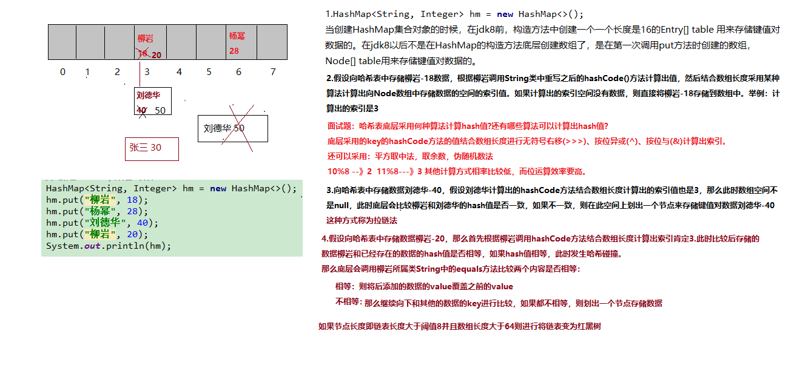

# HashMap集合(高级)

## 1.HashMap集合简介

​	HashMap基于哈希表的Map接口实现，是以key-value存储形式存在，即主要用来存放键值对。HashMap 的实现不是同步的，这意味着它不是线程安全的。它的key、value都可以为null。此外，HashMap中的映射不是有序的。

​	JDK1.8 之前 HashMap 由 数组+链表 组成的，数组是 HashMap 的主体，链表则是主要为了解决哈希冲突**(两个对象调用的hashCode方法计算的哈希码值一致导致计算的数组索引值相同)**而存在的（“拉链法”解决冲突）.JDK1.8 以后在解决哈希冲突时有了较大的变化，**当链表长度大于阈值（或者红黑树的边界值，默认为 8）并且当前数组的长度大于64时，此时此索引位置上的所有数据改为使用红黑树存储。**

补充：将链表转换成红黑树前会判断，即使阈值大于8，但是数组长度小于64，此时并不会将链表变为红黑树。而是选择进行数组扩容。

这样做的目的是因为数组比较小，尽量避开红黑树结构，这种情况下变为红黑树结构，反而会降低效率，因为红黑树需要进行左旋，右旋，变色这些操作来保持平衡 。同时数组长度小于64时，搜索时间相对要快些。所以综上所述为了提高性能和减少搜索时间，底层在阈值大于8并且数组长度大于64时，链表才转换为红黑树。具体可以参考 `treeifyBin`方法。

当然虽然增了红黑树作为底层数据结构，结构变得复杂了，但是阈值大于8并且数组长度大于64时，链表转换为红黑树时，效率也变的更高效。 

小结：

特点：

1.存取无序的

2.键和值位置都可以是null，但是键位置只能是一个null

3.键位置是唯一的，底层的数据结构控制键的

4.jdk1.8前数据结构是：链表 + 数组  jdk1.8之后是 ： 链表 + 数组  + 红黑树

5.阈值(边界值) > 8 并且数组长度大于64，才将链表转换为红黑树，变为红黑树的目的是为了高效的查询。

## 2.HashMap集合底层的数据结构

### 2.1数据结构概念

 	[数据](https://baike.baidu.com/item/数据/5947370)结构是[计算机](https://baike.baidu.com/item/计算机/140338)存储、组织[数据](https://baike.baidu.com/item/数据)的方式。数据结构是指相互之间存在一种或多种特定关系的[数据元素](https://baike.baidu.com/item/数据元素/715313)的集合。通常情况下，精心选择的数据结构可以带来更高的运行或者存储[效率](https://baike.baidu.com/item/效率/868847)。数据结构往往同高效的检索[算法](https://baike.baidu.com/item/算法/209025)和[索引](https://baike.baidu.com/item/索引/5716853)技术有关。 

数据结构：就是存储数据的一种方式。ArrayList LinkedList

在JDK1.8 之前 HashMap 由 **数组+链表** 数据结构组成的。

在JDK1.8 之后 HashMap 由 **数组+链表 +红黑树**数据结构组成的。

### 2.2HashMap底层的数据结构存储数据的过程

存储过程如下所示：

使用的代码：

~~~java
public class Demo01 {
    public static void main(String[] args) {
        HashMap<String, Integer> map = new HashMap<>();
        map.put("刘德华", 53);
        map.put("柳岩", 35);
        map.put("张学友", 55);
        map.put("郭富城", 52);
        map.put("黎明", 51);
        map.put("林青霞", 55);
        map.put("刘德华", 50);
    }
}
~~~

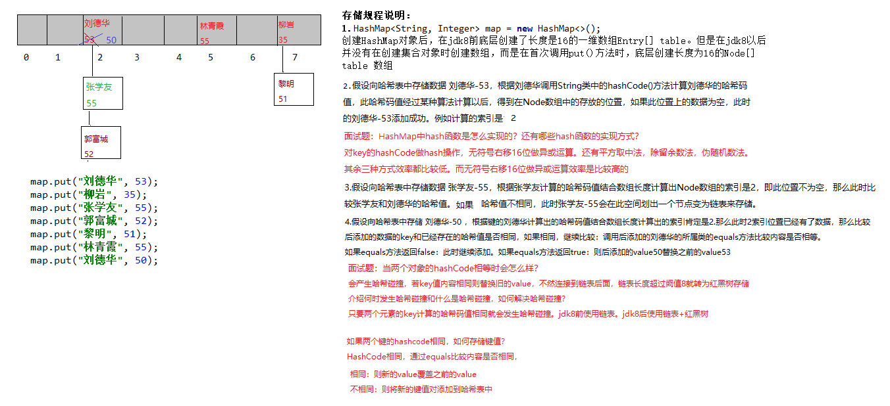

说明：

1.面试题：HashMap中hash函数是怎么实现的？还有哪些hash函数的实现方式？

~~~
对于key的hashCode做hash操作，无符号右移16位然后做异或运算。
还有平方取中法，伪随机数法和取余数法。这三种效率都比较低。而无符号右移16位异或运算效率是最高的。至于底层是如何计算的我们下面看源码时给大家讲解。
~~~

2.面试题：当两个对象的hashCode相等时会怎么样？

~~~
会产生哈希碰撞，若key值内容相同则替换旧的value.不然连接到链表后面，链表长度超过阈值8就转换为红黑树存储。
~~~

3.面试题：何时发生哈希碰撞和什么是哈希碰撞,如何解决哈希碰撞？

~~~
只要两个元素的key计算的哈希码值相同就会发生哈希碰撞。jdk8前使用链表解决哈希碰撞。jdk8之后使用链表+红黑树解决哈希碰撞。
~~~

4.面试题：如果两个键的hashcode相同，如何存储键值对？

~~~
hashcode相同，通过equals比较内容是否相同。
相同：则新的value覆盖之前的value
不相同：则将新的键值对添加到哈希表中
~~~

5.在不断的添加数据的过程中，会涉及到扩容问题，当超出临界值(且要存放的位置非空)时，扩容。默认的扩容方式：扩容为原来容量的2倍，并将原有的数据复制过来。

6.通过上述描述，当位于一个链表中的元素较多，即hash值相等但是内容不相等的元素较多时，通过key值依次查找的效率较低。而**JDK1.8**中，哈希表存储采用数组+链表+红黑树实现，当链表长度(阀值)超过 8 时且当前数组的长度 > 64时，将链表转换为红黑树，这样大大减少了查找时间。jdk8在哈希表中引入红黑树的原因只是为了查找效率更高。

简单的来说，哈希表是由数组+链表+红黑树（JDK1.8增加了红黑树部分）实现的。如下图所示。

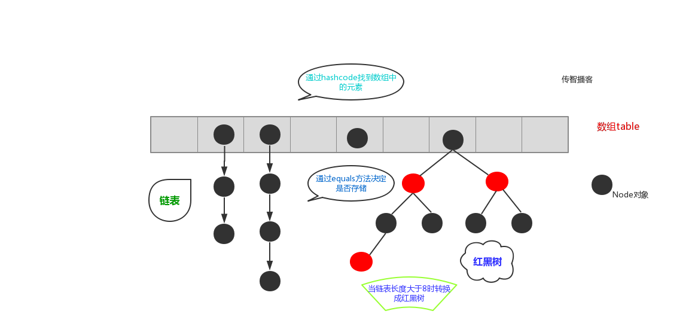

 **但是这样的话问题来了，传统hashMap的缺点，1.8为什么引入红黑树？这样结构的话不是更麻烦了吗，为何阈值大于8换成红黑树？**

 JDK 1.8 以前 HashMap 的实现是 数组+链表，即使哈希函数取得再好，也很难达到元素百分百均匀分布。当 HashMap 中有大量的元素都存放到同一个桶中时，这个桶下有一条长长的链表，这个时候 HashMap 就相当于一个单链表，假如单链表有 n 个元素，遍历的时间复杂度就是 O(n)，完全失去了它的优势。针对这种情况，JDK 1.8 中引入了 红黑树（查找时间复杂度为 O(logn)）来优化这个问题。 当链表长度很小的时候，即使遍历，速度也非常快，但是当链表长度不断变长，肯定会对查询性能有一定的影响，所以才需要转成树。

至于为什么阈值是8，我想，去源码中找寻答案应该是最可靠的途径。 下面我们在分析源码的时候会介绍。

**7.总结：**

上述我们大概阐述了HashMap底层存储数据的方式。为了方便大家更好的理解，我们结合一个存储流程图来进一步说明一下：(jdk8存储过程)

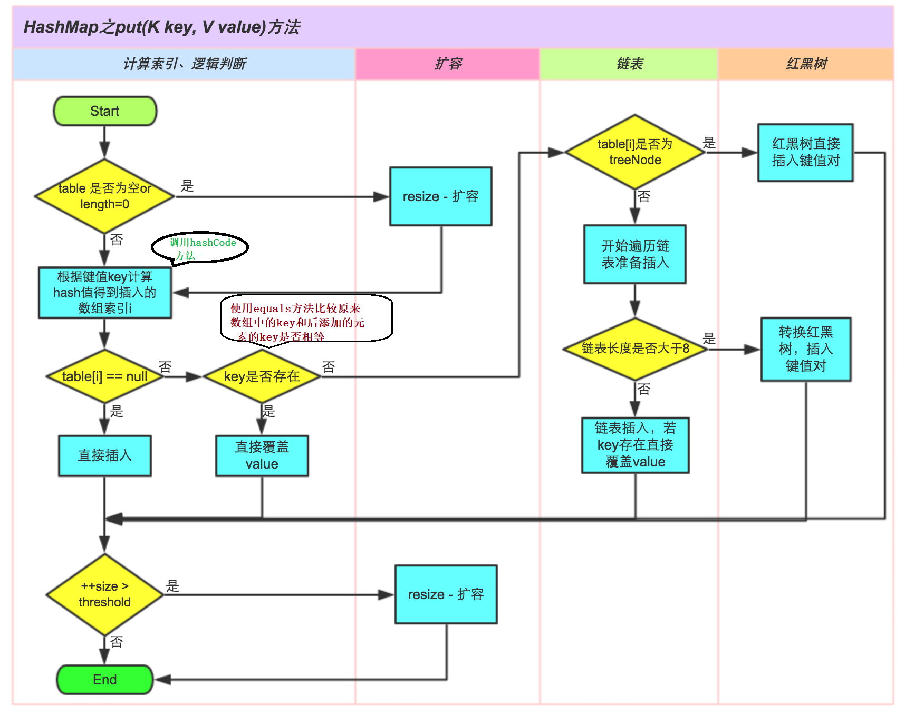

说明：

1.size表示 HashMap中K-V的实时数量 ， 注意这个不等于数组的长度 。 

2.threshold( 临界值)  =capacity(容量) * loadFactor( 加载因子 )。这个值是当前已占用数组长度的最大值。size超过这个临界值就重新resize(扩容)，扩容后的 HashMap 容量是之前容量的两倍 。

## 3.HashMap继承关系

HashMap继承关系如下图所示：

说明：

- Cloneable 空接口，表示可以克隆。 创建并返回HashMap对象的一个副本。
- Serializable 序列化接口。属于标记性接口。HashMap对象可以被序列化和反序列化。
- AbstractMap 父类提供了Map实现接口。以最大限度地减少实现此接口所需的工作。

补充：通过上述继承关系我们发现一个很奇怪的现象， 就是HashMap已经继承了AbstractMap而AbstractMap类实现了Map接口，那为什么HashMap还要在实现Map接口呢？同样在ArrayList中LinkedList中都是这种结构。 

~~~java
据 java 集合框架的创始人Josh Bloch描述，这样的写法是一个失误。在java集合框架中，类似这样的写法很多，最开始写java集合框架的时候，他认为这样写，在某些地方可能是有价值的，直到他意识到错了。显然的，JDK的维护者，后来不认为这个小小的失误值得去修改，所以就这样存在下来了。
~~~

## 4.HashMap集合类的成员

### 4.1成员变量

1.序列化版本号

~~~java
private static final long serialVersionUID = 362498820763181265L;
~~~

2.集合的初始化容量( **必须是二的n次幂** )

~~~java
//默认的初始容量是16 -- 1<<4相当于1*2的4次方---1*16
static final int DEFAULT_INITIAL_CAPACITY = 1 << 4;   
~~~

问题： **为什么必须是2的n次幂？如果输入值不是2的幂比如10会怎么样？** 

HashMap构造方法还可以指定集合的初始化容量大小：

~~~java
HashMap(int initialCapacity) 构造一个带指定初始容量和默认加载因子 (0.75) 的空 HashMap。
~~~

 根据上述讲解我们已经知道，当向HashMap中添加一个元素的时候，需要根据key的hash值，去确定其在数组中的具体位置。 HashMap为了存取高效，要尽量较少碰撞，就是要尽量把数据分配均匀，每个链表长度大致相同，这个实现就在把数据存到哪个链表中的算法。

这个算法实际就是取模，hash%length，计算机中直接求余效率不如位移运算(这点上述已经讲解)。所以源码中做了优化,使用 hash&(length-1)，而实际上hash%length等于hash&(length-1)的前提是length是2的n次幂。

为什么这样能均匀分布减少碰撞呢？2的n次方实际就是1后面n个0，2的n次方-1  实际就是n个1；

举例：

**说明：按位与运算：相同的二进制数位上，都是1的时候，结果为1，否则为零。**

~~~java
例如长度为8时候，3&(8-1)=3  2&(8-1)=2 ，不同位置上，不碰撞；
例如长度length为8时候，8是2的3次幂。二进制是：1000
length-1 二进制运算：
	1000
-	   1
---------------------
     111
如下所示：
hash&(length-1)
3   &(8    - 1)=3  
	00000011  3 hash
&   00000111  7 length-1
---------------------
	00000011-----》3 数组下标
	
hash&(length-1)
2 &  (8 -    1) = 2  
	00000010  2 hash
&   00000111  7 length-1
---------------------
	00000010-----》2  数组下标
说明：上述计算结果是不同位置上，不碰撞；
~~~

~~~java
例如长度为9时候，3&(9-1)=0  2&(9-1)=0 ，都在0上，碰撞了；
例如长度length为9时候，9不是2的n次幂。二进制是：00001001
length-1 二进制运算：
	1001
-	   1
---------------------
    1000
如下所示：
hash&(length-1)
3   &(9    - 1)=0  
	00000011  3 hash
&   00001000  8 length-1 
---------------------
	00000000-----》0  数组下标
	
hash&(length-1)
2 &  (9 -    1) = 2  
	00000010 2 hash
&   00001000 8 length-1 
---------------------
	00000000-----》0  数组下标
说明：上述计算结果都在0上，碰撞了；
~~~

**注意： 当然如果不考虑效率直接求余即可（就不需要要求长度必须是2的n次方了）** 

小结：

​	1.由上面可以看出，当我们根据key的hash确定其在数组的位置时，如果n为2的幂次方，可以保证数据的均匀插入，如果n不是2的幂次方，可能数组的一些位置永远不会插入数据，浪费数组的空间，加大hash冲突。

​    2.另一方面，一般我们可能会想通过 % 求余来确定位置，这样也可以，只不过性能不如 & 运算。而且当n是2的幂次方时：hash & (length - 1) == hash % length

​	3.因此，HashMap 容量为2次幂的原因，就是为了数据的的均匀分布，减少hash冲突，毕竟hash冲突越大，代表数组中一个链的长度越大，这样的话会降低hashmap的性能

​	**4.如果创建HashMap对象时，输入的数组长度是10，不是2的幂，HashMap通过一通位移运算和或运算得到的肯定是2的幂次数，并且是离那个数最近的数字。**

源代码如下：

~~~java
//创建HashMap集合的对象，指定数组长度是10，不是2的幂
HashMap hashMap = new HashMap(10);
public HashMap(int initialCapacity) {//initialCapacity=10
   this(initialCapacity, DEFAULT_LOAD_FACTOR);
 }
public HashMap(int initialCapacity, float loadFactor) {//initialCapacity=10
     if (initialCapacity < 0)
            throw new IllegalArgumentException("Illegal initial capacity: " +
                                               initialCapacity);
        if (initialCapacity > MAXIMUM_CAPACITY)
            initialCapacity = MAXIMUM_CAPACITY;
        if (loadFactor <= 0 || Float.isNaN(loadFactor))
            throw new IllegalArgumentException("Illegal load factor: " +
                                               loadFactor);
    this.loadFactor = loadFactor;
    this.threshold = tableSizeFor(initialCapacity);//initialCapacity=10
}
  /**
   * Returns a power of two size for the given target capacity.
  */
    static final int tableSizeFor(int cap) {//int cap = 10
        int n = cap - 1;
        n |= n >>> 1;
        n |= n >>> 2;
        n |= n >>> 4;
        n |= n >>> 8;
        n |= n >>> 16;
        return (n < 0) ? 1 : (n >= MAXIMUM_CAPACITY) ? MAXIMUM_CAPACITY : n + 1;
    }
~~~

说明：

由此可以看到，当在实例化HashMap实例时，如果给定了initialCapacity(假设是10)，由于HashMap的capacity必须都是2的幂，因此这个方法用于找到大于等于initialCapacity(假设是10)的最小的2的幂（initialCapacity如果就是2的幂，则返回的还是这个数）。
下面分析这个算法：
1)、首先，为什么要对cap做减1操作。int n = cap - 1;
这是为了防止，cap已经是2的幂。如果cap已经是2的幂， 又没有执行这个减1操作，则执行完后面的几条无符号右移操作之后，返回的capacity将是这个cap的2倍。如果不懂，要看完后面的几个无符号右移之后再回来看看。
下面看看这几个无符号右移操作：
2）、如果n这时为0了（经过了cap-1之后），则经过后面的几次无符号右移依然是0，最后返回的capacity是		1（最后有个n+1的操作）。
这里只讨论n不等于0的情况。

3）、注意：**|（按位或运算）：运算规则：相同的二进制数位上，都是0的时候，结果为0，否则为1。**

​	 **第一次右移** ：

~~~java
int n = cap - 1;//cap=10  n=9
n |= n >>> 1;
	00000000 00000000 00000000 00001001 //9
|	
	00000000 00000000 00000000 00000100 //9右移之后变为4
-------------------------------------------------
	00000000 00000000 00000000 00001101 //按位异或之后是13
~~~

 由于n不等于0，则n的二进制表示中总会有一bit为1，这时考虑最高位的1。通过无符号右移1位，则将最高位的1右移了1位，再做或操作，使得n的二进制表示中与最高位的1紧邻的右边一位也为1，如：

~~~java
00000000 00000000 00000000 00001101
~~~

 **第二次右移** ：

~~~java
 n |= n >>> 2;//n通过第一次右移变为了：n=13
	00000000 00000000 00000000 00001101  // 13
|
    00000000 00000000 00000000 00000011  //13右移之后变为3
-------------------------------------------------
	00000000 00000000 00000000 00001111 //按位异或之后是15
~~~

 注意，这个n已经经过了`n |= n >>> 1;` 操作。假设此时n为00000000 00000000 00000000 00001101 ，则n无符号右移两位，会将最高位两个连续的1右移两位，然后再与原来的n做或操作，这样n的二进制表示的高位中会有4个连续的1。如：

~~~java
00000000 00000000 00000000 00001111 //按位异或之后是15
~~~

 **第三次右移** :

~~~java
n |= n >>> 4;//n通过第一、二次右移变为了：n=15
	00000000 00000000 00000000 00001111  // 15
|
    00000000 00000000 00000000 00000000  //15右移之后变为0
-------------------------------------------------
	00000000 00000000 00000000 00001111 //按位异或之后是15
~~~

这次把已经有的高位中的连续的4个1，右移4位，再做或操作，这样n的二进制表示的高位中正常会有8个连续的1。如00001111 1111xxxxxx 。
以此类推
注意，容量最大也就是32bit的正数，因此最后n |= n >>> 16; ，最多也就32个1（但是这已经是负数了。在执行tableSizeFor之前，对initialCapacity做了判断，如果大于MAXIMUM_CAPACITY(2 ^ 30)，则取MAXIMUM_CAPACITY。如果等于MAXIMUM_CAPACITY(2 ^ 30)，会执行移位操作。所以这里面的移位操作之后，最大30个1，不会大于等于MAXIMUM_CAPACITY。30个1，加1之后得2 ^ 30） 。
请看下面的一个完整例子：

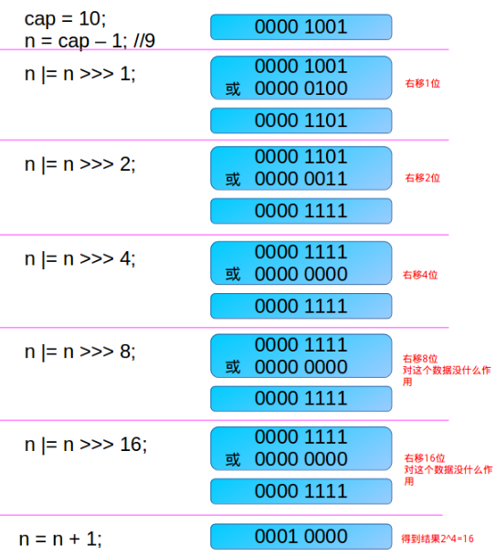

  注意，得到的这个capacity却被赋值给了threshold。 

~~~java
this.threshold = tableSizeFor(initialCapacity);//initialCapacity=10
~~~

3.默认的负载因子，默认值是0.75 

~~~java
static final float DEFAULT_LOAD_FACTOR = 0.75f;
~~~

4.集合最大容量 

~~~java
//集合最大容量的上限是：2的30次幂
static final int MAXIMUM_CAPACITY = 1 << 30;
~~~

5.当链表的值超过8则会转红黑树(**1.8新增**) 

~~~java
 //当桶(bucket)上的结点数大于这个值时会转成红黑树
 static final int TREEIFY_THRESHOLD = 8;
~~~

**问题：为什么Map桶中节点个数超过8才转为红黑树？**

8这个阈值定义在HashMap中，针对这个成员变量，在源码的注释中只说明了8是bin（bin就是bucket(桶)）从链表转成树的阈值，但是并没有说明为什么是8： 

 在HashMap中有一段注释说明： 我们继续往下看 :

~~~java
Because TreeNodes are about twice the size of regular nodes, we use them only when bins contain enough nodes to warrant use (see TREEIFY_THRESHOLD). And when they become too small (due to removal or resizing) they are converted back to plain bins.  In usages with well-distributed user hashCodes, tree bins are rarely used.  Ideally, under random hashCodes, the frequency of nodes in bins follows a Poisson distribution
(http://en.wikipedia.org/wiki/Poisson_distribution) with a parameter of about 0.5 on average for the default resizing threshold of 0.75, although with a large variance because of resizing granularity. Ignoring variance, the expected occurrences of list size k are (exp(-0.5)*pow(0.5, k)/factorial(k)).
The first values are:
因为树节点的大小大约是普通节点的两倍，所以我们只在箱子包含足够的节点时才使用树节点(参见TREEIFY_THRESHOLD)。当它们变得太小(由于删除或调整大小)时，就会被转换回普通的桶。在使用分布良好的用户hashcode时，很少使用树箱。理想情况下，在随机哈希码下，箱子中节点的频率服从泊松分布
(http://en.wikipedia.org/wiki/Poisson_distribution)，默认调整阈值为0.75，平均参数约为0.5，尽管由于调整粒度的差异很大。忽略方差，列表大小k的预期出现次数是(exp(-0.5)*pow(0.5, k)/factorial(k))。
第一个值是:

0:    0.60653066
1:    0.30326533
2:    0.07581633
3:    0.01263606
4:    0.00157952
5:    0.00015795
6:    0.00001316
7:    0.00000094
8:    0.00000006
more: less than 1 in ten million
~~~

TreeNodes占用空间是普通Nodes的两倍，所以只有当bin包含足够多的节点时才会转成TreeNodes，而是否足够多就是由TREEIFY_THRESHOLD的值决定的。当bin中节点数变少时，又会转成普通的bin。并且我们查看源码的时候发现，链表长度达到8就转成红黑树，当长度降到6就转成普通bin。

这样就解释了为什么不是一开始就将其转换为TreeNodes，而是需要一定节点数才转为TreeNodes，说白了就是权衡，空间和时间的权衡。

 这段内容还说到：当hashCode离散性很好的时候，树型bin用到的概率非常小，因为数据均匀分布在每个bin中，几乎不会有bin中链表长度会达到阈值。但是在随机hashCode下，离散性可能会变差，然而JDK又不能阻止用户实现这种不好的hash算法，因此就可能导致不均匀的数据分布。不过理想情况下随机hashCode算法下所有bin中节点的分布频率会遵循泊松分布，我们可以看到，一个bin中链表长度达到8个元素的概率为0.00000006，几乎是不可能事件。所以，之所以选择8，不是随便决定的，而是根据概率统计决定的。由此可见，发展将近30年的Java每一项改动和优化都是非常严谨和科学的。 

也就是说：选择8因为符合泊松分布，超过8的时候，概率已经非常小了，所以我们选择8这个数字。

补充：

1）.

~~~
 Poisson分布(泊松分布)，是一种统计与概率学里常见到的离散[概率分布]。
泊松分布的概率函数为：
~~~

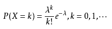

~~~
 泊松分布的参数λ是单位时间(或单位面积)内随机事件的平均发生次数。 泊松分布适合于描述单位时间内随机事件发生的次数。
~~~

2）.以下是我在研究这个问题时，在一些资料上面翻看的解释：供大家参考：

~~~java
红黑树的平均查找长度是log(n)，如果长度为8，平均查找长度为log(8)=3，链表的平均查找长度为n/2，当长度为8时，平均查找长度为8/2=4，这才有转换成树的必要；链表长度如果是小于等于6，6/2=3，而log(6)=2.6，虽然速度也很快的，但是转化为树结构和生成树的时间并不会太短。
~~~

**6.当链表的值小于6则会从红黑树转回链表** 

~~~java
 //当桶(bucket)上的结点数小于这个值时树转链表
 static final int UNTREEIFY_THRESHOLD = 6;
~~~

7.当Map里面的数量超过这个值时，表中的桶才能进行树形化 ，否则桶内元素太多时会扩容，而不是树形化 为了避免进行扩容、树形化选择的冲突，这个值不能小于 4 * TREEIFY_THRESHOLD (8)

~~~java
//桶中结构转化为红黑树对应的数组长度最小的值 
static final int MIN_TREEIFY_CAPACITY = 64;
~~~

**8、table用来初始化(必须是二的n次幂)(重点)** 

~~~java
//存储元素的数组 
transient Node<K,V>[] table;
~~~

**table**在JDK1.8中我们了解到HashMap是由数组加链表加红黑树来组成的结构其中table就是HashMap中的数组，jdk8之前数组类型是Entry<K,V>类型。从jdk1.8之后是Node<K,V>类型。只是换了个名字，都实现了一样的接口：Map.Entry<K,V>。负责存储键值对数据的。

9、用来存放缓存 

~~~java
//存放具体元素的集合
transient Set<Map.Entry<K,V>> entrySet;
~~~

**10、 HashMap中存放元素的个数(重点)**

~~~java
//存放元素的个数，注意这个不等于数组的长度。
 transient int size;
~~~

**size**为HashMap中K-V的实时数量，不是数组table的长度。

11、 用来记录HashMap的修改次数 

~~~java
// 每次扩容和更改map结构的计数器
 transient int modCount;  
~~~

12、 用来调整大小下一个容量的值计算方式为(容量*负载因子) 

~~~java
// 临界值 当实际大小(容量*负载因子)超过临界值时，会进行扩容
int threshold;
~~~

**13、 哈希表的加载因子(重点)** 

~~~java
// 加载因子
final float loadFactor;
~~~

**说明：**

1.**loadFactor**加载因子，是用来衡量 HashMap 满的程度，**表示HashMap的疏密程度，影响hash操作到同一个数组位置的概率**，计算HashMap的实时加载因子的方法为：size/capacity，而不是占用桶的数量去除以capacity。capacity 是桶的数量，也就是 table 的长度length。

**loadFactor太大导致查找元素效率低，太小导致数组的利用率低，存放的数据会很分散。loadFactor的默认值为0.75f是官方给出的一个比较好的临界值**。

**当HashMap里面容纳的元素已经达到HashMap数组长度的75%时，表示HashMap太挤了，需要扩容，而扩容这个过程涉及到 rehash、复制数据等操作，非常消耗性能。，所以开发中尽量减少扩容的次数，可以通过创建HashMap集合对象时指定初始容量来尽量避免。**

**同时在HashMap的构造器中可以定制loadFactor。**

~~~java
构造方法：
HashMap(int initialCapacity, float loadFactor) 构造一个带指定初始容量和加载因子的空 HashMap。
~~~

2.为什么加载因子设置为0.75,初始化临界值是12？

loadFactor越趋近于1，那么 数组中存放的数据(entry)也就越多，也就越密，也就是会让链表的长度增加，loadFactor越小，也就是趋近于0，数组中存放的数据(entry)也就越少，也就越稀疏。

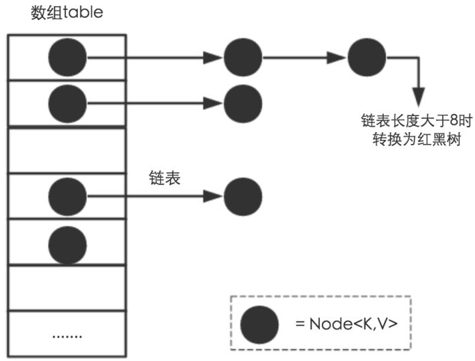

如果希望链表尽可能少些。要提前扩容，有的数组空间有可能一直没有存储数据。加载因子尽可能小一些。

举例：

~~~
例如：加载因子是0.4。 那么16*0.4--->6 如果数组中满6个空间就扩容会造成数组利用率太低了。
	 加载因子是0.9。 那么16*0.9---->14 那么这样就会导致链表有点多了。导致查找元素效率低。
~~~

所以既兼顾数组利用率又考虑链表不要太多，经过大量测试0.75是最佳方案。

- **threshold**计算公式：capacity(数组长度默认16) * loadFactor(负载因子默认0.75)。这个值是当前已占用数组长度的最大值。**当Size>=threshold**的时候，那么就要考虑对数组的resize(扩容)，也就是说，这个的意思就是 **衡量数组是否需要扩增的一个标准**。 扩容后的 HashMap 容量是之前容量的两倍.

### 4.2构造方法

 HashMap 中重要的构造方法，它们分别如下： 

1、构造一个空的 `HashMap` ，默认初始容量（16）和默认负载因子（0.75）。 

~~~java
public HashMap() {
   this.loadFactor = DEFAULT_LOAD_FACTOR; // 将默认的加载因子0.75赋值给loadFactor，并没有创建数组
}
~~~

2、 构造一个具有指定的初始容量和默认负载因子（0.75） `HashMap`。 

~~~java
 // 指定“容量大小”的构造函数
  public HashMap(int initialCapacity) {
      this(initialCapacity, DEFAULT_LOAD_FACTOR);
  }
~~~

3、 构造一个具有指定的初始容量和负载因子的 `HashMap`。我们来分析一下。 

~~~java
/*
	 指定“容量大小”和“加载因子”的构造函数
	 initialCapacity: 指定的容量
	 loadFactor:指定的加载因子
*/
public HashMap(int initialCapacity, float loadFactor) {
    	//判断初始化容量initialCapacity是否小于0
        if (initialCapacity < 0)
            //如果小于0，则抛出非法的参数异常IllegalArgumentException
            throw new IllegalArgumentException("Illegal initial capacity: " +
                                               initialCapacity);
    	//判断初始化容量initialCapacity是否大于集合的最大容量MAXIMUM_CAPACITY-》2的30次幂
        if (initialCapacity > MAXIMUM_CAPACITY)
            //如果超过MAXIMUM_CAPACITY，会将MAXIMUM_CAPACITY赋值给initialCapacity
            initialCapacity = MAXIMUM_CAPACITY;
    	//判断负载因子loadFactor是否小于等于0或者是否是一个非数值
        if (loadFactor <= 0 || Float.isNaN(loadFactor))
            //如果满足上述其中之一，则抛出非法的参数异常IllegalArgumentException
            throw new IllegalArgumentException("Illegal load factor: " +
                                               loadFactor);
     	//将指定的加载因子赋值给HashMap成员变量的负载因子loadFactor
        this.loadFactor = loadFactor;
    	/*
    		tableSizeFor(initialCapacity) 判断指定的初始化容量是否是2的n次幂，如果不是那么会变为比指			定初始化容量大的最小的2的n次幂。这点上述已经讲解过。
    		但是注意，在tableSizeFor方法体内部将计算后的数据返回给调用这里了，并且直接赋值给threshold边			界值了。有些人会觉得这里是一个bug,应该这样书写：
    		this.threshold = tableSizeFor(initialCapacity) * this.loadFactor;
    		这样才符合threshold的意思（当HashMap的size到达threshold这个阈值时会扩容）。
			但是，请注意，在jdk8以后的构造方法中，并没有对table这个成员变量进行初始化，table的初始化被推			 迟到了put方法中，在put方法中会对threshold重新计算，put方法的具体实现我们下面会进行讲解
    	*/
        this.threshold = tableSizeFor(initialCapacity);
    }
最后调用了tableSizeFor，来看一下方法实现：
     /**
     * Returns a power of two size for the given target capacity.
       返回比指定初始化容量大的最小的2的n次幂
     */
    static final int tableSizeFor(int cap) {
        int n = cap - 1;
        n |= n >>> 1;
        n |= n >>> 2;
        n |= n >>> 4;
        n |= n >>> 8;
        n |= n >>> 16;
        return (n < 0) ? 1 : (n >= MAXIMUM_CAPACITY) ? MAXIMUM_CAPACITY : n + 1;
    }
~~~

说明：

对于 this.threshold = tableSizeFor(initialCapacity); 疑问解答：

~~~java
tableSizeFor(initialCapacity) 判断指定的初始化容量是否是2的n次幂，如果不是那么会变为比指			定初始化容量大的最小的2的n次幂。这点上述已经讲解过。
但是注意，在tableSizeFor方法体内部将计算后的数据返回给调用这里了，并且直接赋值给threshold边			界值了。有些人会觉得这里是一个bug,应该这样书写：
this.threshold = tableSizeFor(initialCapacity) * this.loadFactor;
这样才符合threshold的意思（当HashMap的size到达threshold这个阈值时会扩容）。
但是，请注意，在jdk8以后的构造方法中，并没有对table这个成员变量进行初始化，table的初始化被推			 迟到了put方法中，在put方法中会对threshold重新计算，put方法的具体实现我们下面会进行讲解
~~~

4、包含另一个“Map”的构造函数 

~~~java
//构造一个映射关系与指定 Map 相同的新 HashMap。
public HashMap(Map<? extends K, ? extends V> m) {
    	//负载因子loadFactor变为默认的负载因子0.75
         this.loadFactor = DEFAULT_LOAD_FACTOR;
         putMapEntries(m, false);
 }
~~~

最后调用了putMapEntries，来看一下方法实现：

~~~java
final void putMapEntries(Map<? extends K, ? extends V> m, boolean evict) {
    //获取参数集合的长度
    int s = m.size();
    if (s > 0)
    {
        //判断参数集合的长度是否大于0，说明大于0
        if (table == null)  // 判断table是否已经初始化
        { // pre-size
                // 未初始化，s为m的实际元素个数
                float ft = ((float)s / loadFactor) + 1.0F;
                int t = ((ft < (float)MAXIMUM_CAPACITY) ?
                        (int)ft : MAXIMUM_CAPACITY);
                // 计算得到的t大于阈值，则初始化阈值
                if (t > threshold)
                    threshold = tableSizeFor(t);
        }
        // 已初始化，并且m元素个数大于阈值，进行扩容处理
        else if (s > threshold)
            resize();
        // 将m中的所有元素添加至HashMap中
        for (Map.Entry<? extends K, ? extends V> e : m.entrySet()) {
            K key = e.getKey();
            V value = e.getValue();
            putVal(hash(key), key, value, false, evict);
        }
    }
}
~~~

注意：

 float ft = ((float)s / loadFactor) + 1.0F;这一行代码中为什么要加1.0F ？

 s/loadFactor的结果是小数，加1.0F与(int)ft相当于是对小数做一个向上取整以尽可能的保证更大容量，更大的容量能够减少resize的调用次数。所以 + 1.0F是为了获取更大的容量。 

例如：原来集合的元素个数是6个，那么6/0.75是8，是2的n次幂，那么新的数组大小就是8了。然后原来数组的数据就会存储到长度是8的新的数组中了，这样会导致在存储元素的时候，容量不够，还得继续扩容，那么性能降低了，而如果+1呢，数组长度直接变为16了，这样可以减少数组的扩容。

### 4.3成员方法

#### 4.3.1增加方法

put方法是比较复杂的，实现步骤大致如下：

1）先通过hash值计算出key映射到哪个桶；

2）如果桶上没有碰撞冲突，则直接插入；

3）如果出现碰撞冲突了，则需要处理冲突：

​	a:如果该桶使用红黑树处理冲突，则调用红黑树的方法插入数据；

​	b:否则采用传统的链式方法插入。如果链的长度达到临界值，则把链转变为红黑树；

4）如果桶中存在重复的键，则为该键替换新值value；

5）如果size大于阈值threshold，则进行扩容；

具体的方法如下：

~~~java
public V put(K key, V value) {
    return putVal(hash(key), key, value, false, true);
}
~~~

说明： 

​	1）HashMap只提供了put用于添加元素，putVal方法只是给put方法调用的一个方法，并没有提供给用户使用。 所以我们重点看putVal方法。

 	2）我们可以看到在putVal()方法中key在这里执行了一下hash()方法,来看一下Hash方法是如何实现的。 

~~~java
 static final int hash(Object key) 
 {
        int h;
     	/*
     		1）如果key等于null：
     			可以看到当key等于null的时候也是有哈希值的，返回的是0.
     		2）如果key不等于null：
     			首先计算出key的hashCode赋值给h,然后与h无符号右移16位后的二进制进行按位异或得到最后的					hash值
     	*/
        return (key == null) ? 0 : (h = key.hashCode()) ^ (h >>> 16);
 }
~~~

从上面可以得知HashMap是支持Key为空的，而HashTable是直接用Key来获取HashCode所以key为空会抛异常。

{其实上面就已经解释了为什么HashMap的长度**为什么要是2的幂**因为HashMap 使用的方法很巧妙，它通过 hash & (table.length -1)来得到该对象的保存位，前面说过 HashMap 底层数组的长度总是2的n次方，这是HashMap在速度上的优化。当 length 总是2的n次方时，hash & (length-1)运算等价于对 length 取模，也就是hash%length，但是&比%具有更高的效率。比如 n % 32 = n & (32 -1)。}

**解读上述hash方法：**

我们先研究下key的哈希值是如何计算出来的。key的哈希值是通过上述方法计算出来的。

这个哈希方法首先计算出key的hashCode赋值给h,然后与h无符号右移16位后的二进制进行按位异或得到最后的	hash值。计算过程如下所示：

~~~java
 static final int hash(Object key) 
 {
        int h;
     	/*
     		1）如果key等于null：
     			可以看到当key等于null的时候也是有哈希值的，返回的是0.
     		2）如果key不等于null：
     			首先计算出key的hashCode赋值给h,然后与h无符号右移16位后的二进制进行按位异或得到最后的					hash值
     	*/
        return (key == null) ? 0 : (h = key.hashCode()) ^ (h >>> 16);
 }

~~~

在putVal函数中使用到了上述hash函数计算的哈希值：

~~~java
final V putVal(int hash, K key, V value, boolean onlyIfAbsent,
                   boolean evict) {
        。。。。。。。。。。。。。。
        if ((p = tab[i = (n - 1) & hash]) == null)//这里的n表示数组长度16
       。。。。。。。。。。。。。。
  }
~~~

计算过程如下所示：

​	说明：

​		1）key.hashCode()；返回散列值也就是hashcode。假设随便生成的一个值。

​		2）n表示数组初始化的长度是16

​		3）&（按位与运算）：运算规则：相同的二进制数位上，都是1的时候，结果为1，否则为零。

​	    4）^（按位异或运算）：运算规则：相同的二进制数位上，数字相同，结果为0，不同为1。

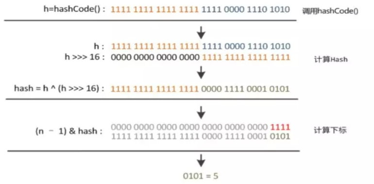

简单来说就是：

- 高16 bit 不变，低16 bit 和高16 bit 做了一个异或（得到的 hashcode 转化为32位二进制，前16位和后16位低16 bit和高16 bit做了一个异或）

  **问题：为什么要这样操作呢？**

  如果当n即数组长度很小，假设是16的话，那么n-1即为  ---》1111 ，这样的值和hashCode()直接做按位与操作，实际上只使用了哈希值的后4位。如果当哈希值的高位变化很大，低位变化很小，这样就很容易造成哈希冲突了，所以这里把高低位都利用起来，从而解决了这个问题。

  ~~~java
  例如上述：
  hashCode()值：     1111 1111 1111 1111 1111 0000 1110 1010
  				&
  n-1即16-1--》15：  。。。。。。。。。。。。。。。。。。。。。。1111
  -------------------------------------------------------------------
  				  0000 0000 0000 0000 0000 0000 0000 1010 ----》10作为索引
  其实就是将hashCode值作为数组索引，那么如果下个高位hashCode不一致，低位一致的话，就会造成计算的索引还是10,从而造成了哈希冲突了。降低性能。
  ~~~

  

- (n-1) & hash = -> 得到下标   (n-1)   n表示数组长度16，n-1就是15

- 取余数本质是不断做除法，把剩余的数减去，运算效率要比位运算低。

现在看putVal()方法，看看它到底做了什么。

主要参数：

- hash key的hash值
- key 原始Key
- value 要存放的值
- onlyIfAbsent 如果true代表不更改现有的值
- evict 如果为false表示table为创建状态

putVal()方法源代码如下所示：

~~~java
public V put(K key, V value) 
{
        return putVal(hash(key), key, value, false, true);
}
final V putVal(int hash, K key, V value, boolean onlyIfAbsent,
                   boolean evict) {
    Node<K,V>[] tab; Node<K,V> p; int n, i;
    /*
    	1）transient Node<K,V>[] table; 表示存储Map集合中元素的数组。
    	2）(tab = table) == null 表示将空的table赋值给tab,然后判断tab是否等于null，第一次肯定是			null
    	3）(n = tab.length) == 0 表示将数组的长度0赋值给n,然后判断n是否等于0，n等于0
    	由于if判断使用双或，满足一个即可，则执行代码 n = (tab = resize()).length; 进行数组初始化。
    	并将初始化好的数组长度赋值给n.
    	4）执行完n = (tab = resize()).length，数组tab每个空间都是null
    */
    if ((tab = table) == null || (n = tab.length) == 0)
        n = (tab = resize()).length;
    /*
    	1）i = (n - 1) & hash 表示计算数组的索引赋值给i，即确定元素存放在哪个桶中
    	2）p = tab[i = (n - 1) & hash]表示获取计算出的位置的数据赋值给节点p
    	3) (p = tab[i = (n - 1) & hash]) == null 判断节点位置是否等于null，如果为null，则执行代			码：tab[i] = newNode(hash, key, value, null);根据键值对创建新的节点放入该位置的桶中
        小结：如果当前桶没有哈希碰撞冲突，则直接把键值对插入空间位置
    */ 
    if ((p = tab[i = (n - 1) & hash]) == null)
        //创建一个新的节点存入到桶中
        tab[i] = newNode(hash, key, value, null);
    else {
         // 执行else说明tab[i]不等于null，表示这个位置已经有值了。
        Node<K,V> e; K k;
        /*
        	比较桶中第一个元素(数组中的结点)的hash值和key是否相等
        	1）p.hash == hash ：p.hash表示原来存在数据的hash值  hash表示后添加数据的hash值 比较两个				 hash值是否相等
                 说明：p表示tab[i]，即 newNode(hash, key, value, null)方法返回的Node对象。
                    Node<K,V> newNode(int hash, K key, V value, Node<K,V> next) 
                    {
                        return new Node<>(hash, key, value, next);
                    }
                    而在Node类中具有成员变量hash用来记录着之前数据的hash值的
             2）(k = p.key) == key ：p.key获取原来数据的key赋值给k  key 表示后添加数据的key 比较两					个key的地址值是否相等
             3）key != null && key.equals(k)：能够执行到这里说明两个key的地址值不相等，那么先判断后				添加的key是否等于null，如果不等于null再调用equals方法判断两个key的内容是否相等
        */
        if (p.hash == hash &&
            ((k = p.key) == key || (key != null && key.equals(k))))
                /*
                	说明：两个元素哈希值相等，并且key的值也相等
                	将旧的元素整体对象赋值给e，用e来记录
                */ 
                e = p;
        // hash值不相等或者key不相等；判断p是否为红黑树结点
        else if (p instanceof TreeNode)
            // 放入树中
            e = ((TreeNode<K,V>)p).putTreeVal(this, tab, hash, key, value);
        // 说明是链表节点
        else {
            /*
            	1)如果是链表的话需要遍历到最后节点然后插入
            	2)采用循环遍历的方式，判断链表中是否有重复的key
            */
            for (int binCount = 0; ; ++binCount) {
                /*
                	1)e = p.next 获取p的下一个元素赋值给e
                	2)(e = p.next) == null 判断p.next是否等于null，等于null，说明p没有下一个元					素，那么此时到达了链表的尾部，还没有找到重复的key,则说明HashMap没有包含该键
                	将该键值对插入链表中
                */
                if ((e = p.next) == null) {
                    /*
                    	1）创建一个新的节点插入到尾部
                    	 p.next = newNode(hash, key, value, null);
                    	 Node<K,V> newNode(int hash, K key, V value, Node<K,V> next) 
                    	 {
                                return new Node<>(hash, key, value, next);
                         }
                         注意第四个参数next是null，因为当前元素插入到链表末尾了，那么下一个节点肯定是								null
                         2）这种添加方式也满足链表数据结构的特点，每次向后添加新的元素
                    */
                    p.next = newNode(hash, key, value, null);
                    /*
                    	1)节点添加完成之后判断此时节点个数是否大于TREEIFY_THRESHOLD临界值8，如果大于
                    	则将链表转换为红黑树
                    	2）int binCount = 0 ：表示for循环的初始化值。从0开始计数。记录着遍历节点的个						数。值是0表示第一个节点，1表示第二个节点。。。。7表示第八个节点，加上数组中的的一						个元素，元素个数是9
                    	TREEIFY_THRESHOLD - 1 --》8 - 1 ---》7
                    	如果binCount的值是7(加上数组中的的一个元素，元素个数是9)
                    	TREEIFY_THRESHOLD - 1也是7，此时转换红黑树
                    */
                    if (binCount >= TREEIFY_THRESHOLD - 1) // -1 for 1st
                        //转换为红黑树
                        treeifyBin(tab, hash);
                    // 跳出循环
                    break;
                }
                 
                /*
                	执行到这里说明e = p.next 不是null，不是最后一个元素。继续判断链表中结点的key值与插					  入的元素的key值是否相等
                */
                if (e.hash == hash &&
                    ((k = e.key) == key || (key != null && key.equals(k))))
                    // 相等，跳出循环
                    /*
                		要添加的元素和链表中的存在的元素的key相等了，则跳出for循环。不用再继续比较了
                		直接执行下面的if语句去替换去 if (e != null) 
                	*/
                    break;
                /*
                	说明新添加的元素和当前节点不相等，继续查找下一个节点。
                	用于遍历桶中的链表，与前面的e = p.next组合，可以遍历链表
                */
                p = e;
            }
        }
        /*
        	表示在桶中找到key值、hash值与插入元素相等的结点
        	也就是说通过上面的操作找到了重复的键，所以这里就是把该键的值变为新的值，并返回旧值
        	这里完成了put方法的修改功能
        */
        if (e != null) { 
            // 记录e的value
            V oldValue = e.value;
            // onlyIfAbsent为false或者旧值为null
            if (!onlyIfAbsent || oldValue == null)
                //用新值替换旧值
                //e.value 表示旧值  value表示新值 
                e.value = value;
            // 访问后回调
            afterNodeAccess(e);
            // 返回旧值
            return oldValue;
        }
    }
    //修改记录次数
    ++modCount;
    // 判断实际大小是否大于threshold阈值，如果超过则扩容
    if (++size > threshold)
        resize();
    // 插入后回调
    afterNodeInsertion(evict);
    return null;
} 
~~~

#### 4.3.2将链表转换为红黑树的treeifyBin方法

节点添加完成之后判断此时节点个数是否大于TREEIFY_THRESHOLD临界值8，如果大于则将链表转换为红黑树，转换红黑树的方法  treeifyBin，整体代码如下：

~~~java
if (binCount >= TREEIFY_THRESHOLD - 1) // -1 for 1st
   //转换为红黑树 tab表示数组名  hash表示哈希值
   treeifyBin(tab, hash);
~~~

treeifyBin方法如下所示：

~~~java
  /**
   * Replaces all linked nodes in bin at index for given hash unless
   * table is too small, in which case resizes instead.
     替换指定哈希表的索引处桶中的所有链接节点，除非表太小，否则将修改大小。
     Node<K,V>[] tab = tab 数组名
     int hash = hash表示哈希值
  */
    final void treeifyBin(Node<K,V>[] tab, int hash) {
        int n, index; Node<K,V> e;
        /*
        	如果当前数组为空或者数组的长度小于进行树形化的阈值(MIN_TREEIFY_CAPACITY = 64),
        	就去扩容。而不是将节点变为红黑树。
        	目的：如果数组很小，那么转换红黑树，然后遍历效率要低一些。这时进行扩容，那么重新计算哈希值
        	，链表长度有可能就变短了，数据会放到数组中，这样相对来说效率高一些。
        */
        if (tab == null || (n = tab.length) < MIN_TREEIFY_CAPACITY)
            //扩容方法
            resize();
        else if ((e = tab[index = (n - 1) & hash]) != null) {
            /*
            	1）执行到这里说明哈希表中的数组长度大于阈值64，开始进行树形化
            	2）e = tab[index = (n - 1) & hash]表示将数组中的元素取出赋值给e,e是哈希表中指定位					置桶里的链表节点，从第一个开始
            */
            //hd：红黑树的头结点   tl :红黑树的尾结点
            TreeNode<K,V> hd = null, tl = null;
            do {
                //新创建一个树的节点，内容和当前链表节点e一致
                TreeNode<K,V> p = replacementTreeNode(e, null);
                if (tl == null)
                    //将新创键的p节点赋值给红黑树的头结点
                    hd = p;
                else {
                    /*
                    	 p.prev = tl：将上一个节点p赋值给现在的p的前一个节点
                    	 tl.next = p;将现在节点p作为树的尾结点的下一个节点
                    */
                    p.prev = tl;
                    tl.next = p;
                }
                tl = p;
                /*
                	e = e.next 将当前节点的下一个节点赋值给e,如果下一个节点不等于null
                	则回到上面继续取出链表中节点转换为红黑树
                */
            } while ((e = e.next) != null);
            /*
            	让桶中的第一个元素即数组中的元素指向新建的红黑树的节点，以后这个桶里的元素就是红黑树
            	而不是链表数据结构了
            */
            if ((tab[index] = hd) != null)
                hd.treeify(tab);
        }
    }
~~~

小结：上述操作一共做了如下几件事：

1.根据哈希表中元素个数确定是扩容还是树形化

2.如果是树形化遍历桶中的元素，创建相同个数的树形节点，复制内容，建立起联系

3.然后让桶中的第一个元素指向新创建的树根节点，替换桶的链表内容为树形化内容

#### 4.3.3扩容方法_resize

##### 4.3.3.1扩容机制

想要了解HashMap的扩容机制你要有这两个问题

- 1.什么时候才需要扩容
- 2.HashMap的扩容是什么

**1.什么时候才需要扩容**

当HashMap中的元素个数超过数组大小(数组长度)*loadFactor(负载因子)时，就会进行数组扩容，loadFactor的默认值(DEFAULT_LOAD_FACTOR)是0.75,这是一个折中的取值。也就是说，默认情况下，数组大小为16，那么当HashMap中的元素个数超过16×0.75=12(这个值就是阈值或者边界值threshold值)的时候，就把数组的大小扩展为2×16=32，即扩大一倍，然后重新计算每个元素在数组中的位置，而这是一个非常耗性能的操作，所以如果我们已经预知HashMap中元素的个数，那么预知元素的个数能够有效的提高HashMap的性能。

**补充：**

**当HashMap中的其中一个链表的对象个数如果达到了8个，此时如果数组长度没有达到64，那么HashMap会先扩容解决，如果已经达到了64，那么这个链表会变成红黑树，节点类型由Node变成TreeNode类型。当然，如果映射关系被移除后，下次执行resize方法时判断树的节点个数低于6，也会再把树转换为链表。**

**2.HashMap的扩容是什么**

 进行扩容，会伴随着一次重新hash分配，并且会遍历hash表中所有的元素，是非常耗时的。在编写程序中，要尽量避免resize。 

HashMap在进行扩容时，使用的rehash方式非常巧妙，因为每次扩容都是翻倍，与原来计算的 (n-1)&hash的结果相比，只是多了一个bit位，所以节点要么就在原来的位置，要么就被分配到"**原位置+旧容量**"这个位置。

 怎么理解呢？例如我们从16扩展为32时，具体的变化如下所示： 

 因此元素在重新计算hash之后，因为n变为2倍，那么n-1的标记范围在高位多1bit(红色)，因此新的index就会发生这样的变化： 

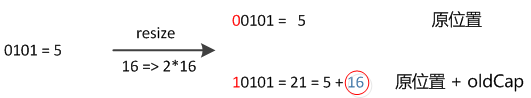

说明：5是假设计算出来的原来的索引。这样就验证了上述所描述的：扩容之后所以节点要么就在原来的位置，要么就被分配到"**原位置+旧容量**"这个位置。

 因此，我们在扩充HashMap的时候，不需要重新计算hash，只需要看看原来的hash值新增的那个bit是1还是0就可以了，是0的话索引没变，是1的话索引变成“原索引+oldCap(**原位置+旧容量**)”。可以看看下图为16扩充为32的resize示意图： 

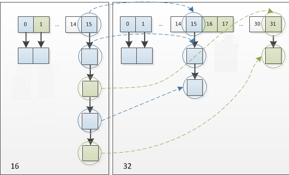

正是因为这样巧妙的rehash方式，既省去了重新计算hash值的时间，而且同时，由于新增的1bit是0还是1可以认为是随机的，在resize的过程中保证了rehash之后每个桶上的节点数一定小于等于原来桶上的节点数，保证了rehash之后不会出现更严重的hash冲突，均匀的把之前的冲突的节点分散到新的桶中了。

##### 4.3.3.2源码resize方法的解读

下面是代码的具体实现：

~~~java
final Node<K,V>[] resize() {
    //得到当前数组
    Node<K,V>[] oldTab = table;
    //如果当前数组等于null长度返回0，否则返回当前数组的长度
    int oldCap = (oldTab == null) ? 0 : oldTab.length;
    //当前阀值点 默认是12(16*0.75)
    int oldThr = threshold;
    int newCap, newThr = 0;
    //如果老的数组长度大于0
    //开始计算扩容后的大小
    if (oldCap > 0) {
        // 超过最大值就不再扩充了，就只好随你碰撞去吧
        if (oldCap >= MAXIMUM_CAPACITY) {
            //修改阈值为int的最大值
            threshold = Integer.MAX_VALUE;
            return oldTab;
        }
        /*
        	没超过最大值，就扩充为原来的2倍
        	1)(newCap = oldCap << 1) < MAXIMUM_CAPACITY 扩大到2倍之后容量要小于最大容量
        	2）oldCap >= DEFAULT_INITIAL_CAPACITY 原数组长度大于等于数组初始化长度16
        */
        else if ((newCap = oldCap << 1) < MAXIMUM_CAPACITY &&
                 oldCap >= DEFAULT_INITIAL_CAPACITY)
            //阈值扩大一倍
            newThr = oldThr << 1; // double threshold
    }
    //老阈值点大于0 直接赋值
    else if (oldThr > 0) // 老阈值赋值给新的数组长度
        newCap = oldThr;
    else {// 直接使用默认值
        newCap = DEFAULT_INITIAL_CAPACITY;//16
        newThr = (int)(DEFAULT_LOAD_FACTOR * DEFAULT_INITIAL_CAPACITY);
    }
    // 计算新的resize最大上限
    if (newThr == 0) {
        float ft = (float)newCap * loadFactor;
        newThr = (newCap < MAXIMUM_CAPACITY && ft < (float)MAXIMUM_CAPACITY ?
                  (int)ft : Integer.MAX_VALUE);
    }
    //新的阀值 默认原来是12 乘以2之后变为24
    threshold = newThr;
    //创建新的哈希表
    @SuppressWarnings({"rawtypes","unchecked"})
    //newCap是新的数组长度--》32
    Node<K,V>[] newTab = (Node<K,V>[])new Node[newCap];
    table = newTab;
    //判断旧数组是否等于空
    if (oldTab != null) {
        // 把每个bucket都移动到新的buckets中
        //遍历旧的哈希表的每个桶，重新计算桶里元素的新位置
        for (int j = 0; j < oldCap; ++j) {
            Node<K,V> e;
            if ((e = oldTab[j]) != null) {
                //原来的数据赋值为null 便于GC回收
                oldTab[j] = null;
                //判断数组是否有下一个引用
                if (e.next == null)
                    //没有下一个引用，说明不是链表，当前桶上只有一个键值对，直接插入
                    newTab[e.hash & (newCap - 1)] = e;
                //判断是否是红黑树
                else if (e instanceof TreeNode)
                    //说明是红黑树来处理冲突的，则调用相关方法把树分开
                    ((TreeNode<K,V>)e).split(this, newTab, j, oldCap);
                else { // 采用链表处理冲突
                    Node<K,V> loHead = null, loTail = null;
                    Node<K,V> hiHead = null, hiTail = null;
                    Node<K,V> next;
                    //通过上述讲解的原理来计算节点的新位置
                    do {
                        // 原索引
                        next = e.next;
                     	//这里来判断如果等于true e这个节点在resize之后不需要移动位置
                        if ((e.hash & oldCap) == 0) {
                            if (loTail == null)
                                loHead = e;
                            else
                                loTail.next = e;
                            loTail = e;
                        }
                        // 原索引+oldCap
                        else {
                            if (hiTail == null)
                                hiHead = e;
                            else
                                hiTail.next = e;
                            hiTail = e;
                        }
                    } while ((e = next) != null);
                    // 原索引放到bucket里
                    if (loTail != null) {
                        loTail.next = null;
                        newTab[j] = loHead;
                    }
                    // 原索引+oldCap放到bucket里
                    if (hiTail != null) {
                        hiTail.next = null;
                        newTab[j + oldCap] = hiHead;
                    }
                }
            }
        }
    }
    return newTab;
}
~~~

#### 4.3.4 删除方法(remove)

 理解了put方法之后，remove方法已经没什么难度了，所以重复的内容就不再做详细介绍了。

 删除的话就是首先先找到元素的位置，如果是链表就遍历链表找到元素之后删除。如果是用红黑树就遍历树然后找到之后做删除，树小于6的时候要转链表。 

 删除remove方法： 

~~~java
//remove方法的具体实现在removeNode方法中，所以我们重点看下removeNode方法
public V remove(Object key) {
        Node<K,V> e;
        return (e = removeNode(hash(key), key, null, false, true)) == null ?
            null : e.value;
    }
~~~

 removeNode方法： 

~~~java
final Node<K,V> removeNode(int hash, Object key, Object value,
                               boolean matchValue, boolean movable) {
        Node<K,V>[] tab; Node<K,V> p; int n, index;
    	//根据hash找到位置 
    	//如果当前key映射到的桶不为空
        if ((tab = table) != null && (n = tab.length) > 0 &&
            (p = tab[index = (n - 1) & hash]) != null) {
            Node<K,V> node = null, e; K k; V v;
            //如果桶上的节点就是要找的key，则将node指向该节点
            if (p.hash == hash &&
                ((k = p.key) == key || (key != null && key.equals(k))))
                node = p;
            else if ((e = p.next) != null) {
                //说明节点存在下一个节点
                if (p instanceof TreeNode)
                    //说明是以红黑树来处理的冲突，则获取红黑树要删除的节点
                    node = ((TreeNode<K,V>)p).getTreeNode(hash, key);
                else {
                    //判断是否以链表方式处理hash冲突，是的话则通过遍历链表来寻找要删除的节点
                    do {
                        if (e.hash == hash &&
                            ((k = e.key) == key ||
                             (key != null && key.equals(k)))) {
                            node = e;
                            break;
                        }
                        p = e;
                    } while ((e = e.next) != null);
                }
            }
            //比较找到的key的value和要删除的是否匹配
            if (node != null && (!matchValue || (v = node.value) == value ||
                                 (value != null && value.equals(v)))) {
                //通过调用红黑树的方法来删除节点
                if (node instanceof TreeNode)
                    ((TreeNode<K,V>)node).removeTreeNode(this, tab, movable);
                else if (node == p)
                    //链表删除
                    tab[index] = node.next;
                else
                    p.next = node.next;
                //记录修改次数
                ++modCount;
                //变动的数量
                --size;
                afterNodeRemoval(node);
                return node;
            }
        }
        return null;
    }
~~~

#### 4.3.5查找元素方法(get)

 查找方法，通过元素的Key找到Value。 

代码如下：

~~~java
public V get(Object key) {
    Node<K,V> e;
    return (e = getNode(hash(key), key)) == null ? null : e.value;
}
~~~

get方法主要调用的是getNode方法，代码如下：

~~~java
final Node<K,V> getNode(int hash, Object key) {
    Node<K,V>[] tab; Node<K,V> first, e; int n; K k;
    //如果哈希表不为空并且key对应的桶上不为空
    if ((tab = table) != null && (n = tab.length) > 0 &&
        (first = tab[(n - 1) & hash]) != null) {
        /* 
        	判断数组元素是否相等
        	根据索引的位置检查第一个元素
        	注意：总是检查第一个元素
        */
        if (first.hash == hash && // always check first node
            ((k = first.key) == key || (key != null && key.equals(k))))
            return first;
        // 如果不是第一个元素，判断是否有后续节点
        if ((e = first.next) != null) {
            // 判断是否是红黑树，是的话调用红黑树中的getTreeNode方法获取节点
            if (first instanceof TreeNode)
                return ((TreeNode<K,V>)first).getTreeNode(hash, key);
            do {
                // 不是红黑树的话，那就是链表结构了，通过循环的方法判断链表中是否存在该key
                if (e.hash == hash &&
                    ((k = e.key) == key || (key != null && key.equals(k))))
                    return e;
            } while ((e = e.next) != null);
        }
    }
    return null;
}
~~~

小结：

1.get方法实现的步骤：

​	1）通过hash值获取该key映射到的桶

​	2）桶上的key就是要查找的key,则直接找到并返回

​	3）桶上的key不是要找的key,则查看后续的节点：

​			a:如果后续节点是红黑树节点，通过调用红黑树的方法根据key获取value

​			b:如果后续节点是链表节点，则通过循环遍历链表根据key获取value

2.上述红黑树节点调用的是getTreeNode方法通过树形节点的find方法进行查找：

~~~java
 final TreeNode<K,V> getTreeNode(int h, Object k) {
            return ((parent != null) ? root() : this).find(h, k, null);
 }
 final TreeNode<K,V> find(int h, Object k, Class<?> kc) {
            TreeNode<K,V> p = this;
            do {
                int ph, dir; K pk;
                TreeNode<K,V> pl = p.left, pr = p.right, q;
                if ((ph = p.hash) > h)
                    p = pl;
                else if (ph < h)
                    p = pr;
                else if ((pk = p.key) == k || (k != null && k.equals(pk)))
                    return p;//找到之后直接返回
                else if (pl == null)
                    p = pr;
                else if (pr == null)
                    p = pl;
                else if ((kc != null ||
                          (kc = comparableClassFor(k)) != null) &&
                         (dir = compareComparables(kc, k, pk)) != 0)
                    p = (dir < 0) ? pl : pr;
                //递归查找
                else if ((q = pr.find(h, k, kc)) != null)
                    return q;
                else
                    p = pl;
            } while (p != null);
            return null;
        }
~~~

3.查找红黑树，由于之前添加时已经保证这个树是有序的了，因此查找时基本就是折半查找，效率更高。

4.这里和插入时一样，如果对比节点的哈希值和要查找的哈希值相等，就会判断key是否相等，相等就直接返回。不相等就从子树中递归查找。

5.

​	若为树，则在树中通过key.equals(k)查找，O(logn) 

​	若为链表，则在链表中通过key.equals(k)查找，O(n)。

#### 4.3.6遍历HashMap集合几种方式

 1、分别遍历Key和Values 

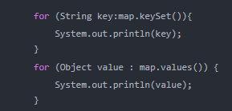

2、使用Iterator迭代器迭代 

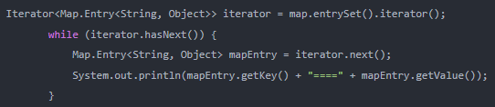

3、通过get方式（不建议使用）

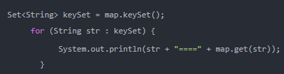

说明：根据阿里开发手册，不建议使用这种方式，因为迭代两次。keySet获取Iterator一次，还有通过get又迭代一次。降低性能。

4.jdk8以后使用Map接口中的默认方法：

~~~
default void forEach(BiConsumer<? super K,? super V> action) 
BiConsumer接口中的方法：
	void accept​(T t, U u) 对给定的参数执行此操作。  
		参数 
            t - 第一个输入参数 
            u - 第二个输入参数 
~~~

遍历代码：

~~~java
public class Demo02 {
    public static void main(String[] args) {
        HashMap<String,String> m1 = new HashMap();
        m1.put("001", "zhangsan");
        m1.put("002", "lisi");
        m1.forEach((key,value)->{
            System.out.println(key+"---"+value);
        });
    }
}
~~~

## 5.如何设计多个非重复的键值对要存储HashMap的初始化？

### 5.1HashMap的初始化问题描述

​	如果我们确切的知道我们有多少键值对需要存储，那么我们在初始化HashMap的时候就应该指定它的容量，以防止HashMap自动扩容，影响使用效率。

​	默认情况下HashMap的容量是16，但是，如果用户通过构造函数指定了一个数字作为容量，那么Hash会选择大于该数字的第一个2的幂作为容量。(3->4、7->8、9->16) .这点我们在上述已经进行过讲解。

 《阿里巴巴Java开发手册》中建议我们设置HashMap的初始化容量。 

 那么，为什么要这么建议？你有想过没有。 

当然，以上建议也是有理论支撑的。我们上面介绍过，HashMap的扩容机制，就是当达到扩容条件时会进行扩容。HashMap的扩容条件就是当HashMap中的元素个数（size）超过临界值（threshold）时就会自动扩容。在HashMap中，threshold = loadFactor * capacity。

所以，如果我们没有设置初始容量大小，随着元素的不断增加，HashMap会有可能发生多次扩容，而HashMap中的扩容机制决定了每次扩容都需要重建hash表，是非常影响性能的。

但是设置初始化容量，设置的数值不同也会影响性能，那么当我们已知HashMap中即将存放的KV个数的时候，容量设置成多少为好呢？

### 5.2HashMap中容量的初始化

当我们使用HashMap(int initialCapacity)来初始化容量的时候，jdk会默认帮我们计算一个相对合理的值当做初始容量。那么，是不是我们只需要把已知的HashMap中即将存放的元素个数直接传给initialCapacity就可以了呢？

关于这个值的设置，在《阿里巴巴Java开发手册》有以下建议：

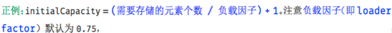

也就是说，如果我们设置的默认值是7，经过Jdk处理之后，会被设置成8，但是，这个HashMap在元素个数达到 8*0.75 = 6的时候就会进行一次扩容，这明显是我们不希望见到的。我们应该尽量减少扩容。原因也已经分析过。

如果我们通过**initialCapacity/ 0.75F + 1.0F**计算，7/0.75 + 1 = 10 ,10经过Jdk处理之后，会被设置成16，这就大大的减少了扩容的几率。

当HashMap内部维护的哈希表的容量达到75%时（默认情况下），会触发rehash，而rehash的过程是比较耗费时间的。所以初始化容量要设置成**initialCapacity/0.75 + 1**的话，可以有效的减少冲突也可以减小误差。

所以，我可以认为，当我们明确知道HashMap中元素的个数的时候，把默认容量设置成**initialCapacity/ 0.75F + 1.0F**是一个在性能上相对好的选择，但是，同时也会牺牲些内存。

我们想要在代码中创建一个HashMap的时候，如果我们已知这个Map中即将存放的元素个数，给HashMap设置初始容量可以在一定程度上提升效率。

但是，JDK并不会直接拿用户传进来的数字当做默认容量，而是会进行一番运算，最终得到一个2的幂。原因也已经分析过。

但是，为了最大程度的避免扩容带来的性能消耗，我们建议可以把默认容量的数字设置成**initialCapacity/ 0.75F + 1.0F**。

