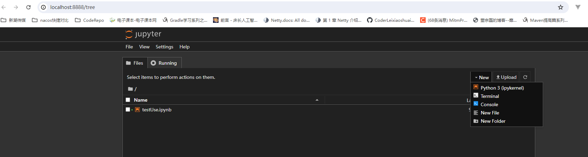

# 安装

```bash
pip install jupyter
```

**运行 Jupyter notebook 的命令：**

```bash
# 在当前目录运行jupter notebook
jupyter notebook
```

默认打开：http://localhost:8888



## 其它使用命令

```bash
# 打开指定笔记本
jupyter notebook notebook_name.ipynb
# 指定启动端口
jupyter notebook --port 9999
# 在不打开 Web 浏览器的情况下启动笔记本服务器的命令：
jupyter notebook --no-browser
# 其它参数帮助查询
jupyter notebook --help
```

