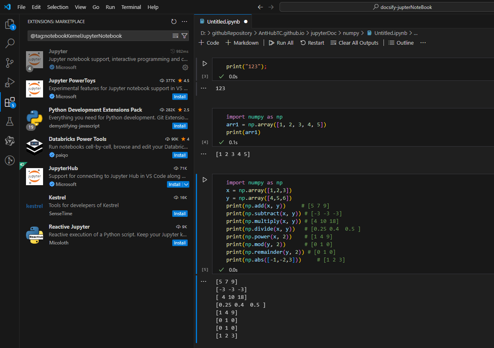

# 使用技巧

## 快捷键

Jupyter Notebook 有**两种键盘输入模式**。**编辑模式**，允许你往单元中键入代码或文本；这时的单元框线是<font color="green">绿色</font>的。**命令模式**，键盘输入运行程序命令；这时的单元框线是<font color="gray">灰色</font>。

### 命令模式 (按键 Esc 开启)

- **Enter** : 转入编辑模式
- **Shift-Enter** : 运行本单元，选中下个单元
- **Ctrl-Enter** : 运行本单元
- **Alt-Enter** : 运行本单元，在其下插入新单元
- **Y** : 单元转入代码状态
- **M** :单元转入markdown状态
- **R** : 单元转入raw状态
- **1** : 设定 1 级标题
- **2** : 设定 2 级标题
- **3** : 设定 3 级标题
- **4** : 设定 4 级标题
- **5** : 设定 5 级标题
- **6** : 设定 6 级标题
- **Up** : 选中上方单元
- **K** : 选中上方单元
- **Down** : 选中下方单元
- **J** : 选中下方单元
- **Shift-K** : 扩大选中上方单元
- **Shift-J** : 扩大选中下方单元
- **A** : 在上方插入新单元
- **B** : 在下方插入新单元
- **X** : 剪切选中的单元
- **C** : 复制选中的单元
- **Shift-V** : 粘贴到上方单元
- **V** : 粘贴到下方单元
- **Z** : 恢复删除的最后一个单元
- **D,D** : 删除选中的单元
- **Shift-M** : 合并选中的单元
- **Ctrl-S** : 文件存盘
- **S** : 文件存盘
- **L** : 转换行号
- **O** : 转换输出
- **Shift-O** : 转换输出滚动
- **Esc** : 关闭页面
- **Q** : 关闭页面
- **H** : 显示快捷键帮助
- **I,I** : 中断Notebook内核
- **0,0** : 重启Notebook内核
- **Shift** : 忽略
- **Shift-Space** : 向上滚动
- **Space** : 向下滚动

### 编辑模式 ( Enter 键启动)

- **Tab** : 代码补全或缩进
- **Shift-Tab** : 提示
- **Ctrl-]** : 缩进
- **Ctrl-[** : 解除缩进
- **Ctrl-A** : 全选
- **Ctrl-Z** : 复原
- **Ctrl-Shift-Z** : 再做
- **Ctrl-Y** : 再做
- **Ctrl-Home** : 跳到单元开头
- **Ctrl-Up** : 跳到单元开头
- **Ctrl-End** : 跳到单元末尾
- **Ctrl-Down** : 跳到单元末尾
- **Ctrl-Left** : 跳到左边一个字首
- **Ctrl-Right** : 跳到右边一个字首
- **Ctrl-Backspace** : 删除前面一个字
- **Ctrl-Delete** : 删除后面一个字
- **Esc** : 进入命令模式
- **Ctrl-M** : 进入命令模式
- **Shift-Enter** : 运行本单元，选中下一单元
- **Ctrl-Enter** : 运行本单元
- **Alt-Enter** : 运行本单元，在下面插入一单元
- **Ctrl-Shift--** : 分割单元
- **Ctrl-Shift-Subtract** : 分割单元
- **Ctrl-S** : 文件存盘
- **Shift** : 忽略
- **Up** : 光标上移或转入上一单元
- **Down** :光标下移或转入下一单元

## 在VSCode中使用Jupter NoteBook




## 如何在markdown中浏览.ipynb文件

需要借助jupyter官方提供的在线浏览工具[入口](https://nbviewer.org/)


如何在我的笔记，markdown中浏览.ipynb文件

```html
<iframe style="min-height:1999px" width="100%" scrolling="no" title="Zdog trefoil" src="https://nbviewer.org/github/ipython/ipython/blob/6.x/examples/IPython%20Kernel/Index.ipynb" frameborder="no" loading="lazy" allowtransparency="true" allowfullscreen="true">
</iframe>
```

## 如何跨Jupter笔记本复制剪切cells

> 说明：此方法实际操作后，发现只在VsCode中有效

在Jupyter Notebook的时候，有时需要从一个文件中拷贝多个cells到另外一个文件。如果只是简单地选中+拷贝的话，是没有用的。
关键点在于使用 Esc进入command模式。 下面是具体的操作步骤：

1. 在源文件中Shift+鼠标点击或者Shift+上下箭头选中多个cell。
2. Esc进入command模式，然后Ctrl+C。
3. 到目标文件中，点击你要复制的位置，然后Esc进入command模式，最后Ctrl+V就可以了。

## GitHub天然已经自带.ipynb文件的浏览功能

