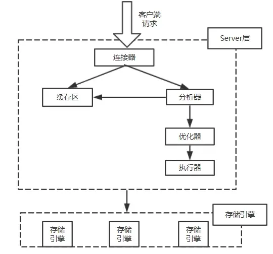
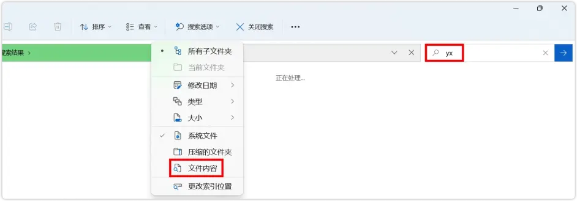

# 全文检索基本概念

## 前言

搜索给我们的生活带来了一种新的获取信息的方式，改变着我们的生活。而如何高效精准查找信息？下面将带你进入搜索的世界，去一探究竟。

## 一. 数据分类

当今信息爆炸的时代，信息每天都在以惊人的速度增长。我们生活中的数据总体分为两种：结构化数据和非结构化数据。

结构化数据：指具有固定格式或有限长度的数据，如数据库、 元数据等。针对结构化数据的搜索，例如对数据库的搜索、可以使用SQL语包。再如对元数据的搜索，例如Windows中对文件名类型和修改时间进行搜索等。

非结构化数据：指不定长或无固定格式的数据，如邮件、word文档等磁盘上的文件。对非结构化数据的搜索，例如Windows中对文件内容的搜索、Linux中grep命令，以及使用Google或百度来搜索内容都属于对全文数据的搜索。

通过调查发现，在企业存储的海量信息中，结构化数据仅占数据信息总量的15%，而非结构化数据却占数据信息总量的85％。有序地存储、管理并挖掘非结构化数据的利用价值是目前全球一切成功企业提高竞争力和生产力的主要手段。

## 二. 结构化数据搜索

常见的结构化数据也就是数据库中的数据。在数据库中搜索很容易实现，通常都是使用SQL语句进行查询，而且能很快的得到查询结果。

为什么数据库搜索很容易？因为数据库中的数据存储是有规律的，有行有列而且数据格式、数据长度都是固定的。

## 三. 非结构化数据查询方法

### 1.顺序扫描法

所谓顺序扫描(Serial Scanning)，比如要找内容包含某一个字符串的文件，就是一个文档一个文档的看，对于每一个文档从头看到尾，如果此文档包含此字符串，则此文档为我们要找的文件，接着看下一个文件，直到扫描完所有的文件。如利用Windows的搜索也可以搜索文件内容，只是相当的慢。

假设你有一个100G硬盘，如果想在上面找到一个内容包含某字符串的文件，不花他几个小时，怕是做不到。Linux系统下的grep命令也是这一种方式。大家可能觉得这种方法比较原始，但对于小数据量的文件，这种方法还是最直接，最方便的。但是对于大量的文件，这种方法就很慢了。

### 2.全文检索

**2.1 检索发展历史**
全文检索是20世纪末产生的一种新的信息检索技术。经过几十年的发展，特别是以计算机技术为代表的新一代信息技术应用，使全文检索从最初的字符串匹配和简单的布尔逻辑检索技术演进到能对超大文本、语音、图像、活动影像等非结构化数据进行综合管理的复合技术。

**2.2 全文检索介绍**
全文检索(Full-text Search)是指**计算机索引程序通过扫描文章中的每一个词，对每一个词建立一个索引，指明该词在文章中出现的次数和位置，当用户查询时，检索程序就根据事先建立的索引进行查找，并将查找的结果反馈给用户的检索方法。这个过程类似于通过字典的目录查字的过程。**

**360百科： 全文检索是一种将文件中所有文本与检索项匹配的文字资料检索方法。**

将非结构化数据中的一部分信息提取出来，重新组织，使其变得有一定结构，然后对此有一定结构的数据进行搜索，从而达到搜索相对较快的目的。这部分从非结构化数据中提取出的然后重新组织的信息，我们称之索引。

例如字典。字典的拼音表和部首检字表就相当于字典的索引，对每一个字的解释是非结构化的， 如果字典没有音节表和部首检字表，在茫茫词海中找一个字只能顺序扫描。然而字的某些信息可以提取出来进行结构化处理，比如读音就比较结构化，分为声母和韵母，分别只有几种可以一一列举，于是将读音拿出来按一定的顺序排列，每一项读音都指向此字的详细解释的页数。我们搜索时按结构化的拼音搜到读音，然后按其指向的页数，便可找到我们的非结构化数据——也即对字的解释。

这种先建立索引，再对索引进行搜索的过程就叫全文检索。虽然创建索引的过程也是非常耗时的，但是索引一旦创建就可以多次使用，全文检索主要处理的是查询，所以耗时间创建索引是值得的。

**2.3 全文检索构成**
全文检索大体分两个过程，**索引创建**(Indexing)和**搜索索引**(Search)。

索引创建：将现实世界中所有的结构化和非结构化数据提取信息，创建索引的过程。

搜索索引：就是得到用户的查询请求，搜索创建的索引，然后返回结果的过程。

于是全文检索就存在三个重要问题：

索引结构？(Index)

如何创建索引？(Indexing)

如何对索引进行搜索？(Search)

下面我们顺序对每个问题进行研究。
