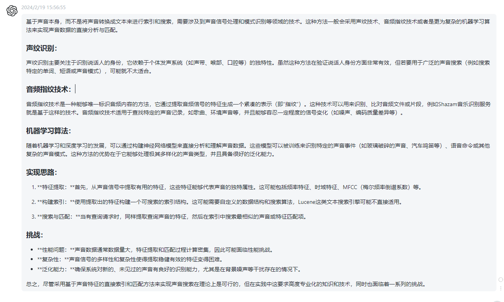
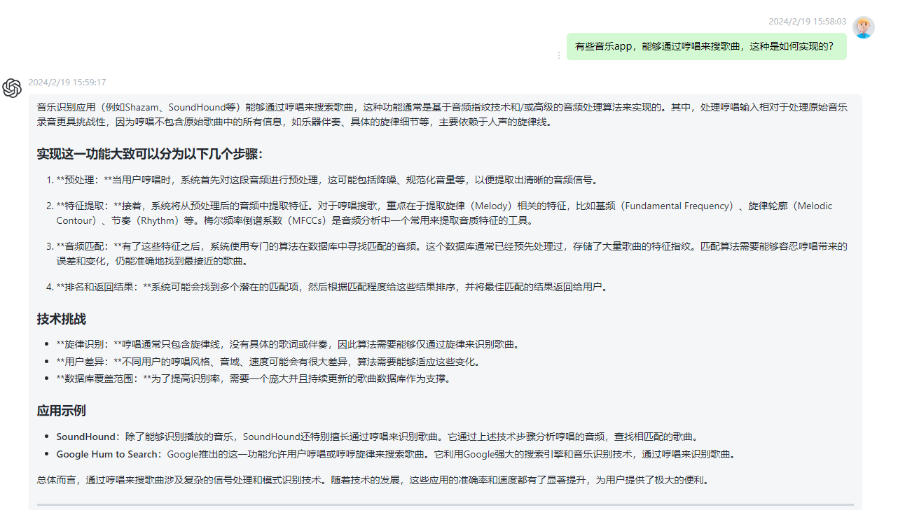
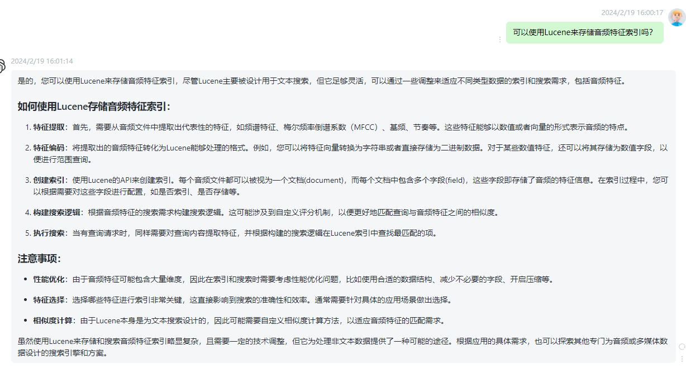
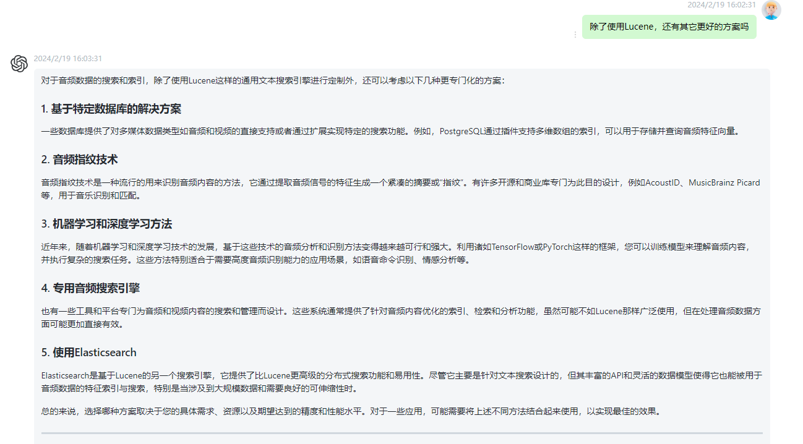

# 基于内容的图像检索 CIBR

**基于内容的图像检索**，即**CBIR**(Content-based image retrieval)，是计算机视觉领域中关注大规模数字图像内容检索的研究分支。典型的CBIR系统，允许用户输入一张图片，以查找具有相同或相似内容的其他图片。而传统的图像检索是基于文本的，即通过图片的名称、文字信息和索引关系来实现查询功能。


## 高维向量的最近邻搜索

```java
import org.apache.lucene.document.Document;
import org.apache.lucene.document.Field;
import org.apache.lucene.index.IndexWriter;
import org.apache.lucene.index.IndexWriterConfig;
import org.apache.lucene.search.IndexSearcher;
import org.apache.lucene.store.Directory;
import org.apache.lucene.store.RAMDirectory;
import org.apache.lucene.util.BytesRef;
import org.apache.lucene.search.BooleanClause;
import org.apache.lucene.search.BooleanQuery;
import org.apache.lucene.document.LatLonPoint;
import org.apache.lucene.search.ScoreDoc;

import java.io.IOException;

public class LuceneHighDimensionalDemo {
    public static void main(String[] args) throws IOException {
        // 创建内存索引
        Directory directory = new RAMDirectory();
        IndexWriterConfig config = new IndexWriterConfig();

        // 实例化IndexWriter来写入索引
        IndexWriter writer = new IndexWriter(directory, config);

        // 添加示例向量数据
        double[][] vectors = {{1.5, 2.0, 3.0}, {4.0, 5.0, 6.0}, {7.5, 8.0, 9.0}};
        for (int i = 0; i < vectors.length; i++) {
            // 创建一个新的文档
            Document doc = new Document();
            for (int j = 0; j < vectors[i].length; j++) {
                // 为每个维度添加LatLonPoint字段
                doc.add(new LatLonPoint("vector_" + j, vectors[i][0], vectors[i][1]));
            }
            // 为了方便演示，将文档ID作为字符串存储
            doc.add(new StringField("id", Integer.toString(i), Field.Store.YES));
            // 将文档添加到索引中
            writer.addDocument(doc);
        }

        // 提交写入并关闭IndexWriter
        writer.commit();
        writer.close();

        // 创建IndexSearcher来搜索索引
        IndexSearcher searcher = new IndexSearcher(writer.getReader());

        // 构建最近邻查询
        BooleanQuery.Builder queryBuilder = new BooleanQuery.Builder();
        for (double value : new double[]{2.0, 3.0, 4.0}) {
            // 对每个维度构建范围查询，并使用MUST操作符组合它们
            queryBuilder.add(LatLonPoint.newDistanceQuery("vector_0", value, 0.1), BooleanClause.Occur.MUST);
        }
        BooleanQuery query = queryBuilder.build();

        // 执行查询并获取结果
        ScoreDoc[] hits = searcher.search(query, 1).scoreDocs;
        System.out.println("最近邻文档ID: " + hits[0].doc);
    }
}
```

高维向量的最近邻搜索在实际中有许多应用场景。以下是一些常见的使用场景：

1. 机器学习和数据挖掘：在聚类、分类、推荐系统等应用中，可以使用最近邻搜索来寻找与某个特定向量最相似的数据点，从而进行数据分析和模式识别。
2. 图像和视频检索：在图像和视频处理领域，可以使用最近邻搜索来寻找与给定图像或视频特征最相似的数据，用于内容检索、相似图片搜索等。
3. 自然语言处理：在文本处理领域，可以使用最近邻搜索来寻找与某个句子或文档最相近的其他句子或文档，用于信息检索、语义相似度计算等任务。
4. 物体识别和三维空间建模：在计算机视觉和三维空间建模领域，可以使用最近邻搜索来寻找与给定物体特征最相似的其他物体，用于对象识别、三维重建等应用。

这些仅仅是一些例子，实际上，高维向量的最近邻搜索可以应用于许多不同的领域和任务中，以提取数据之间的相似性和关联性。


要识别物体或图像，选择合适的特征描述符很重要。对于图像识别，一些常用的特征描述符包括：

1. SIFT（尺度不变特征变换）：对于图像中的关键点进行提取和描述，具有旋转和尺度不变性。
2. SURF（加速稳健特征）：类似于SIFT，但计算更高效，对尺度和旋转具有不变性。
3. HOG（方向梯度直方图）：主要用于目标检测，通过提取图像局部区域的梯度和方向信息来描述图像特征。
4. CNN特征（卷积神经网络）：利用深度学习模型中提取的特征，通常在大规模数据集上训练得出。

选择哪个特征描述符取决于应用场景、可用的数据量以及对计算资源的需求。通常情况下，可以尝试不同的特征描述符并评估它们在特定任务上的性能表现，从而选择最适合的特征描述符。


## LIRE

LIRE（Lucene Image REtrieval）提供一种的简单方式来创建基于图像特性的Lucene索引。利用该索引就能够构建一个基于内容的图像检索(content- based image retrieval，CBIR)系统，来搜索相似的图像。

```xml
  <dependencies>
    <!-- lucene核心库 -->
    <dependency>
      <groupId>org.apache.lucene</groupId>
      <artifactId>lucene-core</artifactId>
      <version>${lucene.version}</version>
    </dependency>
    <!-- https://mvnrepository.com/artifact/com.github.zengde/lire -->
    <dependency>
      <groupId>com.github.zengde</groupId>
      <artifactId>lire</artifactId>
      <version>1.0b2</version>
    </dependency>
  </dependencies>
```

案例代码：

```java
package com.anthubtc.test;

import net.semanticmetadata.lire.aggregators.BOVW;
import net.semanticmetadata.lire.builders.DocumentBuilder;
import net.semanticmetadata.lire.imageanalysis.features.global.CEDD;
import net.semanticmetadata.lire.imageanalysis.features.local.simple.SimpleExtractor;
import net.semanticmetadata.lire.indexers.parallel.ParallelIndexer;
import net.semanticmetadata.lire.searchers.GenericFastImageSearcher;
import net.semanticmetadata.lire.searchers.ImageSearchHits;
import net.semanticmetadata.lire.utils.ImageUtils;
import org.apache.lucene.document.Document;
import org.apache.lucene.index.DirectoryReader;
import org.apache.lucene.index.IndexReader;
import org.apache.lucene.store.FSDirectory;

import javax.imageio.ImageIO;
import java.io.File;
import java.io.IOException;
import java.nio.file.Paths;

/**
 * @author AntHubTC
 * @version 1.0
 * @className Main
 * @description
 * @date 2024/2/18 17:30
 **/
public class Main {
    public static void main(String[] args) throws Exception{
//        indexCreate();
         imgSearch();
    }

    public static void indexCreate() {
        String indexPath = "D:\\githubRepository\\lucene-learn\\index-db\\imgIndex"; // 索引文件存储路径
        String imageDir = "C:\\Users\\xcm656\\Pictures\\uToolsWallpapers";  // 图像文件夹路径

        // 构建图像索引
        ParallelIndexer indexer = new ParallelIndexer(DocumentBuilder.NUM_OF_THREADS, indexPath, imageDir);

        indexer.setImagePreprocessor(ImageUtils::createWorkingCopy);

        // 添加特征提取器，采用不用的特征提取器，图片的匹配正确率不同
        indexer.addExtractor(CEDD.class);
        // indexer.addExtractor(CvSurfExtractor.class);
        // indexer.addExtractor(CvSiftExtractor.class);

        indexer.run();
        System.out.println("索引完成");
    }

    public static void imgSearch() throws IOException {
        String imgIndexPath = "D:\\githubRepository\\lucene-learn\\index-db\\imgIndex";
        IndexReader reader = DirectoryReader.open(FSDirectory.open(Paths.get(imgIndexPath)));

        // 执行图像检索
         GenericFastImageSearcher searcher = new GenericFastImageSearcher(50, CEDD.class);
//        GenericFastImageSearcher searcher = new GenericFastImageSearcher(50, CEDD.class,
//                SimpleExtractor.KeypointDetector.CVSURF, new BOVW(), 128, true,
//                reader, imgIndexPath + ".config");

        // 读取查询图像并执行搜索
        File queryImageFile = new File("C:\\Users\\xcm656\\Pictures\\search.png");
        //File queryImageFile = new File("C:\\Users\\xcm656\\Pictures\\search.jpg");
        ImageSearchHits hits = searcher.search(ImageIO.read(queryImageFile), reader);

        // 输出搜索结果
        for (int i = 0; i < hits.length(); i++) {
            double score = hits.score(i);
            int documentID = hits.documentID(i);
            Document document = reader.document(documentID);
            String[] fileNames = document.getValues(DocumentBuilder.FIELD_NAME_IDENTIFIER);

            System.out.println((i+1) + "、差异分: " + score + ", 相似图像文件名: " + fileNames[0]);
        }
    }
}
```


## 扩展阅读

[策略算法工程师之路-基于内容的图像检索(CBIR)]()

[Elasticsearch 8.X “图搜图”实战](https://zhuanlan.zhihu.com/p/666082963)


# 基于声音的特征的检索







