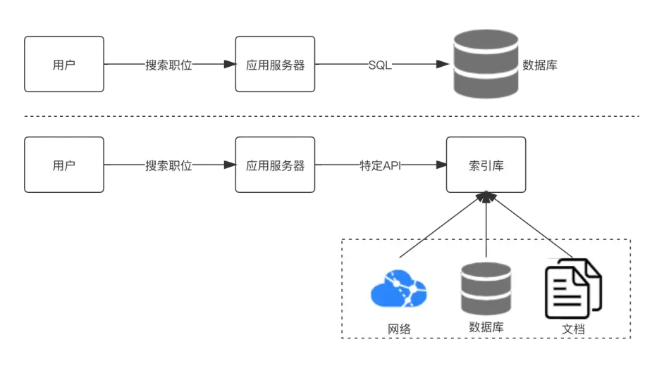
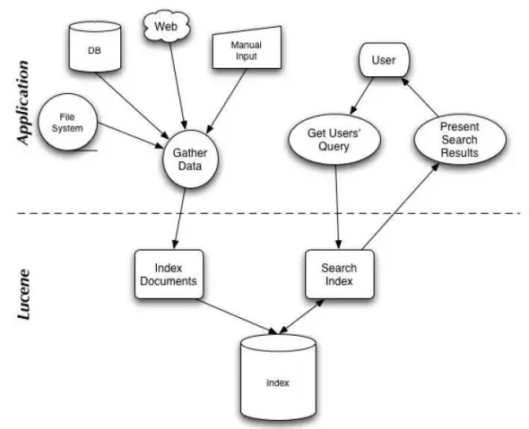
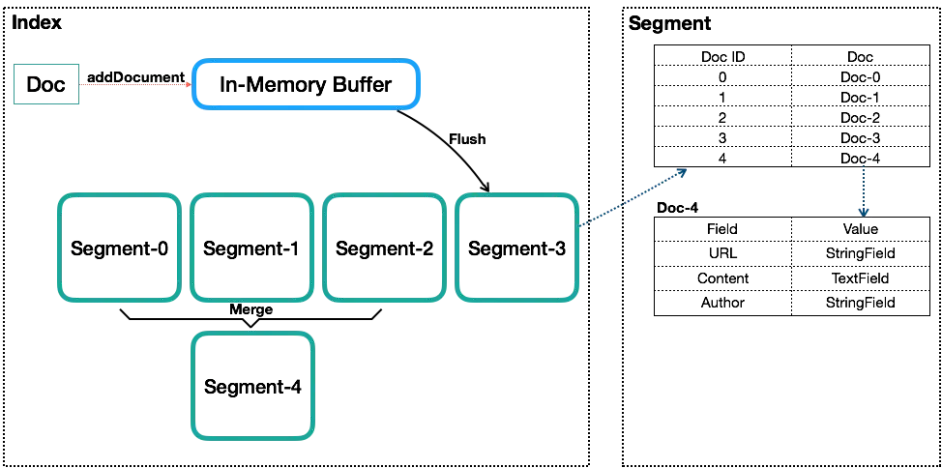

# Lucene基本概念

## 前言

​		上一节给大家介绍了全文检索的基本概念。什么技术可以实现全文检索呢？那就是大名鼎鼎的Lucene。Lucence是一个很容易上手，纯Java语言的全文索引检索工具包。接下来就跟着来探索Lucence这个技术。

## 一. Apache Lucene概述

1.1 Lucene介绍

Lucene是Apache下的一个开放源代码的全文检索引擎工具包。提供了完整的查询引擎和索引引擎，部分文本分析引擎（英文与德文两种西方语言）。Lucene的目的是为软件开发人员提供一个简单易用的工具包，以方便的在目标系统中实现全文检索的功能。可以使用Lucene实现全文检索。

### 1.2 Lucene适用场景

这项技术几乎适用于任何需要结构化搜索、全文搜索、分面、跨高维向量的最近邻搜索、拼写纠正或查询建议的应用程序。

在应用中为数据库中的数据提供全文检索实现。

开发独立的搜索引擎服务、系统。

对于数据量大、数据结构不固定的数据可采用全文检索方式搜索。

### 1.3 Lucene功能

Lucene通过一个简单的API提供了强大的功能。

**1.可扩展的高性能索引**

在现代硬件上超过800GB/小时

小RAM要求——只有1MB堆

增量索引与批量索引一样快

索引大小大约为索引文本大小的20-30%

**2.强大、准确、高效的搜索算法**

排名搜索——最好的结果首先返回

许多强大的查询类型：短语查询、通配符查询、邻近查询、范围查询等

现场搜索（例如标题、作者、内容）

高维向量的最近邻搜索

按任何字段排序

合并结果的多索引搜索

允许同时更新和搜索

灵活的刻面、突出显示、连接和结果分组

快速、节省内存和容错的建议器

可插拔排名模型，包括向量空间模型和Okapi BM25

可配置的存储引擎（编解码器）

**3.跨平台解决方案**

可作为Apache许可证下的开源软件，它允许您在商业和开源程序中使用Lucene

100%纯Java

其他可用的与索引兼容的编程语言的实现

### 1.4 Lucene架构

结构化数据搜索与非结构化数据搜索对比分析见下图：

搜索应用程序和Lucene之间的关系，也反映了利用Lucene构建搜索应用程序的流程：

## 二. Lucene基本概念

在深入解读Lucene之前，先了解下Lucene的几个基本概念，以及这几个概念背后隐藏的一些内容。

### 2.1 Index(索引)

类似数据库的表的概念，但是与传统表的概念会有很大的不同。传统关系型数据库或者NoSQL数据库的表，在创建时至少要定义表的Scheme，定义表的主键或列等，会有一些明确定义的约束。而Lucene的Index，则完全没有约束。Lucene的Index可以理解为一个文档收纳箱，你可以往内部塞入新的文档，或者从里面拿出文档，但如果你要修改里面的某个文档，则必须先拿出来修改后再塞回去。这个收纳箱可以塞入各种类型的文档，文档里的内容可以任意定义，Lucene都能对其进行索引。

### 2.2 Document(文档)

用户提供的源是一条条记录，它们可以是文本文件、字符串或者数据库表的一条记录等等。一条记录经过索引之后，就是以一个Document的形式存储在索引文件中的。用户进行搜索，也是以Document列表的形式返回。

一个Index内会包含多个Document。写入Index的Document会被分配一个唯一的ID，即Sequence Number（序列号，更多被叫做DocId）。

### 2.3 Field(字段)

一个Document会由一个或多个Field组成，Field是Lucene中数据索引的最小定义单位。Lucene提供多种不同类型的Field，例如StringField、TextField、LongFiled或NumericDocValuesField等，Lucene根据Field的类型（FieldType）来判断该数据要采用哪种类型的索引方式（Invert Index、Store Field、DocValues或N-dimensional等）。

例如，一篇文章可以包含“标题”、“正文”、“最后修改时间”等信息域，这些信息域就是通过Field在Document中存储的。

Field有两个属性可选：存储和索引。通过存储属性你可以控制是否对这个Field进行存储；通过索引属性你可以控制是否对该Field进行索引。

如果对标题和正文进行全文搜索，所以我们要把索引属性设置为真，同时我们希望能直接从搜索结果中提取文章标题，所以我们把标题域的存储属性设置为真。但是由于正文域太大了，我们为了缩小索引文件大小，将正文域的存储属性设置为假，当需要时再直接读取文件；我们只是希望能从搜索解果中提取最后修改时间，不需要对它进行搜索，所以我们把最后修改时间域的存储属性设置为真，索引属性设置为假。上面的三个域涵盖了两个属性的三种组合，还有一种全为假的没有用到，事实上Field不允许你那么设置，因为既不存储又不索引的域是没有意义的。

### 2.4 Term和Term Dictionary

Lucene中索引和搜索的最小单位，一个Field会由一个或多个Term组成，Term是由Field经过Analyzer（分词）产生。Term Dictionary即Term词典，是根据条件查找Term的基本索引。

Term由两部分组成：它表示的词语和这个词语所出现的Field的名称。

### 2.5 Segment(段)

一个Index会由一个或多个sub-index构成，sub-index被称为Segment。Lucene的Segment设计思想，与LSM类似但又有些不同，继承了LSM中数据写入的优点，但是在查询上只能提供近实时而非实时查询。

Lucene中的数据写入会先写内存的一个Buffer（类似LSM的MemTable，但是不可读），当Buffer内数据到一定量后会被Flush成一个Segment，每个Segment有自己独立的索引，可独立被查询，但数据永远不能被更改。这种模式避免了随机写，数据写入都是Batch和Append，能达到很高的吞吐量。Segment中写入的文档不可被修改，但可被删除，删除的方式也不是在文件内部原地更改，而是会由另外一个文件保存需要被删除的文档的DocID，保证数据文件不可被修改。Index的查询需要对多个Segment进行查询并对结果进行合并，还需要处理被删除的文档，为了对查询进行优化，Lucene会有策略对多个Segment进行合并，这点与LSM对SSTable的Merge类似。

Segment在被Flush或Commit之前，数据保存在内存中，是不可被搜索的，这也就是为什么Lucene被称为提供近实时而非实时查询的原因。读了它的代码后，发现它并不是不能实现数据写入即可查，只是实现起来比较复杂。原因是Lucene中数据搜索依赖构建的索引（例如倒排依赖Term Dictionary），Lucene中对数据索引的构建会在Segment Flush时，而非实时构建，目的是为了构建最高效索引。当然它可引入另外一套索引机制，在数据实时写入时即构建，但这套索引实现会与当前Segment内索引不同，需要引入额外的写入时索引以及另外一套查询机制，有一定复杂度。

### 2.6 Sequence Number(序列号)

Sequence Number（后面统一叫DocId）是Lucene中一个很重要的概念，数据库内通过主键来唯一标识一行记录，而Lucene的Index通过DocId来唯一标识一个Doc。不过有几点要特别注意：

DocId实际上并不在Index内唯一，而是Segment内唯一，Lucene这么做主要是为了做写入和压缩优化。那既然在Segment内才唯一，又是怎么做到在Index级别来唯一标识一个Doc呢？方案很简单，Segment之间是有顺序的，举个简单的例子，一个Index内有两个Segment，每个Segment内分别有100个Doc，在Segment内DocId都是0-100，转换到Index级的DocId，需要将第二个Segment的DocId范围转换为100-200。

DocId在Segment内唯一，取值从0开始递增。但不代表DocId取值一定是连续的，如果有Doc被删除，那可能会存在空洞。

一个文档对应的DocId可能会发生变化，主要是发生在Segment合并时。

Lucene内最核心的倒排索引，本质上就是Term到所有包含该Term的文档的DocId列表的映射。所以Lucene内部在搜索的时候会是一个两阶段的查询，第一阶段是通过给定的Term的条件找到所有Doc的DocId列表，第二阶段是根据DocId查找Doc。Lucene提供基于Term的搜索功能，也提供基于DocId的查询功能。

DocId采用一个从0开始底层的Int32值，是一个比较大的优化，同时体现在数据压缩和查询效率上。例如数据压缩上的Delta策略、ZigZag编码，以及倒排列表上采用的SkipList等，这些优化后续会详述。

## 三. 结语

我们来总结下，这一节的学习内容。给大家介绍了Lucene技术，以及Lucene适用场景和Lucene功能，然后又介绍了Lucene架构。第二个模块介绍了Lucene基本概念，其中重点的概念包括：Index(索引)、Document(文档)、Field(字段)、Term和Term Dictionary、Segment(段)、Sequence Number(序列号)等。