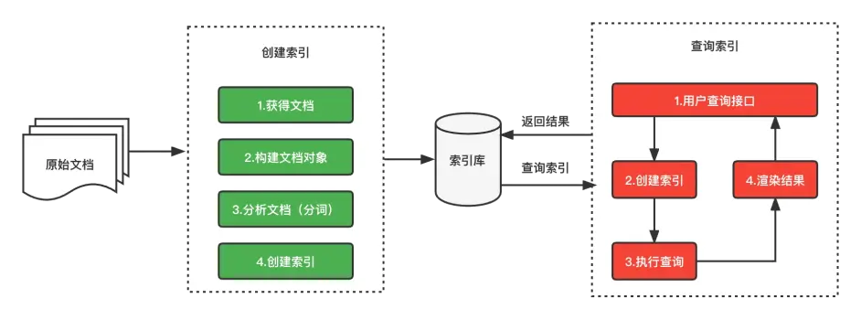
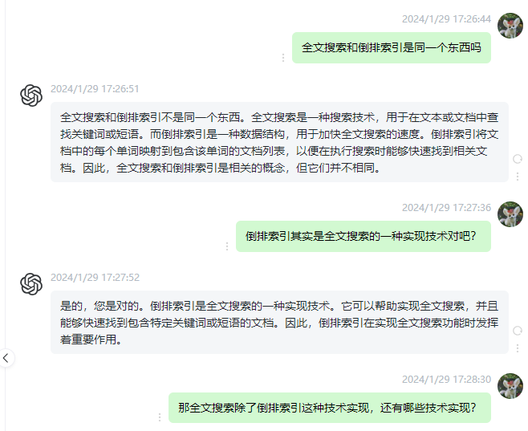

# 倒排索引

## 前言

我们对Lucence的基本概念了解后，那Lucence是如何实现全文检索的？以及它的原理是什么？下面继续探索Lucence的相关技术，揭开它的面纱。

## 一. 索引和搜索流程图

索引和搜索流程图见如下所示：

1.绿色表示索引过程，对要搜索的原始内容进行索引构建一个索引库，索引过程包括：

确定原始内容即要搜索的内容 => 采集文档 => 创建文档 => 分析文档 => 索引文档

2.红色表示搜索过程，从索引库中搜索内容，搜索过程包括：

用户通过搜索界面 => 创建查询 => 执行搜索 => 从索引库搜索 => 渲染搜索结果

## 二. 全文检索解析

我们以招聘网站的搜索为例，在网站上输入关键字搜索显示的内容不是直接从数据库中来的，而是从索引库中获取的，网站的索引数据需要提前创建的。以下是创建的过程：

第一步：获得原始文档

就是从MySQL数据库中通过SQL语句查询需要创建索引的数据。

第二步：创建文档对象（Document）

把查询的内容构建成Lucene能识别的Document对象，获取原始内容的目的是为了索引，在索引前需要将原始内容创建成文档，文档中包括一个一个的域（Field），这个域对应就是表中的列。

注意：每个Document可以有多个Field，不同的Document可以有不同的Field，同一个Document可以有相同的Field（域名和域值都相同）。每个文档都有一个唯一的编号，就是文档id。

第三步：分析文档

将原始内容创建为包含域（Field）的文档（Document），需要再对域中的内容进行分析，分析的过程是经过对原始文档提取单词、将字母转为小写、去除标点符号、去除停用词等过程生成最终的语汇单元，可以将语汇单元理解为一个一个的单词。

分好的词会组成索引库中最小的单元Term，一个Term由域名和词组成。

第四步：创建索引

对所有文档分析得出的语汇单元进行索引，索引的目的是为了搜索，最终要实现只搜索被索引的语汇单元从而找到Document（文档）。

注意：创建索引是对语汇单元索引，通过词语找文档，这种索引的结构叫倒排索引结构。 倒排索引结构是根据内容（词语）找文档，如下图：

倒排索引结构也叫反向索引结构，包括索引和文档两部分，索引即词汇表，它的规模较小，而文档集合较大。

## 三. 倒排索引

倒排索引记录每个词条出现在哪些文档及在文档中的位置，可以根据词条快速定位到包含这个词条的文档及出现的位置。

百度对倒排索引的定义（不错）：[倒排索引](https://baike.baidu.com/item/%E5%80%92%E6%8E%92%E7%B4%A2%E5%BC%95/11001569?fr=ge_ala)

文档：索引库中的每一条原始数据，例如一个商品信息、一个职位信息。

词条：原始数据按照分词算法进行分词，得到的每一个词。

创建倒排索引，分为以下几步。

### 1.1 创建文档列表

Lucene首先对原始文档数据进行编号（DocID），形成列表，就是一个文档列表。

### 1.2 创建倒排索引列表

对文档中数据进行分词，得到词条（分词后的一个又一个词）。对词条进行编号，以词条创建索引。然后记录下包含该词条的所有文档编号（及其它信息）。

### 1.3 搜索的过程

当用户输入任意的词条时，首先对用户输入的数据进行分词，得到用户要搜索的所有词条，然后拿着这些词条去倒排索引列表中进行匹配。找到这些词条就能找到包含这些词条的所有文档的编号。然后根据这些编号去文档列表中找到文档。

### 1.4 触类旁通

有时候我们自己都做了很多倒排索引的事情，只是没有意识到，例如：文件目录归类，文档打标签等，这些其实是简化版的倒排索引思想。倒排索引就是使用内容打标签的思想。

## 四、全文搜索引擎和倒排索引区别

.......

