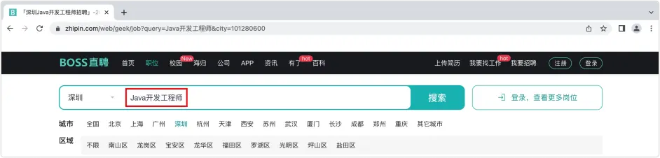

前言
本节袁老师将带领大家学习Lucene技术。Lucene是apache下的一个开源的全文检索引擎工具包。接下来带领大家进行Lucene编程的实战。你准备好了嘛？

一. 需求说明
生成职位信息索引库，从索引库检索数据。例如我们在招聘网站进行职位搜索。




二. 准备开发环境
1.准备数据
1.1 运行sql脚本
1.通过Navicat Premium软件运行课前资料中的job_info.sql脚本。完成初始化数据的准备工作。

2.在Navicat Premium工具中的MySQL数据库【连接名】上右键，选择【运行SQL文件...】选项，然后后运行job_info.sql文件。

3.数据库脚本文件job_info.sql中的内容见下。

CREATE DATABASE `es_db` CHARACTER SET utf8mb4; USE `es_db`; CREATE TABLE `job_info` (  `id` bigint(20) NOT NULL AUTO_INCREMENT COMMENT '主键 id',  `company_name` varchar(100) DEFAULT NULL COMMENT '公司名称',  `company_addr` varchar(200) DEFAULT NULL COMMENT '公司联系方式',  `company_info` mediumtext DEFAULT NULL COMMENT '公司信息',  `job_name` varchar(100) DEFAULT NULL COMMENT '职位名称',  `job_addr` varchar(50) DEFAULT NULL COMMENT '工作地点',  `job_info` mediumtext DEFAULT NULL COMMENT '职位信息',  `salary_min` int(10) DEFAULT NULL COMMENT '薪资范围，最小',  `salary_max` int(10) DEFAULT NULL COMMENT '薪资范围，最大',  `url` varchar(150) DEFAULT NULL COMMENT '招聘信息详情页',  `time` varchar(10) DEFAULT NULL COMMENT '职位最近发布时间',  PRIMARY KEY (`id`) ) ENGINE=InnoDB AUTO_INCREMENT=7656 DEFAULT CHARSET=utf8mb3 COMMENT='招聘信息'; INSERT INTO `job_info` (`id`, `company_name`, `company_addr`, `company_info`, `job_name`, `job_addr`, `job_info`, `salary_min`, `salary_max`, `url`, `time`) VALUES (1397, '北京中认环宇信息安全技术有限公司', '北京市丰台区南四环西路188号9区8号楼', '北京中认环宇信息安全技术有限公司（简称CQCCA）是由中国质量认证中心投资...', ' JAVA软件开发程师 (职位编号：002)', '北京-丰台区', '参与产品需求分析、系统设计工作...', 120000, 180000, 'https://jobs.51job.com/beijing-ftq/101555054.html?s=01&t=5', '2022-02-26'); # 后面省略10000+条INSERT插入语句

1.2 潜在异常
如果在运行job_info.sql脚本时提示1153 - Got a packet bigger than 'max_allowed_packet' bytes出错，解决方案见下：

1.查看max_allowed_packet变量默认值。原因是我安装的MySQL的默认配置为16MB，而导入的文件数据大于默认配置所以出错。

# 16777216 / 1024 / 1024 = 16M SHOW VARIABLES LIKE '%max_allowed_packet%';

2.修改max_allowed_packet变量的默认值。需要重启Navicat Premium软件。

# 设置成512M SET GLOBAL max_allowed_packet = 524288000;

3.再次使用Navicat Premium软件运行job_info.sql脚本。便可执行成功。

2.项目搭建
1.创建一个Spring Initializr类型的Spring Boot项目，项目的名称设置为【lucene-demo】。


2.在项目的pom.xml文件中引入相关的依赖。

```xml
<?xml version="1.0" encoding="UTF-8"?>
<project xmlns="http://maven.apache.org/POM/4.0.0" xmlns:xsi="http://www.w3.org/2001/XMLSchema-instance"
         xsi:schemaLocation="http://maven.apache.org/POM/4.0.0 https://maven.apache.org/xsd/maven-4.0.0.xsd">
    <modelVersion>4.0.0</modelVersion>
    <parent>
        <groupId>org.springframework.boot</groupId>
        <artifactId>spring-boot-starter-parent</artifactId>
        <version>2.7.6</version>
        <relativePath/> <!-- lookup parent from repository -->
    </parent>
    <groupId>com.yx</groupId>
    <artifactId>lucene-demo</artifactId>
    <version>0.0.1-SNAPSHOT</version>
    <name>lucene-demo</name>
    <description>lucene-demo</description>
    <properties>
        <java.version>11</java.version>
    </properties>
    <dependencies>
        <!-- Web依赖 -->
        <dependency>
            <groupId>org.springframework.boot</groupId>
            <artifactId>spring-boot-starter-web</artifactId>
        </dependency>
        <!-- MySQL驱动 -->
        <dependency>
            <groupId>com.mysql</groupId>
            <artifactId>mysql-connector-j</artifactId>
            <scope>runtime</scope>
        </dependency>
        <!-- Mybatis-Plus -->
        <dependency>
            <groupId>com.baomidou</groupId>
            <artifactId>mybatis-plus-boot-starter</artifactId>
            <version>3.5.2</version>
        </dependency>
        <!-- 引入Lucene核心包及分词器包 -->
        <dependency>
            <groupId>org.apache.lucene</groupId>
            <artifactId>lucene-core</artifactId>
            <version>4.10.3</version>
        </dependency>
        <dependency>
            <groupId>org.apache.lucene</groupId>
            <artifactId>lucene-analyzers-common</artifactId>
            <version>4.10.3</version>
        </dependency>
        <!-- 单元测试 -->
        <dependency>
            <groupId>org.springframework.boot</groupId>
            <artifactId>spring-boot-starter-test</artifactId>
            <scope>test</scope>
        </dependency>
        <!-- 热部署 -->
        <dependency>
            <groupId>org.springframework.boot</groupId>
            <artifactId>spring-boot-devtools</artifactId>
            <scope>runtime</scope>
            <optional>true</optional>
        </dependency>
        <!-- Lombok工具 -->
        <dependency>
            <groupId>org.projectlombok</groupId>
            <artifactId>lombok</artifactId>
            <optional>true</optional>
        </dependency>
        <!-- IK中文分词器 -->
        <dependency>
            <groupId>com.janeluo</groupId>
            <artifactId>ikanalyzer</artifactId>
            <version>2012_u6</version>
        </dependency>
    </dependencies>
    <build>
        <plugins>
            <!-- 打包插件 -->
            <plugin>
                <groupId>org.springframework.boot</groupId>
                <artifactId>spring-boot-maven-plugin</artifactId>
                <configuration>
                    <excludes>
                        <exclude>
                            <groupId>org.projectlombok</groupId>
                            <artifactId>lombok</artifactId>
                        </exclude>
                    </excludes>
                </configuration>
            </plugin>
            <!-- 编译插件 -->
            <plugin>
                <groupId>org.apache.maven.plugins</groupId>
                <artifactId>maven-compiler-plugin</artifactId>
                <configuration>
                    <source>11</source>
                    <target>11</target>
                    <encoding>utf-8</encoding>
                </configuration>
            </plugin>
        </plugins>
    </build>
</project>
```

3.将项目自动生成的application.properties文件后缀改为yml类型。并添加数据库连接配置。

server:  port: 9000 Spring:  application:    name: yx-lucene  datasource:    driver-class-name: com.mysql.cj.jdbc.Driver    url: jdbc:mysql://localhost:3306/es_db?useUnicode=true&characterEncoding=utf-8&useSSL=false&serverTimezone=UTC    username: root    password: 123456 # 开启驼峰命名匹配映射 mybatis:  configuration:    map-underscore-to-camel-case: true

4.搭建项目的MVC分层结构。在com.yx包下创建：pojo包、mapper包、service包、service.impl包、controller包。

3.查询接口开发
1.在com.yx.pojo包下创建JobInfo实体类。

package com.yx.pojo; import com.baomidou.mybatisplus.annotation.IdType; import com.baomidou.mybatisplus.annotation.TableId; import com.baomidou.mybatisplus.annotation.TableName; import lombok.Data; @Data @TableName("job_info") public class JobInfo {    @TableId(type = IdType.AUTO)    private Long id; // id属性建议使用包装类定义    private String companyName;    private String companyAddr;    private String companyInfo;    private String jobName;    private String jobAddr;    private String jobInfo;    private int salaryMin;    private int salaryMax;    private String url;    private String time; }

说明：SpringBoot项目启动提示This primary key of "id" is primitive !不建议如此请使用包装类in Class: "com.yx.pojo.JobInfo"。

1.解决方法：使用包装类替换基本数据类型。将id字段封装成Long类型或Integer类型，具体选择什么类型取决于数据库中该id字段的类型。

2.警告原因：如果用long的话id的默认值会是0，会出现一些问题，比如在MyBatis-Plus使用save()方法时就不能使用算法生成id了，这样会生成id为0的数据，如果有唯一或者主键约束的话，下一次生成就会报错。

2.在com.yx.mapper包下创建JobInfoMapper接口并继承MyBatis-Plus提供的BaseMapper<JobInfo>接口。

package com.yx.mapper; import com.baomidou.mybatisplus.core.mapper.BaseMapper; import com.yx.pojo.JobInfo; public interface JobInfoMapper extends BaseMapper<JobInfo> { }

3.在LuceneDemoApplication启动类上添加@MapperScan注解包扫描。

package com.yx; import org.mybatis.spring.annotation.MapperScan; import org.springframework.boot.SpringApplication; import org.springframework.boot.autoconfigure.SpringBootApplication; @SpringBootApplication @MapperScan("com.yx.mapper") public class LuceneDemoApplication {    public static void main(String[] args) {        SpringApplication.run(LuceneDemoApplication.class, args);    } }

4.在com.yx.service包下创建JobInfoService接口。

package com.yx.service; import com.yx.pojo.JobInfo; import java.util.List; public interface JobInfoService {    JobInfo selectById(Long id);        List<JobInfo> selectAll(); }

5.在com.yx.service.impl包下创建JobInfoServiceImpl实现类。

package com.yx.service.impl; import com.baomidou.mybatisplus.core.conditions.query.QueryWrapper; import com.yx.mapper.JobInfoMapper; import com.yx.pojo.JobInfo; import com.yx.service.JobInfoService; import org.springframework.beans.factory.annotation.Autowired; import org.springframework.stereotype.Service; import java.util.List; @Service public class JobInfoServiceImpl implements JobInfoService {    @Autowired    private JobInfoMapper jobInfoMapper;    @Override    public JobInfo selectById(Long id) {        return jobInfoMapper.selectById(id);    }    @Override    public List<JobInfo> selectAll() {        QueryWrapper<JobInfo> queryWrapper = new QueryWrapper();        return jobInfoMapper.selectList(queryWrapper);    } }

6.在com.yx.controller包下创建JobInfoController类。

package com.yx.controller; import com.yx.pojo.JobInfo; import com.yx.service.JobInfoService; import org.springframework.beans.factory.annotation.Autowired; import org.springframework.web.bind.annotation.PathVariable; import org.springframework.web.bind.annotation.RequestMapping; import org.springframework.web.bind.annotation.RestController; import java.util.List; @RestController @RequestMapping("job-info") public class JobInfoController {  @Autowired  private JobInfoService jobInfoService;  @RequestMapping("query/{id}")  public JobInfo getJobInfoById(@PathVariable Long id) {    return jobInfoService.selectById(id);  }  @RequestMapping("query")  public List<JobInfo> getJobInfos() {    return jobInfoService.selectAll();  } }

7.运行项目主类LuceneDemoApplication，使用ApiPost工具进行以下两个接口的测试。

http://localhost:9000/job-info/query http://localhost:9000/job-info/query/1397

三. 创建索引
1.创建索引实现
在test下创建com.yx.lucene包，并在该包下创建LuceneTests测试类，并添加创建索引的createIndex()方法。

package com.yx.lucene; import com.yx.pojo.JobInfo; import com.yx.service.JobInfoService; import org.apache.lucene.analysis.Analyzer; import org.apache.lucene.analysis.standard.StandardAnalyzer; import org.apache.lucene.document.*; import org.apache.lucene.index.IndexWriter; import org.apache.lucene.index.IndexWriterConfig; import org.apache.lucene.store.Directory; import org.apache.lucene.store.FSDirectory; import org.apache.lucene.util.Version; import org.junit.jupiter.api.Test; import org.springframework.beans.factory.annotation.Autowired; import org.springframework.boot.test.context.SpringBootTest; import java.io.File; import java.io.IOException; import java.util.List; @SpringBootTest public class LuceneTests {  @Autowired  private JobInfoService jobInfoService;  @Test  public void createIndex() throws IOException {    // 1.指定索引文件存储的位置    Directory directory = FSDirectory.open(new File("/Users/yuanxin/Documents/lucene/index"));        // 2.配置版本和分词器    Analyzer analyzer = new StandardAnalyzer(); // 标准分词器    IndexWriterConfig config = new IndexWriterConfig(Version.LATEST,analyzer);        // 3.创建一个用来创建索引的对象IndexWriter    IndexWriter indexWriter = new IndexWriter(directory,config);    indexWriter.deleteAll(); // 先删除索引        // 4.获取原始数据    List<JobInfo> jobInfoList = jobInfoService.selectAll();        // 有多少的数据就应该构建多少lucene的文档对象document    for (JobInfo jobInfo : jobInfoList) {      Document document = new Document();          // 域名、值、源数据是否存储      document.add(new LongField("id", jobInfo.getId(), Field.Store.YES));      document.add(new TextField("companyName", jobInfo.getCompanyName(), Field.Store.YES));      document.add(new TextField("companyAddr", jobInfo.getCompanyAddr(), Field.Store.YES));      document.add(new TextField("companyInfo", jobInfo.getCompanyInfo(), Field.Store.YES));      document.add(new TextField("jobName", jobInfo.getJobName(), Field.Store.YES));      document.add(new TextField("jobAddr", jobInfo.getJobAddr(), Field.Store.YES));      document.add(new TextField("jobInfo", jobInfo.getJobInfo(), Field.Store.YES));      document.add(new IntField("salaryMin", jobInfo.getSalaryMin(), Field.Store.YES));      document.add(new IntField("salaryMax", jobInfo.getSalaryMax(), Field.Store.YES));      document.add(new StringField("url", jobInfo.getUrl(), Field.Store.YES));      document.add(new StringField("time", jobInfo.getTime(), Field.Store.YES));            // StringField不需要分词时使用，举例：url、电话号码、身份证号      indexWriter.addDocument(document);    }        // 关闭资源    indexWriter.close();  } }

2.索引解析
2.1 Index索引
在Lucene中一个索引是存放在一个文件夹中的。如下图所示。同一文件夹中的所有的文件构成一个Lucene索引。


2.2 Segment段
按层次保存了索引到词的包含关系：索引(Index) => 段(segment) => 文档(Document) => 域(Field) => 词(Term)。

即此索引包含了哪些段，每个段包含了哪些文档，每个文档包含了哪些域，每个域包含了哪些词。

一个索引可以包含多个段，段与段之间是独立的，添加新文档可以生成新的段，不同的段可以合并。

如上图中，具有相同前缀文件的属同一个段，图中共一个段（以"_0"开头的文件）。

segments_1和segments.gen是段的元数据文件，也即它们保存了段的属性信息。

2.3 Field的特性
Document（文档）是Field（域）的承载体，一个Document由多个Field组成。Field由名称和值两部分组成，Field的值是要索引的内容，也是要搜索的内容。

是否分词（tokenized）：

是：将Field的值进行分词处理，分词的目的是为了索引。如：商品名称，商品描述。这些内容用户会通过输入关键词进行查询，由于内容多样，需要进行分词处理建立索引。

否：不做分词处理。如：订单编号、身份证号，是一个整体，分词以后就失去了意义，故不需要分词。

是否索引（indexed）：

是：将Field内容进行分词处理后得到的词（或整体Field内容）建立索引，存储到索引域。索引的目的是为了搜索。如：商品名称，商品描述需要分词建立索引。订单编号，身份证号作为整体建立索引。只要可能作为用户查询条件的词，都需要索引。

否：不索引。如：商品图片路径, 不会作为查询条件，不需要建立索引。

是否存储（stored）：

是：将Field值保存到Document中。如：商品名称，商品价格。凡是将来在搜索结果页面展现给用户的内容，都需要存储。

否：不存储。如：商品描述内容多格式大，不需要直接在搜索结果页面展现，所以不做存储。需要的时候可以从关系数据库获取。

2.4 Field类型
常用的Field类型见下表：


四. 查询索引
在test下的com.yx.lucene包下的LuceneTests测试类中添加查询索引数据的queryIndex()方法。

@Test public void queryIndex() throws IOException {    // 1.指定索引文件存储的位置    Directory directory = FSDirectory.open(new File("/Users/yuanxin/Documents/lucene/index"));     // 2.创建一个用来读取索引的对象IndexReader    IndexReader indexReader = DirectoryReader.open(directory);     // 3.创建一个用来查询索引的对象IndexSearcher    IndexSearcher indexSearcher = new IndexSearcher(indexReader);     // 使用term查询：指定查询的域名和关键字    // 使用"北京"关键词搜索没有符合的结果    // Query query = new TermQuery(new Term("companyName", "北京"));    Query query = new TermQuery(new Term("companyName", "北"));     // 第二个参数：最多显示多少条数据    TopDocs topDocs = indexSearcher.search(query, 100);    int totalHits = topDocs.totalHits;     // 查询的总数量    System.out.println("符合条件的总数：" + totalHits);    ScoreDoc[] scoreDocs = topDocs.scoreDocs;     // 获取命中的文档，存储的是文档的id    for (ScoreDoc scoreDoc : scoreDocs) {        int docID = scoreDoc.doc; // 根据id查询文档        Document document = indexSearcher.doc(docID);                System.out.println( "id: " + document.get("id"));        System.out.println( "companyName: " + document.get("companyName"));        System.out.println( "companyAddr: " + document.get("companyAddr"));        System.out.println( "jobName: " + document.get("jobName"));        System.out.println("----------------------------------------------");    } }

查看结果你会发现，居然没有数据，如果把查询的关键字“北京”那里改为“北”或“京”就可以，原因是因为中文会一个字一个字的分词，显然是不合适的，所以我们需要使用可以合理分词的分词器，其中最有名的是IKAnalyzer分词器。

五. 中文分词器的使用
1.在pom.xml配置文件中导入IK中文分词器的依赖。

<!-- IK中文分词器 --> <dependency>  <groupId>com.janeluo</groupId>  <artifactId>ikanalyzer</artifactId>  <version>2012_u6</version> </dependency>

2.开发者可以配置自己的扩展字典（在IKAnalyzer.cfg.xml文件中进行配置），将以下文件放到项目的resources目录下。此步骤不用进行配置（使用默认即可）。

IKAnalyzer.cfg.xml stopword.dic

3.在createIndex()方法中将创建索引改为使用IKanalyzer类来完成。

@Test public void createIndex() throws IOException {    // ...    // Analyzer analyzer = new StandardAnalyzer(); // 标准分词器    Analyzer analyzer = new IKAnalyzer(); // ... }

4.把原来的索引文件数据删除（删除/Users/yuanxin/Documents/lucene/index目录），再重新运行createIndex()方法生成索引文件。

5.在queryIndex()方法中使用关键字“北京”来查询数据并进行测试。

Query query = new TermQuery(new Term("companyName", "北京")); // Query query = new TermQuery(new Term("companyName", "北"));

考虑一个问题：一个大型网站中的索引数据会很庞大的，所以使用Lucene这种原生的写代码的方式就不合适了，因此需要借助一个成熟的项目或软件来实现，目前比较有名是Solr和Elasticsearch。接下来我们主要学习Elasticsearch的使用。

六. 结语
通过本小结的学习，我们掌握了通过Lucene编程实现创建索引、查询索引等的实战操作。同时，进一步了解了index、Segment和Field的相关概念。最后，对中文分词器进行了介绍