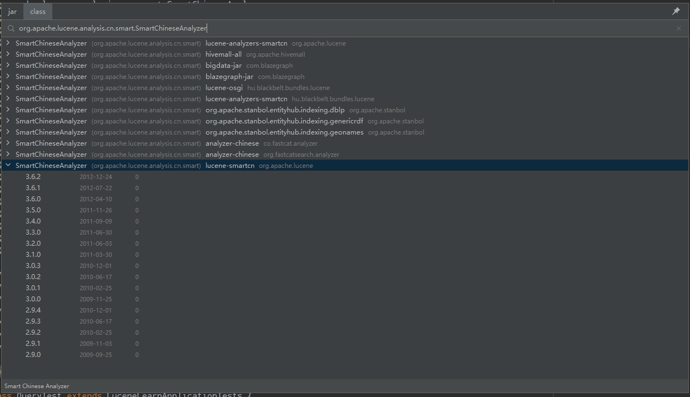

# 实战案例-Maven Search

**[lucene-learn](https://github.com/AntHubTC/lucene-learn)** com.tc.lucene.casedemo.LocalMavenRepoTest

本案例实现下图中IDEA的Maven Search插件类似的效果:




## 主要代码

```java
package com.tc.lucene.casedemo;

import cn.hutool.core.collection.CollUtil;
import cn.hutool.core.io.FileUtil;
import com.tc.lucene.LuceneLearnApplication;
import com.tc.lucene.LuceneLearnApplicationTests;
import com.tc.lucene.config.LuceneDemoConfig;
import com.tc.lucene.dto.MavenArtifact;
import com.tc.lucene.dto.MavenJar;
import com.tc.lucene.dto.MavenJarClass;
import com.tc.lucene.enums.MavenContentType;
import lombok.extern.slf4j.Slf4j;
import org.apache.lucene.analysis.Analyzer;
import org.apache.lucene.analysis.core.SimpleAnalyzer;
import org.apache.lucene.document.Document;
import org.apache.lucene.index.*;
import org.apache.lucene.queryparser.classic.ParseException;
import org.apache.lucene.queryparser.classic.QueryParser;
import org.apache.lucene.search.*;
import org.apache.lucene.store.Directory;
import org.apache.lucene.store.FSDirectory;
import org.junit.jupiter.api.DisplayName;
import org.junit.jupiter.api.Test;
import org.springframework.boot.SpringApplication;
import org.springframework.context.ConfigurableApplicationContext;

import javax.annotation.Resource;
import java.io.File;
import java.io.IOException;
import java.util.*;
import java.util.function.Consumer;
import java.util.jar.JarEntry;
import java.util.jar.JarFile;

/**
 * @author AnthubTC
 * @version 1.0
 * @className BaseDemoTest
 * @description
 * @date 2024/1/15 14:06
 **/
@Slf4j
@DisplayName("maven包工具实战案例")
public class LocalMavenRepoTest extends LuceneLearnApplicationTests {
    @Resource
    private LuceneDemoConfig luceneDemoConfig;

    @DisplayName("建立maven索引")
    @Test
    public void create() throws IOException {
        File repositoryDir = new File("D:\\soft\\0_mavenRepos\\repository");
        // 2 索引目录类,指定索引在硬盘中的位置
        Directory directory = FSDirectory.open(new File(getIdxSavePath()).toPath());
        // 3 创建分词器对象
        Analyzer analyzer = new SimpleAnalyzer();
        // 4 索引写出工具的配置对象
        IndexWriterConfig conf = new IndexWriterConfig(analyzer);
        // 5 创建索引的写出工具类。参数：索引的目录和配置信息
        IndexWriter indexWriter = new IndexWriter(directory, conf);
        // 6 把文档交给IndexWriter
        iterIndexMavenRepository(repositoryDir, file -> {
            try {
                MavenArtifact mavenArtifact = buildMavenArtifact(repositoryDir, file);
                indexWriter.addDocument(mavenArtifact.toDocument());

                List<MavenJarClass> mavenJarClasses = buildMavenJarClass(mavenArtifact);
                indexWriter.addDocuments(MavenJarClass.toDocuments(mavenJarClasses));
            } catch (IOException e) {
                throw new RuntimeException(e);
            }
        });
        // 7 提交
        indexWriter.commit();
        // 8 关闭
        indexWriter.close();

        System.out.println("\r\n\r\n======== maven库索引建立完成！========\r\n\r\n");
    }

    private static final String headStr = "================maven search=================\r\n";
    private static final String optStr1 = headStr +
            "1. jar \r\n" +
            "2. class \r\n" +
            ":eq 退出 \r\n" +
            "请输入选项：";


    public static void main(String[] args) throws IOException {
        ConfigurableApplicationContext applicationContext = SpringApplication.run(LuceneLearnApplication.class, args);
        LuceneDemoConfig config = applicationContext.getBean(LuceneDemoConfig.class);

        LocalMavenRepoTest localMavenRepoTest = new LocalMavenRepoTest();
        localMavenRepoTest.setLuceneDemoConfig(config);

        // 开始搜索
        localMavenRepoTest.search();

        applicationContext.close();
    }

    @DisplayName("maven搜索-要用main启动")
    @Test
    public void search() throws IOException {
        while (true) {
            System.out.println(optStr1);
            String optIn = new Scanner(System.in).nextLine();
            while (!Arrays.asList("1", "2", ":eq").contains(optIn)) {
                System.err.println("选项录入错误，请重新录入! \n\n\n");
                System.out.println("请输入选项：");
                optIn = new Scanner(System.in).nextLine();
            }

            if ("1".equals(optIn.trim())) {
                jarSearch();
            } else if ("2".equals(optIn.trim())) {
                jarClassSearch();
            } else if (":eq".equals(optIn.trim())) {
                break;
            }
        }
        System.out.println("====== 下次再见！ ======");
    }

    private void jarSearch() {
        while (true) {
            if (mavenSearch(MavenContentType.Artifact)) return;
        }
    }

    private void jarClassSearch() {
        QueryParser parser = new QueryParser("className", new SimpleAnalyzer());
        while (true) {
            if (mavenSearch(MavenContentType.Clazz)) return;
        }
    }

    private boolean mavenSearch(MavenContentType searchType) {
        try {
            System.out.print("输入搜索内容（:eq 退出）：");
            Scanner scanner = new Scanner(System.in);
            String optIn = scanner.nextLine();
            if (":eq".equals(optIn)) {
                return true;
            }

            List<MavenJar> mavenJars = new ArrayList<>();
            // lucene搜索
            luceneSearch(searchType, optIn,  mavenJars);
            // 打印输出
            printSearchResult(searchType, mavenJars);
            // 查看对应项的maven pom
            viewMavenPom(scanner, mavenJars);
        } catch (ParseException | IOException e) {
            throw new RuntimeException(e);
        }
        return false;
    }

    private static void viewMavenPom(Scanner scanner, List<MavenJar> mavenJars) {
        System.out.print("选择要显示maven坐标的项：");
        int itemNo = scanner.nextInt();
        MavenJar mavenJar = mavenJars.get(itemNo - 1);
        System.out.println();
        System.out.println(mavenJar.toMavenPom());
        System.out.println();
    }

    private static void printSearchResult(MavenContentType searchType, List<MavenJar> mavenJars) {
        if (MavenContentType.Clazz == searchType) {
            for (int i = 0; i < mavenJars.size(); i++) {
                MavenJar mavenJar = mavenJars.get(i);
                MavenJarClass mavenJar1 = (MavenJarClass) mavenJar;
                System.out.println((i+1) + "、" + mavenJar1.getGroupId() + "  " + mavenJar1.getArtifactId() + "  " + mavenJar1.getVersion());
                System.out.println("\t\t-- " + mavenJar1.getClassName());
            }
        }
        if (MavenContentType.Artifact == searchType) {
            for (int i = 0; i < mavenJars.size(); i++) {
                MavenJar mavenJar = mavenJars.get(i);
                MavenArtifact mavenArtifact = (MavenArtifact) mavenJar;
                System.out.println((i+1) + "、" + mavenArtifact.getGroupId() + "  " + mavenArtifact.getArtifactId() + "  " + mavenArtifact.getVersion());
            }
        }
    }

    private void luceneSearch(MavenContentType searchType, String optIn, List<MavenJar> mavenJars) throws ParseException, IOException {
        String filed = MavenContentType.Artifact == searchType ? "artifactId" : "className";
        Query query1 = new QueryParser(filed, new SimpleAnalyzer()).parse(optIn);
        Query query2 = new TermQuery(new Term("type", String.valueOf(searchType.getType())));

        BooleanQuery.Builder booleanQueryBuilder = new BooleanQuery.Builder();
        booleanQueryBuilder.add(query1, BooleanClause.Occur.MUST);
        booleanQueryBuilder.add(query2, BooleanClause.Occur.MUST);

        Query query = booleanQueryBuilder.build();


        // 创建索引读取器
        Directory directory = FSDirectory.open(new File(getIdxSavePath()).toPath());
        try (IndexReader indexReader = DirectoryReader.open(directory)) {
            IndexSearcher indexSearcher = new IndexSearcher(indexReader);
            TopDocs topDocs = indexSearcher.search(query, 10);
            for (int i = 0; i < topDocs.scoreDocs.length; i++) {
                ScoreDoc scoreDoc = topDocs.scoreDocs[i];
                // 获取文档

                Document doc = indexReader.document(scoreDoc.doc);
                MavenContentType contentType = MavenContentType.getEnum(doc.get("type"));
                if (MavenContentType.Artifact == contentType) {
                    MavenArtifact mavenArtifact = MavenArtifact.fromDocument(doc);
                    mavenJars.add(mavenArtifact);
                } else if (MavenContentType.Clazz == contentType) {
                    MavenJarClass mavenJarClass = MavenJarClass.fromDocument(doc);
                    mavenJars.add(mavenJarClass);
                }
            }
        }

        // 做下排序
        mavenJars.sort((a, b) -> {
            MavenArtifact a1 = (MavenArtifact) a;
            MavenArtifact b1 = (MavenArtifact) b;
            if (a1.getArtifactId().equals(b1.getArtifactId())) {
                return b1.getVersion().compareTo(a1.getVersion());
            }
            return a1.getArtifactId().compareTo(b1.getArtifactId());
        });
    }


    private String getIdxSavePath() {
        return luceneDemoConfig.getDemoIndexDbPath("mvn");
    }
    private List<MavenJarClass> buildMavenJarClass(MavenArtifact mavenArtifact) {
        List<MavenJarClass> mavenJarClasses = new ArrayList<>();
        try (JarFile jarFile = new JarFile(mavenArtifact.getFilePath())) {
            Enumeration<JarEntry> entries = jarFile.entries();

            while (entries.hasMoreElements()) {
                JarEntry entry = entries.nextElement();
                if (entry.getName().endsWith(".class")) {
                    String className = entry.getName().replaceAll("/", ".").replace(".class", "");
                    // System.out.println(className);

                    MavenJarClass mavenJarClass = MavenJarClass.create(mavenArtifact);
                    mavenJarClass.setClassName(className);
                    mavenJarClasses.add(mavenJarClass);
                }
            }
        } catch (IOException e) {
            e.printStackTrace();
        }
        return mavenJarClasses;
    }

    private MavenArtifact buildMavenArtifact(File repositoryDir, File file) {
        String absolutePath = file.getAbsolutePath();
        String version = file.getParentFile().getName();
        String artifactId = file.getName().substring(0, file.getName().indexOf(version) - 1);
        String groupId = getGroupId(file, repositoryDir);

        MavenArtifact mavenArtifact = new MavenArtifact();
        mavenArtifact.setGroupId(groupId);
        mavenArtifact.setArtifactId(artifactId);
        mavenArtifact.setVersion(version);
        mavenArtifact.setFilePath(absolutePath);
        // System.out.println(mavenArtifact);
        return mavenArtifact;
    }

    private void iterIndexMavenRepository(File repositoryDir, Consumer<File> mavenArtifactConsumer) {
        List<File> files = FileUtil.loopFiles(repositoryDir, pathname -> {
            String name = pathname.getAbsolutePath().substring(repositoryDir.getAbsolutePath().length() + 1);
            if (name.startsWith("caches")) {
                // 跳过缓存目录
                return false;
            }
            if (pathname.getName().endsWith(".jar")) {
                // 文件名中包含版本号
                return pathname.getName().contains(pathname.getParentFile().getName());
            }
            return false;
        });

        final int TOTAL_FILE_SIZE = files.size();
        System.out.println("待索引的文件总数:" + TOTAL_FILE_SIZE + "个");
        for (int i = 0; i < TOTAL_FILE_SIZE; i++) {
            File file = files.get(i);
            System.out.println((int) (Math.ceil(i * 100.0 / TOTAL_FILE_SIZE)) + "%,  " + file.getAbsolutePath());

            mavenArtifactConsumer.accept(file);
        }
    }

    private String getGroupId(File file, File repositoryDir) {
        List<String> dirList = new ArrayList<>();
        file = file.getParentFile().getParentFile();
        while (!file.equals(repositoryDir)) {
            dirList.add(file.getName());
            file = file.getParentFile();
        }
        Collections.reverse(dirList);
        return CollUtil.join(dirList, ".");
    }

    public LuceneDemoConfig getLuceneDemoConfig() {
        return luceneDemoConfig;
    }

    public void setLuceneDemoConfig(LuceneDemoConfig luceneDemoConfig) {
        this.luceneDemoConfig = luceneDemoConfig;
    }
}
```

## 效果

```txt
2024-02-18 13:44:29.585  INFO 25836 --- [  restartedMain] c.tc.lucene.casedemo.LocalMavenRepoTest  : Started LocalMavenRepoTest in 13.029 seconds (JVM running for 14.606)
================maven search=================
1. jar 
2. class 
:eq 退出 
请输入选项：1
输入搜索内容（:eq 退出）：hutool
1、cn.hutool.hutool-all  hutool-all  5.7.16
2、cn.hutool.hutool-all  hutool-all  5.6.5
3、cn.hutool.hutool-all  hutool-all  5.5.1
4、cn.hutool.hutool-all  hutool-all  5.4.7
5、cn.hutool.hutool-all  hutool-all  5.4.7
6、cn.hutool.hutool-all  hutool-all  5.4.1
7、cn.hutool.hutool-all  hutool-all  5.3.7
8、cn.hutool.hutool-all  hutool-all  5.1.4
9、cn.hutool.hutool-all  hutool-all  5.1.0
10、cn.hutool.hutool-all  hutool-all  4.6.1
选择要显示maven坐标的项：1

<dependency>
   <groupId>cn.hutool.hutool-all</groupId>
   <artifactId>hutool-all</artifactId>
   <version>5.7.16</version>
</dependency>

输入搜索内容（:eq 退出）：:eq
================maven search=================
1. jar 
2. class 
:eq 退出 
请输入选项：2
输入搜索内容（:eq 退出）：IndexWriterConfig
1、org.apache.lucene.lucene-core  lucene-core  9.5.0
		-- org.apache.lucene.index.IndexWriterConfig
2、org.apache.lucene.lucene-core  lucene-core  9.4.2
		-- org.apache.lucene.index.IndexWriterConfig
3、org.apache.lucene.lucene-core  lucene-core  8.5.0
		-- org.apache.lucene.index.IndexWriterConfig
4、org.apache.lucene.lucene-core  lucene-core  8.11.2
		-- org.apache.lucene.index.IndexWriterConfig
5、org.apache.lucene.lucene-core  lucene-core  8.11.1
		-- org.apache.lucene.index.IndexWriterConfig
6、org.apache.lucene.lucene-core  lucene-core  8.10.1
		-- org.apache.lucene.index.IndexWriterConfig
7、org.apache.lucene.lucene-core  lucene-core  8.0.0
		-- org.apache.lucene.index.IndexWriterConfig
8、org.apache.lucene.lucene-core  lucene-core  7.4.0
		-- org.apache.lucene.index.IndexWriterConfig
9、org.apache.lucene.lucene-core  lucene-core  5.5.0
		-- org.apache.lucene.index.IndexWriterConfig
10、org.apache.lucene.lucene-core  lucene-core  4.10.4
		-- org.apache.lucene.index.IndexWriterConfig
选择要显示maven坐标的项：10

POM xml: 
<dependency>
   <groupId>org.apache.lucene.lucene-core</groupId>
   <artifactId>lucene-core</artifactId>
   <version>4.10.4</version>
</dependency>
class: org.apache.lucene.index.IndexWriterConfig

输入搜索内容（:eq 退出）：:eq
================maven search=================
1. jar 
2. class 
:eq 退出 
请输入选项：
:ew
选项录入错误，请重新录入! 
请输入选项：
:eq
====== 下次再见！ ======
2024-02-18 13:53:35.278  INFO 25836 --- [  restartedMain] o.apache.catalina.core.StandardService   : Stopping service [Tomcat]
Disconnected from the target VM, address: '127.0.0.1:56360', transport: 'socket'

Process finished with exit code 1
```

