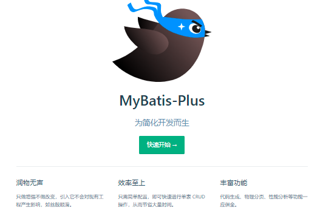

## 同类产品

​	JPA、tk-mapper、MyBatisPlus   偷懒的！

## Mybatis-plus简介

mybatis本来就是简化JDBC操作的。

mybatis plus简化我们的mybatis。

<h3 style="color:green">官方文档非常好，优先看官方文档</h3>

## 参考资料：

[MyBatis-Plus官网](https://baomidou.com/)

[MyBaits-Plus官网指南](https://mybatis.plus/guide)

[狂神说的MybatisPlus视频教程](https://www.bilibili.com/video/BV17E411N7KN?from=search&seid=14895422245246466597)

[狂神说MybatisPlus笔记](https://gitee.com/kuangstudy/openclass/tree/master/%E3%80%90%E9%81%87%E8%A7%81%E7%8B%82%E7%A5%9E%E8%AF%B4%E3%80%91MyBatisPlus%E8%A7%86%E9%A2%91%E7%AC%94%E8%AE%B0)

