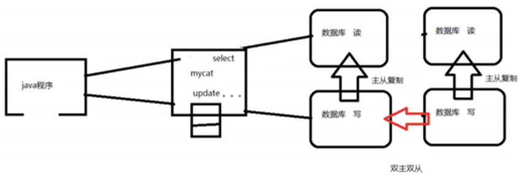
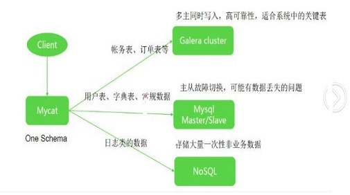

# MyCat简介

[MyCat官网](http://www.mycat.org.cn/)

[视频资料](https://www.bilibili.com/video/BV1WJ411x7bD?from=search&seid=11898400300380594589) 尚硅谷视频 感觉讲的挺好的！

## 是什么

​		数据库中间件，前身上阿里的cobar。

### 数据库中间件

​		中间件：是一类连接软件组成和应用的计算机软件，以便于软件各部件之间的沟通。

​		举例：Tomcat  was  web中间件

​		数据库中间件：连接java应用程序和数据库。

## 干什么

1. 读写分离

   由mycat来判断读请求和写请求发到哪台数据库。

   

   mycat高可用方案：

2. 数据分片

   垂直拆分（分库）、水平拆分（分表）、垂直+水平拆分（分库分表）。

   

3. 多数据源整合

   

## 原理

​	mycat的原理中最重要的一个动词是“**拦截**”，它拦截了用户发送过来的SQL语句，首先对SQL语句做了一些特定的分析：如分片分析、路由分析、读写分离分析、缓存分析等，然后将此SQL发往后端的真实数据库，并将返回的结果做适当的处理，最终再返回给用户。

​		这种方式把数据库的分布式从代码中解偶出来，程序员察觉不出来后台使用MyCat还是MySQL。

Mycat架构图：

### 市面上的数据库中间件

- Cobar  阿里团队开发，已多年无维护更新
- MyCat 基于Cobar二次开发，开源社区维护
- OneProxy 不开源的商业中间件
- kingshard go语音开发，在不断完善
- Vitess Youtube生产在使用，不支持Mysql原生协议。
- Atlas  360团队基于mysqlproxy改写，高并发不稳定
- MaxScale  maiadb研发的中间件
- MySQLRoute MySQLRoute是MySQL官方Oracle公司发布的中间件。