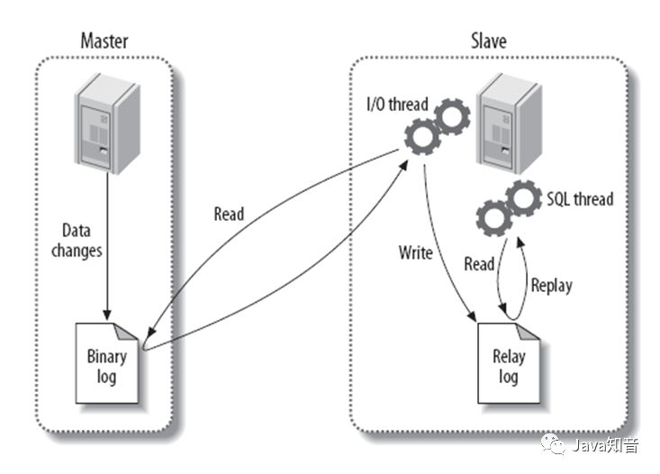
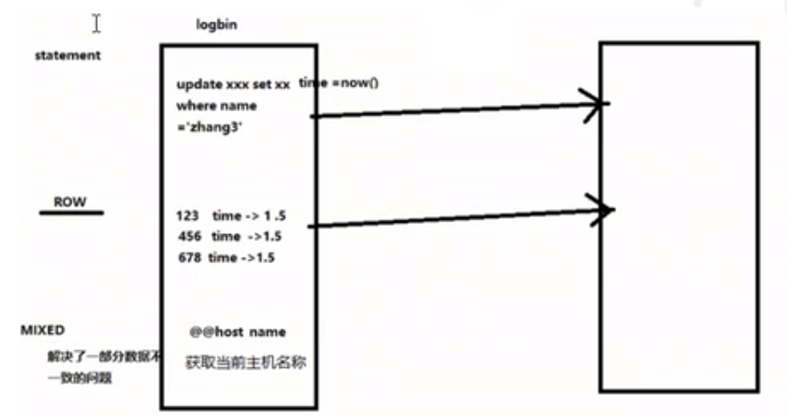

# MyCat搭建读写分离

## 一主一从

1. 搭建MySQL数据库主从复制；

   1. Mysql主从复制原理。

      

   2. 主机配置

      修改配置文件: vim /etc/my.cnf

      ```properties
      # 主服务器唯一ID
      server-id=1
      # 启用二进制日志
      log-bin=mysql-bin
      # 设置不要复制的数据库(可设置多个)
      binlog-ignore-db=mysql
      binlog-ignore-db=information_schema
      # 设置需要复制的数据库
      binlog-do-db=需要复制的主数据库的名字
      # 设置logbin格式
      binlog_format=STATEMENT
      ```

      binlog日志三种格式：

      

   3. 从机配置(host80)
   
      ```properties
      # 修改配置文件: vim /etc/my.cnf
      # 从服务器唯一id
      server-id=2
      # 启用中继日志
      relay-log-mysql-relay
      ```
      
   4. 主机、从机重启mysql服务
   
      ```bash
      systemctl restart mysqld
      systemctl status mysqld
      ```
   
   5. 主机从机都关闭防火墙
   
      ```bash
      # 开放端口：
      systemctl status firewalld
      firewall-cmd  --zone=public --add-port=3306/tcp -permanent
      firewall-cmd  --reload
      # 关闭防火墙：
      sudo systemctl stop firewalld
      ```
   
   6. 在主机上建立帐户并授权slave
   
      ```bash
      # 在主机MySQL里执行授权命令
      GRANT REPLICATION SLAVE ON *。* to 'SLAVE'@'%' IDENTIFIED BY '123456';
      # 查看master的状态
      show master status;
      # 记录下File和Position的值
      # 执行完成此步骤后不要再操作主服务器MySQL，防止主服务器状态值变化。
      ```
   
   7. 在从机上配置需要复制的主机
   
      ```mysql
      # 复制主机的命令
      CHANGE MASTER TO MASTER_HOST='主机的IP地址',MASTER_USER='slave',MASTER_PASSWORD='123123',MASTER_LOG_FILE='mysql-bin.具体数字',MASTER_LOG_POS=具体值;
      
      resset master;
      start slave;
      show slave status\G
      ```
   
   8. 建库建表插入数据验证主从。

TODO:: [后续再继续看视频学习](https://www.bilibili.com/video/BV1WJ411x7bD?p=11)。

## 双主双从

