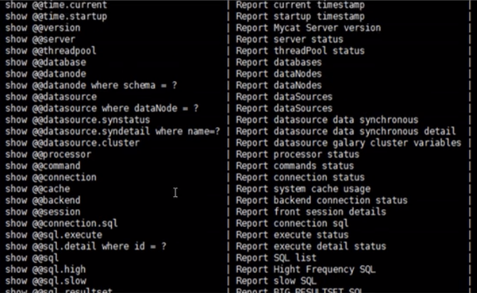

# MyCat安装启动

我们linux中常见安装软件方式有：

1、rpm安装

​		.rpm安装包。如果有多个rpm包，要安装依赖顺序安装。

2、yum方式

​	需要联网

3、apt-get方式

​	需要联网

4、解压后即可使用

5、解压后编译安装

6、docker通过镜像使用

## 解压后即可使用

下载位置：[入口](http://dl.mycat.org.cn/)

```bash
# 查看权限信息
ls -lt Mycat-server-1.6.7.6-test-20201124193646-linux.tar.gz
# 授权
sudo chown -R root:root Mycat-server-1.6.7.6-test-20201124193646-linux.tar.gz
# 解压
sudo tar -zxvf Mycat-server-1.6.7.6-test-20201124193646-linux.tar.gz -C /opt/
```

三个配置文件：

1. schema.xml：定义逻辑库，表、分片节点等内容；

   ```xml
   <?xml version="1.0"?>
   <!DOCTYPE mycat:schema SYSTEM "schema.dtd">
   <mycat:schema xmlns:mycat="http://io.mycat/">
           <schema name="TESTDB" checkSQLschema="true" sqlMaxLimit="100" randomDataNode="dn1">
                   <table name="customer" primaryKey="id" dataNode="dn1,dn2" rule="sharding-by-intfile" autoIncrement="true" fetchStoreNodeByJdbc="true">
                           <childTable name="customer_addr" primaryKey="id" joinKey="customer_id" parentKey="id"> </childTable>
                   </table>
           </schema>
           <dataNode name="dn1" dataHost="localhost1" database="db1" />
           <dataHost name="localhost1" maxCon="1000" minCon="10" balance="0"
                             writeType="0" dbType="mysql" dbDriver="jdbc" switchType="1"  slaveThreshold="100">
                   <heartbeat>select user()</heartbeat>
                   <writeHost host="hostM1" url="jdbc:mysql://localhost:3306" user="root"
                                      password="root">
                   </writeHost>
           </dataHost>
   </mycat:schema>
   ```

   

2. rule.xml：定义分片规则；

   ```xml
   <?xml version="1.0" encoding="UTF-8"?>
   <!DOCTYPE mycat:rule SYSTEM "rule.dtd">
   <mycat:rule xmlns:mycat="http://io.mycat/">
           <tableRule name="rule1">
                   <rule>
                           <columns>id</columns>
                           <algorithm>func1</algorithm>
                   </rule>
           </tableRule>
   
           <tableRule name="sharding-by-date">
                   <rule>
                           <columns>createTime</columns>
                           <algorithm>partbyday</algorithm>
                   </rule>
           </tableRule>
   
           <tableRule name="rule2">
                   <rule>
                           <columns>user_id</columns>
                           <algorithm>func1</algorithm>
                   </rule>
           </tableRule>
   
           <tableRule name="sharding-by-intfile">
                   <rule>
                           <columns>sharding_id</columns>
                           <algorithm>hash-int</algorithm>
                   </rule>
           </tableRule>
           <tableRule name="auto-sharding-long">
                   <rule>
                           <columns>id</columns>
                           <algorithm>rang-long</algorithm>
                   </rule>
           </tableRule>
           <tableRule name="mod-long">
                   <rule>
                           <columns>id</columns>
                           <algorithm>mod-long</algorithm>
                   </rule>
           </tableRule>
           <tableRule name="sharding-by-murmur">
                   <rule>
                           <columns>id</columns>
                           <algorithm>murmur</algorithm>
                   </rule>
           </tableRule>
          <tableRule name="crc32slot">
                   <rule>
                           <columns>id</columns>
                           <algorithm>crc32slot</algorithm>
                   </rule>
           </tableRule>
           <tableRule name="sharding-by-month">
                   <rule>
                           <columns>create_time</columns>
                           <algorithm>partbymonth</algorithm>
                   </rule>
           </tableRule>
           <tableRule name="latest-month-calldate">
                   <rule>
                           <columns>calldate</columns>
                           <algorithm>latestMonth</algorithm>
                   </rule>
           </tableRule>
   
           <tableRule name="auto-sharding-rang-mod">
                   <rule>
                           <columns>id</columns>
                           <algorithm>rang-mod</algorithm>
                   </rule>
           </tableRule>
   
           <tableRule name="jch">
                   <rule>
                           <columns>id</columns>
                           <algorithm>jump-consistent-hash</algorithm>
                   </rule>
           </tableRule>
   
   
           <function name="murmur"
                             class="io.mycat.route.function.PartitionByMurmurHash">
                   <property name="seed">0</property><!-- 默认是0 -->
                   <property name="count">2</property><!-- 要分片的数据库节点数量，必须指定，否则没法分片 -->
                   <property name="virtualBucketTimes">160</property><!-- 一个实际的数据库节点被映射为这么多虚拟节点，默认是160倍，也就是虚拟节点数是物理节点数的160倍 -->
                   <!-- <property name="weightMapFile">weightMapFile</property> 节点的权重，没有指定权重的节点默认是1。以properties文件的格式填写，以从0开始到count-1的整数值也就是节点索引为key，以节点权重值为值。所
   有权重值必须是正整数，否则以1代替 -->
                   <!-- <property name="bucketMapPath">/etc/mycat/bucketMapPath</property>
                           用于测试时观察各物理节点与虚拟节点的分布情况，如果指定了这个属性，会把虚拟节点的murmur hash值与物理节点的映射按行输出到这个文件，没有默认值，如果不指定，就不会输出任何东西 -->
           </function>
   
           <function name="crc32slot"
                             class="io.mycat.route.function.PartitionByCRC32PreSlot">
                   <property name="count">2</property><!-- 要分片的数据库节点数量，必须指定，否则没法分片 -->
           </function>
           <function name="hash-int"
                             class="io.mycat.route.function.PartitionByFileMap">
                   <property name="mapFile">partition-hash-int.txt</property>
           </function>
           <function name="rang-long"
                             class="io.mycat.route.function.AutoPartitionByLong">
                   <property name="mapFile">autopartition-long.txt</property>
           </function>
           <function name="mod-long" class="io.mycat.route.function.PartitionByMod">
                   <!-- how many data nodes -->
                   <property name="count">3</property>
           </function>
   
           <function name="func1" class="io.mycat.route.function.PartitionByLong">
                   <property name="partitionCount">8</property>
                   <property name="partitionLength">128</property>
           </function>
           <function name="latestMonth"
                             class="io.mycat.route.function.LatestMonthPartion">
                   <property name="splitOneDay">24</property>
           </function>
           <function name="partbymonth"
                             class="io.mycat.route.function.PartitionByMonth">
                   <property name="dateFormat">yyyy-MM-dd</property>
                   <property name="sBeginDate">2015-01-01</property>
           </function>
           <function name="partbyday"
                             class="io.mycat.route.function.PartitionByDate">
                   <property name="dateFormat">yyyy-MM-dd</property>
                   <property name="sNaturalDay">0</property>
                   <property name="sBeginDate">2014-01-01</property>
                   <property name="sEndDate">2014-01-31</property>
                   <property name="sPartionDay">10</property>
           </function>
   
           <function name="rang-mod" class="io.mycat.route.function.PartitionByRangeMod">
                   <property name="mapFile">partition-range-mod.txt</property>
           </function>
   
           <function name="jump-consistent-hash" class="io.mycat.route.function.PartitionByJumpConsistentHash">
                   <property name="totalBuckets">3</property>
           </function>
   </mycat:rule>                          
   ```

   

3. server.xml：定义用户以及系统相关变量，如端口等；

   ```xml
   <?xml version="1.0" encoding="UTF-8"?>
   <!DOCTYPE mycat:server SYSTEM "server.dtd">
   <mycat:server xmlns:mycat="http://io.mycat/">
           <system>
           <property name="nonePasswordLogin">0</property> <!-- 0为需要密码登陆、1为不需要密码登陆 ,默认为0，设置为1则需要指定默认账户-->
           <property name="ignoreUnknownCommand">0</property><!-- 0遇上没有实现的报文(Unknown command:),就会报错、1为忽略该报文，返回ok报文。
           在某些mysql客户端存在客户端已经登录的时候还会继续发送登录报文,mycat会报错,该设置可以绕过这个错误-->
           <property name="useHandshakeV10">1</property>
       <property name="removeGraveAccent">1</property>
           <property name="useSqlStat">0</property>  <!-- 1为开启实时统计、0为关闭 -->
           <property name="useGlobleTableCheck">0</property>  <!-- 1为开启全加班一致性检测、0为关闭 -->
           <property name="sqlExecuteTimeout">300</property>  <!-- SQL 执行超时 单位:秒-->
                   <property name="sequenceHandlerType">1</property>
           <!--<property name="sequnceHandlerPattern">(?:(\s*next\s+value\s+for\s*MYCATSEQ_(\w+))(,|\)|\s)*)+</property>
           INSERT INTO `travelrecord` (`id`,user_id) VALUES ('next value for MYCATSEQ_GLOBAL',"xxx");
           -->
           <!--必须带有MYCATSEQ_或者 mycatseq_进入序列匹配流程 注意MYCATSEQ_有空格的情况-->
           <property name="sequnceHandlerPattern">(?:(\s*next\s+value\s+for\s*MYCATSEQ_(\w+))(,|\)|\s)*)+</property>
           <property name="subqueryRelationshipCheck">false</property> <!-- 子查询中存在关联查询的情况下,检查关联字段中是否有分片字段 .默认 false -->
           <property name="sequenceHanlderClass">io.mycat.route.sequence.handler.HttpIncrSequenceHandler</property>
         <!--  <property name="useCompression">1</property>--> <!--1为开启mysql压缩协议-->
           <!--  <property name="fakeMySQLVersion">5.6.20</property>--> <!--设置模拟的MySQL版本号-->
           <!-- <property name="processorBufferChunk">40960</property> -->
           <!-- 
           <property name="processors">1</property> 
           <property name="processorExecutor">32</property> 
            -->
           <!--默认为type 0: DirectByteBufferPool | type 1 ByteBufferArena | type 2 NettyBufferPool -->
                   <property name="processorBufferPoolType">0</property>
                   <!--默认是65535 64K 用于sql解析时最大文本长度 -->
                   <!--<property name="maxStringLiteralLength">65535</property>-->
                   <!--<property name="sequenceHandlerType">0</property>-->
                   <!--<property name="backSocketNoDelay">1</property>-->
                   <!--<property name="frontSocketNoDelay">1</property>-->
                   <!--<property name="processorExecutor">16</property>-->
                   <!--
                           <property name="serverPort">8066</property> <property name="managerPort">9066</property> 
                           <property name="idleTimeout">300000</property> <property name="bindIp">0.0.0.0</property>
                           <property name="dataNodeIdleCheckPeriod">300000</property> 5 * 60 * 1000L; //连接空闲检查
                           <property name="frontWriteQueueSize">4096</property> <property name="processors">32</property> -->
                   <!--分布式事务开关，0为不过滤分布式事务，1为过滤分布式事务（如果分布式事务内只涉及全局表，则不过滤），2为不过滤分布式事务,但是记录分布式事务日志-->
                   <property name="handleDistributedTransactions">0</property>
   
                   <!--
                           off heap for merge/order/group/limit      1开启   0关闭
                   -->
                   <property name="useOffHeapForMerge">0</property>
   
                   <!-- 单位为m -->
           <property name="memoryPageSize">64k</property>
   
                   <!-- 单位为k -->
                   <property name="spillsFileBufferSize">1k</property>
   
                   <property name="useStreamOutput">0</property>
   
                   <!-- 单位为m -->
                   <property name="systemReserveMemorySize">384m</property>
   
                   <!--是否采用zookeeper协调切换  -->
                   <property name="useZKSwitch">false</property>
   
                   <!-- XA Recovery Log日志路径 -->
                   <!--<property name="XARecoveryLogBaseDir">./</property>-->
   
                   <!-- XA Recovery Log日志名称 -->
                   <!--<property name="XARecoveryLogBaseName">tmlog</property>-->
                   <!--如果为 true的话 严格遵守隔离级别,不会在仅仅只有select语句的时候在事务中切换连接-->
                   <property name="strictTxIsolation">false</property>
                   <!--如果为0的话,涉及多个DataNode的catlet任务不会跨线程执行-->
                   <property name="parallExecute">0</property>
           </system>
   
           <!-- 全局SQL防火墙设置 -->
           <!--白名单可以使用通配符%或着*-->
           <!--例如<host host="127.0.0.*" user="root"/>-->
           <!--例如<host host="127.0.*" user="root"/>-->
           <!--例如<host host="127.*" user="root"/>-->
           <!--例如<host host="1*7.*" user="root"/>-->
           <!--这些配置情况下对于127.0.0.1都能以root账户登录-->
           <!--
           <firewall>
              <whitehost>
                 <host host="1*7.0.0.*" user="root"/>
              </whitehost>
          <blacklist check="false">
          </blacklist>
           </firewall>
           -->
   
           <user name="root" defaultAccount="true">
                   <property name="password">123456</property>
                   <property name="schemas">TESTDB</property>
                   <property name="defaultSchema">TESTDB</property>
                   <!--No MyCAT Database selected 错误前会尝试使用该schema作为schema，不设置则为null,报错 -->
   
                   <!-- 表级 DML 权限设置 -->
                   <!--
                   <privileges check="false">
                           <schema name="TESTDB" dml="0110" >
                                   <table name="tb01" dml="0000"></table>
                                   <table name="tb02" dml="1111"></table>
                           </schema>
                   </privileges>           
                    -->
           </user>
   
           <user name="user">
                   <property name="password">user</property>
                   <property name="schemas">TESTDB</property>
                   <property name="readOnly">true</property>
                   <property name="defaultSchema">TESTDB</property>
           </user>
   
   </mycat:server>
   ```

   

### 启动
```bash
cd /opt/mycat/bin
# 1. 控制台方式启动  可以第一时间看到启动日志方便定位问题。
./mycat console
# 2.后台启动
./mycat start

```

### 登录

1. 登录后台管理窗口

   此登录方式用于管理维护Mycat。

   ```bash
   mysql -umycat -p123456 -P9066-h <mycat所在机器ip地址>
   # 常用命令
   show database;
   show @@help;
   ```

   

2. 登录数据窗口

   ```bash
   # 此登录方式用于通过mycat查询数据，我们选择这种方式访问mycat 端口不同
   mysql -umycat -p123456 -P8066 -h localhost
   ```

   

## mycat-docker

[参考文档](https://blog.csdn.net/Youyzq/article/details/94971129)

```bash
docker pull longhronshens/mycat-docker
docker run -d -p 8066:8066 -v /home/vagrant/schema.xml:/usr/local/mycat/conf/schema.xml -v /home/vagrant/rule.xml:/usr/local/mycat/conf/rule.xml -v /home/vagrant/server.xml:/usr/local/mycat/conf/server.xml --name mycat longhronshens/mycat-docker
```

