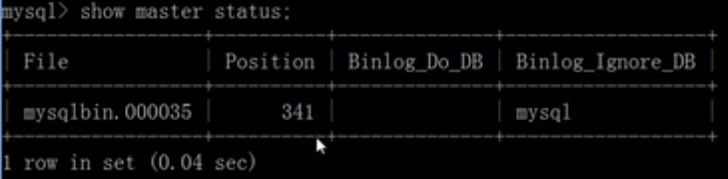
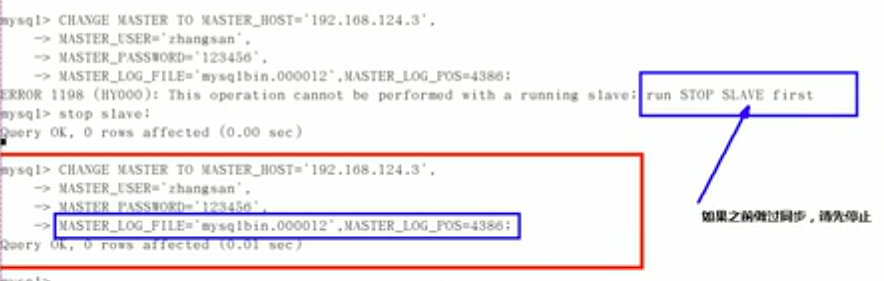

# 主从复制

​		mysql是现在普遍使用的数据库，但是如果宕机了必然会造成数据丢失。为了保证mysql数据库的可靠性。就要会一些提高可靠性的技术。

slave（从服务器）

master（主服务器）

## 什么是主从复制

​		将主数据库中的DDL和DML操作通过二进制日志传输到从数据库上，然后将这些日志重新执行（重做）；从而使得从数据库的数据与主数据库保持一致。

## 复制的基本原理

​		slave会从master读取binlog来进行数据异步同步。


Binary log：主数据库的二进制日志。

Relay log：从服务器的中继日志。

需要开启3个线程，master IO线程，slave开启 IO线程 SQL线程，

**第一步：**master在每个事务更新数据完成之前，将该操作记录串行地写入到binlog文件中。

**第二步：**salve开启一个I/O Thread，该线程在master打开一个普通连接，主要工作是binlog dump process。如果读取的进度已经跟上了master，就进入睡眠状态并等待master产生新的事件。I/O线程最终的目的是将这些事件写入到中继日志中。

**第三步：**SQL Thread会读取中继日志，并顺序执行该日志中的SQL事件，从而与主数据库中的数据保持一致。

## 复制的基本规则

- 每个slave只有一个master
-  每个slave只能有一个唯一的服务器ID
- 每个master可以有多个slave

## 复制的最大问题

​	**延时**

## 一主一从常见配置

**mysql版本一致**且后台以服务运行。

主从都配置在[mysqld]结点下，都是小写。

首先主从双向都能ping通。

主机修改my.cnf配置文件：

```properties
# 【必须】主服务器唯一ID
server-id=1
# 【必须】启用二进制日志
log-bin=自己本地的路径/mysqlbin
# 【可选】启用错误日志
log-err=自己本地的路径/mysqlerr
# 【可选】根目录
basedir=自己本地路径
# 【可选】临时目录
tmpdir=自己本地路径
# 【可选】数据目录
datadir=自己本地路径/data
# 主机，读写都可以
read-only=0
# 【可选】设置不要复制的数据库
binlog-igore-db=mysql
# 【可选】设置需要复制的数据库
binlog-do-db=需要复制的主数据库名字
```

从机修改my.cnf配置文件

```properties
# 【必须】从服务器唯一ID
server-id=2
# 【可选】启用二进制日志
log-bin=自己本地的路径/mysqlbin
```

因修改过配置文件，请将主从都重启后台mysql服务。

主机从机都关闭防火墙

```bash
service iptables stop
```

在主机上建立帐户并授权slave。

```mysql
# 授权从机访问
GRANT REPLICATION SLAVE ON *.* TO 'zhangsan'@'从数据库IP' IDENTIFIED BY ‘123456’；
# 权限生效
flush privileges;
# 查看master的状态
show master status;
# 记录下File和Position的值
# 执行完此步骤后不要再操作主服务器MySQL,防止主服务器状态值变化。
```



在从机上配置需要复制的主机。

```mysql
# 配置主服务器
CHANGE MASTER TO MASTER_HOST='主机IP',MASTER_USER='zhangsan',MASTER_PASSWORD='123456',MASTER_LOG_FILE='file文件名字',MASTER_LOG_POS=Position数字；
# 启用从服务器复制功能
start slave;
```



查看主从是否配置成功：

```mysql
show slave status\G
# 下面两个参数都是Yes，则说明主从配置成功！
# Slave_IO_Running:Yes
# Slave_SQL_Running:Yes
```

主机新建库、新建表、insert记录，从机复制。

```mysql
create database mydb58;
use mydb58;
create table dog(id int not null, name varchar(20));
insert into dog values(1, 'ww1');
-- 分别查看下主从的情况。
select * from dog;
```

如何停止从服务复制功能？

```mysql
stop slave;
```

