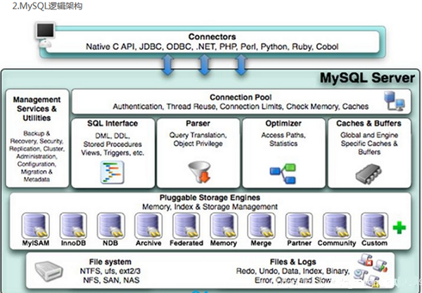

# mysql的架构介绍

## Mysql简介

## Mysql Linux版的安装

## Mysql配置文件

- 二进制日志log-bin  主要用于主从复制
- 错误日志log-error   默认关闭  用于记录严重的警告和错误信息，每次启动和关闭的详细信息等。
- 查询日志  默认关闭，记录查询的sql语句，如果开启会降低mysql的整体性能。 像配置了慢查询分析，那么慢sql也会通过日志记录下来。
- 数据文件
  - 两系统
    - windows   mysql安装目录/data下可以挑选很多库
    - linux  默认/var/lib/mysql
  - Myisam
    - frm文件    存放表结构
    - myd文件   存放表数据
    - myi文件     存放表索引
  - Innodb
    - frm是表定义文件
    - ibd是数据文件
- 如何配置

## Mysql逻辑架构介绍

[参考文档](https://www.jb51.net/article/154417.htm)



​		和其它数据库相比，MySQL有点与众不同，它的架构可以在不同场景中应用并发挥良好性能，主要体现在存储引擎的架构上。**插件式的存储引擎架构将查询处理和其它的系统任务以及数据的存储提取相分离**。这种架构可以根据业务的需求和实际需要选择合适的存储引擎。

**连接层**

最上层是一些客户端和连接服务，包含本地sock通信和大多数基于客户端/服务端工具实现的类似于tcp/ip的通信。主要完成一些类似于连接处理、授权认证、及相关的安全方案。在该层上引入了线程池的概念，为通过认证安全接入的客户端提供线程。同样在该层上可以实现基于SSL的安全链接。服务器也会为安全接入的每个客户端验证它所具有的操作权限。

**服务层**


**引擎层**

存储引擎层，存储引擎真正的负责了MySQL中数据的存储和提取，服务器通过API与存储引擎进行通信。不同的存储引擎具有的功能不同，这样我们可以根据自己的实际需要进行选取。

**存储层**

数据存储层，主要是将数据存储在运行于裸设备的文件系统之上，并完成与存储引擎的交互。

## Mysql存储引擎

### 查看存储引擎

**show engines;**

```
mysql> show engines;
+--------------------+---------+-------------------------------------------------------------+--------------+------+------------+
| Engine             | Support | Comment                                                        | Transactions | XA   | Savepoints |
+--------------------+---------+-------------------------------------------------------------+--------------+------+------------+
| FEDERATED          | NO      | Federated MySQL storage engine                                 | NULL         | NULL | NULL       |
| MEMORY             | YES     | Hash based, stored in memory, useful for temporary tables      | NO           | NO   | NO         |
| InnoDB             | DEFAULT | Supports transactions, row-level locking, and foreign keys     | YES          | YES  | YES        |
| PERFORMANCE_SCHEMA | YES     | Performance Schema                                             | NO           | NO   | NO         |
| MyISAM             | YES     | MyISAM storage engine                                          | NO           | NO   | NO         |
| MRG_MYISAM         | YES     | Collection of identical MyISAM tables                          | NO           | NO   | NO         |
| BLACKHOLE          | YES     | /dev/null storage engine (anything you write to it disappears) | NO           | NO   | NO         |
| CSV                | YES     | CSV storage engine                                             | NO           | NO   | NO         |
| ARCHIVE            | YES     | Archive storage engine                                         | NO           | NO   | NO         |
+--------------------+---------+-------------------------------------------------------------+--------------+------+------------+
9 rows in set (0.00 sec)
```

**show variables like '%engine%';**

```
mysql> show variables like '%engine%';
+-----------------------------------------+---------------+
| Variable_name                           | Value         |
+-----------------------------------------+---------------+
| default_storage_engine                  | InnoDB        |
| default_tmp_storage_engine              | InnoDB        |
| disabled_storage_engines                |               |
| internal_tmp_mem_storage_engine         | TempTable     |
| secondary_engine_cost_threshold         | 100000.000000 |
| show_create_table_skip_secondary_engine | OFF           |
| use_secondary_engine                    | ON            |
+-----------------------------------------+---------------+
7 rows in set (0.01 sec)
```

### MyISAM与InnoDB的区别

| 对比项   | MyISAM                                                       | InnoDB                                                       |
| -------- | ------------------------------------------------------------ | ------------------------------------------------------------ |
| 主外键   | 不支持                                                       | 支持                                                         |
| 事务     | 不支持                                                       | 支持                                                         |
| 行表锁   | 只支持表锁，即使操作一条记录也会锁住整个表，不适合高并发操作 | 支持表锁和行锁。行锁，只锁住操作的那一行，对其他行的操作不影响。适合高并发操作。 |
| 表空间   | 小                                                           | 大                                                           |
| 关注点   | 性能                                                         | 事务                                                         |
| 默认安装 | Y                                                            | Y                                                            |

[MyISAM与InnoDB 的区别](https://blog.csdn.net/qq_35642036/article/details/82820178)

### 市场上的引擎

[扩展阅读](https://blog.csdn.net/zhao9tian/article/details/55261718)


Percona为Mysql数据库服务器进行了改造，在功能和性能上较Mysql有着很明显的提升。该版本提升了在高负载情况下的InnoDB的性能、为DBA提供一些非常有用的性能诊断工具；另外有更多的参数和命令控制服务器行为。

该公司新建了一款存储引擎较Xtradb完全可以替代Innodb，并且在性能和并发上做得很好。

阿里巴巴大部分mysql数据库其实使用的percona的原型加以修改。**AliSql+AliRedis**。