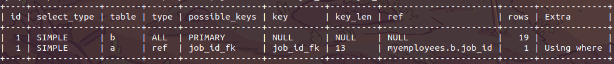

# 索引优化分析

​		sql的优化一般是在有大量数据的情况下，如果一个表就只有几千几万行，那就没有太大必要，mysql有能力处理好这种量级的数据。但是作为程序员来说，肯定是希望自己的技术水平精益求精，如果能掌握好优化技术，能在首次开发就能写出相对性能较好的sql，何乐而不为呢！

## 性能下降

​	执行时间长，等待时间长

- 操作系统资源分析
  - cpu、内存、硬盘、网络使用情况，看是不是由于资源满了导致mysql服务性能下降
- 查询语句写的很烂，导致性能差
- 索引创建不合理
- 索引失效（单值、复合）
- 关联查询太多join（设计缺陷或不得已的需求）
- 服务器调优及各个参数设置（缓冲、线程数等）

## 常见通用的Join查询

### mysql查询语句执行顺序

SQL语言不同于其他编程语言的最明显特征是处理代码的顺序。在大多数据库语言中，代码按编码顺序被处理。但在SQL语句中，第一个被处理的子句式FROM，而不是第一出现的SELECT。SQL查询处理的步骤序号：

(1) FROM <left_table>

(2) ON <join_condition>

(3) <join_type> JOIN <right_table>

(4) WHERE <where_condition>

(5) GROUP BY <group_by_list>

(6) WITH {CUBE | ROLLUP}

(7) HAVING <having_condition>

(8) SELECT

(9) DISTINCT

(9) ORDER BY <order_by_list>

(10) LIMIT

以上每个步骤都会产生一个虚拟表，该虚拟表被用作下一个步骤的输入。这些虚拟表对调用者(客户端应用程序或者外部查询)不可用。只有最后一步生成的表才会会给调用者。如果没有在查询中指定某一个子句，将跳过相应的步骤。

### 7种join用法


## 索引简介

### **是什么**

​		MySQL官方对索引的定义为：**索引（Index）是帮助Mysql高效获取数据的数据**。 可以得到索引的本质：**索引就是数据结构**。你可以简单的理解为“**排好序的快速查找数据结构**”，目的在于提高查询效率，可以类比字典。

​		一般来说，索引本身也很大，不可能全部存储在内存中，因此所以往往以索引文件的形式存储在磁盘上。

​		**我们平常所说的索引，如果没有特别指明，都是指B树**（多路搜索树，并不一定是二叉树）结构组织的索引。其中聚集索引，次要索引、复合索引、覆盖索引、前缀索引，唯一索引默认都是使用B+树索引，统称索引。当然，除了B+树这种类型的索引之外，还有哈希索引（hash index）等。

​		**在数据之外，数据库系统还维护着满足特定查找算法的数据结构，这些数据结构以某种方式引用（指向）数据，这样就可以再这些数据结构上实现高级查找算法。这种数据结构，就是索引。**


​		为了加快col2的查找，可以维护一个右边所示的二叉树，每个节点分别包含索引和一个指向对应数据记录物理地址的指针，这样就可以运用二叉树在一定的复杂度内获取到相应的数据，从而快速的检出符合条件的记录。

### 优势

- 类似大学图书馆书目索引，**提高数据检索效率**，降低数据库IO成本。
- 通常索引列对数据进行排序，**降低数据排序的成本**，降低了CPU的消耗。

### 劣势

- 实际上索引也是一张表，该表保存了主键与索引字段，并指向实体表的记录，所以**索引列也是要占用空间**的。
- 虽然索引大大提高了查询速度，同时却**会降低更新表的速度**，如果对表进行INSERT、UPDATE或DELETE。因为更新表时，MySQL不仅要保存数据，还要保存一下索引文件每次更新添加了索引列的字段。
- 索引只是提高效率的一个因素，如果你的Mysql有大量数据的表，就需要化时间研究建立最优秀的索引，或优化查询语句。
  - 建立索引，可能会根据业务，实际使用等不断重新优化调整最佳索引建立策略。

### mysql索引分类

1. 单值索引

   即一个索引只包含单个列，一个表可以有多个单列索引。

2. 唯一索引

   索引列的值必须唯一，但允许有空值。

3. 复合索引

   一个索引包含多个列。

4. 全文索引fulltext：用于搜索很长一篇文章的时候效果最好。
5. 空间索引spatial: 了解即可，几乎不用

基本语法：

创建：

​		CREATE [UNIQUE] INDEX indexName ON mytable(columnname(length));

​		ALTER mytable ADD [UNIQUE] INDEX [indexName] ON (columname(length))

删除：

​		DROP INDEX [indexName] ON mytable;

查看:

​		SHOW INDEX FORM table_name\G


### mysql索引结构

- BTree索引

  

- Hash索引

- full-text全文索引

  - [MySQL-使用中文分词的全文索引](https://blog.csdn.net/silence_xiang/article/details/102709410)

- R-Tree索引

[mysql索引原理](https://www.jianshu.com/p/d90f6b028d0e)

[Mysql聚簇索引和非聚簇索引原理（数据库）](https://blog.csdn.net/lisuyibmd/article/details/53004848)


如上图，是一颗b+树，关于b+树的定义可以参见[B+树](http://zh.wikipedia.org/wiki/B%2B树)，这里只说一些重点，浅蓝色的块我们称之为一个磁盘块，可以看到每个磁盘块包含几个数据项（深蓝色所示）和指针（黄色所示），如磁盘块1包含数据项17和35，包含指针P1、P2、P3，P1表示小于17的磁盘块，P2表示在17和35之间的磁盘块，P3表示大于35的磁盘块。真实的数据存在于叶子节点即3、5、9、10、13、15、28、29、36、60、75、79、90、99。非叶子节点只不存储真实的数据，只存储指引搜索方向的数据项，如17、35并不真实存在于数据表中。

\###b+树的查找过程
如图所示，如果要查找数据项29，那么首先会把磁盘块1由磁盘加载到内存，此时发生一次IO，在内存中用二分查找确定29在17和35之间，锁定磁盘块1的P2指针，内存时间因为非常短（相比磁盘的IO）可以忽略不计，通过磁盘块1的P2指针的磁盘地址把磁盘块3由磁盘加载到内存，发生第二次IO，29在26和30之间，锁定磁盘块3的P2指针，通过指针加载磁盘块8到内存，发生第三次IO，同时内存中做二分查找找到29，结束查询，总计三次IO。真实的情况是，3层的b+树可以表示上百万的数据，如果上百万的数据查找只需要三次IO，性能提高将是巨大的，如果没有索引，每个数据项都要发生一次IO，那么总共需要百万次的IO，显然成本非常非常高。

\###b+树性质
1**.索引字段要尽量的小**：通过上面的分析，我们知道IO次数取决于b+数的高度h，假设当前数据表的数据为N，每个磁盘块的数据项的数量是m，则有h=㏒(m+1)N，当数据量N一定的情况下，m越大，h越小；而m = 磁盘块的大小 / 数据项的大小，磁盘块的大小也就是一个数据页的大小，是固定的，如果数据项占的空间越小，数据项的数量越多，树的高度越低。这就是为什么每个数据项，即索引字段要尽量的小，比如int占4字节，要比bigint8字节少一半。这也是为什么b+树要求把真实的数据放到叶子节点而不是内层节点，一旦放到内层节点，磁盘块的数据项会大幅度下降，导致树增高。当数据项等于1时将会退化成线性表。
2.**索引的最左匹配特性（即从左往右匹配）**：当b+树的数据项是复合的数据结构，比如(name,age,sex)的时候，b+数是按照从左到右的顺序来建立搜索树的，比如当(张三,20,F)这样的数据来检索的时候，b+树会优先比较name来确定下一步的所搜方向，如果name相同再依次比较age和sex，最后得到检索的数据；但当(20,F)这样的没有name的数据来的时候，b+树就不知道下一步该查哪个节点，因为建立搜索树的时候name就是第一个比较因子，必须要先根据name来搜索才能知道下一步去哪里查询。比如当(张三,F)这样的数据来检索时，b+树可以用name来指定搜索方向，但下一个字段age的缺失，所以只能把名字等于张三的数据都找到，然后再匹配性别是F的数据了， 这个是非常重要的性质，即索引的最左匹配特性。

### 那些情况需要索引

1. 主键自动建立唯一索引；
2. 频繁作为查询条件的字段应该创建索引；
3. 查询中与其它表关联的字段，外键关系建立索引；
4. 频繁更新的字段不合适创建索引(每次更新记录就会更新索引)；
5. where条件里用不到的字段不创建索引；
6. 单键/组合索引的选择问题，who?（在高并发下倾向创建组合索引）;
7. 查询中排序的字段，排序字段若通过索引去访问将大大提高排序速度；
8. 查询中统计或分组的字段。

### 那些情况不需要索引

1. 表记录太少    随便几万的数据mysql还是能hold住的。

2. 经常增删改的表

   索引提高了查询速度，却同时却会降低更新表的速度，如对表进行INSERT、UPDATE和DELETE。因为更新表时，MySQL不仅要保存数据，还要保存一下索引文件。

3. 如果某个列有大量的重复内容且分布平均，为它建立索引就没有太大的实际效果。像一般内容重复，或者枚举值字段。 也就是说**数据重复率越低，索引效率越高**。

### 覆盖索引

​		**指从辅助索引中就能获取到需要的记录，而不需要查找聚簇索引中的记录。**索引是高效找到行的一个方法，当能通过检索索引就可以读取想要的数据，那就不需要再到数据表中读取行了。如果一个索引包含了（或覆盖了）满足查询语句中字段与条件的数据就叫做覆盖索引。

### 聚集索引

​		**一个表中只能有一个，聚集索引的顺序与数据真实的物理存储顺序一致。**查询速度贼快，聚集索引的叶子节点上是该行的所有数据 ，数据索引能加快范围查询(聚集索引的顺序和数据存放的逻辑顺序一致)。主键!=聚集索引。

### 辅助索引（非聚集索引）

​		一个表中可以有多个，叶子节点存放的不是一整行数据，而是键值，叶子节点的索引行中还包含了一个'书签'，这个书签就是指向聚簇索引的一个指针，从而在聚簇索引树中找到一整行数据。

> **聚集索引与辅助索引的区别：**叶子节点是否存放的为一整行数据（意思应该是说连续的意思）。

### 最左前缀规则

​		假设联合索引由列(a,b,c)组成，则以下顺序满足最左前缀规则：a、ab、abc；selece、where、order by 、group by都可以匹配最左前缀。其它情况都不满足最左前缀规则就不会用到联合索引。

## 性能分析

### MySQL Query Optimizer

​		MySQL查询优化器。Mysql中专门负责优化SELECT语句的优化器模块，主要功能：通过计算分析系统中收集到的统计信息，为客户端请求的Query提供他认为最优的执行计划（它认为最优的数据检索方式，但不见得是DBA认为最优的，这部分最耗费时间）。

​		当客户端向MySQL请求一条Query，命令解析器模块完成请求分类，区别出是SELECT并转发给MySQL查询优化器时，它首先会对整条Query进行优化，处理掉一些常量表达式的运算，直接换算成常亮值。并对Query中的查询条件简化和转换，如去掉一些无用或者显而易见的条件、结构调整等。然后分析Query中Hint信息（如果有），看显示Hint信息是否可以完全确定该Query的执行计划。如果没有Hint或者Hint信息还不足以完成确定执行计划，则会读取所涉及对象的统计信息，根据Query进行相应的计算分析，然后再得出最后的执行计划。

### MySQL常见瓶颈

- CPU：CPU在饱和的时候一般发生在数据装入内存或者从磁盘上读取数据的时候。
- IO：磁盘I/O瓶颈发生在装入数据远大于内存容量的时候。
- 服务器硬件的性能瓶颈：top,free,iostat和vmstat来查看系统的性能状态。

### Explain

#### 是什么（查看执行计划）

​		使用EXPLAIN关键字可以模拟优化器执行SQL查询语句，从而知道Mysql是如何处理你的SQL语句的。分析你的查询语句或是表结构的性能瓶颈。

#### 能干什么

- 表的执行顺序 (explain 看id)
- 数据读取操作的操作类型
- 哪些索引可以使用
- 哪些索引被实际使用
- 表之间的引用
- 每张表有多少行被优化器查询

#### 怎么玩

​	explain + SQL语句

​	执行计划包含的信息：


#### 各字段解释

1. id

   select查询的序列号，包含一组数字，表示查询中执行select子句或操作表的执行顺序

   三种情况：

   - id相同，执行顺序由上至下

     ```sql
     explain select employees.*,departments.department_name, jobs.job_title
     from employees, departments, jobs
     where jobs.job_id = employees.job_id
     and employees.department_id = departments.department_id;
     ```

     

   - id不同，如果是子查询，id的序号会递增，id值越大优先级越高，越先执行。

     ```sql
     explain select *
     from departments
     where department_id = (
         select distinct department_id
         from employees
         where job_id = (
             select jobs.job_id
             from jobs
             where min_salary = 15000
         )
         and employees.department_id = 90
     );
     ```

     mysql8执行效果：

     

   - id相同不同，同时存在。

     id如果相同，可以认为是一组，从上往下顺序执行；在所有租中，id值越大，优先级越高，越先执行。

     ```sql
     explain select *
     from departments
     where department_id in (
         select distinct department_id
         from employees
         where job_id in (
             select jobs.job_id
             from jobs
             where min_salary > 1300 and max_salary < 30000
         )
     );
     ```

   mysql5.5执行效果:

   

   mysql8执行效果：

   

   ```sql
   explain select t1.*, departments.department_name
   from (
       select employees.*, job_title from employees, jobs
       where employees.job_id = jobs.job_id
   ) t1
   left join departments
   on t1.department_id = departments.department_id;
   ```

   mysql5:

   DERIVED: 衍生

   

   mysql8:

   

2. select_type

   ​		常见常用的值：SIMPLE、PRIMARY、SUBQUERY、DERIVED、UNION、UNION RESULT。查询的类型，主要是用于区别普通查询、联合查询、子查询等的复杂查询。

   - SIMPLE: 简单select查询，查询中不包含子查询或者UNION。

   - PRIMARY： 查询中若包含复杂的子部分，最外层标记为PRIMARY。
   - SUBQUERY：在SELECT或WHERE列表中包含了子查询。
   - DERIVED: 在FROM列表中包含的子查询被标记为DERIVED（衍生），MySQL会递归执行这些子查询，把结果放在临时表中。
   - UNION: 若第二个SELECT 出现在UNION之后，则被标记为UNION；若UNION包含在FROM子句的子查询中，外层SELECT被标记为DERIVED。
   - UNION RESULT：从UNION表获取结果的SELECT。

3. table

   操作的对应的表名

4. type 常见的值有：ALL、index、range、ref、eq_ref、const、system、NULL。

   显示查询使用了何种类型，从最好到最差依次是：system>const>eq_ref>ref>range>index>ALL。 一般来说，得保证查询至少达到range级别，最好能达到ref。

   完整的的最好到最差依次是：system>const>eq_ref>ref>fulltext>ref_of_null>index_merge>unique_subquery>index_subquery>range>index>ALL

   解析：

   - system：表只有一行数据（等于系统表），这是const类型的特例，平时不会出现。这个也可以忽略不计。

     ```sql
     -- 内部临时表只会返回一行数据 所以最后id为1的执行type为system。
     -- job_id是jobs表的主键
     explain select * from (select * from jobs where job_id = 'ST_MAN') a;
     ```

     

   - const：表示通过索引一次就找到了，const用于比较primary key或者union索引，因为只匹配一行数据，所以很快。如将主键置于where列表中，Mysql就能将该查询转换为一个常亮。

     ```sql
     -- job_id是jobs表的主键
     explain select * from jobs where job_id = 'ST_MAN';
     ```

   

   - eq_ref：唯一性索引扫码，对于每个索引键，表中只有一条记录与之相匹配。常见于主键或唯一索引扫描。

     ```sql
     explain select * from employees a left join jobs b on a.job_id = b.job_id
     ```

     

   - ref 非唯一性索引扫描，返回匹配单个值得所有行，本质上也是一种索引访问，它返回所有匹配某个单独值的行，然而，它可能找到多个符合条件的行，所以他应该属于查找和扫描的混合体。

     ```sql
     explain select * from employees a, jobs b where a.job_id = b.job_id;
     ```

     

   - range：只检索给定范围的行，使用一个**索引**来选择行。key列显示使用了哪个索引，一般就是在你的where语句中出现了between，>，<，in等的查询。这种范围扫描索引比全表扫描要好，因为它只需要开始于索引的某一点，然后再另一点结束，不用全部索引。

     ```sql
     explain select * from article where id between 1 and 2;
     ```

     

   - index：Full Index Scan, Index与ALL区别为index类型只遍历索引树，这通常比ALL快，因为索引文件通常比数据文件小。（也就是说虽然all和index都是读全表，但是index是从索引中读取的，而all是从硬盘中读的。）

     ```sql
     explain select count(*) from article;
     ```

     

   - all：Full Table Scan，将遍历全表以找到匹配的行。

     ```sql
     explain select * from article;
     ```

     

   > 备注：一般来说，得保证查询至少达到range级别，最好达到ref。

5. possible_keys：显示**可能**应用在这张表中的索引，一个活多个。查询涉及到的字段若存在索引，则该索引将被列出，**但不一定被查询实际使用**。

   

6. key：**实际**使用的索引，如果是NULL，则没有使用索引或者索引失效。 

   >  查询中若使用了覆盖索引，则该索引仅出现在key列表中。

   

7. key_len

   

8. ref

## 索引优化