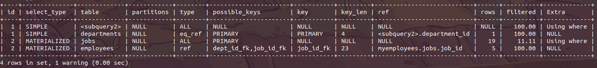

# 索引优化分析

​		sql的优化一般是在有大量数据的情况下，如果一个表就只有几千几万行，那就没有太大必要，mysql有能力处理好这种量级的数据。但是作为程序员来说，肯定是希望自己的技术水平精益求精，如果能掌握好优化技术，能在首次开发就能写出相对性能较好的sql，何乐而不为呢！

## 性能下降

​	执行时间长，等待时间长

- 操作系统资源分析
  - cpu、内存、硬盘、网络使用情况，看是不是由于资源满了导致mysql服务性能下降
- 查询语句写的很烂，导致性能差
- 索引创建不合理
- 索引失效（单值、复合）
- 关联查询太多join（设计缺陷或不得已的需求）
- 服务器调优及各个参数设置（缓冲、线程数等）

## 常见通用的Join查询

### mysql查询语句执行顺序

SQL语言不同于其他编程语言的最明显特征是处理代码的顺序。在大多数据库语言中，代码按编码顺序被处理。但在SQL语句中，第一个被处理的子句式FROM，而不是第一出现的SELECT。SQL查询处理的步骤序号：

(1) FROM <left_table>

(2) ON <join_condition>

(3) <join_type> JOIN <right_table>

(4) WHERE <where_condition>

(5) GROUP BY <group_by_list>

(6) WITH {CUBE | ROLLUP}

(7) HAVING <having_condition>

(8) SELECT

(9) DISTINCT

(9) ORDER BY <order_by_list>

(10) LIMIT

以上每个步骤都会产生一个虚拟表，该虚拟表被用作下一个步骤的输入。这些虚拟表对调用者(客户端应用程序或者外部查询)不可用。只有最后一步生成的表才会会给调用者。如果没有在查询中指定某一个子句，将跳过相应的步骤。

### 7种join用法


## 索引简介

### **是什么**

​		MySQL官方对索引的定义为：**索引（Index）是帮助Mysql高效获取数据的数据**。 可以得到索引的本质：**索引就是数据结构**。你可以简单的理解为“**排好序的快速查找数据结构**”，目的在于提高查询效率，可以类比字典。

​		一般来说，索引本身也很大，不可能全部存储在内存中，因此所以往往以索引文件的形式存储在磁盘上。

​		**我们平常所说的索引，如果没有特别指明，都是指B树**（多路搜索树，并不一定是二叉树）结构组织的索引。其中聚集索引，次要索引、复合索引、覆盖索引、前缀索引，唯一索引默认都是使用B+树索引，统称索引。当然，除了B+树这种类型的索引之外，还有哈希索引（hash index）等。

​		**在数据之外，数据库系统还维护着满足特定查找算法的数据结构，这些数据结构以某种方式引用（指向）数据，这样就可以再这些数据结构上实现高级查找算法。这种数据结构，就是索引。**


​		为了加快col2的查找，可以维护一个右边所示的二叉树，每个节点分别包含索引和一个指向对应数据记录物理地址的指针，这样就可以运用二叉树在一定的复杂度内获取到相应的数据，从而快速的检出符合条件的记录。

### 优势

- 类似大学图书馆书目索引，**提高数据检索效率**，降低数据库IO成本。
- 通常索引列对数据进行排序，**降低数据排序的成本**，降低了CPU的消耗。

### 劣势

- 实际上索引也是一张表，该表保存了主键与索引字段，并指向实体表的记录，所以**索引列也是要占用空间**的。
- 虽然索引大大提高了查询速度，同时却**会降低更新表的速度**，如果对表进行INSERT、UPDATE或DELETE。因为更新表时，MySQL不仅要保存数据，还要保存一下索引文件每次更新添加了索引列的字段。
- 索引只是提高效率的一个因素，如果你的Mysql有大量数据的表，就需要化时间研究建立最优秀的索引，或优化查询语句。
  - 建立索引，可能会根据业务，实际使用等不断重新优化调整最佳索引建立策略。

### mysql索引分类

1. 单值索引

   即一个索引只包含单个列，一个表可以有多个单列索引。

2. 唯一索引

   索引列的值必须唯一，但允许有空值。

3. 复合索引

   一个索引包含多个列。

4. 全文索引fulltext：用于搜索很长一篇文章的时候效果最好。
5. 空间索引spatial: 了解即可，几乎不用

基本语法：

创建：

​		CREATE [UNIQUE] INDEX indexName ON mytable(columnname(length));

​		ALTER mytable ADD [UNIQUE] INDEX [indexName] ON (columname(length))

删除：

​		DROP INDEX [indexName] ON mytable;

查看:

​		SHOW INDEX FORM table_name\G


### mysql索引结构

- BTree索引

  

- Hash索引

- full-text全文索引

  - [MySQL-使用中文分词的全文索引](https://blog.csdn.net/silence_xiang/article/details/102709410)

- R-Tree索引

[mysql索引原理](https://www.jianshu.com/p/d90f6b028d0e)

[Mysql聚簇索引和非聚簇索引原理（数据库）](https://blog.csdn.net/lisuyibmd/article/details/53004848)


如上图，是一颗b+树，关于b+树的定义可以参见[B+树](http://zh.wikipedia.org/wiki/B%2B树)，这里只说一些重点，浅蓝色的块我们称之为一个磁盘块，可以看到每个磁盘块包含几个数据项（深蓝色所示）和指针（黄色所示），如磁盘块1包含数据项17和35，包含指针P1、P2、P3，P1表示小于17的磁盘块，P2表示在17和35之间的磁盘块，P3表示大于35的磁盘块。真实的数据存在于叶子节点即3、5、9、10、13、15、28、29、36、60、75、79、90、99。非叶子节点只不存储真实的数据，只存储指引搜索方向的数据项，如17、35并不真实存在于数据表中。

\###b+树的查找过程
如图所示，如果要查找数据项29，那么首先会把磁盘块1由磁盘加载到内存，此时发生一次IO，在内存中用二分查找确定29在17和35之间，锁定磁盘块1的P2指针，内存时间因为非常短（相比磁盘的IO）可以忽略不计，通过磁盘块1的P2指针的磁盘地址把磁盘块3由磁盘加载到内存，发生第二次IO，29在26和30之间，锁定磁盘块3的P2指针，通过指针加载磁盘块8到内存，发生第三次IO，同时内存中做二分查找找到29，结束查询，总计三次IO。真实的情况是，3层的b+树可以表示上百万的数据，如果上百万的数据查找只需要三次IO，性能提高将是巨大的，如果没有索引，每个数据项都要发生一次IO，那么总共需要百万次的IO，显然成本非常非常高。

\###b+树性质
1**.索引字段要尽量的小**：通过上面的分析，我们知道IO次数取决于b+数的高度h，假设当前数据表的数据为N，每个磁盘块的数据项的数量是m，则有h=㏒(m+1)N，当数据量N一定的情况下，m越大，h越小；而m = 磁盘块的大小 / 数据项的大小，磁盘块的大小也就是一个数据页的大小，是固定的，如果数据项占的空间越小，数据项的数量越多，树的高度越低。这就是为什么每个数据项，即索引字段要尽量的小，比如int占4字节，要比bigint8字节少一半。这也是为什么b+树要求把真实的数据放到叶子节点而不是内层节点，一旦放到内层节点，磁盘块的数据项会大幅度下降，导致树增高。当数据项等于1时将会退化成线性表。
2.**索引的最左匹配特性（即从左往右匹配）**：当b+树的数据项是复合的数据结构，比如(name,age,sex)的时候，b+数是按照从左到右的顺序来建立搜索树的，比如当(张三,20,F)这样的数据来检索的时候，b+树会优先比较name来确定下一步的所搜方向，如果name相同再依次比较age和sex，最后得到检索的数据；但当(20,F)这样的没有name的数据来的时候，b+树就不知道下一步该查哪个节点，因为建立搜索树的时候name就是第一个比较因子，必须要先根据name来搜索才能知道下一步去哪里查询。比如当(张三,F)这样的数据来检索时，b+树可以用name来指定搜索方向，但下一个字段age的缺失，所以只能把名字等于张三的数据都找到，然后再匹配性别是F的数据了， 这个是非常重要的性质，即索引的最左匹配特性。

### 那些情况需要索引

1. 主键自动建立唯一索引；
2. 频繁作为查询条件的字段应该创建索引；
3. 查询中与其它表关联的字段，外键关系建立索引；
4. 频繁更新的字段不合适创建索引(每次更新记录就会更新索引)；
5. where条件里用不到的字段不创建索引；
6. 单键/组合索引的选择问题，who?（在高并发下倾向创建组合索引）;
7. 查询中排序的字段，排序字段若通过索引去访问将大大提高排序速度；
8. 查询中统计或分组的字段。

### 那些情况不需要索引

1. 表记录太少    随便几万的数据mysql还是能hold住的。

2. 经常增删改的表

   索引提高了查询速度，却同时却会降低更新表的速度，如对表进行INSERT、UPDATE和DELETE。因为更新表时，MySQL不仅要保存数据，还要保存一下索引文件。

3. 如果某个列有大量的重复内容且分布平均，为它建立索引就没有太大的实际效果。像一般内容重复，或者枚举值字段。 也就是说**数据重复率越低，索引效率越高**。

### 覆盖索引

​		就是select的数据列只用从索引中就能够取得，不必读取数据行，MySQL可以利用索引返回select列表中的字段，而不必根据索引再次读取数据文件，换句话说**查询列要被所建的索引覆盖**

### 聚集索引

​		**一个表中只能有一个，聚集索引的顺序与数据真实的物理存储顺序一致。**查询速度贼快，聚集索引的叶子节点上是该行的所有数据 ，数据索引能加快范围查询(聚集索引的顺序和数据存放的逻辑顺序一致)。主键!=聚集索引。

### 辅助索引（非聚集索引）

​		一个表中可以有多个，叶子节点存放的不是一整行数据，而是键值，叶子节点的索引行中还包含了一个'书签'，这个书签就是指向聚簇索引的一个指针，从而在聚簇索引树中找到一整行数据。

> **聚集索引与辅助索引的区别：**叶子节点是否存放的为一整行数据（意思应该是说连续的意思）。

### 最左前缀规则

​		假设联合索引由列(a,b,c)组成，则以下顺序满足最左前缀规则：a、ab、abc；selece、where、order by 、group by都可以匹配最左前缀。其它情况都不满足最左前缀规则就不会用到联合索引。

## 性能分析

### MySQL Query Optimizer

​		MySQL查询优化器。Mysql中专门负责优化SELECT语句的优化器模块，主要功能：通过计算分析系统中收集到的统计信息，为客户端请求的Query提供他认为最优的执行计划（它认为最优的数据检索方式，但不见得是DBA认为最优的，这部分最耗费时间）。

​		当客户端向MySQL请求一条Query，命令解析器模块完成请求分类，区别出是SELECT并转发给MySQL查询优化器时，它首先会对整条Query进行优化，处理掉一些常量表达式的运算，直接换算成常亮值。并对Query中的查询条件简化和转换，如去掉一些无用或者显而易见的条件、结构调整等。然后分析Query中Hint信息（如果有），看显示Hint信息是否可以完全确定该Query的执行计划。如果没有Hint或者Hint信息还不足以完成确定执行计划，则会读取所涉及对象的统计信息，根据Query进行相应的计算分析，然后再得出最后的执行计划。

### MySQL常见瓶颈

- CPU：CPU在饱和的时候一般发生在数据装入内存或者从磁盘上读取数据的时候。
- IO：磁盘I/O瓶颈发生在装入数据远大于内存容量的时候。
- 服务器硬件的性能瓶颈：top,free,iostat和vmstat来查看系统的性能状态。

### Explain

#### 是什么（查看执行计划）

​		使用EXPLAIN关键字可以模拟优化器执行SQL查询语句，从而知道Mysql是如何处理你的SQL语句的。分析你的查询语句或是表结构的性能瓶颈。

#### 能干什么

- 表的执行顺序 (explain 看id)
- 数据读取操作的操作类型(select_type type)
- 哪些索引可以使用(possible_keys)
- 哪些索引被实际使用(keys)
- 表之间的引用(ref)
- 每张表有多少行被优化器查询（rows）

#### 怎么玩

​	explain + SQL语句

​	执行计划包含的信息：


#### 各字段解释

1. id

   select查询的序列号，包含一组数字，表示查询中执行select子句或操作表的执行顺序

   三种情况：

   - id相同，执行顺序由上至下

     ```sql
     explain select employees.*,departments.department_name, jobs.job_title
     from employees, departments, jobs
     where jobs.job_id = employees.job_id
     and employees.department_id = departments.department_id;
     ```

     

   - id不同，如果是子查询，id的序号会递增，id值越大优先级越高，越先执行。

     ```sql
     explain select *
     from departments
     where department_id = (
         select distinct department_id
         from employees
         where job_id = (
             select jobs.job_id
             from jobs
             where min_salary = 15000
         )
         and employees.department_id = 90
     );
     ```

     mysql8执行效果：

     

   - id相同不同，同时存在。

     id如果相同，可以认为是一组，从上往下顺序执行；在所有租中，id值越大，优先级越高，越先执行。

     ```sql
     explain select *
     from departments
     where department_id in (
         select distinct department_id
         from employees
         where job_id in (
             select jobs.job_id
             from jobs
             where min_salary > 1300 and max_salary < 30000
         )
     );
     ```

   mysql5.5执行效果:

   

   mysql8执行效果：

   

   ```sql
   explain select t1.*, departments.department_name
   from (
       select employees.*, job_title from employees, jobs
       where employees.job_id = jobs.job_id
   ) t1
   left join departments
   on t1.department_id = departments.department_id;
   ```

   mysql5:

   DERIVED: 衍生

   

   mysql8:

   

2. select_type

   ​		常见常用的值：SIMPLE、PRIMARY、SUBQUERY、DERIVED、UNION、UNION RESULT。查询的类型，主要是用于区别普通查询、联合查询、子查询等的复杂查询。

   - SIMPLE: 简单select查询，查询中不包含子查询或者UNION。

   - PRIMARY： 查询中若包含复杂的子部分，最外层标记为PRIMARY。
   - SUBQUERY：在SELECT或WHERE列表中包含了子查询。
   - DERIVED: 在FROM列表中包含的子查询被标记为DERIVED（衍生），MySQL会递归执行这些子查询，把结果放在临时表中。
   - UNION: 若第二个SELECT 出现在UNION之后，则被标记为UNION；若UNION包含在FROM子句的子查询中，外层SELECT被标记为DERIVED。
   - UNION RESULT：从UNION表获取结果的SELECT。

3. table

   操作的对应的表名

4. type 常见的值有：ALL、index、range、ref、eq_ref、const、system、NULL。

   显示查询使用了何种类型，从最好到最差依次是：system>const>eq_ref>ref>range>index>ALL。 一般来说，得保证查询至少达到range级别，最好能达到ref。

   完整的的最好到最差依次是：system>const>eq_ref>ref>fulltext>ref_of_null>index_merge>unique_subquery>index_subquery>range>index>ALL

   解析：

   - system：表只有一行数据（等于系统表），这是const类型的特例，平时不会出现。这个也可以忽略不计。

     ```sql
     -- 内部临时表只会返回一行数据 所以最后id为1的执行type为system。
     -- job_id是jobs表的主键
     explain select * from (select * from jobs where job_id = 'ST_MAN') a;
     ```

     

   - const：表示通过索引一次就找到了，const用于比较primary key或者union索引，因为只匹配一行数据，所以很快。如将主键置于where列表中，Mysql就能将该查询转换为一个常亮。

     ```sql
     -- job_id是jobs表的主键
     explain select * from jobs where job_id = 'ST_MAN';
     ```

   

   - eq_ref：唯一性索引扫码，对于每个索引键，表中只有一条记录与之相匹配。常见于主键或唯一索引扫描。

     ```sql
     explain select * from employees a left join jobs b on a.job_id = b.job_id
     ```

     

   - ref 非唯一性索引扫描，返回匹配单个值得所有行，本质上也是一种索引访问，它返回所有匹配某个单独值的行，然而，它可能找到多个符合条件的行，所以他应该属于查找和扫描的混合体。

     ```sql
     explain select * from employees a, jobs b where a.job_id = b.job_id;
     ```

     

   - range：只检索给定范围的行，使用一个**索引**来选择行。key列显示使用了哪个索引，一般就是在你的where语句中出现了between，>，<，in等的查询。这种范围扫描索引比全表扫描要好，因为它只需要开始于索引的某一点，然后再另一点结束，不用全部索引。

     ```sql
     explain select * from article where id between 1 and 2;
     ```

     

   - index：Full Index Scan, Index与ALL区别为index类型只遍历索引树，这通常比ALL快，因为索引文件通常比数据文件小。（也就是说虽然all和index都是读全表，但是index是从索引中读取的，而all是从硬盘中读的。）

     ```sql
     explain select count(*) from article;
     ```

     

   - all：Full Table Scan，将遍历全表以找到匹配的行。

     ```sql
     explain select * from article;
     ```

     

   > 备注：一般来说，得保证查询至少达到range级别，最好达到ref。

5. possible_keys：显示**可能**应用在这张表中的索引，一个活多个。查询涉及到的字段若存在索引，则该索引将被列出，**但不一定被查询实际使用**。

6. key：**实际**使用的索引，如果是NULL，则没有使用索引或者索引失效。 

   >  查询中若使用了覆盖索引，则该索引仅出现在key列表中。

7. key_len：表示索引中使用的字节数，可通过该列计算查询中十一哦那个的索引的长度。在不损失精确度的情况下，长度越短越好。 key_len显示的值为索引字段的最大可能长度，并非实际使用长度，即key_len使根据表定义计算而得，不是通过表内检索出的。

8. ref：显示索引的哪一列被使用了，如果可能的话，是一个常数。哪些列或常量被用于查找列上的值。

9. rows：根据表统计信息及索引选用情况，大致估算出找到所需的记录所需要读取的行数。（越小越好，每张表有多少行被优化器查询）

10. Extra：包含不适合在其他列中显示但十分重要的额外信息。

    1. **Using filesort**：说明mysql会对数据使用一个外部的索引排序，而不是按照表内的索引顺序进行读取。MySQL中无法利用索引完成的排序操作称为“文件排序”。

       ```sql
       explain select * from locations where location_id > 2000 order by country_id desc\G
       -- \G 竖排显示数据
       ```

       ```
       ******* 1. row **************
                  id: 1
         select_type: SIMPLE
               table: locations
          partitions: NULL
                type: range
       possible_keys: PRIMARY
                 key: PRIMARY
             key_len: 4
                 ref: NULL
                rows: 15
            filtered: 100.00
               Extra: Using where; Using filesort
       ```

    2. **Using temporary**: 使用了临时表保存中间结果，MySQL在对查询结果排序时使用临时表。常见于排序order by和分组查询group by。

       ```sql
       explain col1 from t1 where col1 in ('ac', 'ab', 'aa') group by col2\G
       -- 违背最左前缀原则
       ```

       ```
       ******* 1. row **************
                  id: 1
         select_type: SIMPLE
               table: t1
                type: range
       possible_keys: idx_col1_col2
                 key: idx_col1_col2
             key_len: 13
                 ref: NULL
                rows: 569
               Extra: Using where; Using index;Using temporary;Using filesort
       ```

       优化：

       ```sql
       explain select col1 from t1 where col1 in ('ac', 'ab') group by col1, col2\G
       ```

       ```
       ******* 1. row **************
                  id: 1
         select_type: SIMPLE
               table: t1
                type: range
       possible_keys: idx_col1_col2
                 key: idx_col1_col2
             key_len: 26
                 ref: NULL
                rows: 4
               Extra: Using where; Using index for group-by;
       ```

    3. **Using index**：

       表示相应的select操作中使用了覆盖索引（Covering Index），避免访问了表的数据行，效率不错！如果同时出现Using where，表明索引被用来执行索引键值得查找；如果没有出现Using where，表明索引用来读取数据而非执行查找动作。

       > 注意：如果要使用覆盖索引，一定要注意select列表中只读取需要的列，不可select *。
       >
       > 因为如果将所有字段一起做检索会导致索引文件过大，查询性能下降。

    4. Using where：

       表明使用了where过滤

    5. Using join buffer：

       使用了连接缓冲。  我们使用join很多了，所以如果缓冲不够可以讲配置文件中的join_buffer调大一点。

    6. Impossible where

       where 子句的值总是false，不能用来获取任何元组。

       ```sql
       explain select * from locations where city='Roma' and city='London'\G;
       -- 不可能一个字段同时等于两个不同的值
       ```

    7. select table optimized away

       在没有Group By子句的情况下，基于索引优化MIN/MAX操作或者对于MyISAM存储引擎优化COUNT(*)操作（这个引擎哟保存表记录数），不必等到执行阶段再进行计算，查询执行计划生成的阶段即完成优化。

    8. distinct

       优化distinct操作，在找到第一匹配的元组后即停止找同样值的动作。

## 索引优化

不好记笔记，[视频](https://www.bilibili.com/video/BV12b411K7Zu?p=209)讲得非常好。

### 索引分析

单表：索引加在条件上，不要加在会让索引失效的操作列上。

两表：LEFT JOIN 索引加在右表上， RIGHT JOIN索引加在左边表上。

三表：A left join B left join C索引加在B和C关联列上。

> 多张表连接查询最好使用小表驱动大表。

### 索引失效（应该避免）

#### 建立表

```sql
CREATE TABLE staffs(
    id INT primary key auto_increment,
    name varchar(24) not null default '' comment '姓名',
    age int not null default 0 comment '年龄',
    pos varchar(20) not null default '' comment '职位',
    add_time timestamp not null default current_timestamp comment '入职时间'
) CHARSET utf8 COMMENT '员工记录表';

insert into staffs(name, age, pos, add_time) VALUES ('z3', 22, 'manager', NOW());
insert into staffs(name, age, pos, add_time) VALUES ('July', 22, 'manager', NOW());
insert into staffs(name, age, pos, add_time) VALUES ('2000', 22, 'manager', NOW());

select * from staffs;

-- 添加复合索引
alter table staffs add index idx_staffs_nameAgePos(name, age, pos);
```

#### 索引失效知识点

1. 全值匹配我最爱（带头大哥不能死）；

   ```sql
   explain select * from staffs where name='July';
   explain select * from staffs where name='July' and age = 22;
   explain select * from staffs where name='July' and age = 22 and pos = 'manager';
   ```

2. 最佳左前缀法则（中间兄弟不能断）；

   如果索引列多列，要遵守最左前缀法则，指的是查询从索引的最左前列开始并且**不跳过索引的中的列**。

   ```sql
   -- 改动一下 (变成了全表扫描)
   explain select * from staffs where age = 22 and pos = 'manager';
   -- 这样也不能使用索引
   explain select * from staffs where age = 22;
   -- 这样能用上索引（最左前缀规则）
   explain select * from staffs where name='July';
   -- 如果中间缺一个呢（这个索引只用到了一部分，并且只用到了name）
   explain select * from staffs where name='July' and pos = 'manager';
   ```

3. 不在索引列上做任何操作（计算、函数、（自动or手动）类型转换），会导致索引失效； 

   ```sql
   explain select * from staffs where name = 'July';
   -- 对比
   explain select * from staffs where left(name, 4) = 'July';
   ```

4. 索引列范围条件之后的索引列全失效。

   ```sql
   -- age 和 pos失效
   explain select * from staffs where name = 'July' and age > 21 and pos = 'manager';
   ```

5. 尽量使用覆盖索引（只访问索引的查询（索引列和查询列一致）），减少select *。

    ```sql
    explain select * from staffs where name = 'July' and age = 25 and pos = 'manager';
    -- 对比
    explain select name, age, pos from staffs where name = 'July' and age = 25 and pos = 'manager';
    ```

6. mysql在使用不等于(!=或者<>)的时候无法使用索引会导致全表扫描。

    ```sql
    explain select * from staffs where name = 'July';
    --对比 下面语句mysql 5.5会全表扫描type为all，mysql8中显示type为range
    explain select * from staffs where name != 'July';
    ```

7. is null, is not null也无法使用索引。

    设计表的时候尽量避免空值，使用特殊默认值也可以。

    ```sql
    explain select * from staffs where name is null;
    explain select * from staffs where name is not null;
    ```

8. like通配符开头(''%abc...')，mysql索引失效会变成全表扫描的操作。

    百分like放右边。

    ```sql
    -- type=ref
    explain select * from staffs where name = 'July';
    -- type=range
    explain select * from staffs where name like 'July';
    -- type=range
    explain select * from staffs where name like 'July%';
    -- type=ALL
    explain select * from staffs where name like '%July';
    ```

    如果非要两边都用百分号搜索，这个时候可以使用**覆盖索引**，可以将type可以降到index。

    ```sql
    create table tbl_user(
        id int(11) not null auto_increment,
        name varchar(20) default null,
        age int(11) default null,
        email varchar(20) default null,
        primary key (id)
    ) engine=InnoDB auto_increment=1 default charset=utf8;
    # drop table tbl_user;
    
    insert into tbl_user(name, age, email) VALUES
    ('1aa1', 21, 'b@163.com'),
    ('2aa2', 222, 'a@163.com'),
    ('3aa3', 265, 'c@163.com'),
    ('4aa4', 21, 'd@163.com'),
    ('aa', 121, 'e@163.com');
    
    -- before index
    explain select name, age from tbl_user where name like '%aa%';
    
    explain select id from tbl_user where name like '%aa%';
    explain select name from tbl_user where name like '%aa%';
    explain select age from tbl_user where name like '%aa%';
    
    explain select id, name from tbl_user where name like '%aa%';
    explain select id, name, age from tbl_user where name like '%aa%';
    explain select name, age from tbl_user where name like '%aa%';
    
    explain select * from tbl_user where name like '%aa%';
    explain select id, name, age, email from tbl_user where name like '%aa%';
    
    -- create index  对比建立索引前和建立索引后
    create index idx_user_nameAge ON tbl_user(name, age);
    -- drop index idx_user_nameAge on tbl_user;
    ```

    

9. 字符串不加引号索引失效；

    > 不要让sql存在不知不觉的隐式的类型转换，否则索引会失效。

    ```sql
    explain select * from staffs where name='2000';
    -- 对比 不加引号，索引失效  （mysql会自动在底层隐式的做了一次数字到字符的转换。这个就匹配到了第3个规则）
    explain select * from staffs where name=2000;
    ```

10. 少用or，用它来连接时会索引失效。

```sql
explain select * from staffs where name='2000' or age=22;
```

**小练习**：


#### 试题讲解

##### 建表语句

```sql
create table test03(
    id int primary key not null auto_increment,
    c1 char(10),
    c2 char(10),
    c3 char(10),
    c4 char(10),
    c5 char(10)
);

insert into test03(c1, c2, c3, c4, c5) VALUES
('a1', 'a2', 'a3', 'a4', 'a5'),
('b1', 'b2', 'b3', 'b4', 'b5'),
('c1', 'c2', 'c3', 'c4', 'c5'),
('d1', 'd2', 'd3', 'd4', 'd5'),
('e1', 'e2', 'e3', 'e4', 'e5');

select * from test03;

-- 建立索引  复合索引
create index idx_test03_c1234 on test03(c1, c2, c3, c4);
show index from test03;
```

##### 问题

​		我们创建了复合索引idx_test03_c1234，根据一下SQL分析索引使用情况？

```sql
-- 用到了部分索引c1
explain select * from test03 where c1='a1';
-- 用到了部分索引c1,c2
explain select * from test03 where c1='a1' and c2='a2';
-- 用到了部分索引c1,c2,c3
explain select * from test03 where c1='a1' and c2='a2' and c3='a3';
-- 用到了全部索引c1,c2,c3, c4
explain select * from test03 where c1='a1' and c2='a2' and c3='a3' and c4='a4';
-- 用到了部分索引c1,c2,c3, c4  会被mysql的sql优化器调整为最佳执行顺序，所以这里直接写顺序没什么影响
explain select * from test03 where c1='a1' and c2='a2' and c4='a4' and c3='a3';
-- 用到了部分索引c1,c2，用到部分a3, a4没有用到到  看精度可以多少能看出点东西
explain select * from test03 where c1='a1' and c2='a2' and c3>'a3' and c4='a4';
-- 用到了部分索引c1,c2,c3,用到部分c4
explain select * from test03 where c1='a1' and c2='a2' and c4>'a4' and c3='a3';
-- 用到了部分索引c1,c2 实际也用到了c3  c3的作用是排序而不是查找
explain select * from test03 where c1='a1' and c2='a2' and c4='c4' order by c3;
-- 少了c4,结果相同，说明和c4没什么关系
explain select * from test03 where c1='a1' and c2='a2' order by c3;
-- 跳过c3直接使用出排序， 会出现Using filesort
explain select * from test03 where c1='a1' and c2='a2' order by c4;
-- 只有c1一个字段索引，但是c2,c3用于排序，无filesort
explain select * from test03 where c1='a1' and c5='a5' order by c2, c3;
-- 只有c1一个字段索引，出现filesort。我们建的索引顺序是1234,   32颠倒了
explain select * from test03 where c1='a1' and c5='a5' order by c3, c2;
-- 按照索引顺序来了， c1,c2都用到了,c3用于排序
explain select * from test03 where c1='a1' and c2='a2' order by c2, c3;
-- 复合索引中 c1, c2用于检索， c3用于排序 问题出现c2='a2'，这里想当于c2只能说a2,也就没什么排序可言，始终值都是：c3,'a2'
-- 排序字段已经成为一个常量，是一个固定值，没什么排序可言。
explain select * from test03 where c1='a1' and c2='a2' and c5='a5' order by c3, c2;
-- 排序列没有按照索引顺序来，出现filesort
explain select * from test03 where c1='a1' and c5='a5' order by c3, c2;
-- mysql 5.7以上执行报错 this is incompatible with sql_mode=only_full_group_by 调整sq模式可以解决
-- 可以使用c1用于检索，c2,c3用于排序然后分组 c4好像没有效果
explain select * from test03 where c1='a1' and c4='a4' group by c2, c3;
-- 不符合索引顺序 Using where; Using temporary; Using filesort
-- group by表面叫分组，它实际上先排序然后再分组。所以group by和order by使用索引规则基本相同
-- 如果排序，没有按照索引的顺序必然会有临时表的产生。
explain select * from test03 where c1='a1' and c4='a4' group by c3, c2;
```

### 一般性建议

- 对于单键索引，尽量选择针对当前query过滤更好的索引；
- 在选择组合索引的时候，当前Query中过滤性最好的字段在索引字段顺序中，位置越靠前越好；
- 在选择组合索引的时候，尽量选择可以能够包含当前Query中的where子句中更多字段的索引。
- 尽可能通过分析统计信息和调整Query的写法来达到选择合适索引的目的；