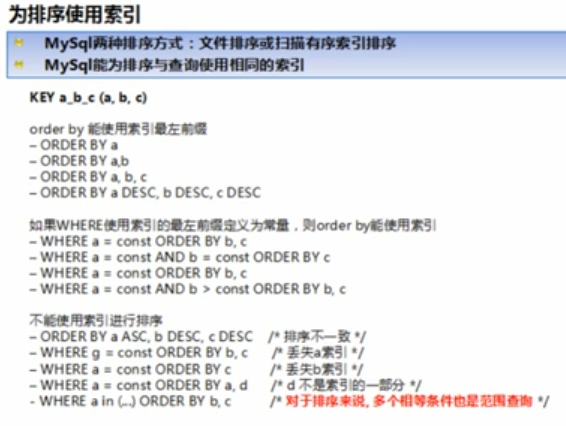
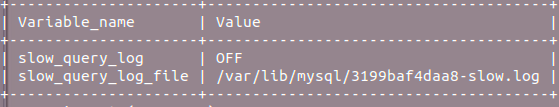
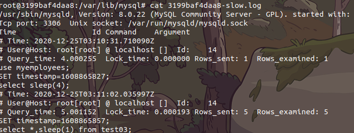
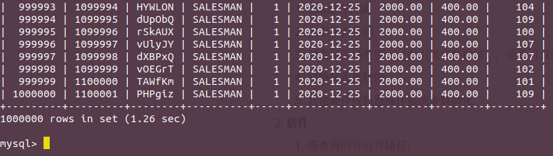
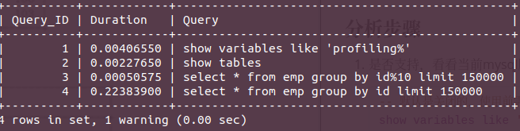
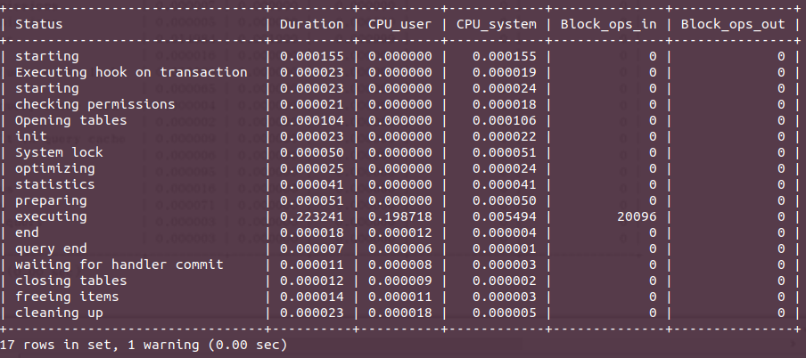
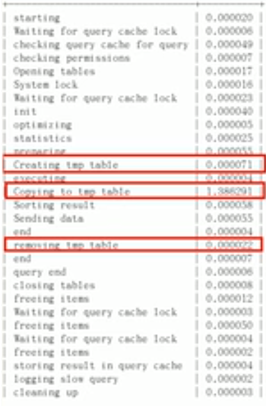

# 查询截取分析

## 整个比较完整的sql优化

1. 观察，至少跑1天，看看生产的慢SQL情况。
2. 开启慢查询日志，设置阀值，比如超过5秒中的就是慢SQL，并将它抓取出来。
3. explain+慢SQL分析原因
4. show profile
5. 运维经理  or  DBA，进行SQL数据库服务器的参数调优。


==总结==

1. 慢查询的开启并捕获；
2. explain+慢SQL分析；
3. show profile查询SQL在MySQL服务器里面的执行细节和生命周期情况；
4. SQL数据库服务器的参数调优。

## 查询优化

### 小表驱动大表

​	永远小表驱动大表，即小的数据集驱动大的数据集。

```sql
-- 原理RBO
select * from A where id in (select id from B);
-- 等价于
for select id from B
for select * from A where A.id =B.id
-- 当B表的数据集必须小于A表的数据集时，用in优于exists
select * from A where exists (select 1 from B where B.id = A.id)
-- 等价于
for select * from A
for select * from B where B.id = A.id
-- 当A表的数据集小于B表的数据集时，用exists优于in。
注意： A表和B表的id字段应建立索引。
```

口诀总结：当使用in的时候，小表在in里面，当使用exists的时候，小表在exists外面。

### order by关键字优化

​	MySQL支持两种方式的排序，FileSort和Index，Index效率高，它指MySQL扫描索引本身完成排序。FileSort方式效率较低。

```sql
-- index(age, birth)
-- using where;using index
explain select * from tblA where age>20 order by age;
-- using where;using index
explain select * from tblA where age>20 order by age,birth;
-- using where;using index;using filesort
explain select * from tblA where age>20 order by birth
-- using where;using index;using filesort
explain select * from tblA where age>20 order by birth,age;
-- Using index;Using file sort
explain select * from tblA order by birth;
-- Using where;Using index;Using fileSort
explain select * from tblA where birth='2016-01-28 00:00:00' order by birth;
-- using where;using index;
explian select * from tblA where birth>'2016-01-28 00:00:00' order by age;
-- using index;using filesort
explain select * from tblA order by age asc, birth desc;
-- Using where; Using index 相同顺序方向可以使用索引
explain select c1, c2 from test03 where c3 = 'a0' order by c1 desc, c2 desc;
-- Using where; Using index; Using filesort
explain select c1, c2 from test03 where c3 = 'a0' order by c1 asc, c2 desc;
```

- order by满足两种情况,会使用Index方式排序:
  1. order by语句使用索引最左前列。
  2. 使用where子句与order by子句条件列组合满足索引最左前列。
- 尽可能在索引列上完成排序操作，遵照索引建的最佳左前缀。
- 如果不在索引列上，filesort有两种算法：mysql就要启动双路排序和单路排序

**filesort优化:**

> 双路排序：MySQL4.1之前是使用双路排序，字面意思就是两次扫描磁盘，最终得到数据，读取行指针和orderby列，对他们进行排序，然后扫描已经排序好的列表，按照列表中的值重新从列表中读取对应的数据输出。从磁盘取排序字段，在buffer进行排序，再从磁盘取其他字段。
>
> 取一批数据，要对磁盘进行了两次扫描，众所周知，IO是很耗时的，所以在mysql4.1之后，出现了第二种排改进算法，就是单路排序。
>
> 单路排序：从磁盘读取查询需要的所有列，按照order by列在buffer对它们进行排序，然后扫描排序后的列表进行输出，它的效率更快一些，避免了第二次读取数据。并且把随机IO变成了顺序IO，但是它会使用更多的空间，因为它把每一行都保存在内存中路。

结论：由于单路算法是后出的，总体而言好过双路，但是单路在有种情况也有问题。

在sort_buffer中，方法B比方法A要多占用很多空间，因为方法B是把所有字段都取出，所以有可能取出的数据的总大小大于sort_buffer的容量，导致每次只能读取sort_buffer容量大小的数据，进行排序（创建tmp文件，多路合并），排序完再取sort_buffer容量大小，再排....从而多次IO。这种本来想省一次IO操作，返回导致了大量的IO操作，反而得不偿失。

**优化策略**：

- select * 是大忌，尽量不要这样写；
- 增大sort_buffer_size参数的设置；
- 增大max_length_for_sort_data参数的设置；



### group by关键字优化

- group by实质是先排序（所以order by的原则适用于group by）后进行分组，遵照索引建的最佳左前缀原则；
- 当无法使用索引列，增大max_length_for_sort_data参数+增大sort_buffer_size参数的设置;
- where高于having，能写在where限定的条件就不要去having限定了;

## 慢查询日志

### 是什么

​		MYSQL的慢查询日志是 MYSQL提供的一种日志记录,它用来记录在 MYSQL中响应时间超过阀值的语句,具体指运行时间超过**long_query_time**值的SQL,则会被记录到慢查询日志中。

​		具体指运行时间超过long_ query time值的SQL,则会被记录到慢查询日志中。 long query time的默认值为10,意思是运行10秒以上的语句。

​		由他来查看哪些SQL超出了我们的最大忍耐时间值,比如一条sq执行超过5秒钟,我们就算慢SQL,希望能收集超过5秒的sq,结合之前 explain进行全面分析。

### 怎么玩

**说明**

​		**默认情况下，MySQL数据库没有开启慢查询日志**，需要我们手动来设置这个参数。

​		当然，如果不是调优需要的话，一般不建议启动该参数，因为开启慢查询日志或多或少会带来一定的性能影响。慢查询日志支持将日志记录写入文件。

**查看是否开启及如何开启**

​		默认： show variables like '%slow_query_log%';



​		开启：set global slow_query_log=1; 开启了慢查询日志只对当前数据库生效，如果MySQL重启后则失效。

如何永久生效？

​		修改my.cnf文件[mysqld]下新增或修改参数slow_query_log和slow_query_log_file后，然后重启MySQL服务器，也即将如下两行配置进my.cnf文件。

```properties
slow_query_log=1
# 关于slow_query_log_file指定慢查询日志存放路径，系统默认为host_name-slow.log
slow_query_log_file=/var/lib/mysql/atguigu-slow.log
```

**那么开启了慢查询日志后，什么样的SQL才会记录到慢查询日志里面呢？**

这个由参数long_query_time控制，如果大于这个参数（不等于），就会记录下来，默认情况下long_query_time的值为10秒，命令：

```
SHOW VARIABLES LIKE 'long_query_time%';
```

可以使用命令修改，也可以在my.cnf参数里面修改。

```
set global long_query_time=3;
SHOW global VARIABLES LIKE 'long_query_time%';
```

**模拟慢查询**

```sql
-- 表示延迟4秒查询出
select sleep(4);
-- 这样写表示每一条记录都延迟0.1秒，如果有20条记录，那么久延迟2秒。
select *, sleep(0.1) from test03;
-- 查看系统慢sql数量  这个可以作为一个系统衡量指标
show global status like '%Slow_queries%';
```



**配置版本**

```properties
# 开启慢查询日志
slow_query_log=1
# 日志文件
slow_query_log_file=/var/lib/mysql/tc-slow.log
# 慢查询时间  下面设置的3秒
long_query_time=3
# 输出为文件形式
log_output=FILE
```

### 日志分析工具mysqldumpslow

​		在生产环境中，如果手工分析日志，查找、分析SQL，显然是个体力活，MySQL提供了日志分析工具mysqldumpslow。

查看mysqldumpsslow帮助信息

- s：是表示按照何种方式排序；
- c：访问次数
- l：锁定时间
- r：返回记录
- t：查询时间
- al： 平均锁定时间
- ar：平均返回记录数
- at：平均查询时间
- t：即为返回前面多少条的数据
- g：后边搭配一个正则匹配模式，大小写不敏感

```
root@3199baf4daa8:/var/lib/mysql# mysqldumpslow --help
Usage: mysqldumpslow [ OPTS... ] [ LOGS... ]

Parse and summarize the MySQL slow query log. Options are

  --verbose    verbose
  --debug      debug
  --help       write this text to standard output

  -v           verbose
  -d           debug

  -s ORDER     what to sort by (al, at, ar, c, l, r, t), 'at' is default
                al: average lock time
                ar: average rows sent
                at: average query time
                 c: count
                 l: lock time
                 r: rows sent
                 t: query time  
  -r           reverse the sort order (largest last instead of first)
  -t NUM       just show the top n queries
  -a           don't abstract all numbers to N and strings to 'S'
  -n NUM       abstract numbers with at least n digits within names
  -g PATTERN   grep: only consider stmts that include this string
  -h HOSTNAME  hostname of db server for *-slow.log filename (can be wildcard),
               default is '*', i.e. match all
  -i NAME      name of server instance (if using mysql.server startup script)
  -l           don't subtract lock time from total time
```

常用分析语：

```bash
# 得到返回记录集最多的10个SQL
mysqldumpslow -s r -t 10 /var/lib/mysql/atguigu-slow.log
# 得到访问次数最多的10个
mysqldumpslow -s c-t 10 /var/lib/mysql/atguigu-slow.log
# 得到按照时间排序的前10条里面含有左连接的查询语句
nysqldumpslow -s t -t 10 -g "left join" /var/ib/mysql/atguigu-slow.log
# 另外建议在使用这些命令时结合|和more使用,否则有可能出现爆屏情况
nysqldumpslow -s r -t 10 /var/lib/mysql/atguigu-slow.log | more
```

## 批量数据脚本

### **插入1000W数据**

​		造数据。

#### 建立表

```sql
create table dept(
    id int unsigned primary key auto_increment,
    deptno mediumint unsigned not null default 0,
    dname varchar(20) not null default '',
    loc varchar(13) not null default ''
) engine=innodb default charset=GBK;


create table emp(
    id int unsigned primary key auto_increment,
    empno mediumint unsigned not null default 0, -- 编号
    ename varchar(20) not null default '',
    job varchar(9) not null default '',
    mgr mediumint unsigned not null default 0,
    hiredate DATE NOT NULL ,
    sal DECIMAL(7, 2) NOT NULL,
    comm decimal(7, 2) NOT NULL,
    deptno mediumint unsigned not null default 0
)  engine=innodb default charset=GBK;

```

#### 设置参数

​	由于在这种短时间插入大量数据到mysql，mysql会报错，所以要做参数log_bin_trust_function_creators调整。

​	创建函数，假如报错：This function has none of DETERMINISTIC....，由于开启过慢查询日志，因为我们开启了bin-log，我们必须为我们的function指定一个参数

[网络文章参考](https://blog.csdn.net/topasstem8/article/details/8216740)

```mysql
show variables like 'log_bin_trust_function_creators';
set global log_bin_trust_function_creators=1;
```

  这样添加了参数以后，如果mysqld重启，上述参数有会消失，永久方法：

```properties
# my.cnf
log_bin_trust_function_creators=1
```

#### 创建函数

​	创建函数，保证每套数据都不同。

```mysql
-- 自定义结束符合
DELIMITER $$
-- 随机字符串
CREATE FUNCTION rand_string(n INT) RETURNS VARCHAR(255)
BEGIN
	DECLARE chars_str VARCHAR(100) DEFAULT 'abcdefghijklmnopqrstuvwxyzABCDEFGHIJKLMNOPQRSTUVWXYZ';
	DECLARE return_str VARCHAR(200) DEFAULT '';
	DECLARE i INT DEFAULT 0;
	WHILE i < n DO
		SET return_str = CONCAT(return_str, SUBSTRING(chars_str, FLOOR(1 + RAND() * 52), 1));
		SET i = i + 1;
	END WHILE;
	RETURN return_str;
END$$

-- test
select rand_string(10);


-- 用于随机产生部门编号
DELIMITER $$
CREATE FUNCTION  rand_num() RETURNS INT(5)
BEGIN
    DECLARE i INT default 0;
    set i = FLOOR(100 +rand()*10);
    return i;
end $$

--test
select rand_num();

# 删除
-- drop function rand_string;
-- drop function rand_num;
```

#### 创建存储过程

```mysql
DELIMITER $$
CREATE PROCEDURE insert_emp(IN start INT(10), IN max_num INT(10))
BEGIN
    DECLARE i INT DEFAULT 0;
    SET autocommit = 0;
    REPEAT
        SET i = i + 1;
        insert into emp(empno, ename, job, mgr, hiredate, sal, comm, deptno)
        value ((start+i), rand_string(6), 'SALESMAN', 0001, CURDATE(), 2000, 400, rand_num());
    until i = max_num  end repeat;
    COMMIT;
END $$
```

#### 调用存储过程

```mysql
DELIMITER;
call insert_emp(100001, 1000000);
-- 查询可以看出一共100万条数据
select * from emp;
```



## Show Profile

### 是什么

是mysql提供可以用来分析当前会话中语句执行的资源消耗情况，可以用于SQL的调优的测量。

官网文档：http://dev.mysql.com/doc/refman/5.5/en/show-profile.html

默认情况下，参数处于关闭状态，并保存最近15次的运行结果。

### 分析步骤

1. 是否支持，看看当前mysql版本是否支持；

   ```mysql
   -- 默认是关闭的，使用前需要开启
   show variables like 'profiling';
   -- or
   show variables like 'profiling%';
   ```

   开启功能，默认是关闭，使用前需要开启；

   ```mysql
   set profiling=on;
   ```

2. 运行SQL

3. 查看结果，show profiles;

   

4. 诊断SQL，show profile cpu, block io for query上一步前面的SQL数字号码；

   show profile cpu,block io for query 4;

   

   除了上面的cpu，block io外还有：

   - ALL 显示所有的开销信息
   - BLOCK IO 显示块IO相关开销
   - CONTEXT SWITCHES 上下文切换相关开销
   - CPU 显示CPU相关开销信息
   - IPC 显示发送和接收相关信息
   - MEMORY 显示内存相关呢开销信息
   - PAGE FAULTS 显示页面错误相关开销信息
   - SOURDE 显示和Source_function, Source_file, Source_line相关的开销信息。。
   - SWAPS 显示交换次数相关开销的信息

5. 日常开发需要注意的结论。

   - converting HEAP to MyISAM查询结果太大，内存都不够用了往磁盘上搬了。
   - Creating tmp table 创建临时表
     - 拷贝数据到临时表
     - 用完再删除
   - Copying to tmp table on disk把内存中临时表复制到磁盘，危险！！
   - locked

   

## 全局查询日志

​		开启后，系统将会记录你的所有的sql，记录在mysql库里的general_log表，可以使用下面命令查看： select * from mysql.general_log ;

>  永远不要再生产上开启这个功能。

### 配置

在mysql的my.cnf中，设置如下：

```properties
# 开启
general_log=1
# 记录日志文件的路径
general_log_file=/path/logfile
# 输出格式
log_output=FILE
```

### 编码

```mysql
set global general_log=1;
set global log_output='TABLE';
# 此后，你所编写的sql语句，将会记录到mysql库里的general_log表，可以用下面的命令查看
select * from mysql.general_log;
```

## 遇到mysql数据库使用慢怎么办？

1. **从硬件分析**
   1. cpu是否打满
   2. 内存是否打满
   3. 硬盘是否还有空间（索引以文件存储），是否可以使用固态。
   4. 网络是否比较慢
   5. 其他硬件或机器操作系统参数调优
2. **软件**
   1. 慢查询的开启并捕获；
   2. explain+慢SQL分析；
   3. show profile查询SQL在MySQL服务器里面的执行细节和生命周期情况；
   4. SQL数据库服务器的参数调优。