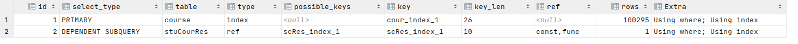
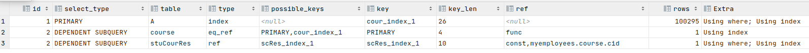

# mysql高级-sql写法优化


## 统计计数优化

count(1)、count(*)、sum(1)、count(列名)

- 除了count(列名)，其它都会统计NULL列
- 如果表没有主键，那么count(1)比count(*)快。如果有主键，count(\*)会自动优化到主键列上（快）。
- 如果只有一个字段，count(*)比count(1)快
- count(1)跟count(主键)一样，只扫描主键。count(*)跟count(非主键)一样，扫描整个表。明显前者更快一些。
- count(1)和count(*)基本没有差别，但在优化的时候尽量使用count(1)。


## in和not in优化

经过实战分析，发现in和not in并不会索引失效，但是网上说效率较低，所以不推荐使用。

- 使用inner join和left join进行优化

- 对于连续的数值，能用 between 就不要用 in 了：

  select id from t where num in(1,2,3)

  优解：select id from t where num between 1 and 3

小实战：

中文名   学生            课程            学生-课程关系
student(sid, sname, sex, age)
cource(cid,cname)
stuCourRes(sid,cid)

```sql
-- 表基础数据sql：
create table student(
    sid int unsigned primary key auto_increment,
    sname varchar(30) not null,
    sex varchar(1),
    age int
) engine=innodb default charset=GBK;

create table course(
    cid int unsigned primary key auto_increment,
    cname varchar(30) not null
) engine=innodb default charset=GBK;

create table stuCourRes(
    sid int,
    cid int
) engine=innodb default charset=GBK;

insert into student values (1,'aa','F',27),(2,'bb','M',20),(3,'cc','F',21),(4,'aa','F',29),(5,'aa','F',22);
insert into course values (1,'语文'),(2,'数学'),(3,'外语'),(4,'音乐');
insert into stuCourRes values (1, 1),(1, 2),(1, 3),(1, 4),(2, 1),(2, 2),(2, 4),(3, 2),(3, 4),(4, 1),(4, 5);

drop function if exists batchInsertStudent;
create function batchInsertStudent(num int) returns varchar(1)
begin
    declare i int;
    set i=100;
    set autocommit=0;
    while i<num+100 do
        insert into student values (i,concat('rnd',i),'F',27);
        set i=i+1;
    end while;
    commit;
    return '1';
end;

select batchInsertStudent(1000000);


drop function if exists batchInsertCourse;
create function batchInsertCourse(num int) returns varchar(1)
begin
    declare i int;
    set i=100;
    set autocommit=0;
    while i<num+100 do
        insert into course values (i,concat('rnd',i));
        set i=i+1;
    end while;
    commit;
    return '1';
end;

select batchInsertCourse(100000);


drop function if exists batchInsertSCRes;
create function batchInsertSCRes(num int) returns varchar(1)
begin
    declare i int;
    set i=100;
    set autocommit=0;
    while i<num+100 do
        insert into stuCourRes values (i, i);
        set i=i+1;
    end while;
    commit;
    return '1';
end;

select batchInsertSCRes(100000);

create index stu_index_1 on student(sid, sname, age);
create index cour_index_1 on course(cid, cname);
create index scRes_index_1 on stuCourRes(sid, cid);
```

查询某个学生选了那些课程？

```sql
-- 垃圾写法
explain
select cid, cname from course
where cid in (
    select cid from stuCourRes where stuCourRes.sid = 3
);
```



```sql
-- 优化写法1
explain
select course.cid, course.cname from course, stuCourRes
where course.cid = stuCourRes.cid and stuCourRes.sid = 3;
```


```sql
-- 优化写法2
explain
select course.cid, course.cname from course
inner join stuCourRes on course.cid = stuCourRes.cid and stuCourRes.sid = 3; -- 只限inner join可以把=3这个条件加这里。 left join和right join条件只对从表有效
```


查询某个学生没有选哪些课程？

```sql
-- 入门垃圾水平SQL
explain
select A.* from course A
where A.cid not in (select course.cid from course, stuCourRes where course.cid = stuCourRes.cid and stuCourRes.sid = 3);
```



```sql
-- 中等优化
explain
select A.* from course A
where not exists (select course.cid from course, stuCourRes where A.cid = course.cid and course.cid = stuCourRes.cid and stuCourRes.sid = 3);
-- 高级优化
explain
select A.* from course A
left join ( select course.cid from course join stuCourRes on course.cid = stuCourRes.cid where stuCourRes.sid = 3 ) as tmp
on A.cid=tmp.cid
where tmp.cid is null;

-- 另外注意永远小表驱动大表，即小的数据集驱动大的数据集。
```

## where字段进行函数操作，

```sql
这将导致引擎放弃使用索引而进行全表扫描。如：
select id from t where substring(name,1,3)='abc'   --name
select id from t where datediff(day,createdate,'2005-11-30')=0--‘2005-11-30’ 

生成的id 应改为:
select id from t where name like 'abc%'
select id from t where createdate>='2005-11-30' and createdate<'2005-12-1'
```

## like %开头

 select id from t where name like '%abc%' 或者

```sql
select id from t where name like '%abc' 或者
若要提高效率，可以考虑全文检索。
而select id from t where name like 'abc%' 才用到索引
```
## null值判断

null值判断会导致执行引擎放弃索引使用全表扫描。

解决办法：在表设计的时候，对字段赋值一个默认值。使用一个特殊的值，如0，-1作为默 认值，哪怕是‘’都可以。


[MySQL 调优 | OPTIMIZER_TRACE跟踪分析详解](https://www.imooc.com/article/308721/)