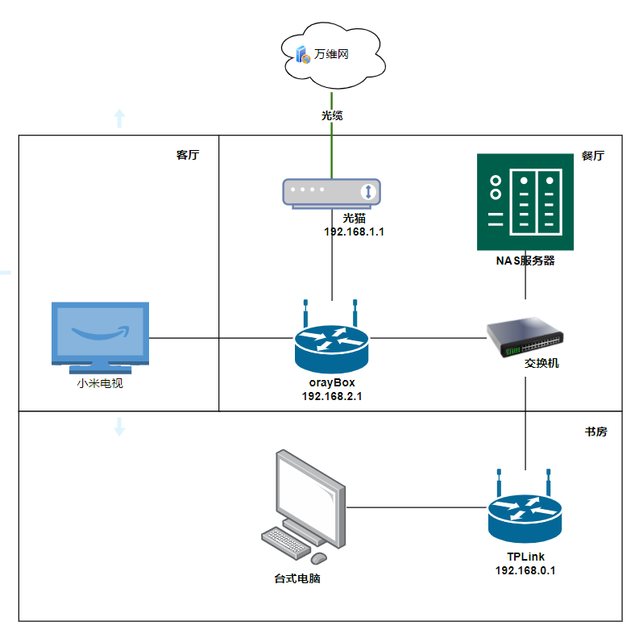
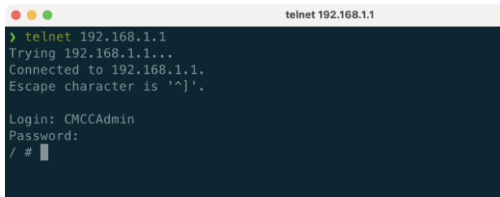
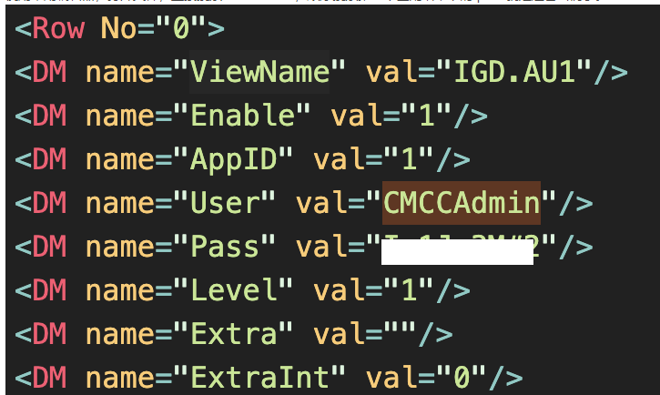
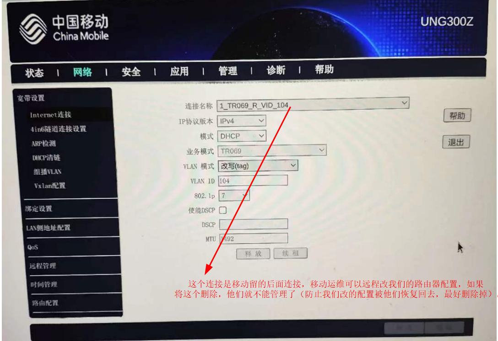
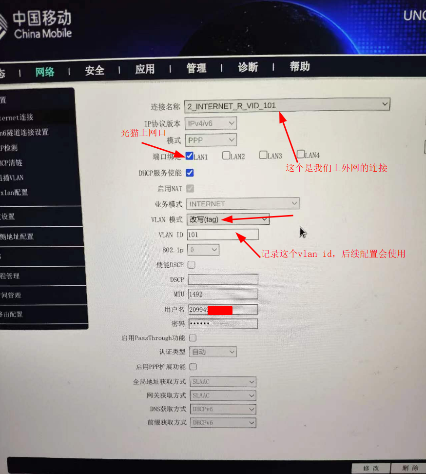
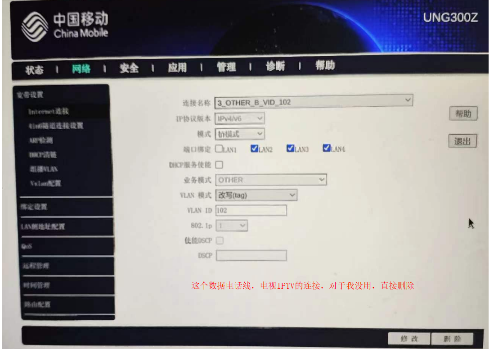

# 家庭网络

## 家庭网络改造

下图是我家有线设备的网络部署图：



  刚搬入新家后，选择的移动的宽带，移动的师傅很快就拿来了已经注册激活的光猫设备，将光缆和网线连接好，测试了下是否可以上网，几下就将宽带装好了，但是随着我不断的折腾家里面的设备后，发现有很多的弊端：

1. 移动基本申请不到公网ip，无法通过外网访问家中的设备。（只有通过目前正版群晖的quickconnect访问群晖官网应用或使用小米的米家助手访问家庭的小米设备，想多开放一些群晖应用和家庭设备也没办法）。
2. 一般运营商送的光猫性能不是很好，对于一般家庭使用的确完全够用，但是光猫除了负责光电转换，还自带拨号和路由功能，家庭网络设备多一层NAT地址转换，降低网络使用效率。
3. ipv6+DDNS方案，想要转发端口数据，要在很多个路由器上去配置。


## 移动光猫UNG300Z 超管破解

​	一般我们在光猫背面看到的用户名和密码只是一般用户和密码，能够使用和更改的配置有限（这个很容易理解，移动的运维人员怕你不懂，怕配置弄错了，又打电话去找他们，那可闹心了）。

1.在浏览器中输入

```
http://192.168.1.1/usr=CMCCAdmin&psw=aDm8H%25MdA&cmd=1&telnet.gch
```

返回 **TelnetSet Success** 表示开启成功

2.连接光猫
直接在你常用的终端中，输入 telnet 192.168.1.1 用户名 CMCCAdmin 密码 aDm8H%MdA
如密码正确，终端则会变成 / # 进入可操作状态。



3. 解密配置文件
   在终端中输入：

   ```bash
   sidbg 1 DB decry /userconfig/cfg/db_user_cfg.xml
   ```

   回车，配置文件完成解密，可在 /tmp/debug-decry-cfg 文件中找到解密的内容

4. 下载解密的文件
   准备一个FTP客户端，不管是系统自带的、Filezilla还是其他的都可以，先在终端中输入

   ```
   tcpsvd -vE 0.0.0.0 21 ftpd /
   ```

   并回车，开启FTP服务器。
   使用FTP客户端连接到光猫，地址 192.168.1.1，用户名密码为空，端口21。连接成功后可以按照上述的路径（即 /tmp/debug-decry-cfg）打开并下载该文件到本地。

5. 搜索密码
   使用常用编辑器，打开文件，直接搜索 CMCCAdmin，顺序搜索第一个匹配结果下的 pass 就是超管密码了。(另外这个文件还有很多其它用户的密码)

   

**提示**：<font color="red" size=7>**拿到超管密码后千万不要恢复出厂设置**</font>，机器是经过安装人员注册激活过的，如果恢复了出厂设置，只能打电话叫运营商运维人员来进行设备注册激活了。

## 移动光猫改桥接

网上的教程大同小异，都差不多

[移动光猫之桥接教程](https://zhuanlan.zhihu.com/p/398555628)

1.访问光猫管理页面

​	我的光猫管理页面地址是http://192.168.1.1（连接的时候要确保你的访问端和光猫在同一个网段）

2.使用超管密码登录

3.将现有的Internet连接都截屏或拍照记录下来，防止错误配置或今后恢复，然后全部删除。








然后新增INTERNET的桥接模式连接，参照之前的INTERNET填写桥接下的值。

[TODO:: 后面有空截张图吧]


## 路由器完成PPPOE上网


网上好多没有说一个点，移动的宽带应该将宽带账号和光猫的MAC地址进行了绑定，所以在使用路由器拨号功能的时候，路由器一定要克隆光猫的MAC地址进行播放（卡这步卡了好久，原因原来是这里的问题）；

**完成网络改造后，明细感觉网速提升了!**
