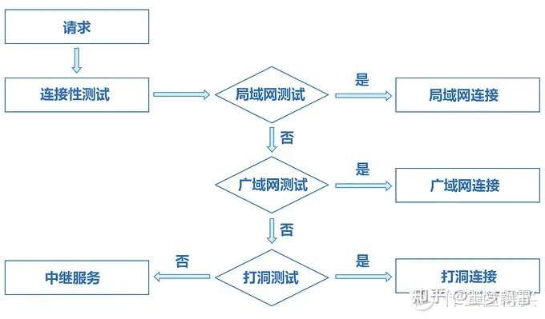

# 家庭网络

  这篇文章不错：[移动宽带配置IPV6环境，通过外网访问群晖NAS](https://zhuanlan.zhihu.com/p/402639062)

 测试你的网络目前是否支持ipv6， [测试](https://www.test-ipv6.com/)

## 内网穿透

原文：[地址](https://www.zhihu.com/question/507754447)

一般情况，我们家中的NAS处于局域网内，是无法从外网直接访问的，局域网内的设备互相连接的方式都是直连。

如果我们想让家中局域网内的NAS可以在外网访问，此时就需要穿透局域内网。

百度知道对内网穿透的解释是：

> 内网穿透，也即 NAT 穿透，进行 NAT 穿透是为了使具有某一个特定源 IP 地址和源端口号的数据包不被 NAT 设备屏蔽而正确路由到内网主机。

在网络时代发展初期，[ipv4](https://www.zhihu.com/search?q=ipv4&search_source=Entity&hybrid_search_source=Entity&hybrid_search_extra={"sourceType"%3A"answer"%2C"sourceId"%3A2285872457})的地址是32位的，就是我们经常看到的[http://xxx.xxx.xxx.xxx](https://link.zhihu.com/?target=http%3A//xxx.xxx.xxx.xxx)。随着全球[网络设备](https://link.zhihu.com/?target=https%3A//www.smzdm.com/fenlei/wangluoshebei/)数量不停增长，32位的ip地址很快就要不够用了，

后来者被逼无奈只能N多人共用一个IP，这个技术就是NAT。

NAT确实在大多数应用场景下，缓解了IP不足的问题，因为大多数时候，都是我们访问网站，只要网站[服务器](https://link.zhihu.com/?target=https%3A//www.smzdm.com/fenlei/fuwuqi/)有公网IP，就可以了。

但是，NAT的最大缺点就是造成两个NAT后面的设备不能直接互访。若想访问，有两套方案，一是中继转发，二是握手打洞。

通过中转服务器转发数据是100%成功的，但是在这个过程中需要使用中转服务器的带宽，而服务器带宽一般很贵。

打洞方案的原理是，借助一台公网服务器牵线搭桥，让两个NAT后的设备，能够互相知晓对方的存在（即为“握手”），并在NAT中留下记录，从而使两者能够直接通讯，不走转发，成本低很多。。


基于转发和打洞技术的内网穿透的方案有很多，下面依次介绍5种我在自家群晖NAS上使用过的方法。


1. **QuickConnect**

  QuickConnect是群晖公司开发的黑科技，使得连接群晖NAS服务器变得方便快捷。

  无论家中宽带有没有公网IP，也无论你的路由器有没有做端口转发，只需要通过简单的设置，它就能使得用户在外网可以轻松访问家中的NAS。

  QuickConnect进行内网穿透的逻辑简单来说是这样的：它首先通过QuickConnect服务器上注册的网络地址，若客户端与NAS之间位于同一局域网内，则提供直连服务；无法直连的情况下，根据群晖NAS所处的网络环境来测试是否适合打洞；如之前所述方法都不可访问到NAS的话最后将会提供中继服务。

  

  总体来说，QuickConnect作为群晖官方的亲儿子，是正版NAS使用过程中必备的功能，可靠性是很高的。

  其缺点在于，群晖的官方服务器位于中国台湾，大陆用户在使用的过程中偶尔有不稳定、连接不上服务器的情况（不过这个问题我倒是还没遇到过）。同时如果QuickConnect运行在中继转发的模式下，因为数据的传输都要途径位于中国台湾的服务器，所以速度可能会慢一些（有时会在几百KB/s的样子）。

2. **群晖自带的DDNS**

   群晖的正版NAS用户（包括洗白的）在家中宽带有公网ip的情况下，可以使用群晖自带的[http://synology.me](https://link.zhihu.com/?target=http%3A//synology.me) DDNS来进行映射，无论家中公网ip怎么变化，只需要访问“*.synology.me”的域名就可以登陆自己的NAS。现在电信、联通和移动三大宽带运营商都普及了ipv6地址，不过只有电信和联通可以提供免费的ipv4公网ip。

3. 其它参考这里 [地址](https://www.zhihu.com/question/507754447)


## 家庭网络改造

下图是我家有线设备的网络部署图：


  刚搬入新家后，选择的移动的宽带，移动的师傅很快就拿来了已经注册激活的光猫设备，将光缆和网线连接好，测试了下是否可以上网，几下就将宽带装好了，但是随着我不断的折腾家里面的设备后，发现有很多的弊端：

1. 移动基本申请不到公网ip，无法通过外网访问家中的设备。（只有通过目前正版群晖的quickconnect访问群晖官网应用或使用小米的米家助手访问家庭的小米设备，想多开放一些群晖应用和家庭设备也没办法）。
2. 一般运营商送的光猫性能不是很好，对于一般家庭使用的确完全够用，但是光猫除了负责光电转换，还自带拨号和路由功能，家庭网络设备多一层NAT地址转换，降低网络使用效率。
3. ipv6+DDNS方案，想要转发端口数据，要在很多个路由器上去配置。


## 移动光猫UNG300Z 超管破解

​	一般我们在光猫背面看到的用户名和密码只是一般用户和密码，能够使用和更改的配置有限（这个很容易理解，移动的运维人员怕你不懂，怕配置弄错了，又打电话去找他们，那可闹心了）。

1.在浏览器中输入

```
http://192.168.1.1/usr=CMCCAdmin&psw=aDm8H%25MdA&cmd=1&telnet.gch
```

返回 **TelnetSet Success** 表示开启成功

2.连接光猫
直接在你常用的终端中，输入 telnet 192.168.1.1 用户名 CMCCAdmin 密码 aDm8H%MdA
如密码正确，终端则会变成 / # 进入可操作状态。


3. 解密配置文件
   在终端中输入：

   ```bash
   sidbg 1 DB decry /userconfig/cfg/db_user_cfg.xml
   ```

   回车，配置文件完成解密，可在 /tmp/debug-decry-cfg 文件中找到解密的内容

4. 下载解密的文件
   准备一个FTP客户端，不管是系统自带的、Filezilla还是其他的都可以，先在终端中输入

   ```
   tcpsvd -vE 0.0.0.0 21 ftpd /
   ```

   并回车，开启FTP服务器。
   使用FTP客户端连接到光猫，地址 192.168.1.1，用户名密码为空，端口21。连接成功后可以按照上述的路径（即 /tmp/debug-decry-cfg）打开并下载该文件到本地。

5. 搜索密码
   使用常用编辑器，打开文件，直接搜索 CMCCAdmin，顺序搜索第一个匹配结果下的 pass 就是超管密码了。(另外这个文件还有很多其它用户的密码)

   

**提示**：<font color="red" size=7>**拿到超管密码后千万不要恢复出厂设置**</font>，机器是经过安装人员注册激活过的，如果恢复了出厂设置，只能打电话叫运营商运维人员来进行设备注册激活了。

## 移动光猫改桥接

网上的教程大同小异，都差不多

[移动光猫之桥接教程](https://zhuanlan.zhihu.com/p/398555628)

1.访问光猫管理页面

​	我的光猫管理页面地址是http://192.168.1.1（连接的时候要确保你的访问端和光猫在同一个网段）

2.使用超管密码登录

3.将现有的Internet连接都截屏或拍照记录下来，防止错误配置或今后恢复，然后全部删除。


提示：下面这个配置中，宽带密码可以在浏览器控制台将type="password"去掉，可以看到宽带密码（另外也可以打电话给运营商索要密码）。


然后新增INTERNET的桥接模式连接，参照之前的INTERNET填写桥接下的值。

[TODO:: 后面有空截张图吧]


## 路由器完成PPPOE上网


网上好多没有说一个点，移动的宽带应该将宽带账号和光猫的MAC地址进行了绑定，所以在使用路由器拨号功能的时候，路由器一定要克隆光猫的MAC地址进行播放（卡这步卡了好久，原因原来是这里的问题）；

**完成网络改造后，明细感觉网速提升了!**


