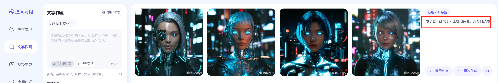

# 前期准备工作

## 创建账号

1. 选好赛道

2. 弄一个好的，专业的头像，和赛道相关的

   这里我使用的通义万相 https://tongyi.aliyun.com/ 帮我绘制的一个头像

   

3. 起一个不错的用户名

   ​		---》新技术革命

4. 开通相关创作者收益（粉丝大于5）

​		今日头条手机APP：我的-》创作中心-》创作权益， 将看见的内容能打开就打开；

