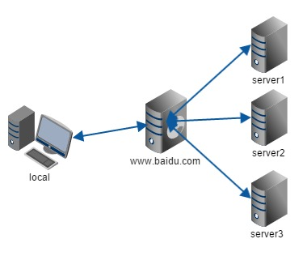

# 基本概念

#### 1、什么是NGINX

​	Nginx ("engine x")是一个**高性能**的**HTTP和反向代理**服务器，特点是占有**内存少，并发能力强**，事实上nginx的并发能力确实在同类型的网页服务器中表现较好。
 	Nginx专为性能优化而开发，性能是其最重要的考量，实现上非常注重效率，能经受高负载
的考验，有报告表明能支持高达50000（5万）个并发连接数。

#### **2、反向代理**

**a. 正向代理**

​	在客**户端（浏览器）配置代理服务器**，通过代理服务器进行互联网访问。
​	Nginx不仅可以做反向代理，实现负载均衡。还能用作正向代理来进行上网等功能。正向代理：如果把局域网外的 Internet想象成一个巨大的资源库，则局域网中的客户端要访问 Internet，则需要通过代理服务器来访问，这种代理服务就称为正向代理。

**b. 反向代理**
	反向代理，其实**客户端对代理是无感知的**，因为**客户端不需要任何配置**就可以访问，我们只
需要将请求发送到反向代理服务器，由反向代理服务器去选择目标服务器获取数据后，在返
回给客户端，此时反向代理服务器和目标服务器对外就是一个服务器，暴露的是代理服务器
地址，隐藏了真实服务器IP地址。

#### 3、负载均衡

​		单个服务器解决不了，我们增加服务器的数量，然后将请求分发到各个服务器上，将原先
请求集中到单个服务器上的情况改为将请求分发到多个服务器上，将负载分发到不同的服
务器，也就是我们所说的负载均衡。

#### 4、动静分离

为了加快网站的解析速度，可以把动态页面和静态页面由不同的服务器来解析，加快解析速
度。降低原来单个服务器的压力。

