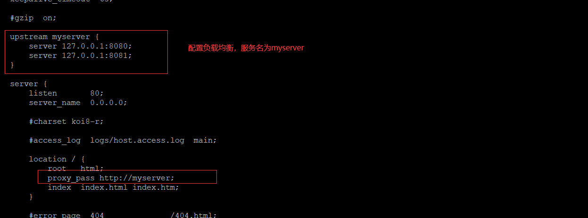

# 负载均衡

[nginx做负载均衡](https://www.cnblogs.com/xiugeng/p/10155283.html#_label0_2)

**1、实现效果**

> (1) 浏览器地址栏输入地址http://192.168.xxx.xxx/edu/index.html, 负载均衡效果，平均到8080
> 和8081端口中，

**2、准备工作**

> (1) 准备两台tomcat服务器，一 台8080， 一台8081
>
> (2) 在两台tomcat里面webapps目录中，创建名称是edu文件夹，在edu文件夹中创建
> 页面index.html,用于测试。

**3、在nginx的配置文件中进行负载均衡的配置**



**4、效果**

 

#### 负载分配策略

在linux下有Nginx、LVS、 Haproxy 等等服务可以提供负载均衡服务，而且Nginx提供了几种分配方式(策略):。

- **1、轮询(默认)**

  每个请求按时间顺序逐一分配到不 同的后端服务器，如果后端服务器down掉，能自动剔除

- **2、weight**
  weight代表权重默认为1,权重越高被分配的客户端越多。
  指定轮询几率，weight和访问比率成正比，用于后端服务器性能不均的情况。例如: 。

- **3、ip hash**

  每个请求按访问ip的hash结果分配, 这样每个访客固定访问一个后端服务器,可以解诀session的问题。例如:

  ```nginx
  upstream server pool{
    ip_ hash
    server 192.168.5.21:80
    server 192.168.5.22:80
  }
  ```

- **4、fair (第三方)**
  按后端服务器的响应时间来分配请求，响应时间短的优先分配

  ```nginx
  upstream server_pool 
  	server 192.168.5.21:80;
  	server 192.168.5.22:80;
  	fair;
  }
  ```