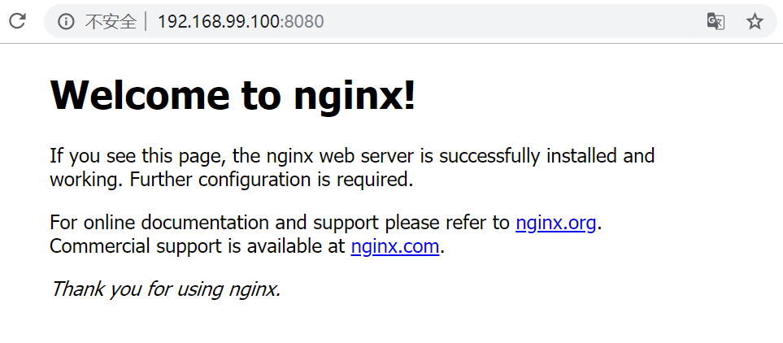

# nginx安装、常用命令和配置文件

nginx下载地址：[入口](http://nginx.org/en/download.html)

下面介绍两种方式安装linux：一种是直接下载安装，第二种是使用docker下载官方镜像进行安装。

## centos编译安装

**1. 使用远程连接工具连接Centos7操作系统**
**2. 安装nginx相关依赖**

```
gcc
pcre
openssl
zlib
```

① 安装 nginx 需要先将官网下载的源码进行编译，编译依赖 gcc 环境，如果没有 gcc 环境，则需要安装：

```shell
$ yum install gcc-c++
```

② PCRE(Perl Compatible Regular Expressions) 是一个Perl库，包括 perl 兼容的正则表达式库。nginx 的 http 模块使用 pcre 来解析正则表达式，所以需要在 linux 上安装 pcre 库，pcre-devel 是使用 pcre 开发的一个二次开发库。nginx也需要此库。命令：

```shell
$ yum install -y pcre pcre-devel
```

③ zlib 库提供了很多种压缩和解压缩的方式， nginx 使用 zlib 对 http 包的内容进行 gzip ，所以需要在 Centos 上安装 zlib 库。

```shell
$ yum install -y zlib zlib-devel
```

④ OpenSSL 是一个强大的安全套接字层密码库，囊括主要的密码算法、常用的密钥和证书封装管理功能及 SSL 协议，并提供丰富的应用程序供测试或其它目的使用。
nginx 不仅支持 http 协议，还支持 https（即在ssl协议上传输http），所以需要在 Centos 安装 OpenSSL 库。

```shell
$ yum install -y openssl openssl-devel
```

① 下载nginx，两种方式

> a. 直接下载`.tar.gz`安装包，地址：https://nginx.org/en/download.html
>
> b. **使用`wget`命令下载（推荐）**。确保系统已经安装了wget，如果没有安装，执行 yum install wget 安装。

```shell
$ wget -c https://nginx.org/download/nginx-1.19.0.tar.gz
```

② 依然是直接命令：

```shell
$ tar -zxvf nginx-1.19.0.tar.gz
$ cd nginx-1.19.0
```

③ 配置：

其实在 nginx-1.12.0 版本中你就不需要去配置相关东西，默认就可以了。当然，如果你要自己配置目录也是可以的。
1.使用默认配置

```shell
$ ./configure
```

2.自定义配置（不推荐）

```shell
$ ./configure \
--prefix=/usr/local/nginx \
--conf-path=/usr/local/nginx/conf/nginx.conf \
--pid-path=/usr/local/nginx/conf/nginx.pid \
--lock-path=/var/lock/nginx.lock \
--error-log-path=/var/log/nginx/error.log \
--http-log-path=/var/log/nginx/access.log \
--with-http_gzip_static_module \
--http-client-body-temp-path=/var/temp/nginx/client \
--http-proxy-temp-path=/var/temp/nginx/proxy \
--http-fastcgi-temp-path=/var/temp/nginx/fastcgi \
--http-uwsgi-temp-path=/var/temp/nginx/uwsgi \
--http-scgi-temp-path=/var/temp/nginx/scgi
```

> 注：将临时文件目录指定为/var/temp/nginx，需要在/var下创建temp及nginx目录

④ 编辑安装

```shell
$ make && make install
```

查看版本号(`使用nginx操作命令前提条件:必须进入nginx的目录/usr/local/nginx/sbin`.)

```shell
$ ./nginx -v
```

查找安装路径：

```shell
$ whereis nginx
```

⑤ 启动，停止nginx

```shell
$ cd /usr/local/nginx/sbin/
$ ./nginx 
$ ./nginx -s stop
$ ./nginx -s quit
$ ./nginx -s reload
```

查询nginx进程：

```shell
$ ps aux|grep nginx
```

## linux直接安装

```bash
# 安装依赖
# PCRE
sudo apt-get install libpcre3 libpcre3-dev
pcre-config --version
# zlib
sudo apt-get install zlib1g-dev
cat /usr/local/lib/pkgconfig/zlib.pc
# OpenSSL
sudo apt-get install openssl libssl-dev 
openssl version

# 下载安装nginx
wget http://nginx.org/download/nginx-1.19.8.tar.gz
tar -zxvf nginx-1.19.8.tar.gz
cd nginx-1.19.8
./configure
make
make install
#    ==>此时安装目录下会生成几个文件夹
#    ==>conf    Nginx运行环境配置文件
#    ==>html    Nginx中的页面
#    ==>logs    Nginx打印的日志
#    ==>sbin    Nginx可执行文件，包括启动Nginx等
```

**配置防火墙规则，让能使用80端口：**

```bash
# 查看开放的端口号
firewall-cmd --list-all
# 设置开放的端口号
firewall-cmd --add-service=http --permanent
sudo firewall-cmd --add-port=80/tcp --permanent
# 重启防火墙（使生效）
firewall-cmd --reload
```

## docker安装nginx

```bash
sudo docker pull nginx:latest
sudo docker images nginx:latest
docker run --name nginx-test -p 8080:80 -d nginx
# 参数说明：
#
#    --name nginx-test：容器名称。
#    -p 8080:80： 端口进行映射，将本地 8080 端口映射到容器内部的 80 端口。
#    -d： 设置容器在在后台一直运行。
#    nginx: 镜像名称
```

启动成功效果图：



```shell
# 进入容器
sudo docker exec -it nginx-test bash
# nginx命令路径
which nginx
# /usr/sbin/nginx
# nginx配置文件路径
cd /etc/nginx
```

## nginx操作的常用命令

```shell
# 查看nginx命令如何使用
nginx -h
```

> nginx version: nginx/1.19.6
> Usage: nginx [-?hvVtTq] [-s signal] [-p prefix]
>              [-e filename] [-c filename] [-g directives]
>
> Options:
>   -?，-h         : this help
>   -v            : show version and exit
>   -V            : show version and configure options then exit
>   -t            : test configuration and exit
>   -T            : test configuration， dump it and exit
>   -q            : suppress non-error messages during configuration testing
>   -s signal     : send signal to a master process: **stop， quit， reopen， reload**
>   -p prefix     : set prefix path (default: /etc/nginx/)
>   -e filename   : set error log file (default: /var/log/nginx/error.log)
>   -c filename   : set configuration file (default: /etc/nginx/nginx.conf)
>   -g directives : set global directives out of configuration file

```shell
# 查看版本号
./nginx -v
# 启动
./nginx
# 关闭
./nginx -s stop
# 重新加载nginx  不需要重启，重启加载配置文件改动，以及静态资源文件。
./nginx -s reload
```

## nginx.conf配置文件

```nginx
user  nginx;
worker_processes  1;

error_log  /var/log/nginx/error.log warn;
pid        /var/run/nginx.pid;


events {
    worker_connections  1024;
}


http {
    include       /etc/nginx/mime.types;
    default_type  application/octet-stream;

    log_format  main  '$remote_addr - $remote_user [$time_local] "$request" '
                      '$status $body_bytes_sent "$http_referer" '
                      '"$http_user_agent" "$http_x_forwarded_for"';

    access_log  /var/log/nginx/access.log  main;

    sendfile        on;
    #tcp_nopush     on;

    keepalive_timeout  65;

    #gzip  on;

    include /etc/nginx/conf.d/*.conf;  # server部分在这里面/etc/nginx/conf.d/default.conf
}
```

/etc/nginx/default.conf

```bash
server {
    listen       80;
    listen  [::]:80;
    server_name  localhost;

    #charset koi8-r;
    #access_log  /var/log/nginx/host.access.log  main;

    location / {
        root   /usr/share/nginx/html;
        index  index.html index.htm;
    }

    #error_page  404              /404.html;

    # redirect server error pages to the static page /50x.html
    #
    error_page   500 502 503 504  /50x.html;
    location = /50x.html {
        root   /usr/share/nginx/html;
    }

    # proxy the PHP scripts to Apache listening on 127.0.0.1:80
    #
    #location ~ \.php$ {
    #    proxy_pass   http://127.0.0.1;
    #}

    # pass the PHP scripts to FastCGI server listening on 127.0.0.1:9000
    #
    #location ~ \.php$ {
    #    root           html;
    #    fastcgi_pass   127.0.0.1:9000;
    #    fastcgi_index  index.php;
    #    fastcgi_param  SCRIPT_FILENAME  /scripts$fastcgi_script_name;
    #    include        fastcgi_params;
    #}

    # deny access to .htaccess files， if Apache's document root
    # concurs with nginx's one
    #
    #location ~ /\.ht {
    #    deny  all;
    #}
}
```


### 第一部分：全局块

​	**从配置文件开始到 events块之间的内容，主要会设置一些影响nginx服务器整体运行的配置指令**，主要包括配置运行 Nginx服务器的用户(组)、允许生成的 worker process数，进程PID存放路径、日志存放路径和类型以及配置文件的引入等。

比如上面第一行配置的:

```
worker_processes  1;
```

​		这是Nginx服务器并发处理器的关键配置，workder_processes值越大，可以支持的并发量越多，但是受到硬件、软件等设备的制约。

### 第二部分：events块

​	**events块涉及的指令主要影响 Nginx务器与用户的网络连接**，常用的设置包括是否开启对多 work prrocess下的网络连接进行序列化，是否允许同时接收多个网络连接，选取哪种事件驱动模型来处理连接请求，每个wordprocess可以同时支持的最大连接数等。

上述例子就表示每个 work process支持的最大连接数为1024。

这部分的配置对 Nginx的性能影响较大，在实际中应该灵活配。

### 第三部分：http块

​	 这算是Nginx服务器配置中**修改最频繁的部分**，代理、缓存和日志定义等绝大数功能和第三方模块的配置都在这里。需要注意的是：http块也可以包括**http全局块、server块**。

1. http全局块

   http全局快配置的指令包括文件引入、MIME-TYPE定义、日志定义、连接超时时间、单链接请求数上限等。

2. server块

   这块和虚拟主机有密切关系，虚拟主机从用户角度看，和一台独立的硬件主机是完全一样的，该技术的产生是为了节省互联网服务器硬件成本。

   每个http块可以包括多个 server块，而每个 server块就相当于一个虚拟主机。

   而每个 server块也分为全局 server块，以及可以同时包含多个 locaton块。

   1. 全局 server块

      最常见的配置是本虚拟机主机的监听配置和本虚拟主机的名称或IP配置

   2. location块

      一个 server块可以配置多个 location块。

      这块的主要作用是基于Nqimⅸ服务器接收到的请求字符串(例如 server_name/uri-string)，对虚以主机名称(也可以是IP别名)之外的字符串(例如前面的 /uri- string )进行匹配，对特定的请求进行处理。地址定向、数据缓存和应答控制等功能，还有许多第三方模块的配置也在这里进行。