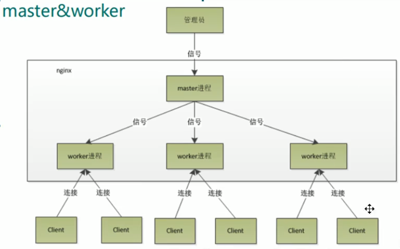
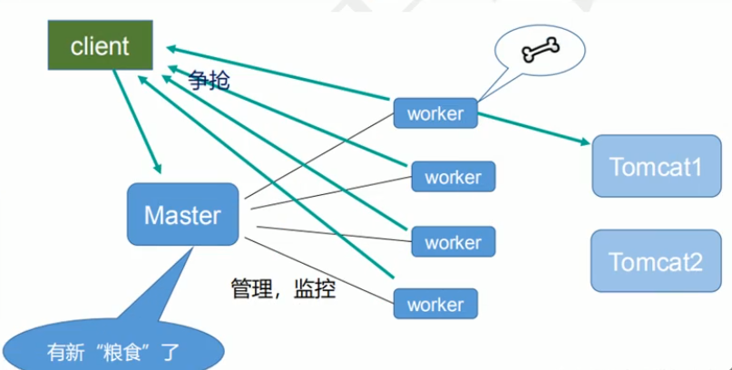

# nginx原理

**1、master和worker**



**2、worker如何进行工作的**



**3、一个master和多个woker的好处**
(1) 可以使用nginx -s reload热部署。

```
首先，对于每个worker进程来说，独立的进程，不需要加锁，所以省掉了锁带来的开销，
同时在编程以及问题查找时，也会方便很多。其次,采用独立的进程，可以让互相之间不会
影响，一个进程退出后，其它进程还在工作，服务不会中断，master进程则很快启动新的
worker进程。当然，worker进程的异常退出，肯定是程序有bug了，异常退出，会导致当
前worker.上的所有请求失败，不过不会影响到所有请求，所以降低了风险。
```

**4、设置多少个woker合适**

```
Nginx同redis类似都采用了io多路复用机制，每个worker都是一个独立的进程， 但每个进
程里只有一个主线程，通过异步非阻塞的方式来处理请求，即使是 千上万个请求也不在话
下。每个worker的线程可以把一个cpu的性能发挥到极致。所以worker数和服务器的cpu
数相等是最为适宜的。设少了会浪费cpu,设多了会造成cpu频繁切换上下文带来的损耗。
# 设置worker数量
worker.processes 4 

# work绑定cpu(4work绑定4cpu)
worker_cpu_affinity 0001 0010 0100 1000

# work绑定cpu (4work绑定8cpu中的4个)
worker_cpu_affinity 0000001 00000010 00000100 00001000
```

**5、连接数worker_ connection**

```
这个值是表示每个worker进程所能建立连接的最大值，所以，一个nginx 能建立的最大连接数，应该是worker.connections * worker processes。当然，这里说的是最大连接数，对于HTTP 请求本地资源来说，能够支持的最大并发数量是worker.connections * worker processes,如果是支持http1.1的浏览器每次访问要占两个连接，所以普通的静态访问最大并发数是: worker.connections * worker.processes / 2, 而如果是HTTP作为反向代理来说，最大并发数量应该是worker.connections * worker_proceses/4. 因为作为反向代理服务器，每个并发会建立与客户端的连接和与后端服务的连接，会占用两个连接.
```

> 第一个: 发送请求，占用了woker的几个连接数?
> 答案: 2或者4个。
>
> 第二个: nginx有一个master,有四个woker,每个woker支持最大的连接数1024,支持的最大并发数是多少?
> 答案：普通的静态访问最大并发数是: worker connections * worker processes /2，
> 而如果是HTTP作为反向代理来说，最大并发数量应该是worker connections * worker processes/4