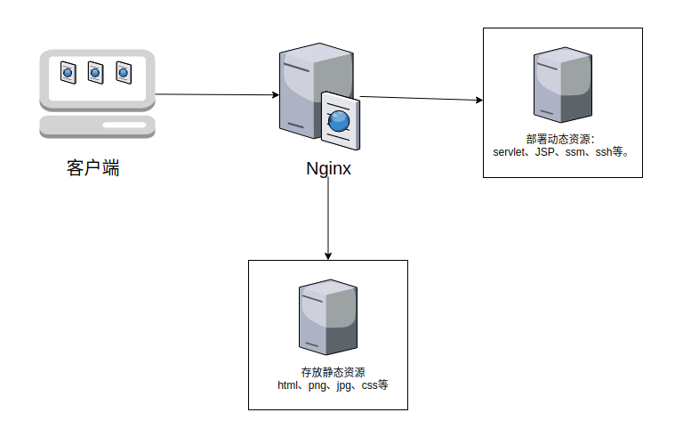

# 动静分离

## 1、概述

动态请求发往静态服务器（nginx可以作为静态服务器），动态请求发往动态服务器。



​		通过location指定不同的后缀名实现不同的请求转发。通过expires参数设置，可以使浏览器缓存过期时间，减少与服务器之前的请求和流量。具体Expires定义: 是给一个资源
设定一个过期时间，也就是说无需去服务端验证，直接通过浏览器自身确认是否过期即可，
所以不会产生额外的流量。此种方法非常适合不经常变动的资源。(如果经常更新的文件，
不建议使用Expires来缓存)，如果设置3d, 表示在这3天之内访问这个URL, 发送一
个请求，比对服务器该文件最后更新时间没有变化，则不会从服务器抓取，返回状态码304,
如果有修改，则直接从服务器重新下载，返回状态码200。。

## 2、准备工作

> (1) 在liunx系统中准备静态资源，用于进行访问
>
> /data/image 图片文件夹
>
> /data/www html文件夹

## 3、具体配置

> (1) 在nginx配置文件中进行配置


## 4、实际测试

```
http://192.168.1.112/www/index.html
http://192.168.1.112/image/1.jpg
```


上图是因为`autoindex on`这个设置生效的