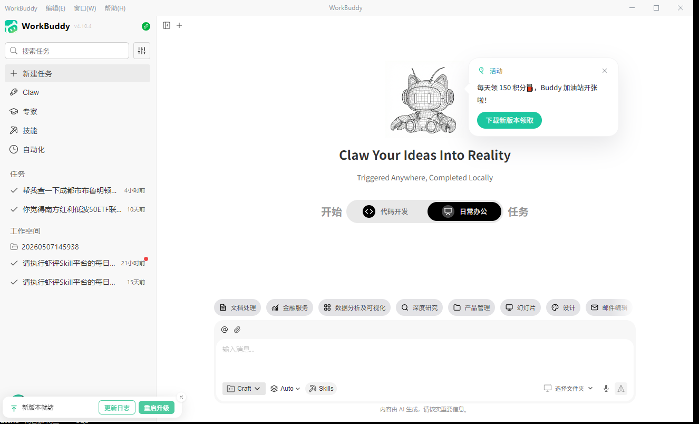

# WorkBuddy

## 安装

去腾讯WorkBuddy官网去下载：[下载地址](https://copilot.tencent.com/work/)，下载后直接运行安装即可。

## 认识界面

<video src="https://acc-1258344699.cos.accelerate.myqcloud.com/web/website/0dfab9e6a1a64937e8a6bb2a711d5f8dc9646d79/assets/expert-team-intro-BMXwQbuo.mp4">

## 养龙虾经验

1. 将龙虾当下属一样看待，将你让它做的事情要事无巨细的告诉它，这样它才能更懂你；
2. 当养出的龙虾或Skill不符合要求的时候，要时刻和它进行沟通直到正确为止，并要求它将正确做法固化下来；
3. 有时候防止龙虾跑偏，可以让它先出做事的计划，你确认没有问题后再执行；
4. 写提示词技巧，尽可能的让龙虾自己去写提示词，你只引导它然后做确认就可以了，这样的结果通常又快又好；
5. 如果发现龙虾执行的时候没有完全按照你写的提示词流程去执行，你引导它做正确后，你可以告诉它，“为了防止下次执行跑偏，请你调整SKILL提示词，方便你下次识别更准确”；
6. 如果要调用服务接口，最好的方式是固化成固定的脚步去做，这样龙虾去做事情的成功概率会大大提升，否则他会现场去写脚本去做这个事情，不行它又换来换去的，要整很久才成功。你告诉它将次接口用python脚本封装下来，作为SKILL的能力提供，脚本需要其它内容加工都可以给它说，这样可以加大成功概率，同时也能减少token消耗；

