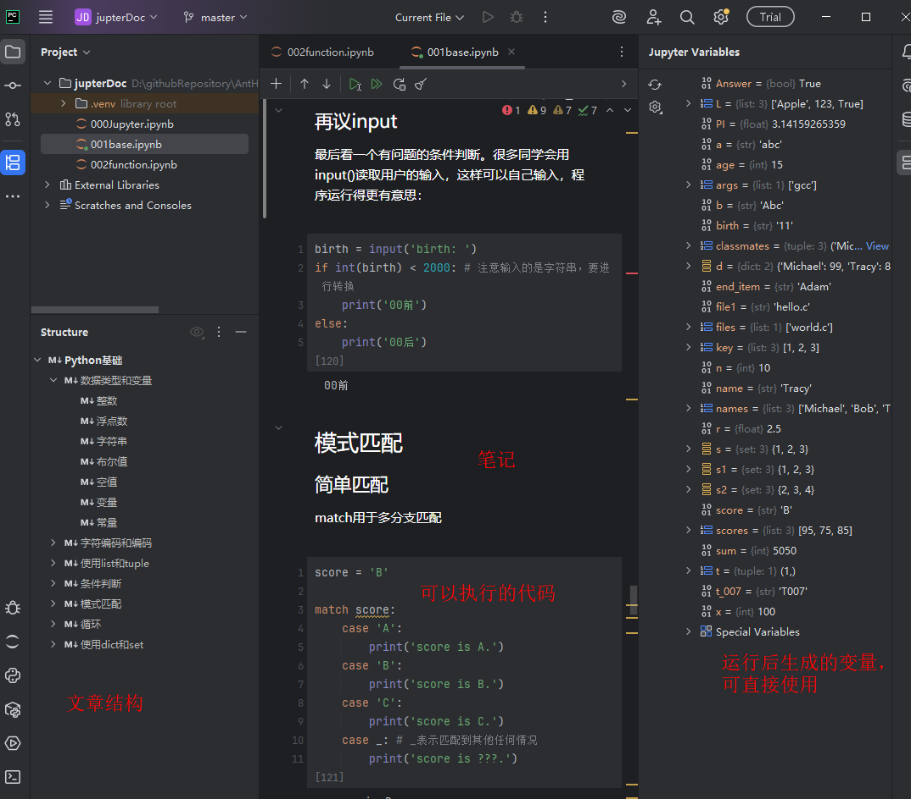
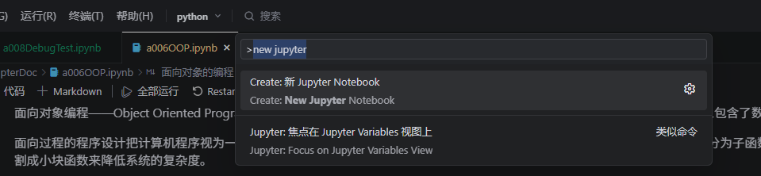
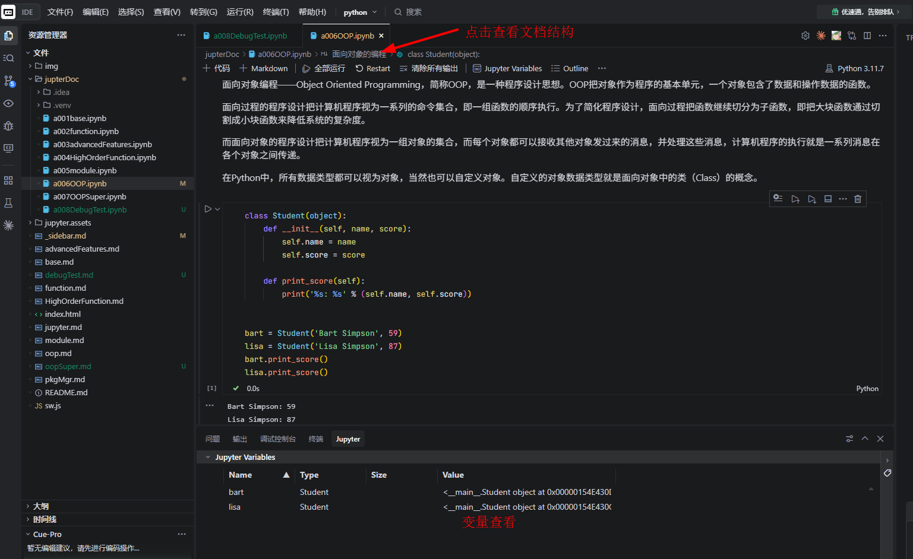

# Jupyter notebook代码笔记本

## Jupyter Notebook

一款交互式Python编辑工具，可分段运行代码，支持代码、文字、图表混排，适合编程学习、数据分析与笔记记录。

### Jupyter Notebook（PyNotebook）核心好处

1. **代码分段运行**：不用整段重跑，单块执行调试，改代码超方便
2. **图文代码混排**：代码、文字、图表、公式放一起，笔记+编程一体
3. **实时可视化**：画图、数据分析立刻出图，直观看结果
4. **学习入门友好**：适合练Python、数据分析、机器学习，新手上手快
5. **方便复盘分享**：保存完整运行记录，发给别人就能直接复现
6. **交互调试强**：变量随时查看，排查bug比普通脚本省事

简单说：**写代码+记笔记+看图表三合一，学习、数据分析首选**。

### Jupyter  常用快捷键

Shift+Enter：运行当前单元格

Ctrl+Enter：运行当前单元格，不跳下

Enter: 进入编辑

ESC： 进入快捷键模式

A：上方插入单元格

B：下方插入单元格

DD：删除单元格

M：切换到 Markdown

Y：切换到 Code

## 在Pycharm中使用

## 在Visual Code中使用

Visual Code以及在此上衍生出来的编辑器Cursor、Trae等等。

ctrl+shift+p，输入：“new jupter...”，来创建一个Jupter Notebook。

使用Jupter Notebook的场景，注意初次使用需要安装内核，根据提示安装就行（如果安装报错找豆包帮忙，出过一次包版本问题导致的报错）。

