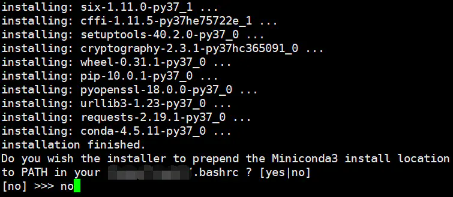
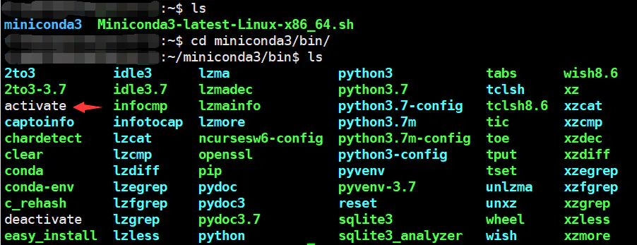
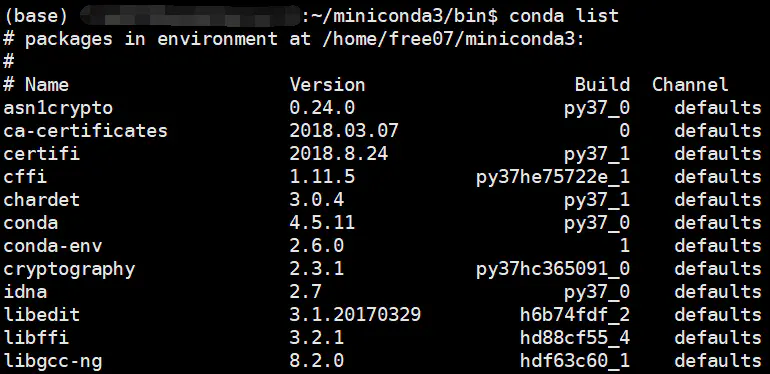

# python-包管理

## pip

### 基本使用

```bash
pip3 --help
pip3 install --help
```

​		python3自带的包安装工具是pip3。

​		如果使用这个管理包，一般会在项目文件中放一个依赖文件列requirements.txt

```bash
pip3 -install -r requirements.txt
```

requirements.txt

```
flower == 0.9.2
dwebsocket == 0.4.2
HttpRunner
Numpy
tornado
```

[linux 执行：pip3 install -r requirements.txt 报错](https://www.cnblogs.com/guo2733/p/11512360.html)

### pip镜像源配置

[pip国内镜像源配置](https://blog.csdn.net/zhoulinshijie/article/details/87974824)

## conda

​		有很多的软件都可以通过conda安装，省去了很多的安装、修bug的烦恼。经常是安装到崩溃的软件，conda一行命令就搞定了。

### conda简介

​		Conda 是一个开源的软件包管理系统和环境管理系统，用于安装多个版本的软件包及其依赖关系，并在它们之间轻松切换。 Conda 是为 Python 程序创建的，适用于 Linux，OS X 和Windows，也可以打包和分发其他软件。

### 安装conda

​		conda分为anaconda和miniconda。anaconda是包含一些常用包的版本（这里的常用不代表你常用 微笑.jpg），miniconda则是精简版，需要啥装啥，所以推荐使用miniconda。

### 下载网址

miniconda官网：[https://conda.io/miniconda.html](https://links.jianshu.com/go?to=https%3A%2F%2Fconda.io%2Fminiconda.html)

选择适合自己的版本，用wget命令下载。

```bash
wget -c https://repo.continuum.io/miniconda/Miniconda3-latest-Linux-x86_64.sh
# 这个版本是适合于linux的，要看清楚噢。

# mac用户请用：
curl -O https://repo.anaconda.com/miniconda/Miniconda3-latest-MacOSX-x86_64.sh

# mac用户选择图形化界面的anaconda版本也可。
# 传送门：https://www.anaconda.com/products/individual 
# 往下翻，选择64-Bit Graphical Installer
```

这里选择的是`latest-Linux`版本，所以下载的程序会随着python的版本更新而更新（现在下载的版本默认的python版本已经是3.7了）

### 安装命令

```bash
chmod 777 Miniconda3-latest-Linux-x86_64.sh #给执行权限
bash Miniconda3-latest-Linux-x86_64.sh #运行
```

注意，以前的教程都是教一路yes下来的，但是会有隐患，特别是当你的服务器之前有安装过软件的话，conda会污染你原来的环境，把你原来设置好的东西进行更改。具体的惨痛教训请参见：[Anaconda is a snake.](https://links.jianshu.com/go?to=https%3A%2F%2Fmp.weixin.qq.com%2Fs%3F__biz%3DMzAxMDkxODM1Ng%3D%3D%26mid%3D2247486380%26idx%3D1%26sn%3D9329fcd0a60ac5488607d359d6c28134%26chksm%3D9b484b17ac3fc20153d25cbdefe5017c7aa9080d13b5473a05f79808244e848b0a45d2a6a735%26scene%3D21%23wechat_redirect)

所以在询问是否将conda加入环境变量的时候选择no。



### 启动conda（非必须步骤）

在上一步选择no之后，输入conda是会报找不到此命令的。那要如何启动呢？
 找到你刚才安装的miniconda，如果没有更改过安装位置的话应该是在`/home`下面，`cd`到miniconda3的bin目录下面，能看到有一个activate。



这里需要给`activate`添加一下权限才能使用

```bash
chmod 777 activate 
```

接下来启动conda

```bash
 ./activate #这里的第一个点跟source是一样的效
```

当命令行前面出现`(base)`的时候说明现在已经在conda的环境中了。这时候输入`conda list` 命令就有反应了



### 添加频道

官方channel: `(先不要急着添加这两个哦~,只要添加下面的清华的4个镜像地址就足够了的~)`：

```bash
conda config --add channels bioconda
conda config --add channels conda-forge
```

官方的话这两个channel应该就够了的。

```bash
# 这个频道有的时候会引起网络错误, 网络不稳定的朋友不建议加.
conda config --add channels genomedk
```

如何添加清华的镜像channels：

```bash
conda config --add channels https://mirrors.tuna.tsinghua.edu.cn/anaconda/pkgs/free/
conda config --add channels https://mirrors.tuna.tsinghua.edu.cn/anaconda/pkgs/main/
conda config --add channels https://mirrors.tuna.tsinghua.edu.cn/anaconda/cloud/conda-forge/
conda config --add channels https://mirrors.tuna.tsinghua.edu.cn/anaconda/cloud/bioconda/
```

北京外国语大学也开启了镜像站点:

```bash
conda config --add channels https://mirrors.bfsu.edu.cn/anaconda/cloud/bioconda/
conda config --add channels https://mirrors.bfsu.edu.cn/anaconda/cloud/conda-forge/
conda config --add channels https://mirrors.bfsu.edu.cn/anaconda/pkgs/free/
conda config --add channels https://mirrors.bfsu.edu.cn/anaconda/pkgs/main/
下面这个我没用过, 但是看起来像是R的频道, 可以添加一下试试看.
conda config --add channels https://mirrors.bfsu.edu.cn/anaconda/pkgs/r/
```

显示安装的频道:

```bash
conda config --set show_channel_urls yes 
```

查看已经添加的channels

```bash
conda config --get channels
```

已添加的channel在哪里查看

```bash
vim ~/.condarc
```

### 如需要安装特定的版本的包

```bash
conda install 软件名=版本号
conda install gatk=3.7
```

这时conda会先卸载已安装版本，然后重新安装指定版本。

查看已安装软件:

```bash
conda list
```

更新指定软件:

```bash
conda update gatk
```

卸载指定软件:

```bash
conda remove gatk
```

### 退出conda环境

```bash
. ./deactivate
# 或者用 
conda deactivate
```

### 创建软件的软链接（非必须步骤）

跟着命令一路敲到这里的小旁友们估计发现了，现在退出conda环境之后之前安装的软件全都GG了，敲命令没法执行了！
 怎么办呢！其实只要把安装好的软件软连接到一个处在环境变量里的位置就可以使用了。三步走：

- 第一步，创建一个文件夹
   我一般的习惯是在`/home`目录下创建一个`.soft`文件夹
- 第二步，将这个文件夹添加到环境变量中


```bash
export PATH="~/.soft:$PATH"
```

- 第三步，软链接


```ruby
ln -s ~/miniconda3/bin/gatk ~/.soft
```

这样就可以运行啦~如果还是不行建议试试初始化一下bashrc：`. ./bashrc`

### 创建conda环境（常用步骤，强烈推荐）

之前创建的时候显示的是（base）这是conda的基本环境，有些软件依赖的是python2的版本，当你还是使用你的base的时候你的base里的python会被自动降级，有可能会引发别的软件的报错，所以，可以给一些特别的软件一些特别的关照，比如创建一个单独的环境。
 在conda环境下，输入`conda env list`（或者输入`conda info --envs`也是一样滴）查看当前存在的环境：

```php
conda env list
# 这是我相当常用的一条命令了，建议记一记
```


目前只有一个base

```bash
conda create -n python2 python=2
# -n: 设置新的环境的名字
# python=2 指定新环境的python的版本，非必须参数
# 这里也可以用一个-y参数，可以直接跳过安装的确认过程。
```

conda会创建一个新的python2的环境，并且会很温馨的提示你只要输入conda activate python2就可以启动这个环境了


新的环境

### 退出环境

如上面的截图提到的，只要

```undefined
conda deactivate
2019-6-28 update: 如何删除和重命名一个已存在的环境
```

### 删除环境

删除也很容易的

```csharp
conda remove -n myenv --all
```

就可以退出当前环境。
 掌握了创建和删除我们就可以实现重命名的操作了

### 重命名环境

实际上conda并没有提供这样的功能，但是可以曲线救国，原理是先克隆一个原来的环境，命名成想要的名字，再把原来的环境删掉即可
 参考自：[conda 创建/删除/重命名 环境](https://www.jianshu.com/p/7265011ba3f2)
 接下来演示把一个原来叫做py2的环境重新命名成python2：


```bash
conda create -n python2 --clone py2
conda remove -n py2 --all
```

### 骚操作：allias简化启动（非必须步骤）


 linux提供了一个给大家偷懒的命令叫alias，只要在你的`.bashrc`里设置一下就好了，我添加了一条叫做`condaup`的命令，这样就可以免去每次敲`. ~/miniconda/bin/dactivate`的麻烦，一步搞定~技术宅改变世界！


### 卸载miniconda

找到miniconda3的文件夹，使用rm命令将它删除：
然后，用vim命令进入.bashrc文件，将conda的语句用#注释掉
最后，重新激活一下source .bashrc就可以了。

### 报错信息集锦

```
2020-08-06 update: 我最近用conda总是发生一些奇怪的问题, 所以想把报错的信息及解决方式给收集整理一下.
```

#### 报错1: 网络错误

```python
Collecting package metadata (current_repodata.json): failed

CondaHTTPError: HTTP 000 CONNECTION FAILED for url <https://conda.anaconda.org/genomedk/linux-64/current_repodata.json>
Elapsed: -

An HTTP error occurred when trying to retrieve this URL.
HTTP errors are often intermittent, and a simple retry will get you on your way.
u'https://conda.anaconda.org/genomedk/linux-64'
```

一般这种问题就只要重新运行一下上一条命令就可以了. 有的时候网络不稳定而已.

#### 报错2：使用清华的镜像源出现问题

conda create, conda install, conda update报错conda.core.subdir_data.Response304ContentUnchanged

https://blog.csdn.net/javafalcon/article/details/104720175/

解决：

```bash
conda config --get channels
conda config --remove channels https://mirrors.tuna.tsinghua.edu.cn/anaconda/cloud/conda-forge
```


### 参考及感谢

- 感谢 卖萌哥的文章 https://www.jianshu.com/p/edaa744ea47d

- 感谢青山屋主在知乎的专栏文章~

  [使用Bioconda管理Linux系统中的生物信息软件](https://links.jianshu.com/go?to=https%3A%2F%2Fzhuanlan.zhihu.com%2Fp%2F25085567)

- 我为什么能知道这么多呢？因为我看了我洲更学长[hoptop](https://www.jianshu.com/u/9ea40b5f607a)的课啊！推荐给你们！
   [https://ke.qq.com/course/310838](https://links.jianshu.com/go?to=https%3A%2F%2Fke.qq.com%2Fcourse%2F310838)
   `2020-07-08 update: 洲更学长的课程免费在b站放送啦！~快来白嫖！~`
   [https://www.bilibili.com/video/BV1JJ411p7fX](https://links.jianshu.com/go?to=https%3A%2F%2Fwww.bilibili.com%2Fvideo%2FBV1JJ411p7fX)

- conda的cheatsheet。conda官方提供的小抄了解一下~
   [https://conda.io/docs/user-guide/cheatsheet.html](https://links.jianshu.com/go?to=https%3A%2F%2Fconda.io%2Fdocs%2Fuser-guide%2Fcheatsheet.html)