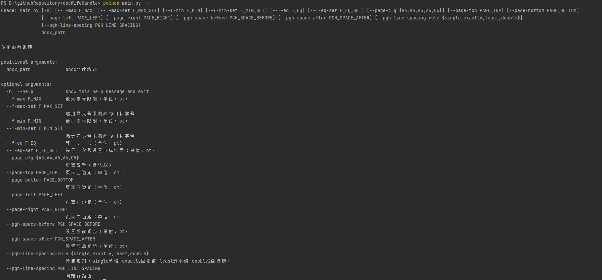

# 首页


## 参考文档

[官方文档](https://python-docx.readthedocs.io/en/latest/index.html) 重要  再结合chatgpt基本上就能做事了

https://blog.csdn.net/qq_41314882/article/details/134922594

https://blog.csdn.net/m0_64359306/article/details/130686822


## 实战案例



```python
import os
import sys

from docx import Document
from docx.shared import Pt, Cm
from docx.enum.text import WD_LINE_SPACING
import argparse


def over_min_font_size_set(paragraph, run):
    """
        --f-min,--f-min-set参数
    :param paragraph:
    :param run:
    :param user_args:
    :return:
    """
    # 定义字号的阈值
    # 四号字体 Pt(14)      五号字体 Pt(10.5)
    min_font_size = round(Pt(user_args.f_min), 2)
    target_font_size = Pt(user_args.f_min_set)
    is_handled = False
    # print(f"内容：{run.text}")
    font_size = run.font.size
    if font_size and round(font_size, 2) < min_font_size:
        run.font.size = target_font_size
        print(f"修改内容：{run.text}, 修改前字大小:{font_size}")
        is_handled = True
    if not is_handled:
        font_size = run.style.font.size
        if font_size and round(font_size, 2) < min_font_size:
            run.style.font.size = target_font_size
            print(f"修改内容：{run.text}, 修改前字大小:{font_size}")
            is_handled = True
    if not is_handled:
        font_size = paragraph.style.font.size
        if font_size and round(font_size, 2) < min_font_size:
            run.font.size = target_font_size
            print(f"修改内容：{run.text}, 修改前字大小:{font_size}")


def over_max_font_size_set(paragraph, run):
    """
        --f-max,--f-max-set参数
    :param paragraph:
    :param run:
    :param user_args:
    :return:
    """
    # 定义字号的阈值
    # 四号字体 Pt(14)      五号字体 Pt(10.5)
    max_font_size = round(Pt(user_args.f_max), 2)
    target_font_size = Pt(user_args.f_max_set)
    is_handled = False
    # print(f"内容：{run.text}")
    font_size = run.font.size
    if font_size and round(font_size, 2) > max_font_size:
        run.font.size = target_font_size
        print(f"修改内容：{run.text}, 修改前字大小:{font_size}")
        is_handled = True
    if not is_handled:
        font_size = run.style.font.size
        if font_size and round(font_size, 2) > max_font_size:
            run.style.font.size = target_font_size
            print(f"修改内容：{run.text}, 修改前字大小:{font_size}")
            is_handled = True
    if not is_handled:
        font_size = paragraph.style.font.size
        if font_size and round(font_size, 2) > max_font_size:
            run.font.size = target_font_size
            print(f"修改内容：{run.text}, 修改前字大小:{font_size}")


def eq_font_size_set(paragraph, run):
    """
        --f-eq,--f-eq-set参数
    :param paragraph:
    :param run:
    :param user_args:
    :return:
    """
    # 定义字号的阈值
    # 四号字体 Pt(14)      五号字体 Pt(10.5)
    eq_font_size = round(Pt(user_args.f_eq), 2)
    target_font_size = Pt(user_args.f_eq_set)
    is_handled = False
    # print(f"内容：{run.text}")
    font_size = run.font.size

    if font_size and round(font_size, 2) == eq_font_size:
        run.font.size = target_font_size
        print(f"修改内容：{run.text}, 修改前字大小:{font_size}")
        is_handled = True
    if not is_handled:
        font_size = run.style.font.size
        if font_size and round(font_size, 2) == eq_font_size:
            run.style.font.size = target_font_size
            print(f"修改内容：{run.text}, 修改前字大小:{font_size}")
            is_handled = True
    if not is_handled:
        font_size = paragraph.style.font.size
        if font_size and round(font_size, 2) == eq_font_size:
            run.font.size = target_font_size
            print(f"修改内容：{run.text}, 修改前字大小:{font_size}")


def handle_runs(paragraph, run):
    if user_args.f_max > -1:
        # --f-max,--f-max-set
        over_max_font_size_set(paragraph, run)
    if user_args.f_min > -1:
        # --f-min,--f-min-set
        over_min_font_size_set(paragraph, run)
    if user_args.f_eq > -1:
        # --f-eq,--f-eq-set
        eq_font_size_set(paragraph, run)


def set_paragraph_format(paragraph):
    pf = paragraph.paragraph_format
    if user_args.pgh_space_before > -1:
        # --pgh-space-before
        pf.space_before = Pt(user_args.pgh_space_before)
    if user_args.pgh_space_after > -1:
        # --pgh-space-after
        pf.space_after = Pt(user_args.pgh_space_after)
    # SINGLE、DOUBLE、EXACTLY和AT_LEAST
    spacing_mapping = {
        "single": WD_LINE_SPACING.SINGLE,  # 单倍
        "exactly": WD_LINE_SPACING.EXACTLY,  # 固定值
        "least": WD_LINE_SPACING.AT_LEAST,  # 最小值
        "double": WD_LINE_SPACING.DOUBLE  # 2倍行距
    }
    if user_args.pgh_line_spacing_rule in spacing_mapping:
        pf.line_spacing_rule = spacing_mapping[user_args.pgh_line_spacing_rule]
        if pf.line_spacing_rule == WD_LINE_SPACING.EXACTLY and user_args.pgh_line_spacing > -1:
            pf.line_spacing = user_args.pgh_line_spacing


def handle_paragraphs(paragraphs):
    for paragraph in paragraphs:
        set_paragraph_format(paragraph)
        for run in paragraph.runs:
            handle_runs(paragraph, run)


def handle_header_footer(section):
    handle_paragraphs(section.header.paragraphs)
    handle_paragraphs(section.footer.paragraphs)


page_mapping = {
    # type: 宽, 高
    "A3": (29.7, 42),
    "A4": (21.0, 29.7),
    "A5": (14.85, 21),
    "A6": (10.5, 14.85),
    "C5": (16.2, 22.9)
}


def set_page_info(section):
    if user_args.page_cfg in page_mapping:
        w, h = page_mapping[user_args.page_cfg]
        section.page_height = Cm(w)
        section.page_width = Cm(h)

    # --page-left
    if user_args.page_left > -1:
        section.left_margin = Cm(user_args.page_left)
    # --page-right
    if user_args.page_right > -1:
        section.right_margin = Cm(user_args.page_right)
    # --page-top
    if user_args.page_top > -1:
        section.top_margin = Cm(user_args.page_top)
    # --page-bottom
    if user_args.page_bottom > -1:
        section.bottom_margin = Cm(user_args.page_bottom)


def check_word_extension(doc_path):
    if doc_path:
        file_extension = os.path.splitext(doc_path)[1].lower()
        if not file_extension == '.docx':
            print("错误:只支持docx文件!")
            sys.exit(0)


def process_word_document():
    doc_path = user_args.docx_path
    # 验证文档类型
    check_word_extension(doc_path)

    doc = Document(doc_path)

    # 遍历所有段落
    handle_paragraphs(doc.paragraphs)

    # 遍历所有表格
    for table in doc.tables:
        for row in table.rows:
            for cell in row.cells:
                handle_paragraphs(cell.paragraphs)

    # 遍历所有页眉
    for section in doc.sections:
        # 设置页面信息
        set_page_info(section)
        # 处理页眉和页尾
        handle_header_footer(section)

    # 保存修改后的文档
    modified_doc_path = doc_path.replace('.docx', '_modified.docx')
    doc.save(modified_doc_path)

    print(f"处理完成，修改后的文档保存为: {modified_doc_path}")


def getArguments():
    # 1. 定义命令行解析器对象
    parser = argparse.ArgumentParser(description='使用参数说明')
    # 2. 添加命令行参数
    parser.add_argument('--f-max', type=int, default=-1, help="最大字号限制（单位：pt）")
    parser.add_argument('--f-max-set', type=int, default=-1, help="超过最大号限制改为目标字号")
    parser.add_argument('--f-min', type=int, default=-1, help="最小字号限制（单位：pt）")
    parser.add_argument('--f-min-set', type=int, default=-1, help="低于最小号限制改为目标字号")
    parser.add_argument('--f-eq', type=int, default=-1, help="等于此字号（单位：pt）")
    parser.add_argument('--f-eq-set', type=int, default=-1, help="等于此字号设置目标字号（单位：pt）")
    parser.add_argument('--page-cfg', type=str, default="A4", help="页面配置（默认A4）",
                        choices=["A3", "A4", "A5", "A6", "C5"])
    parser.add_argument('--page-top', type=int, default=-1, help="页面上边距（单位：cm）")
    parser.add_argument('--page-bottom', type=int, default=-1, help="页面下边距（单位：cm）")
    parser.add_argument('--page-left', type=int, default=-1, help="页面左边距（单位：cm）")
    parser.add_argument('--page-right', type=int, default=-1, help="页面右边距（单位：cm）")
    parser.add_argument('--pgh-space-before', type=int, default=-1, help="设置段前间距（单位：pt）")
    parser.add_argument('--pgh-space-after', type=int, default=-1, help="设置段后间距（单位：pt）")
    parser.add_argument('--pgh-line-spacing-rule', type=str, default=-1,
                        help="行距规则（single单倍 exactly固定值 least最小值 double2倍行距）",
                        choices=["single", "exactly", "least", "double"])
    parser.add_argument('--pgh-line-spacing', type=int, default=-1, help="固定行距值")
    parser.add_argument("docx_path", type=str, help="docx文件路径")
    # 3. 从命令行中结构化解析参数
    return parser.parse_args()


if __name__ == "__main__":
    # 参数解析
    user_args = getArguments()
    # 根据参数处理文档
    process_word_document()

```

