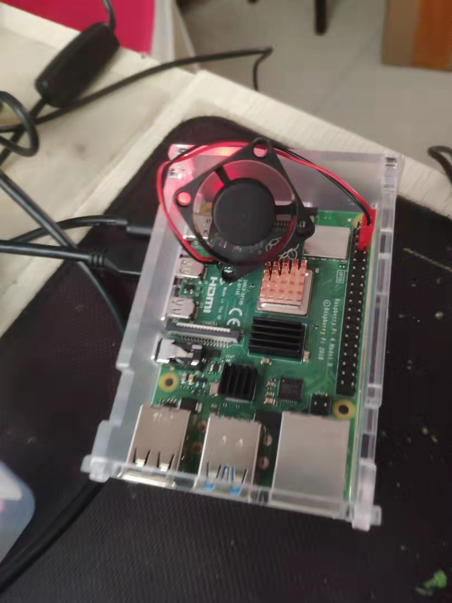

# 基础环境搭建

## 基础硬件连接

​	没什么难得，看看就会。



## 刷系统

  支持系统主要包括：Raspbian、windows 10 IOT、Ubuntu mate等等。

1.  去官网下载系统镜像：https://www.raspberrypi.com/software/

2.  下载烧录镜像到TF卡的工具

   方式一：SD Formatter（格式化TF，据说windows格式化有问题） +   *Win*32DiskImager写入工具

   方式二： 官网提供的[Raspberry Pi Imager](https://www.raspberrypi.com/software/)，自带格式化和写入。

3. TF卡插到读卡器上，再插到电脑USB口上，进行烧录镜像。

4. 将TF插入到树莓派上就可以启动了。


## 无屏幕

   没有屏幕怎么办？ 两种方式玩：SSH远程连接、VNC（VNC Viewer）远程连接（带界面）。

### 开启SSH

​		2016年11月25日以后的系统镜像，默认不开启SSH，需要在SD卡根目录**（boot中）新建“SSH”文件**（无后缀）。

- 通过网线连接
- 通过在TF卡中提前配置好wpa_supplicant.conf有哪些无线网络SID密码等信息。

在路由器中获取到树莓派的ip地址，或者使用Advanced IP Scanner获取ip地址，具体百度一下。

拿到ip地址后就可以通过putty, xshell, VNC, FileZilla等软件进行操作了。


## 如果能看见屏幕，如何开启ssh和VNC

```shell
sudo raspi-config	
```

选择"5. Interfacing Options"下的"SSH"和“VNC”都打开。


