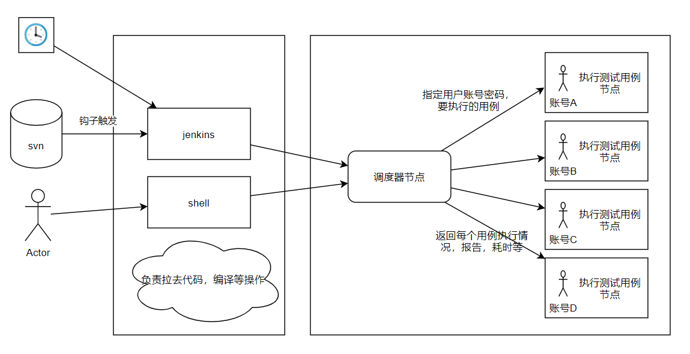
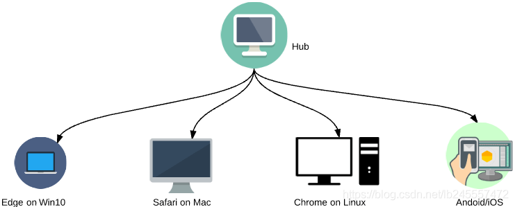

# 减少selenium用例执行时间

> 一个同事分享的加快selenium测试的思想

## 问题

selenium写的测试用例是串行在一台机器上一个一个执行，整体执行时间会特别长。

有没有什么办法能够减少用例的执行时长？

## 解决思想

调度器节点，注册执行节点，也能剔除执行节点，维护心跳等功能；

调度器维护了每个节点的测试用例队列；

调度器会根据历史对应用例的执行耗时来自动分配用例队列；

调度器还要考虑用例的依赖、排斥等情况；

调度器根据历史的节点执行时间和当前已经适用的时间来计算和重新分配用例执行所在队列，达到每个节点都合理的适用，达到执行很多单元测试时，整体耗时最少；

## 类似产品

selenium本身有推出一个组件[selenium Grid](https://www.cnblogs.com/hls-code/p/15761437.html)，它专门用于并行运行多个测试用例在不同的浏览器、操作系统和机器上。

