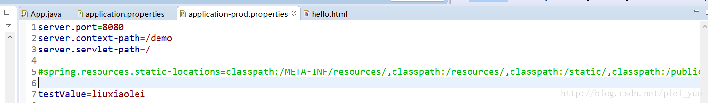

# SpringBoot 静态资源访问

## 默认静态资源访问

默认静态资源的路径为：

​	classpath:/META-INF/resources/

​	 classpath:/resources/

​	classpath:/static/

​	classpath:/public/

**优先级从从高到低。**

默认情况不配置静态资源访问路径时，该条件是指我们不在application.properties/yml文件中进行这个路径配置时，如图： 



我们将静态资源放到以上路径（classpath:/META-INF/resources/,classpath:/resources/,classpath:/static/,classpath:/public/）或放到者我们把静态文件直接放到webapp下 ,我们在浏览器中都是可以访问到的。

   ```提示：但是需要我们注意的是：如果你的应用将被打包成jar，那就不要使用src/main/webapp文件夹。尽管该文件夹是一个共同的标准，但它仅在打包成war的情况下起作用，如果产生一个jar，多数构建工具都会静悄悄的忽略它!所以根据需要进行配置```

## 自定义静态资源路径的配置

一般情况下，默认的静态资源访问路径就能满足我们的需求，当然我们也可以自定义静态资源的路径：

### 1.通过配置文件修改

修改配置文件的方法就是修改spring.resources.static-locations的配置：

```properties
spring.resources.static-locations=classpath:/testStatic/,classpath:/META-INF/resources/,classpath:/resources/,classpath:/static/,classpath:/public/
```

### 2.通过代码修改

创建一个配置类，实现类继承 WebMvcConfigurerAdapter 并重写方法 addResourceHandlers 。

```java
@Configuration
public class MyWebAppConfigurer
        extends WebMvcConfigurerAdapter {
    @Override
    public void addResourceHandlers(ResourceHandlerRegistry registry) {
        registry.addResourceHandler("/testStatic/**")
            .addResourceLocations("classpath:/testStatic/");
        super.addResourceHandlers(registry);
    }
}
```

这样使用代码的方式自定义目录映射，并不影响Spring Boot的默认映射，可以同时使用。