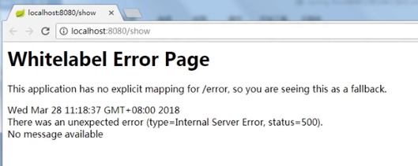
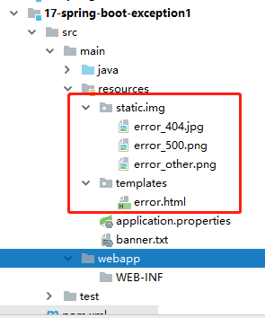
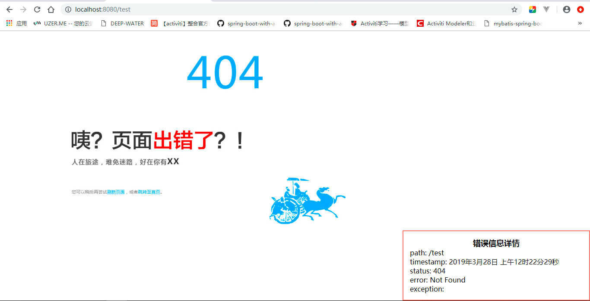

# SpringBoot异常处理方式

​	源代码项目参考：\*spring-boot-exception*

## SpringBoot默认的处理异常的机制

​	SpringBoot默认已经提供了一套处理异常的机制，一旦程序中出现了异常，SpringBoot会向/error的URL发送请求。在SpringBoot中提供了一个BasicErrorController来处理/error请求，然后跳转到默认的错误页面来展示错误信息。



## 五种异常处理方式

1. 自定义错误页面

   ​	自定义错误页面来替换SpringBoot默认的错误页面。

   ​	如果我们需要将所有的异常统一跳到自定义的错误页面，需要在/src/main/resources/templates目录下创建一个error.html页面。 这个error.html是默认的，如果要修改这个名字，可以在application.properties中配置server.error.path=。

   案例项目结构：

   

   error.html源代码：

   ```
   <!doctype html>
   <html lang="en">
   <head>
       <meta charset="UTF-8">
       <meta name="viewport"
             content="width=device-width, user-scalable=no, initial-scale=1.0, maximum-scale=1.0, minimum-scale=1.0">
       <meta http-equiv="X-UA-Compatible" content="ie=edge">
       <title>错误</title>
       <style>
           .info-box {
               width: 400px;
               position: absolute;
               bottom: 0px;
               right: 0px;
               padding: 15px;
               background-color: white;
               border: 2px solid salmon;
           }
           .info-box .info-box-title {
               font-weight: bold;
               font-size: 18px;
               text-align: center;
           }
       </style>
   </head>
   <body>
       <div class="info-box">
           <div class="info-box-title">错误信息详情</div>
           path: <span th:text="${path}"></span> <br>
           timestamp: <span th:text="${#dates.format(timestamp)}"></span> <br>
           status: <span th:text="${status}"></span> <br>
           error: <span th:text="${error}"></span> <br>
           exception: <span th:text="${exception}"></span> <br>
       </div>
       <div th:switch="${status}">
           
           
           
       </div>
   </body>
   </html>
   ```

   然后我写了一个能造成NullException的Controller，访问路径为/show。

   测试 http://localhost:8080/show   500错误

   

   测试 http://localhost:8080/test   404错误

   

2. @ExceptionHandle注解处理异常

   ```java
   @ExceptionHandler(value = {java.lang.ArithmeticException.class})
   public ModelAndView arithmeticExceptionHandler(Exception e) {
           ModelAndView modelAndView = new ModelAndView();
           modelAndView.addObject("error", e.toString());
           modelAndView.setViewName("arithError");
   
           return modelAndView;
       }
   ```

   缺点：

   >  如果一个Controller中要处理的异常比较多，那么就需要在这个Controller中添加很多的这种异常处理方法。而且不具备夸Controller。

3. @ControllerAdvice加@ExceptionHandler注解处理异常

   ​	使用此方式，可以将@ExceptionHandler的配置提取到一个公共的异常配置注解中，就弥补了2中描述的缺点。

   ```java
   package com.tc.controller.config;
   
   import org.springframework.web.bind.annotation.ControllerAdvice;
   import org.springframework.web.bind.annotation.ExceptionHandler;
   import org.springframework.web.servlet.ModelAndView;
   
   @ControllerAdvice(basePackages = "com.tc")
   public class GloablException {
       /**
        * 该方法需要返回一个ModelAndView，目的是可以让我们封装异常信息以及视图的指定。
        *
        * @param e 将产生的异常主要到这个参数中
        * @return
        */
       @ExceptionHandler(value = {java.lang.ArithmeticException.class})
       public ModelAndView arithmeticExceptionHandler(Exception e) {
           ModelAndView modelAndView = new ModelAndView();
           modelAndView.addObject("error", e.toString());
           modelAndView.setViewName("arithError");
   
           return modelAndView;
       }
   
       @ExceptionHandler(value = {java.lang.NullPointerException.class})
       public ModelAndView nullPointerExceptionHandler(Exception e) {
           ModelAndView modelAndView = new ModelAndView();
           modelAndView.addObject("error", e.toString());
           modelAndView.setViewName("nullError");
   
           return modelAndView;
       }
   }
   ```

4. 配置SimpleMappingExceptionResolver处理异常

   缺点：

   - 只能做异常类型和视图的映射，不能做在视图跳转的时候传递异常信息，因为我们开发的时候不能获取到异常信息，排错就会比较麻烦。

   ```java
   package com.tc.controller.config;
   
   import org.springframework.context.annotation.Bean;
   import org.springframework.context.annotation.Configuration;
   import org.springframework.web.servlet.handler.SimpleMappingExceptionResolver;
   
   import java.util.Properties;
   
   @Configuration
   public class GloablException {
       @Bean
       public SimpleMappingExceptionResolver getSimpleMappingExceptionResolver() {
           SimpleMappingExceptionResolver resolver = new SimpleMappingExceptionResolver();
           Properties mapping = new Properties();
           
           mapping.setProperty("java.lang.ArithmeticException", "arithError");
           mapping.setProperty("java.lang.NullPointerException", "nullError");
           resolver.setExceptionMappings(mapping);
   
           return resolver;
       }
   }
   ```

5. 自定义HandlerExceptionResover类处理异常

   本配置方法就弥补了上述的不足之处。

```java
package com.tc.controller.config;

import org.springframework.context.annotation.Bean;
import org.springframework.context.annotation.Configuration;
import org.springframework.web.servlet.HandlerExceptionResolver;
import org.springframework.web.servlet.ModelAndView;
import org.springframework.web.servlet.handler.SimpleMappingExceptionResolver;

import javax.servlet.http.HttpServletRequest;
import javax.servlet.http.HttpServletResponse;
import java.util.Properties;

/**
 *
 * 使用HandlerExceptionResolver接口来做全局异常处理
 *
 */
@Configuration
public class GloablException implements HandlerExceptionResolver{
    
    @Override
    public ModelAndView resolveException(HttpServletRequest httpServletRequest, HttpServletResponse httpServletResponse, Object o, Exception e) {
        ModelAndView modelAndView = new ModelAndView();
        // 判断不同的异常类型做不同的视图跳转
        if (e instanceof ArithmeticException) {
            modelAndView.setViewName("arithError");
            modelAndView.addObject("error", e.toString());
        } else if (e instanceof NullPointerException) {
            modelAndView.setViewName("nullError");
            modelAndView.addObject("error", e.toString());
        } else {
            // 其它异常对应的处理
            modelAndView.setViewName("error");
        }

        return modelAndView;
    }
}
```

其它参考：

​	https://www.cnblogs.com/jin-zhe/p/8204202.html

​	https://blog.csdn.net/fantomelarmes/article/details/81061435