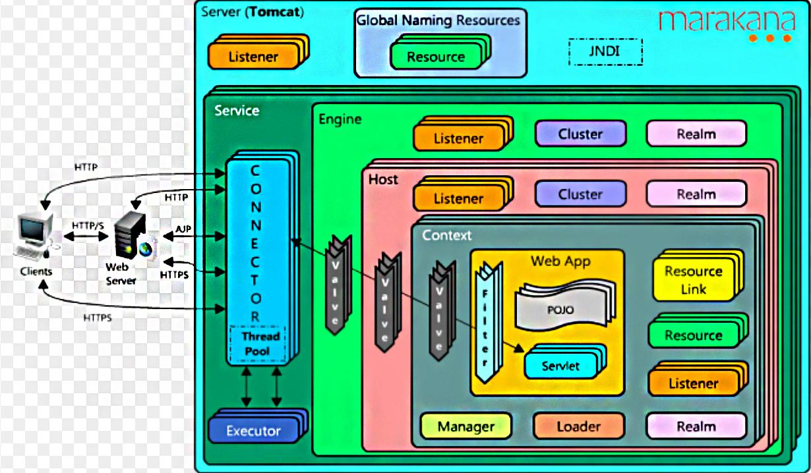
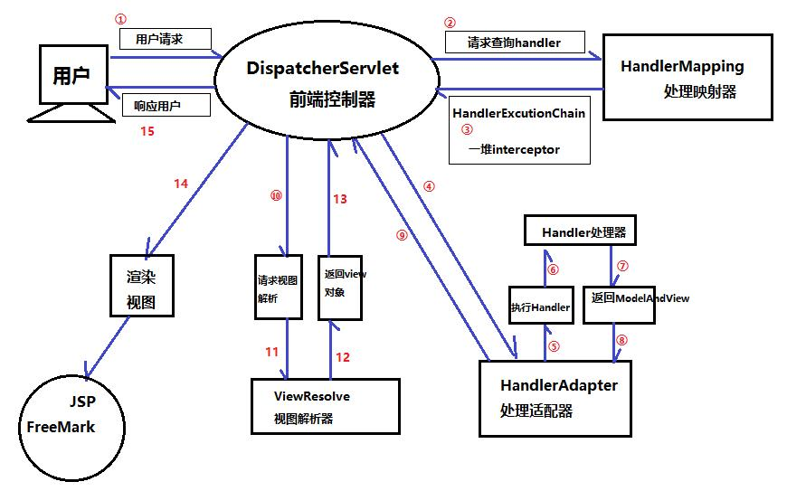

# Tomcat架构



## Http工作原理

​		HTTP协议是浏览器与服务器之间的数据传送协议。作为应用层协议，HTTP是基于TCP/IP协议来传递数据的（HTML文件、图片、查询结果等），HTTP协议不涉及数据包（Packet）传输，主要规定了客户端和服务器之间的通信格式。


从图上你可以看到这个么一个过程：

1. 用户通过浏览器进行了一个操作，比如输入网址并回车，或者是点击链接，接着浏览器获取了这个事件。
2. 浏览器向服务端发出TCP链接请求。
3. 服务程序接受浏览器的连接请求，并经过TCP三次握手建立连接。
4. 浏览器将请求数据打包成一个HTTP协议格式的数据包。
5. 浏览器将该数据包推入网络，数据包经过网络传输，最终达到服务端程序。
6. 服务端程序拿到这个数据包后，同样以HTTP协议格式解包，获取到客户端的意图。
7. 得知客户端意图后进行处理，比如提供静态文件或者调用服务端程序获得动态结果。
8. 服务端将响应结果（可能是HTML或者图片等）按照HTTP协议格式打包。
9. 浏览器拿到数据包后，以HTTP协议的格式解包，然后解析数据，假设这里的数据是HTML。
10. 浏览器将HTML文件展示在页面上呈现给用户。

## Tomcat整体架构

### Http服务器请求处理

​		浏览器发给服务端的是一个HTTP格式的请求，HTTP服务器收到这个请求后，需要调用服务端程序来处理，所谓的服务端程序就是你写的Java类，一般来说不同的请求需要不同的Java类来处理。


图1，表示HTTP服务器直接调用具体业务类，它们是紧耦合的。

图2，HTTP服务器不直接调用业务类，而是把请求交给容器来处理，容器通过Servlet容器调用业务类，因此Servlet接口和Servlet容器的出现，达到了HTTP服务器与业务类解耦的目的，而Servlet接口和Servlet容器这一套规范叫做Servlet规范。Tomcat按照Servlet规范的要求实现了Servlet容器，同时它们也具有HTTP服务器的功能。作为Java程序员，如果我们要实现新的业务功能，只需要实现一个Servlet，并把它注册到Tomcat(Servlet容器)中，剩下的事情就由Tomcat帮我们处理了。

### Servlet容器工作流程

为了解耦，HTTP服务器不直接调用Servlet，而是把请求交给Servlet容器来处理，那Servlet容器又是怎么工作的呢？

当客户端请求某个资源时，HTTP服务器会用一个ServletRequest对象将客户的请求封装起来，然后调用Servlet容器的service方法，Servlet容器拿到请求后，根据请求的URL和Servlet的映射关系，找到相应的Servlet，如果Servlet还没有被加载，就用反射机制创建这个Servlet，并调用Servlet的init方法来完成初始化，接着调用Servlet的service方法来处理请求，把ServletResponse对象返回给HTTP服务器，HTTP服务器会把响应发送给客户端。


### Tomcat整体架构

我们知道如果要设计一个系统，首先是要了解需求，我们已经了解了Tomcat要实现两个核心功能：

1. 处理Socket连接，负责网络字节流与Request和Response对象的转化。
2. 加载和管理Servlet，以及具体处理Request请求。

因此Tomcat设计了两个核心组件连接器（Connector）和容器（Container）来分别做这两件事情。连接器负责对外交流，容器负责内部处理。


## 连接器 - Coyote

### 架构介绍

​		Coyote 是Tomcat的连接器框架的名称，是Tomcat服务器提供的供客户端访问的外部接口。客户端通过Coyote与服务器建立连接、发送请求并接收响应。

​		Coyote封装了底层的网络通信（Socket请求及响应处理），为Catalina容器提供了统一的接口，使catalina容器与具体的请求协议及IO操作方式完全解耦。Coyote将Socket输入转换为Request对象，交由Catalina容器进行处理，处理请求完成后，Catalina通过Coyote提供的Response对象将结果写入输出流。

​		Coyote作为独立的模块，只负责具体协议和IO的相关操作，与Servlet规范实现没有直接关系，因此即便是Request和Response对象也并未实现Servlet规范相应的接口，而是在Catalina中将他们进一步封装为ServletRequest和ServletResponse。

​	

### IO模型与协议

​		在Coyote中，Tomcat支持的多种I/O模型和应用层协议，具体包含哪些IO模型和应用层协议，请求看下表：

Tomcat支持的IO模型（自8.5、9.0版本起， Tomcat移除了对BIO的支持）：

| IO模型 | 描述                                                         |
| ------ | ------------------------------------------------------------ |
| NIO    | 非阻塞I/O，采用Java NIO类库实现。                            |
| NIO2   | 异步I/O，采用JDK 7最新的NIO2类库实现。                       |
| APR    | 采用Apache可移植运行库实现，是C/C++编写的本地库。如果选择该方案，需要单独安装APR库。 |

Tomcat支持的应用层协议：

| 应用程序协议 | 描述                                                         |
| ------------ | ------------------------------------------------------------ |
| HTTP/1.1     | 这是大部分Web应用采用的访问协议。                            |
| AJP          | 用于和Web服务器集成（如Apache），以实现对静态资源的优化以及集群部署，当前支持AJP/1.3。 |
| HTTP/2       | HTTP 2.0大幅度的提升了Web性能。下一代HTTP协议，自8.5以及9.0版本之后支持。 |

协议分层：


​		在8.0前，Tomcat默认采用的I/O方式是BIO，之后改为NIO。无论NIO、NIO2还是APR，在性能方面均优于以往的BIO。如果采用APR，甚至可以达到Apache HTTP Server的性能。

​		Tomcat为了实现支持多种IO模型和应用层协议，一个容器可能对接多个连接器，就好比一个房间有多个门。但是单独的连接器或者容器都不能对外提供服务，需要把它们组装起来才能工作，组装后这个整体叫作Service组件。这里请你注意，Service本身没有做什么重要的事情，只是在连接器和容器外面多包了一层，把它们组装在一起。Tomcat内可能有多个Service，这样的设计也是处于灵活性的考虑。通过在Tomcat中配置多个Service，可以实现通过不同的端口号来访问同一台机器上部署的不同应用。

### 连接器组件

[参考资料](https://www.jianshu.com/p/ce6d6012af63)


连接器中的各个组件的作用如下：

Endpoint

1. EndPoint: Coyote通信端点，即通信监听的接口，是具体Socket接收和发送处理器，是对传输层的抽象，因此EndPoint用来实现TCP/IP协议的。
2. Tomcat并没有EndPoint接口，而是提供了一个抽象类AbstractEndpoint，里面定义了两个内部类：Acceptor和SocketProcessor。Acceptor用于监听Socket连接请求。SocketProcessor用于处理接收到的Socket请求，它实现Runnable接口，在Run方法里调用协议处理组件Processor进行处理。为了提高处理能力，SocketProcessor被提交到线程池执行。而这个线程池叫作执行器（Executor），我在后面的专栏会详细介绍Tomcat如何扩展原生的Java线程池。

Processor

​		Processor: Coyote协议处理接口，如果说EndPoint是用来实现TCP/IP协议的，那么Processor用来实现HTTP协议，Processor接收来自EndPoint的Socket，读取字节流解析成Tomcat Request和Response对象，并通过Adapter将其提交到容器处理，Processor是对应用层协议的抽象。

ProtocolHandler

​		ProtocolHandler：Coyote协议接口，通过Endpoint和Processor，实现针对具体协议的处理能力。Tomcat按照协议和IO提供了6个实现类：AJPNIOProtocol，AJPAPRProtocol，AJPNIO2Protocol，Http11NioProtocol，Http11Nio2Protocol，Http11AprProtocol。我们在配置tomcat/conf/server.xml时，至少要指定具体的ProtocolHandler，当然也可以指定协议名称，如：HTTP/1.1，如果安装了APR，那么将使用Http11AprProtocol，否则使用Http11NioProtocol。

## 容器 - Catalina

​		Tomcat是一个由一系列可配置的组件构成的Web容器，而Catalina是Tomcat的servlet容器。

​		Catalina是Servlet容器实现，包含了之前讲到的所有的容器组件，以及后续章节涉及到的安全、会话、集群、管理等Servlet容器架构的各个方面。它通过松耦合的方式集成Coyote，以完成按照请求协议进行数据读写。同时，它还包含我们的启动入口、Shell程序等。

### Catalina地位

Tomcat的模块分层结构图，如下：


Tomcat本质上就是一款Servlet容器，因此Catalina才是Tomcat的核心，其他模块都是为Catalina提供支持的。比如：通过Coyote模块提供链接通信，Jasper模块提供JSP引擎，Naming提供JNDI服务，Juli提供日志服务。

### Catalina结构


​		如上图所示，Catalina负责管理Server，而Server表示着整个服务器。Server下面有多个服务Service，每个服务都包含着多个连接器组件Connector（Coyote实现）和一个容器组件Container。在Tomcat启动的时候，会初始化一个Catalina的实例。

Catalina各个组件的职责：

| 组件      | 职责                                                         |
| --------- | ------------------------------------------------------------ |
| Catalina  | 负责解析Tomcat的配置文件，以此来创建服务器Server组件，并根据命令来对其进行管理 |
| Server    | 服务器表示整个Catalina Servlet容器以及其它组件，负责组装并启动Servlet引擎，Tomcat连接器。Server通过实现Lifecycle接口，提供了一种优雅的启动和关闭整个系统的方式 |
| Service   | 服务是Server内部的组件，一个Server包含多个Service。它将若干个Connector组件绑定到一个Container（Engine）上。 |
| Connector | 连接器，处理与客户端的通信，它负责接收客户请求，然后转给相关的容器处理，最后向客户返回响应结果。 |
| Container | 容器，负责处理用户的Servlet请求，并返回对象给web用户的模块。 |

### Container结构

​		Tomcat设计了4种容器，分别是Engine、Host、Context和Wrapper。这4种容器不是平行关系，而是父子关系。Tomcat通过一种分层架构，使得Servlet容器具有很好的灵活性。


各个组件的含义：

| 容器    | 描述                                                         |
| ------- | ------------------------------------------------------------ |
| Engine  | 表示整个Catalina的Servlet引擎，用来管理多个虚拟站点，一个Service最多只能有一个Engine，但是一个引擎可包含多个Host |
| Host    | 代表一个虚拟机，或者一个站点，可以给Tomcat配置多个虚拟机地址，而一个虚拟主机下可包含多个Context。 |
| Context | 表示一个Web应用程序，一个Web应用可包含多个Wrapper            |
| Wrapper | 表示一个Servlet，Wrapper作为容器中的最底层，不能包含子容器   |

​		我们也可以再通过 Tomcat的 server.xm配置文件来加深对 Tomcat容器的理解。 tomcat采用了组件化的设计,它的构成组件都是可配置的,其中最外层的是 Server,其他组件按照一定的格式要求配置在这个顶层容器中。

```xml
<Server>
	<Service>
    	<Connector/>
        <Connector/>
        <Engine>
        	<Host>
                <Context></Context>
            </Host>
        </Engine>
    </Service>
    <Service>
    	....
    </Service>
</Server>
```

​		那么, Tomcat是怎么管理这些容器的呢?你会发现这些容器具有父子关系,形成一个树形结构,你可能马上就想到了设计模式中的组合模式。没错, Tomcat就是用组合模式来管理这些容器的。具体实现方法是,所有容器组件都实现了 containert接口,因此组合模式可以使得用户对单容器对象和组合容器对象的使用具有一致性。这里单容器对象指的是最底层的 wrapper,组合容器对象指的是上面的 context、Host或者Engine。


Container接口中提供了以下方法（截图中只是一部分方法）：


在上面的接口看到了getParent、SetParent、addChild和removeChild等方法。

Container接口扩展了LifeCycle接口，LifeCycle接口用来统一管理各组件的生命周期，后面我也用专门的篇幅去详细介绍。

## Tomcat启动流程

### 流程


步骤：

1. 启动tomcat，需要调用bin/startup.bat(在linux目录下，需要调用bin/startup.sh)，在startup.bat脚本中，调用了catalina.bat。
2. 在catalina.bat脚本文件中调用Bootstrap中的main方法。
3. 在Bootstrap的main方法中调用了init方法，来创建Catalina及初始化类加载器。
4. 在Bootstrap的main方法调用了load方法，在其中又调用了Catalina的load方法。
5. 在Catalina的load方法中，需要进行一些初始化的工作，并需要构造Digester对象，用于解析XML。
6. 然后再调用后续组件的初始化操作...

加载Tomcat的配置文件，初始化容器组件，监听对应的端口号，准备接收客户端请求。

### 源码解析

#### Lifecycle

​		由于所有的组件均存在初始化、启动、停止等生命周期方法,拥有生命周期管理的特性,所以 Tomcat在设计的时候,基于生命周期管理抽象成了一个接口 lifecycle,而组件 Server、 Service、 Container、 Executor、 Connector组件,都实现了一个生命周期的接口,从而具有了以下生命周期中的核心方法：

1. init()：初始化组件
2. start()：启动组件
3. stop()：停止组件
4. destory()：销毁组件


#### 各组件的默认实现

​		上面我们提到的 server、 Service、 Engine、Host、 context都是接口,下图中罗列了这些接口的默认实现类。当前对于 Endpoint组件来说,在 Tomcat中没有对应的 Endpoint接口,但是有一个抽象类 Abstractendpoint,其下有三个实现类: NioEndpoint、Nio2Endpoint、AprEndpoint,这三个实现类,分别对应于前面讲解链接器 Coyote时,提到的链接支持的三种工模型:NIO,NIO2,APR。 Tomcat8.5版本中,默认采用的是 NioEndpoint。


​		ProtocolHandler: coyote协议接口,通过封装 Endpoint和 Processor,实现针对具体协议的处理功能。 Tomcat按照协议和IO提供了6个实现类。

AJP协议：

1. AjpNioProtocol：采用NIO的IO模型
2. AjpNio2Protocol：采用NIO2的IO模型
3. AjpAprProtocol：采用APR的IO模型，需要依赖于APR库。

HTTP协议：

1. Http11NioProtocol：采用NIO的IO模型，默认使用的协议（如果服务器没有安装APR）。
2. Http11Nio2Protocol：采用NIO2的IO模型。
3. Http11AprProtocol：采用APR的IO模型，需要依赖APR库。


### Tomcat请求处理流程

#### 请求流程

​		设计了这么多层次的容器, Tomcat是怎么确定每一个请求应该由哪个 Wrapper容器里的serv1et来处理的呢?答案是, Tomcat.是用 Mappe组件来完成这个任务的。

​		Mapper组件的功能就是将用户请求的URL定位到一个 Servlet,它的工作原理是: Mapper组件里保存了web应用的配置信息,其实就是容器组件与访问路径的映射关系,比如Host容器里配置的域名、 context容器里的Web应用路径,以及 Wapper容器里 Servlet映射的路径,你可以想象这些配置信息就是一个多层次的Map。

​		当一个请求到来时, Mapper组件通过解析请求URL里的域名和路径,再到自己保存的Map里去查找,就能定位到一个 Servlet。请你注意,一个请求URL最后只会定位到一个Wrapper容器,也就是一个 Servlet。

​		下面的示意图中,就描述了当用户请求链接http://www.itcats.cn/bbs/findAll之后,是如何找到最终处理业务逻辑的 servlet。


​		那上面这幅图知识描述了根据请求的URL如何查找需要执行的Servlet，那么下面我们再来解析一下，从Tomat的设计架构成面来分析Tomcat的请求处理。


步骤如下：

1. Connector组件 Endpoint中的 Acceptor监听客户端套接字连接并接收 Socket。
2. 将连接交给程池Executor处理,开始执行请求响应任务。
3. Processor组件读取消思报文,解析请求行、请求体、请求头,封装成 Recuesti对象。
4. Mapper组件根据请求行的URL值和请求头的Host值匹配由哪个Host容器、Context容器、Wrapper容器处理请求。
5. CoyoteAdaptor组件负责将Connector组件和Engine容器关联起来，把生成的Request对象和响应对象Response传递到Engine容器中，调用Pipeline。
6. Engine容器的管道开始处理，管道中包含若干个Value、每个Value负责部分处理逻辑。执行完Value后会执行基础的value--StandardEngineValue，负责调用Host容器的Pipeline。
7. Host容器的管道开始处理，流程类似，最后执行Context容器的Pipeline。
8. Context容器的管道开始处理，流程类似，最后执行Wrapper容器的Pipeline。
9. Wrapper容器的管道开始处理，流程类似，最后执行Wrapper容器对应的Servlet对象的处理方法。

#### 请求流程代码源码解析


​		在前面所讲解的 Tomcat的整体架构中,我们发现 Tomcat中的各个组件各司其职,组件之间松耦合,确保了整体架构的可伸缩性和可拓展性,那么在组件内部,如何增强组件的灵活性和拓屐性呢?在 Tomcat中,每个 Container组件采用责任链模式来完成具体的请求处理。

​		在 tomcat中定义了Pipeline和Valve两个接口, Pipeline用于构建责任链,后者代表责任链上的每个处理器。Pipeline中维护了个基础的 Valve,它始终位于 pipeline的末端(最后执行),封装了具体的请求处理和输出响应的过程。当然,我们也可以调用 addVave()方法,为Pipeline添加其他的Valve,后添加的Valve位于基础的Valve之前・并按照添加序执行。Pipeline通过获得首个Valve来启动整合链条的执行。

**Tomcat Server处理一个http请求的过程：**

假设来自客户的请求为：
http://localhost:8080/test/index.jsp

1) 请求被发送到本机端口8080，被在那里侦听的Coyote HTTP/1.1 Connector获得
2) Connector把该请求交给它所在的Service的Engine来处理，并等待来自Engine的回应
3) Engine获得请求localhost/test/index.jsp，匹配它所拥有的所有虚拟主机Host
4) Engine匹配到名为localhost的Host（即使匹配不到也把请求交给该Host处理，因为该Host被定义为该Engine的默认主机）
5) localhost Host获得请求/test/index.jsp，匹配它所拥有的所有Context
6) Host匹配到路径为/test的Context（如果匹配不到就把该请求交给路径名为""的Context去处理）
7) path="/test"的Context获得请求/index.jsp，在它的mapping table中寻找对应的servlet
8) Context匹配到URL PATTERN为*.jsp的servlet，对应于JspServlet类
**9) 构造HttpServletRequest对象和HttpServletResponse对象，作为参数调用JspServlet的doGet或doPost方法**
10)Context把执行完了之后的HttpServletResponse对象返回给Host
11)Host把HttpServletResponse对象返回给Engine
12)Engine把HttpServletResponse对象返回给Connector
13)Connector把HttpServletResponse对象返回给客户browser

**四、SpringMVC下前后端交互过程**




**1、交互过程**

由于目前接触的项目是建立在springMVC模式下的，故根据上图所示，在最后对SpringMVC下的请求响应过程进行解析：

1）用户发送一个URL请求到**前端控制器DispatcherServlet**；

2）前端控制器将请求发给**处理器映射器HandlerMapping**，它会根据xml配置、注解等进行查找hander；

3）处理器映射器返回执行链HandlerExecutionChain(里面有handler对象，在它之前有多个interceptor拦截器)；

4）前端控制器通过**处理器适配器HandlerAdapter**去执行Handler，不同的Handler由不同的适配器执行；

5）通过**Handler处理器，即我们熟悉的Controller**来处理业务逻辑；

6）处理完之后，返回ModelAndView对象，其中有视图名称，模型数据等；

7）HandlerAdapter将ModelAndView返回给DispatcherServlet；

8）DispatcherServlet将得到的ModelAndView传递给**视图解析器ViewResolver**进行解析；

9）ViewResolver解析后返回具体的**视图View**；

10）前端控制器对视图View和数据进行渲染，将模型数据等填充到request域中；

11）将最终的视图返回给客户，产生response响应。

**2、组件名词解释**

**前端控制器DispatcherServlet**：接收请求响应结果，相当于转发器、中央处理器，减少了其他组件之间的耦合度；

**处理器映射器HandlerMapping**：根据请求URL查找handler；

**处理器适配器HandlerAdapter**：按特定规则去执行handler，故编写handler时按HandlerAdapter要求去做，这样适配器才可正确执行handler；

**视图解析器ViewResolver**：根据逻辑视图解析成真正的视图（View对象）

**视图View**：View是一个接口，实现类支持不同的View类型（jsp，PDF，Excel...）