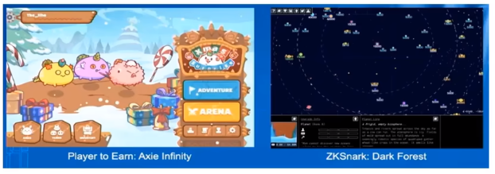
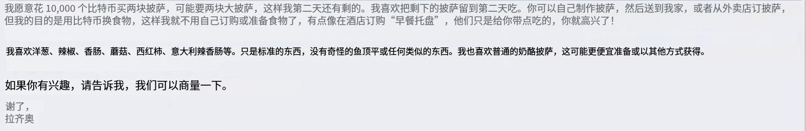

# Web3

“Web3.0”是对“Web2.0”的改进，在此环境下，用户不必在不同中心化的平台创建多种身份，而是能打造一个去中心化的通用数字身份体系，通行各个平台。 
Web3.0被用来描述互联网潜在的下一阶段，一个运行在“区块链”技术之上的“去中心化”的互联网。

了解：从2021年开始，各种互联网人，投资人，媒体人，都在讨论web3.0，有人说它是互联网的未来，有人说它纯粹的庞氏骗局，有人说它是暴富的法门，也有人说它是熊市之光。甚至之前周星驰也开始出来招聘web3的专业人才了。好多互联网人也要从大厂离职去搞这个web3.0。你可能听过和它相关的：元宇宙、区块链、比特币、NFT、DeFi、GameFi这些层出不穷的概念，这些都是什么意思呢？web3和这些概念发展到什么样的程度了呢？

##  **Web1.0、Web2.0、Web3.0有什么区别？**

Web 1.0 可读   --- 我们可以看网站发布的内容，但是不能互动。

Web 2.0  可读、可写  --- 我们不仅可以发布观看内容，还可以互动。

​		2.0是中心化的，有一家一家互联网公司掌控着，所以呢才有兴趣分发，用户喜欢什么推什么，有他好的一面，但是也有它的弊端，容易形成垄断，也存在侵犯用户隐私的隐患，所以基于这些弊端，人们还是畅想搞出了Web3.0。

Web 3.0 可读、可写、可拥有 --- 在web2.0的基础上，架构去中心化，反垄断，我们还可以拥有我们自己的数字资产。

## 衍生出哪些岗位？

- web3前端工程师
  - 常规前端库 + Web3.js + ethers.js
- 智能合约开发工程师
  - 智能合约+扎实的计算机理论知识+扎实的网络知识
- Web3研发专家
  - 对公链技术、节点RPC搭建与调用、合约交易有深入了解
  - 对加密货币钱包、交易所、Defi有开发经验
  - 熟悉solidity的合约开发、对区块链、智能合约技术、加密经济模型有相关经验
  - 要熟悉DeFi生态系统及经济模型
  - 还要掌握GoLang、javscript至少一门编程语言
- web3产品经理
  - 基本产品经理掌握项
  - 对区块链技术、NFT、GameFi玩家有了解
  - 或长期持有数字资产之类的
- 区块链社区运营
- 区块链平面设计师

## 元宇宙

### 元宇宙概念比较

- 数字孪生
  - 虚实映射思想:对物理 实体进行精准虚拟映射
  - 核心技术:人工智能, 通信技术,边缘计算
  - 应用:医疗,工业,交 通,通信,制造
- 元宇宙
  - 数字空间思想:虚实融合 数字空间
  - 核心技术:人机交互,数字孪生,算力网络,区块链,人工智能,边缘计算
  - 应用:教育,医疗,旅游, 金融, 游戏等,但具体形态在发展中
- Web 3.0
  - 新一代互联网思想:去中心化及以用户为中心的互联网
  - 数据:可读可写可授权核心技术:区块链NFT
  - 应用: 互联网上应用

## NFT

NFT，全称为Non-Fungible Token，指非同质化凭证（另外还有同质货币），实质是区块链网络里具有唯一性特点的可信数字权益凭证，是一种可在区块链上记录和处理多维、复杂属性的数据对象。 

NFT数字世界与物理世界的交叠

土地NFT

数字藏品NFT

数字孪生NFT

游戏NFT

区块链支撑的Web3.0

## 区块链

### 定义

### 特征

### 应用场景

### 区块链的类型

1. 公链

   人人可参与这种去中心化的应用；

2. 私链

   我们搭一个链，是掌握再少数的人手里面的。

3. 联盟链

   部分去中心化。

4. 混合链

   结合了公链和私链的东西。

   ### 区块链类型对比

   |          | 公链   | 私链         | 联盟链     |
   | -------- | ------ | ------------ | ---------- |
   | 准入限制 | 无     | 有           | 有         |
   | 读取者   | 任何人 | 仅限受邀用户 | 相关联用户 |
   | 写入者   | 任何人 | 获批参与者   | 获批参与者 |
   | 所属者   | 无     | 单一实体     | 多方实体   |
   | 匿名性   | 是     | 否           | 否         |
   | 交易速度 | 慢     | 快           | 快         |

   

### 区块链hash算法

- 从hash值不可以反向推导出原始的数据
- 输入数据的微小变化会得到完全不同的hash值
- 相同的数据会得到相同的值
- 执行效率要高效，长的文本也能快速地计算出哈希值
- hash算法的冲突概率要小

实例demo：https://github.com/anders94/blockchain-demo

### 区块的概念

### 区块链P2P网络

### 区块链记账和挖矿

为什么会有人愿意花费精力来记账？

以谁记录的账本为准 ?
	比特币记账采取的是工作量证明法，也就是让记账的人去解一道运算量很大数学题，谁能够最先解出来，就用谁的账本，同时谁也就获得了比特币的奖励，这个解数学题的过程就叫做挖矿，所以挖矿比拼的就是矿机CPU的运算能力。

### 区块链共识机制

POW（工作量证明机制）

POS（权益证明机制）

POA（权威证明机制）

POC（容量证明机制）

CPOC（有条件的容量证明机制）

智能合约也是一种共识机制

等等，还有其它共识机制。

## 比特币BTC（Bitcoin）

区块链的第一个应用：比特币

比特币使用点对点技术，在没有中央机构或银行的情况下运作; 管理交易和发行比特币是由网络集体进行的。比特币是开源的，它的设计是公开的，没有人拥有或控制比特币，每个人都可以参与。通过其许多独特的属性，比特币允许令人兴奋的用途，不能涵盖任何以前的支付系统。

比特币官网：https://bitcoin.org/en

比特币的一个交易网络：https://www.blockchain.com/

###  诞生

发过论文：

### 比特币换故事

一万个比特币换披萨。

翻译

https://www.blockchain.com/

中本聪 挖的第一个比特币

### 信任从何来

- 记账
- 挖矿
- 共识

### 比特币所有权

## 以太坊ETH（Ether）

在不受中心监督管控下创建应用程序，做去中心和的应用。

