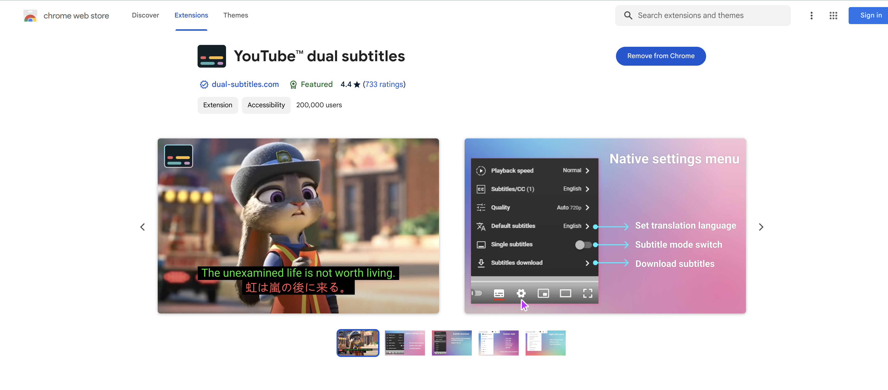
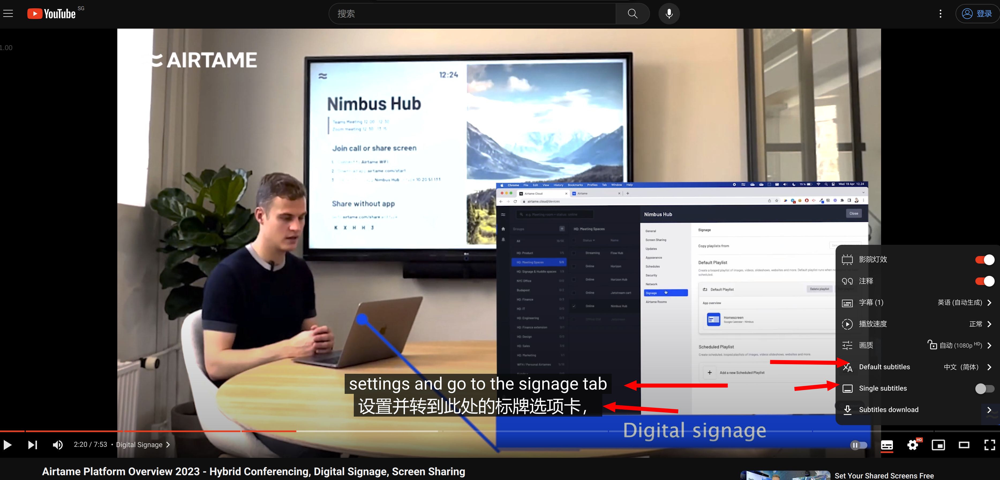

# YouTube

​	YouTube是一个视频网站，早期公司位于美国加利福尼亚州的圣布鲁诺。注册于2005年2月15日，由美国华裔陈士骏等人创立，让用户下载、观看及分享影片或短片。2006年后被google收购。

## 插件

### youtube dual subtitles

youtube默认自带字幕可以将视频带的字幕显示为中文，但是就无法看到之前的英文字幕来。

**youtube双字幕插件**（youtube dual subtitles），可以只显示原来的字幕，也可以显示翻译后的字幕，这对于外语不好的国人来说，这个功能非常有用，有利于我们学习增长我们的英文能力。

使用效果：

