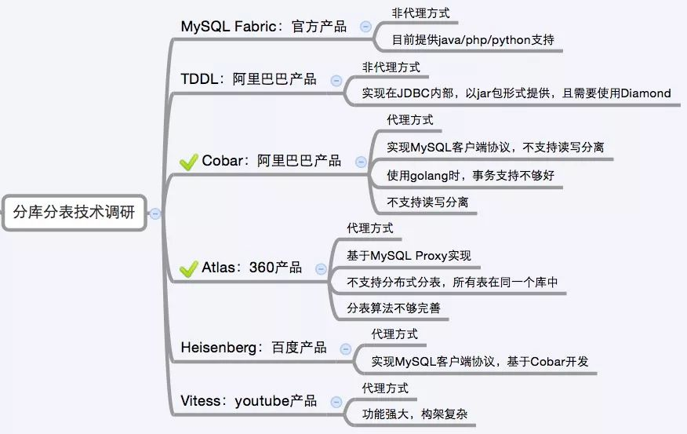

目前市面上的分库分表中间件相对较多，其中基于代理方式的有MySQL Proxy和Amoeba， 基于Hibernate框架的是Hibernate Shards，基于jdbc的有当当sharding-jdbc， 基于mybatis的类似maven插件式的有蘑菇街的蘑菇街TSharding， 通过重写spring的ibatis template类的Cobar Client。

sharding-sphere：jar，前身是sharding-jdbc；

还有一些大公司的开源产品：

