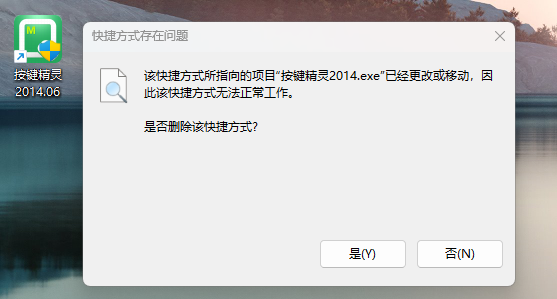
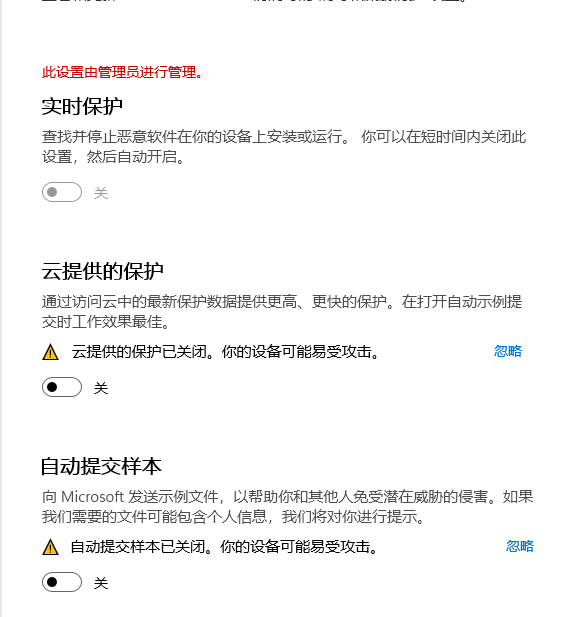
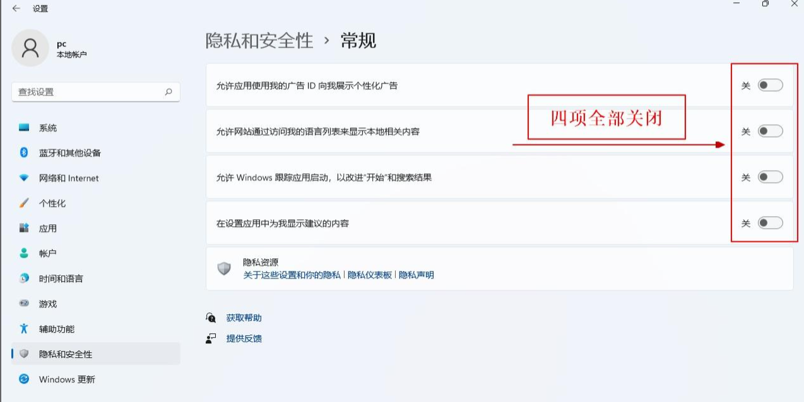
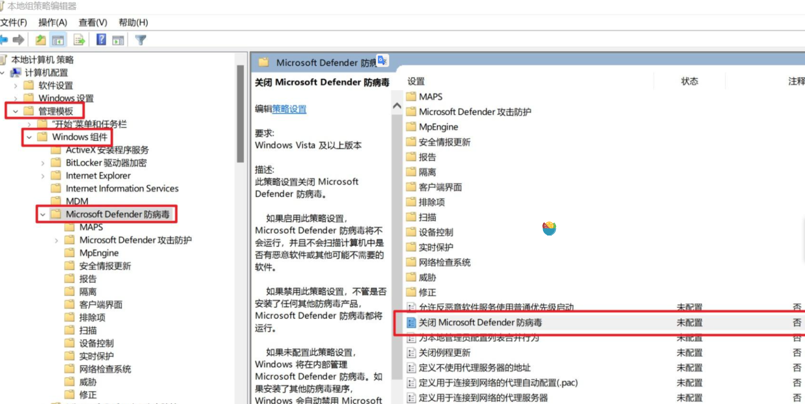
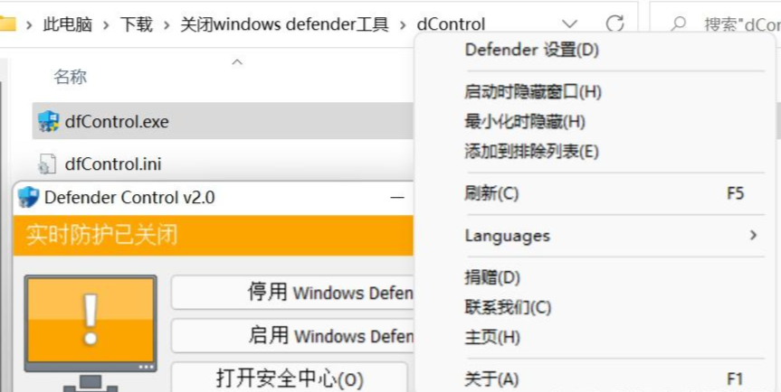
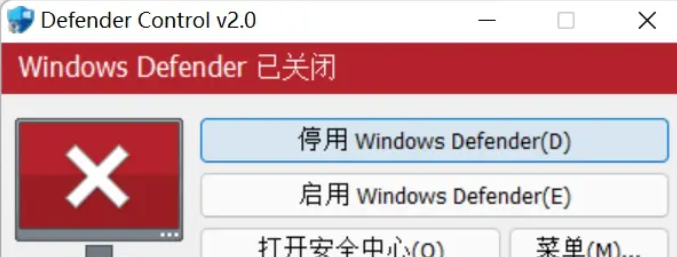

# 安装与用途


## 安装

到官网下载 [地址](http://www.anjian.com/)

分为电脑端和手机端版本。


## 关闭Defender和杀毒软件

> 没有安装的时候就一定要把更新关闭，防火墙关闭，win10真的各种限制，杀毒软件卸载。  否则报毒或者莫名其妙的发现按键精灵打不开了。



### 手动关闭

1. windows设置中“隐私和安全性” -》“windows安全中心” -》 “病毒和威胁防护” -》 ““病毒和威胁防护设置” -》 “管理设置”

   

   

2. windows组策略关闭Microsoft Defender。

   按WIN + R ，输入 gpedit.msc

   找到计算机配置>管理模板>Windows 组件>关闭Microsoft Defender 防病毒

   

   ​	在命令提示符中输入命令  gpupdate  ，这将更新您最近应用的所有设置

3. 运行下面命令改注册表

   ```bat
   ::禁Windows Defender
   reg add "HKEY_LOCAL_MACHINE\SOFTWARE\Policies\Microsoft\Windows Defender" /v "DisableAntiSpyware" /t REG_DWORD /d 00000001 /f
   reg add "HKEY_LOCAL_MACHINE\SYSTEM\CurrentControlSet\Services\SecurityHealthService" /v "Start" /t REG_DWORD /d 00000004 /f
   reg add "HKEY_LOCAL_MACHINE\SOFTWARE\Policies\Microsoft\Windows Defender\Real-Time Protection" /v "DisableBehaviorMonitoring" /t REG_DWORD /d 00000001 /f
   reg add "HKEY_LOCAL_MACHINE\SOFTWARE\Policies\Microsoft\Windows Defender\Real-Time Protection" /v "DisableIOAVProtection" /t REG_DWORD /d 00000001 /f
   reg add "HKEY_LOCAL_MACHINE\SOFTWARE\Policies\Microsoft\Windows Defender\Real-Time Protection" /v "DisableOnAccessProtection" /t REG_DWORD /d 00000001 /f
   reg add "HKEY_LOCAL_MACHINE\SOFTWARE\Policies\Microsoft\Windows Defender\Real-Time Protection" /v "DisableRealtimeMonitoring" /t REG_DWORD /d 00000001 /f
   reg add "HKEY_LOCAL_MACHINE\SOFTWARE\Policies\Microsoft\Windows Defender\Real-Time Protection" /v "DisableScanOnRealtimeEnable" /t REG_DWORD /d 00000001 /f
   ```

关闭Defender有可能重启后又会被打开，这个一般是由于关闭不够彻底导致的，除了上面办法之外，还有以下办法：

### 使用小工具关闭

使用小工具彻底关闭Windows Defender

Defender Control 是一个绿色的小工具，无需安装直接运行。可以一键关闭Windows Defender，支持多语言，支持中文。

注意：该工具运行时，可能会被Windows Defender，所以运行前，先需要执行方法一，关闭实时保护后再运行该工具，彻底关闭Windows Defender



点击停用 Windows Defender（D）。彻底停用Defender。



## 用途

1. 游戏辅助

   自动打怪，自动捡物品，自动加血加蓝，自动跑图

   端游我们正常手动去操作2个窗口就已经很累了

   如果我们手动去操作10个端游的窗口，会不会很麻烦，很累

   不要怕我们可以通过按键精灵+大漠插件，来实现游戏多开，后台多开。

   后台就是在按键精灵可以自动去操作自动打怪等一系列操作的时候，还不影响我们前台去看电影，办公。

   手游 雷电模拟器，夜神模拟器，逍遥模拟器5-20个模拟器的窗口，也是通过按键精灵+大漠插件，实现多线程多开后台操作

   为什么要用按键精灵电脑端的脚本去操作模拟器呢?

   因为一些游戏会有检测，会检测模拟器里面的程序，比如说你有没有开一些apk的辅助脚本exe程序  apk是在模拟器的内部，exe程序它是在模拟器的一个外部，所以用按键精灵电脑版去写手游模拟器，一定程度上可以防止被检测到

   > 总结: 按键精灵电脑版，可以写端游和手游模拟器，实现自动操作，一键解放双手。

2. 日常办公

   操作表格，exce将表格中的内容录入到一些网页的页面或者pc电脑上的一些窗口页面的页面

   它还可以筛选表格中的内容

   ​	就比如说一个工厂，想要招一些人

   ​	指定的要求，比如说性别，年龄，工龄或者比如说一个游戏的表格中

   可以去筛选大区服务器，段位，胜率，位置上单，中单，打野

## 特点

按键精灵的特点门槛很低，极低，哪怕小学没有上过，也可以学，不需要英文基础，年龄的话也没有要求50+完全没有问题的可以学的；

如果说你学会了按键精灵，业余的话你可以去接单，比如说一些游戏的图色模拟操作，办公的自动化操作日常生活中，遇到一些繁琐的，重复的，都可以去用按键精灵完成。

