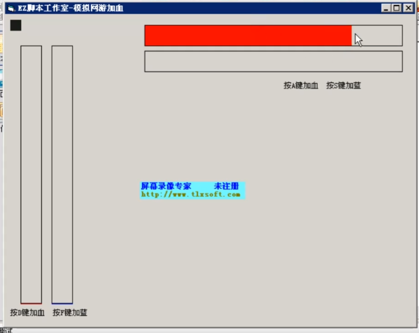

# 自动加血-案例


## 案例

实现血条低于某个百分比自动加血功能。




## 实现脚本

```vb
Rem 开始加血
	/*
		满血颜色 0000FF
		空血颜色 C8D0D4
		满蓝颜色 FF0000
		空蓝颜色 C8D0D4
		判断点颜色 1F1F1F
	*/
	判断点颜色="1F1F1F"
	FindColor 0, 0, 1024, 768, 判断点颜色, intX, intY
	If intX > 0 And intY > 0 Then 
		TracePrint intX & "," & intY
	End If
	
	// 从判断点到我们的空穴坐标 中间的X距离=209 Y距离=9
	空血X坐标 = intX + 209
	空血Y坐标 = intY + 9
	TracePrint 空血X坐标 & "," & 空血Y坐标
	
	// 从判断点到我们的满血坐标 中间的X距离=606 Y距离=9
	满血X坐标 = intX + 606
	满血Y坐标 = intY + 9
	TracePrint 满血X坐标 & "," & 满血Y坐标
	
	血条长度 = 满血X坐标 - 空血X坐标
	TracePrint 血条长度
	百分之一血 = 血条长度 / 100
	TracePrint 百分之一血
	加血百分比 = 80
	血条判断点X坐标 = 空血X坐标 + 百分之一血 * 加血百分比
	血条判断点X坐标 = 血条判断点X坐标 \ 1' 这里是取整数，没有半个像素的说法
	血条判断点Y坐标 = 空血Y坐标
	TracePrint 血条判断点X坐标 & "," & 血条判断点Y坐标
	
	
	满血颜色 = "0000FF"
	空血颜色 = "C8D0D4"
	满蓝颜色 = "FF0000"
	空蓝颜色 = "C8D0D4"
	判断点颜色 = "1F1F1F"
	
	当前血量颜色 = GetPixelColor(血条判断点X坐标, 血条判断点Y坐标)
	If 当前血量颜色 <> 满血颜色 Then 
		KeyPress 65,1
	End If
	Delay 200
Goto 开始加血 '不断重复判断当前血量是否足够，不够进行加血操作
```

