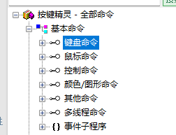
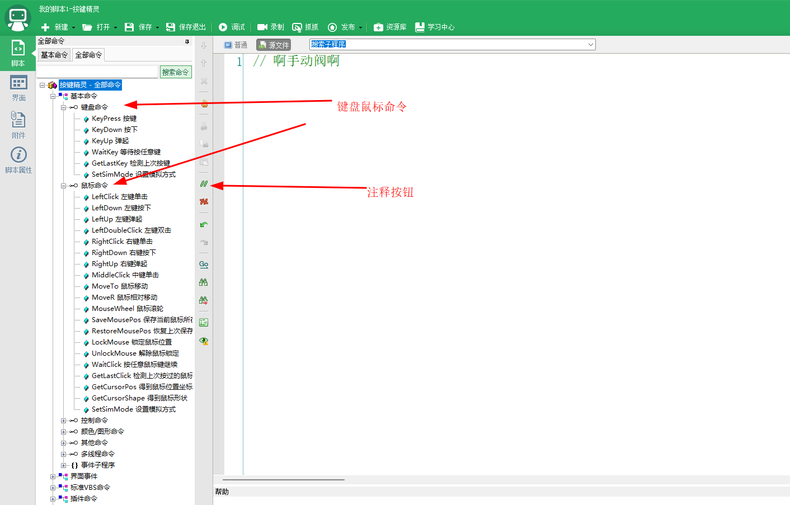
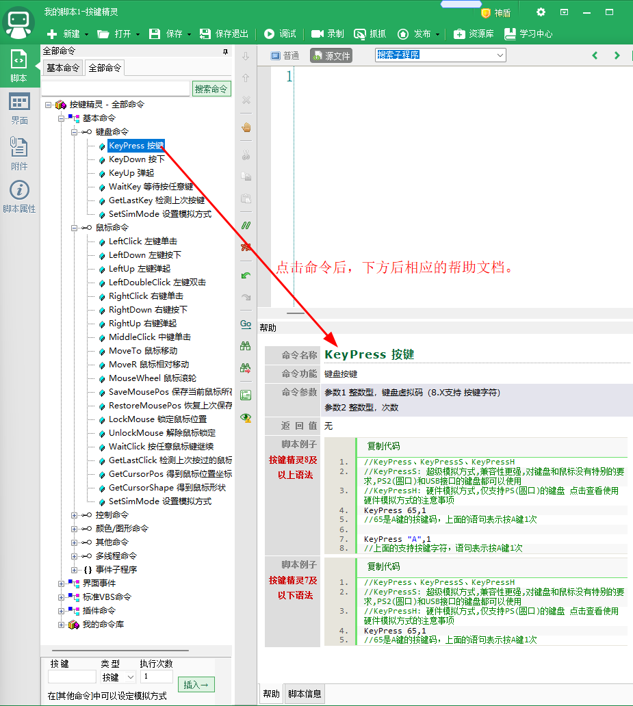
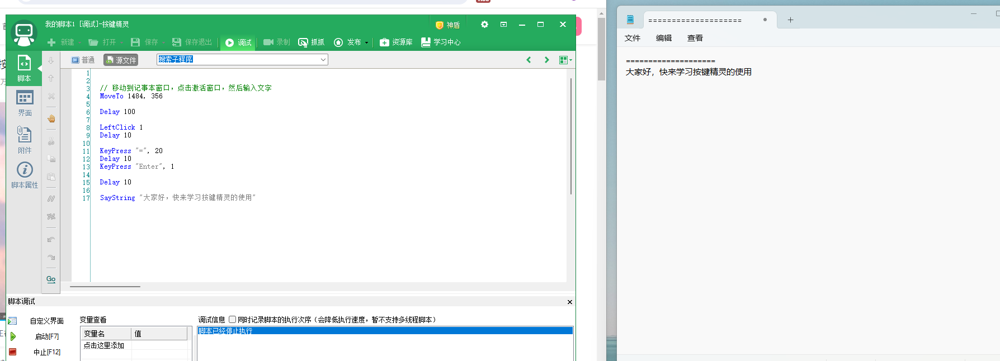
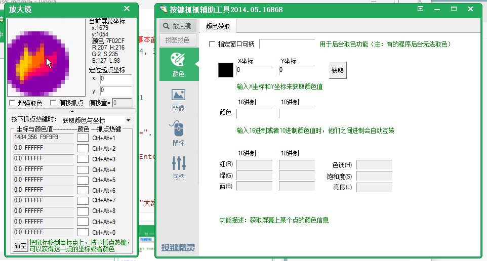
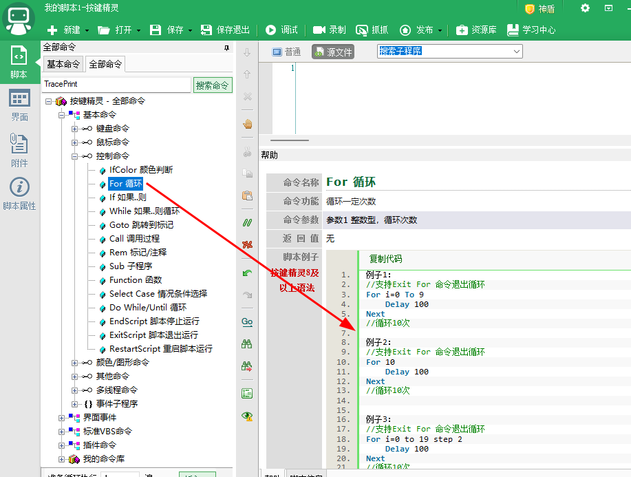
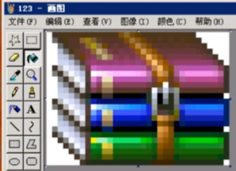

# 基本命令



## 查询命令的手册

键盘与鼠标命令就相当于我们按键精灵的双手，它可以代替我们的双手去完成一些繁琐，机械的操作。



## 命令如何使用

点击命令后，下方会显示相应的帮助文档。

双击命令，直接在代码中添加相应的样例代码。




## 初始尝鲜

案例效果：移动到记事本窗口，点击激活窗口，然后输入文字

```vb
// 移动到记事本窗口，点击激活窗口，然后输入文字
MoveTo 1484, 356

Delay 100

LeftClick 1
Delay 10

KeyPress "=", 20
Delay 10
KeyPress "Enter", 1

Delay 10

SayString "大家好，快来学习按键精灵的使用"
// 在调试窗口打印文字 (只在调试模式下有效，否则没有任何效果)
TracePrint "hello console"
```




这个代码中用到了MoveTo命令，那么要移动什么坐标位置呢？这个时候要用到按键精灵自带的**抓抓工具**。

## 抓抓工具抓坐标

抓抓工具功能十分强大，可以抓取很多东西。

这里抓坐标，就按对于的快捷键ctrl+alt+数字键，抓取对于的坐标和颜色放到对应的位置。



## 条件控制

### IF

```vb
i=0   
If i=0 Then  
    //满足条件，执行下面的脚本  
    TracePrint "0"
ElseIf i = 2 Then
	TracePrint "2"
End If
//通过判断表达式的取值，来执行后面的动作或控制
```

### For



其他控制命令就不演示了，帮助手册都有详细例子演示和api说明。

## 找颜色

```vbscript
//FindColor 1603,207, 1672,291, "2726FF", x, y
FindCenterColor 1603,207, 1672,291, "2726FF", x, y
If x > 0 and y > 0 Then 
    Delay 100
    //    MoveTo x + 20, y + 20
    MoveTo x, y
Else 
    MessageBox "未找到像素"
End If  
```

## 找图

使用抓抓工具找到查找区域的左上角坐标，然后找到查找区域的右上角坐标，然后将目标区域截图存储到某位置，然后将截图命名好后拖入到按键精灵中的“附件”中，然后就可以引用了。

```vb
FindPic 1406,88, 1713,439, "Attachment:\thumb_btn.bmp", 0.5, x, y
If x > 0 and y > 0 Then 
    Delay 100
    MoveTo x+20, y+20
Else 
    MessageBox "未找到像素"
End If  
```

高级技巧：找图的时候，有可能图的背景颜色会发生变化，这个时候会影响到我们识别图，但是我们可以制作透明图，可以不考虑背景颜色进行匹配。



在按键精灵中，会将图片的4个角的一个像素，如果颜色相同，那么就认为这个是透明的颜色（不仅仅是上图的白色，还可以是任意其他颜色，只要4个角的颜色相同即可）。


## 游戏自动喊话

```vb
MoveTo 246,103
Delay 1000
LeftClick 1
Delay 1000
KeyPress "Enter", 1
Delay 1000
SayString "你好啊"
Delay 1000
KeyPress "Enter", 1
Delay 1000
' 还可以使用Plugin.File.ReadFileEx去读取文件中准备好的内容用来录入到相应表单中
```

> SayString 不是所有窗口都支持的，可以用按键组合键代替

## 定时执行任务

```vb
Do
	Delay 1000
	现在日期时间=Plugin.Sys.GetDateTime()
	TracePrint (现在日期时间)
	If 现在日期时间 = "2024-01-25 16:05:10" Then 
		Call 执行任务()
	End If
Loop

Sub 执行任务()
	For 100
		Delay 100
		TracePrint "执行任务"
	Next
	ExitScript
End Sub
```

## 播放音乐

```vb

//下面这句是音阶(标准(M))音符(DO(1))节拍(1/16拍)   
Call Plugin.Media.Beep(523, 200)   
//下面这句是音阶(标准(M))音符(RE(2))节拍(1/16拍)   
Call Plugin.Media.Beep(578, 200)   
//下面这句是音阶(标准(M))音符(MI(3))节拍(1/16拍)   
Call Plugin.Media.Beep(659, 200)   
//下面这句是音阶(标准(M))音符(FA(4))节拍(1/16拍)   
Call Plugin.Media.Beep(698, 200)   
//下面这句是音阶(标准(M))音符(SO(5))节拍(1/16拍)   
Call Plugin.Media.Beep(784, 200)   
//下面这句是音阶(标准(M))音符(LA(6))节拍(1/16拍)   
Call Plugin.Media.Beep(880, 200)   
//下面这句是音阶(标准(M))音符(SI(7))节拍(1/16拍)   
Call Plugin.Media.Beep(988, 200)   
Msgbox "Beep 播放结束!!"

Call Plugin.Media.Vol(50)   
Call Plugin.Media.Play("C:\WINDOWS\Media\Windows XP 启动.wav")
Delay 3000
Plugin Media.Stop()   
Msgbox "播放停止!!"
```

## 用户变量

```vb
// 用户变量-普通模式， 默认值aa
UserVar var1="aa" "注释"
// 用户变量-下拉选择模式， 默认值 1
UserVar var2=DropList{"番茄":"1"|"土豆":"2"}=1 "设置内容"
TracePrint var1 & "_" & var2
```

## 注意资源释放/还原

在使用命令的时候，如果锁定了就要解除，改了模式就要改回去。

例如： SetSimMode默认是普通模式，如果程序里面改为了硬件模式或者超级模式，那么如果不回复到普通模式，那么脚本执行完毕后，我们可能无法操作鼠标和键盘，这个时候就智能按电源键强制关机重启了。

## 今后如何学习基本命令

基本命令非常简单，多点开看看，在脑袋里面有一个有哪些命令的印象，不会的看下帮助说明，整体使用非常简单，不用一个个命令写笔记记录了。

## 大漠插件

非常适合来做游戏脚本，功能非常的丰富，能后台多开。