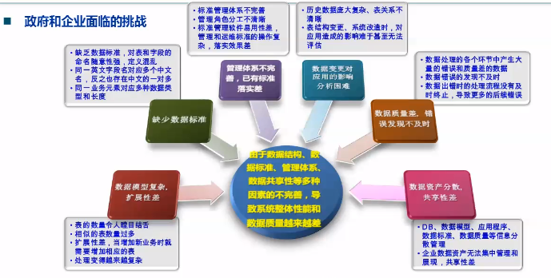
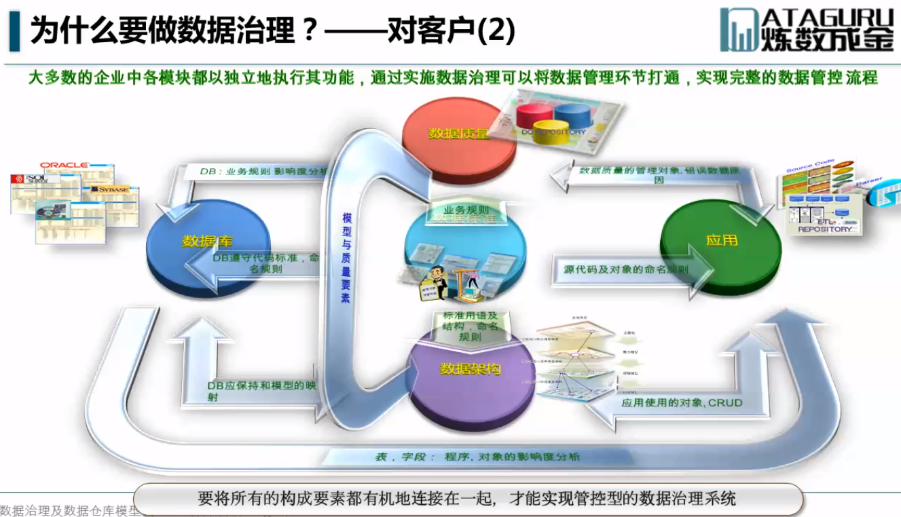

# 数据治理及数据仓库模型设计

本文档是在我学习了<<数据治理及数据仓库模型设计>>之后整理的笔记。

## 为什么要学数据治理

​	**从技术角度看**，我们的IT职业生涯不会一直在做最基础的开发和运维。随着技术能力和经验的积累，自己在技术部门的职位、在具体项目中的角色都会提升。这时候我们技术人员所需要具备的，不仅仅是对某个功能的编程实现，而需要对整个IT系统、甚至整个企业下的所有IT系统有管理方法上的认知，能够参与和制定系统整体的规划、管理能力。必须有一个从企业全局看待数据问题的眼光，才能发现问题根源所在，制定出更全面、更合理的解决方案。

​	**从商业角度看**，数据治理在IT技术中属于较新的、正在方兴未艾的发展阶段，未来会有更多案例应用。放眼国际，IBM Infosphere、Oracle BI、Infomatica Powercenter等大型数据集成软件或者模块都实现了数据治理的功能；国际上也成立了DAMA International、DGPO、The Data Governance Society、The IBM Data Governance Council、IAIDQ等多个数据治理组织。国内大型的企业客户、政府客户在建设大数据的热潮中，对数据治理咨询和实时的需求正在成倍增长。

## 政府和企业面临的挑战

## 数据治理在整个技术上的地位

​	数据治理是面向整个企业的IT系统进行管理，最低限度是对某一个大型系统进行管理，它不负责具体某一个小的功能的实现，而是对宏观的我的数据如何为整个企业去定制数据的标准、数据的规则、有什么样的管理体系，以及设计如何审批的整个流程，到数据的设计、产生、应用、运转、在加上数据质量如果不准确如何处理，从数据的产生一直到数据消亡整个全生命周期的数据治理都能够管理和规划。

​	五年前的时候(2016), 很多系统开发的时候还是开发团队自己先商量先画业务流程，有的会画模型图（逻辑模型，物理模型 -- ER图），之后开发第一版的时候会对应这个模型去开发它的表结构，到后面程序在不断上线前的改造，以及上线后不断的添加表字段等，时间长了，数据库中的表结构和模型图已经完全不同，这种情况非常的多。这种相对算是国内开发比较好的一种状态，就是它在项目上线之前，还进行过模型的设计，还有这个理念把业务怎么通过模型转换出来，模型在转换到数据库中，至少还有这么一个步骤。

​	还有一些开发团队，能开发的系统小一些，或者是功能少一些的，直接跳过了模型，直接按照客户需求想法使用编码这么实现，然后就可以了。但是带来的问题也一样，然后程序上线以后，后续所有的变化，只有开发和维护源代码的人他能够顺着代码去查，究竟表与表之间的关系怎么样，或者某个数据怎么来的，他们经过了哪几张表，经过多少运算然后得到的。如果有模型图，至少表与表的关系，以及一部分字段从哪里继承下来的，只写通过模型可以一目了然的看到。

​	还有一种情况，开发团队根据需求制定出业务流程，直接开发数据库表和字段，写应用程序代码，在开发的过程中反复的去迭代数据库中的表结构，当开发到上线之前，为了补充概要设计、详细设计把文档补全，在一定定版的表结构之后逆推回去画出来物理模型是怎么样的（这种只是从数据库中逆推回去的一个摆设，这个物理模型是否涉及合理，是否减少了数据的重复，解决了不一致的问题，这种逆向的去做这个模型只是为了提交文档，已经失去了模型的意义）。

​	最近3-5年之内，对数据模型，对ERD图这种模型的管理的需求，设计的需求，以及对大型系统大客户对数据宏观的管理，比如说数据治理这种需求越来越多，而且我们都知道在最近两年到三年之内，党中央国务院在讲话中有提到大数据这样的概念出现的频率越来越多，这个就直接导致国内央企、国企、省政府单位、大一点的市政府单位、或者是包括国家级的一些部门都兴起了新一轮大数据平台、大数据中心建设流程，当建设大数据的时候，基本就是跨系统，不是单一一个系统的数据，而是很多系统的数据，可以是在之前数据仓库的一个升级，我们需要吞吐更多数据，这个时候就更需要设计好模型，如何存储、如果规划这个数据，通过物理模型量化出来这种关系，以及设计好这个管理流程，当业务发生变更的时候，如何去改造模型然后再映射到数据库中去。这种管理的流程，比如数据治理，数据治理包含很多的内容，eg：定义企业的数据标准、定义数据模型的管理流程（元数据管理、数据质量管理），以及管理数据治理这个体系或组织、人员结构、角色分工等等。这些宏观针对企业数据资产，宏观管理的这些技术随着大数据新的一轮热潮需求量越来越大。这个文档前部分讲解数据治理，后面部分讲解数据仓库模型设计。

​	数据治理在国际上，不管是IBM、informix 、Oracle等等这些比较大型的数据库厂商，自己或者有数据治理一整套的流程和软件，或者是在软件之中的某一个模块实现了数据治理一部分的功能，就是大家都会在数据治理这个方向有动作，就是在数据治理这个趋势上不要脱节。而且现在国际上至少有五六个已经成型的数据治理的技术组织，有是依托厂商的，有的是独立的第三方的组织，分别有关于自己对于数据治理这个技术理念的解释或者方法论。

​	数据治理特点：站在高层往下看，大部分是管理的原理、方法论、以及管理的流程、管理的团队体系如何构建。数据治理这个领域至少有一半的内容是属于在方法论以及管理方式这一套东西，只有在负责实现这部分变成使用不同厂商的工具。

​	Watson Analytics实现了基于自然语言的认知服务，可以为商务人士即时提供预测和可视化分析工具。Watson Analytics可提供自助式分析功能，包括数据访问、数据清洗、数据仓库，帮助企业用户获取和准备数据，并基于此进行分析、实现结果可视化，为使用者采取有效行动和开展进一步交互提供基础和便利。

## 大数据时代的数据治理

​	最近20年间,中国I行业快速发展,网络、硬件、软件都飞速发展。随着I系统建设得越来越多我们逐渐积累了海量的数据,记录承载着各类信息。从我国的媒体来看,2013年至今,“大数据″也越来越多岀现在新闻报道中。当信息量越来越大、数据越来越多时,如何管理这些数据,

​	大数据将打开各行各业的数据“潘多拉魔盒”。社交网站、电商巨头、电信运营商乃至金融、医疗、敏育等行业,都将加入大数据的“淘金”热潮,政府部门同样会从大数据中获益匪浅。如何将海量数据应用于決策、营销和产品创新?如何利用大数据平台优化产品、流程和服务?如何利用大数据更科学地制定公共政策、实现社会治理?所有这一切,都离不开大数据治理。可以说在大数据战略从顶层设计到底层实现的“落地”过程中,治理是基础,技术是承载,分析是手段应用是目的。------引自《大数据治理》的书评

## 什么是数据治理(Data Governance)

​	数据治理( Datagovernance)，是企业数据治理部门发起并推行的,关于如何制定和实施针对落个企业内部数据的商业应用和技术管理的一系列政策和流程。数据治理是一套持续改善管理机制，通常包括了数据架构组织、数据模型、政策及体系制定、技术工具、数据标准、数据质量、影响度分析、作业流程、监督及考核等内容。

​	”数据治理是目前一个比较新兴的、正在发展的学科,目前业界对它的定义还不完金一样。“

- 数据治理涉及的IT技术主题包括元数管理、主数据管理、数据质量、数据集成、监控告等。
- 所有与数据有关的技术产出物全部通过知识库( REPOSITORY)实现相互之间共享,知识库作为数据治理的后台通道，传输不同平台、环境、技术、工具所提交和需要的元数据信息

- 数据治理是专注于将数据作为企业的商业资产进行应用和管理的一套管理机制,能够消除数据的不一致性,建立规范的数据应用标准,提高组织的数据质量,实现数据广泛共享,并能够将数据作为组织的宝贵资产应用于业务、管理、战略决策中,发挥数据资产的商业价值

