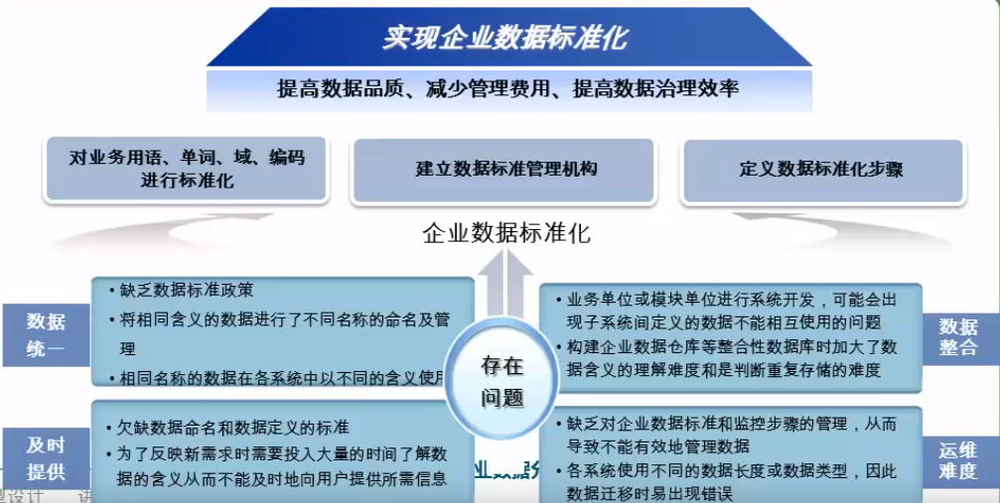
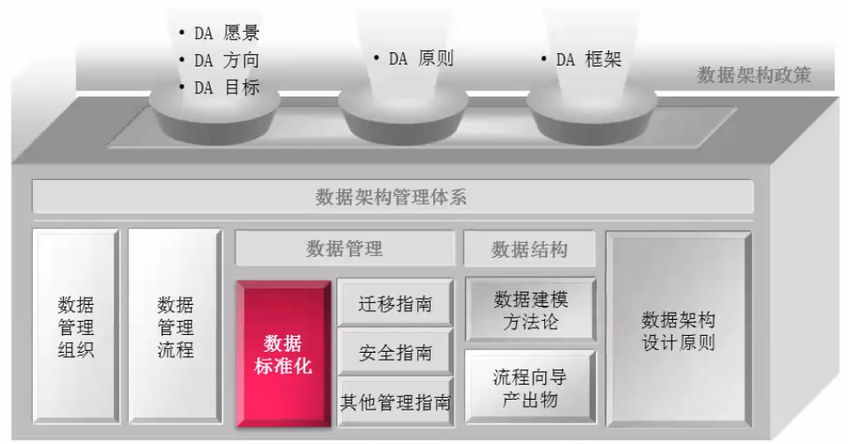
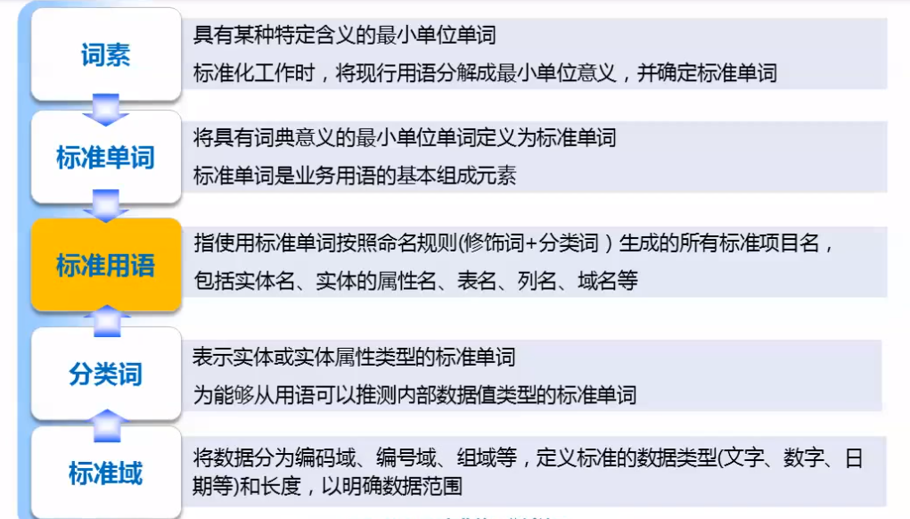
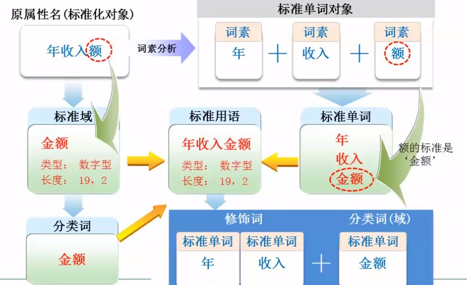
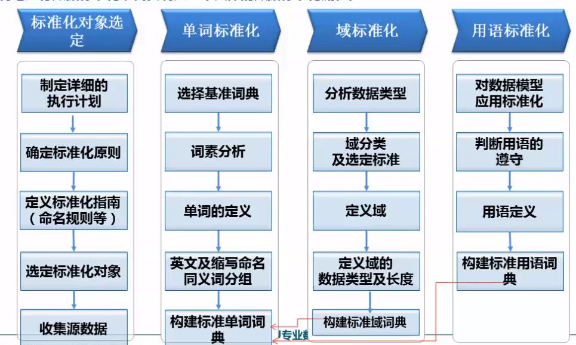
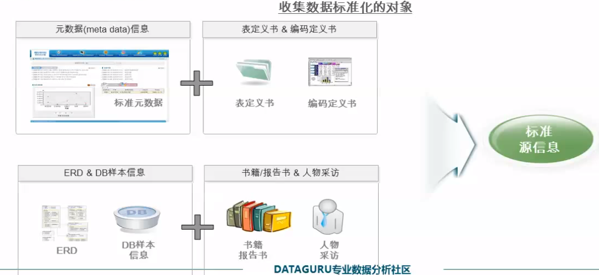

## 什么是数据标准化

- 数据标准化是对分散在各系统中的数据提供一套统一的数据命名、数据定义、数据类型、赋值规则等的定义基准，并且提供运维这套数据标椎的。通过数据标准化可以防止用语的混乱使用,维持企业数据模型的一贯性,确保数据的正确性及质量,并可以提高开发生产性和数据管理的一贯性和效率性。

## 数据标准化在数据治理体系中的重要性

标准化是数据治理的重要基石，数据标准化的实施可以作为数据治理整体工作的七点。

<h3>数据架构政策构成</h3>

## 数据标准化中的几个术语

小例子：

标准单词、标准用语这些通常是和客户多次讨论得到的最终的结果。

## 数据标准化的实施流程

​	为了顺利地进行数据标准化，需要指定一个具体的数据标准化流程。

## 数据标准化的起点-选定标准化范围和目标

​	标准化对象是指工程项目范围内使用的数据。进行数据标准化之前要收集需要进行数据标准化的对象,一般是从专业用语词典,表定义书,编码定义书,ERD, DB Catalog,专业书籍,报道材料,人物访谈中收集。并且和客户商定最终产出物的形态,除了标准词典之外,是否还要做所有老字段的标准化命名。

